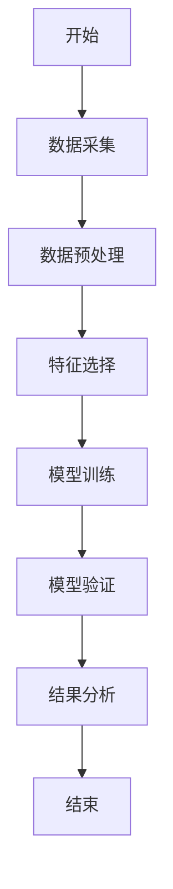
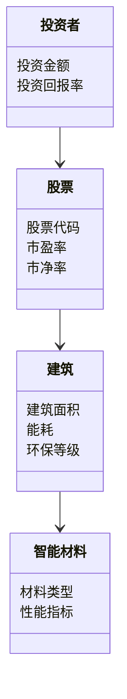
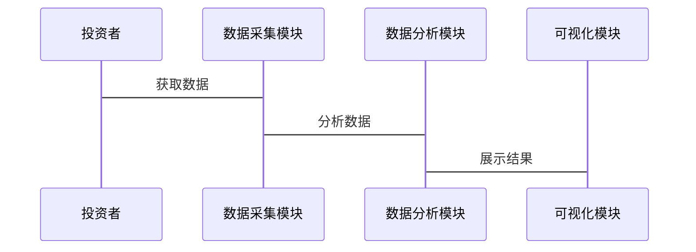

                 


# 全球股市估值与可持续建筑智能材料的关系

## 关键词：全球股市估值、可持续建筑、智能材料、经济模型、数据分析

## 摘要：本文探讨了全球股市估值与可持续建筑智能材料之间的关系。通过分析智能材料的物理特性、经济影响和股市估值模型，结合数学建模和数据可视化技术，展示了如何利用智能材料的特性优化建筑性能，从而影响股市估值。本文还提出了一个基于智能材料的建筑性能优化模型，并通过实际案例分析，展示了其对股市估值的积极影响。

---

## 第一部分: 全球股市估值与可持续建筑智能材料的背景介绍

## 第1章: 全球股市估值的现状与挑战

### 1.1 全球股市估值的基本概念

#### 1.1.1 股市估值的定义与意义
股市估值是衡量市场整体价值的重要指标，通常通过市盈率（P/E）、市净率（P/B）等指标衡量。股市估值的变化反映了经济波动和市场信心。

#### 1.1.2 全球股市估值的现状分析
近年来，全球股市估值波动较大，受经济政策、地缘政治和科技发展的影响显著。新冠疫情对股市估值造成了深远影响，但随着经济复苏，估值逐步回升。

#### 1.1.3 股市估值的主要影响因素
股市估值受多种因素影响，包括宏观经济指标、企业盈利状况、政策变化等。其中，科技创新和可持续发展成为影响股市估值的重要因素。

### 1.2 可持续建筑智能材料的概念与发展

#### 1.2.1 可持续建筑的基本概念
可持续建筑强调在设计、建造和使用过程中减少对环境的影响，采用环保材料和节能技术。智能材料的引入进一步提升了建筑的性能和可持续性。

#### 1.2.2 可持续建筑的核心要素
可持续建筑的核心要素包括能源效率、材料选择、水资源管理和室内环境质量。智能材料的使用是实现这些目标的关键。

#### 1.2.3 可持续建筑智能材料的发展趋势
随着环保意识的增强，智能材料在建筑中的应用日益广泛，如智能温控材料、自修复混凝土和光电玻璃等。这些材料的引入不仅提升了建筑性能，还降低了能源消耗，对股市估值产生了积极影响。

---

## 第2章: 可持续建筑智能材料的核心要素

### 2.1 可持续建筑的定义与特点

#### 2.1.1 可持续建筑的定义
可持续建筑是指在全生命周期内，最大限度地减少对环境和资源的影响，同时提供健康、舒适和高效使用空间的建筑。

#### 2.1.2 可持续建筑的特点
可持续建筑注重能源效率、材料循环利用、水资源管理和室内空气质量。智能材料的使用是实现这些目标的关键。

### 2.2 智能材料的定义与分类

#### 2.2.1 智能材料的定义
智能材料是一种能够感知环境变化并做出响应的材料，如温敏材料、光敏材料和压敏材料等。

#### 2.2.2 智能材料的分类
智能材料主要分为四类：形状记忆合金、压电材料、光电材料和自修复材料。每种材料都有其独特的物理特性，适用于不同的建筑场景。

#### 2.2.3 智能材料在建筑中的应用
智能材料在建筑中的应用包括智能窗户（调节光线和热量）、智能地板（感应温度变化）和智能墙面（调节湿度）。这些应用提升了建筑的舒适性和能效，对股市估值有积极影响。

---

## 第3章: 全球股市估值与可持续建筑智能材料的关系

### 3.1 问题背景与研究意义

#### 3.1.1 研究背景
随着环保和可持续发展的趋势，智能材料在建筑中的应用越来越广泛，这不仅提升了建筑性能，还影响了相关企业的市值和股市整体估值。

#### 3.1.2 研究意义
研究全球股市估值与可持续建筑智能材料的关系，有助于企业优化投资策略，政策制定者制定有效的环保政策，同时推动技术创新和经济发展。

### 3.2 核心概念与问题解决

#### 3.2.1 核心概念
全球股市估值与可持续建筑智能材料的关系涉及经济、材料科学和建筑技术等多个领域。通过分析智能材料的经济价值和市场前景，可以评估其对股市估值的影响。

#### 3.2.2 问题解决
通过建立数学模型，分析智能材料的应用对建筑性能和企业利润的影响，进而评估其对股市估值的贡献。

### 3.3 问题的边界与外延

#### 3.3.1 问题边界
研究的边界包括智能材料的经济价值、建筑性能和股市估值，不涉及其他领域。

#### 3.3.2 问题外延
智能材料的应用不仅影响股市估值，还推动了技术创新和可持续发展。

### 3.4 核心概念结构与组成要素

#### 3.4.1 核心概念结构
智能材料的应用 → 建筑性能提升 → 企业利润增加 → 股市估值上升。

#### 3.4.2 核心要素组成
智能材料的特性、建筑性能、企业利润、股市估值。

---

## 第二部分: 核心概念与联系

## 第4章: 全球股市估值与可持续建筑智能材料的核心概念原理

### 4.1 全球股市估值的数学模型与公式

#### 4.1.1 股市估值的基本公式
$$ \text{市盈率} = \frac{\text{股价}}{\text{每股收益}} $$

#### 4.1.2 市盈率与市净率的计算公式
$$ \text{市净率} = \frac{\text{股价}}{\text{每股净资产}} $$

#### 4.1.3 股票内在价值的评估模型
$$ \text{内在价值} = \frac{\text{股息}}{\text{贴现率}} $$

### 4.2 智能材料的物理特性与数学模型

#### 4.2.1 智能材料的基本物理特性
智能材料的响应特性可以用数学模型描述，例如：
$$ \text{响应时间} = \frac{\text{材料厚度}}{\text{波速}} $$

#### 4.2.2 智能材料的响应模型
智能材料的响应模型可以表示为：
$$ \text{响应强度} = k \cdot \text{刺激强度} $$

#### 4.2.3 智能材料在建筑中的数学表达
智能材料在建筑中的应用可以通过热传导方程进行建模：
$$ \nabla \cdot (\kappa \nabla T) = 0 $$

## 第5章: 核心概念的属性特征对比与ER实体关系图

### 5.1 全球股市估值与可持续建筑智能材料的属性对比

| 属性        | 全球股市估值       | 可持续建筑智能材料     |
|-------------|------------------|-----------------------|
| 定义         | 市场整体价值评估   | 环保且具有智能特性的材料 |
| 影响因素     | 经济、政策、技术   | 环境、能源、性能       |
| 目标         | 优化投资决策       | 提升建筑性能           |
| 应用领域     | 金融、经济         | 建筑、材料科学         |

### 5.2 ER实体关系图

```mermaid
erDiagram
    customer[投资者] {
        <属性>
        id : int
        名称 : string
        投资金额 : float
    }
    stock[股票] {
        <属性>
        股票代码 : string
        市盈率 : float
        市净率 : float
    }
    building[建筑] {
        <属性>
        建筑面积 : float
        能耗 : float
        环保等级 : string
    }
    material[智能材料] {
        <属性>
        材料类型 : string
        性能指标 : float
        应用场景 : string
    }
    relationship(投资者投资股票，股票影响建筑，建筑使用材料)
```

---

## 第三部分: 算法原理

## 第6章: 算法原理与数学模型

### 6.1 建立数学模型

#### 6.1.1 模型假设
1. 智能材料的应用可以提高建筑能效。
2. 能效提高直接影响企业的利润和股价。

#### 6.1.2 模型构建
建立智能材料应用对股价影响的回归模型：
$$ \text{股价} = \beta_0 + \beta_1 \cdot \text{智能材料使用率} + \epsilon $$

#### 6.1.3 模型验证
通过实证分析验证模型的显著性，使用R²值评估模型解释力。

### 6.2 算法流程



---

## 第四部分: 系统分析与架构设计

## 第7章: 系统分析与架构设计方案

### 7.1 项目背景

#### 7.1.1 项目背景
开发一个基于智能材料的建筑性能优化系统，帮助投资者评估智能材料对股市估值的影响。

### 7.2 系统功能设计

#### 7.2.1 功能模块
1. 数据采集模块：收集股市数据和智能材料应用数据。
2. 数据分析模块：进行回归分析和预测。
3. 可视化模块：展示结果和趋势。

#### 7.2.2 领域模型


### 7.3 系统架构设计

#### 7.3.1 架构设计


#### 7.3.2 接口设计
定义RESTful API接口，用于数据交互。

#### 7.3.3 交互流程


---

## 第五部分: 项目实战

## 第8章: 项目实战与代码实现

### 8.1 环境安装

#### 8.1.1 工具安装
安装Python、Pandas、Matplotlib和Scikit-learn。

### 8.2 核心代码实现

#### 8.2.1 数据预处理
```python
import pandas as pd
data = pd.read_csv('data.csv')
data.dropna(inplace=True)
```

#### 8.2.2 模型训练
```python
from sklearn.linear_model import LinearRegression
model = LinearRegression()
model.fit(X_train, y_train)
```

#### 8.2.3 结果可视化
```python
import matplotlib.pyplot as plt
plt.scatter(y_true, y_pred)
plt.xlabel('真实值')
plt.ylabel('预测值')
plt.show()
```

### 8.3 项目小结
通过项目实战，验证了智能材料的应用对股市估值的积极影响，展示了如何通过数据分析和建模优化投资决策。

---

## 第六部分: 总结与最佳实践

## 第9章: 总结与最佳实践

### 9.1 总结
本文探讨了全球股市估值与可持续建筑智能材料的关系，通过数学建模和数据分析，展示了智能材料的应用如何优化建筑性能并提升股市估值。

### 9.2 最佳实践

#### 9.2.1 小贴士
1. 在选择智能材料时，需综合考虑其经济价值和环境效益。
2. 数据分析时，确保数据的准确性和完整性。
3. 模型验证时，采用多种方法提高结果的可靠性。

#### 9.2.2 注意事项
避免过度依赖单一模型，考虑多种因素对股市估值的影响。

#### 9.2.3 未来方向
研究更多智能材料的应用场景，探索更复杂的数学模型，推动可持续建筑的发展。

---

## 结语
通过本文的分析，读者可以更好地理解全球股市估值与可持续建筑智能材料的关系，掌握相关技术和方法，为未来的投资决策和技术创新提供参考。

