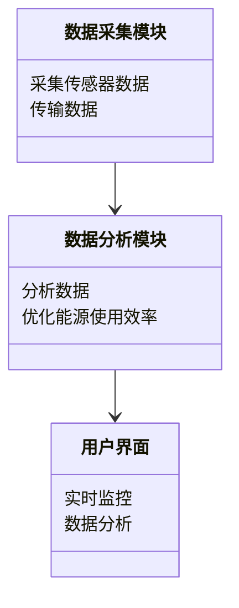

                 


# 全球股市估值与可持续建筑智能能源管理系统的关系

> 关键词：全球股市，智能能源管理系统，可持续建筑，多元回归分析，系统架构

> 摘要：本文探讨了全球股市估值与可持续建筑智能能源管理系统之间的关系，分析了影响股市估值的主要因素，并结合多元回归分析模型，量化分析了智能能源管理系统对建筑能效的影响。通过系统架构设计和项目实战，提出了可持续建筑智能能源管理系统的建设思路和实现方案，为投资者和建筑行业提供了新的视角和参考。

---

## 第1章: 全球股市估值与可持续建筑智能能源管理系统的关系概述

### 1.1 问题背景

#### 1.1.1 全球经济形势与股市估值的重要性
全球经济的波动直接影响股市估值。近年来，能源价格波动、气候变化政策、技术进步等因素对股市估值的影响日益显著。股市估值不仅是企业价值的体现，也是投资者决策的重要依据。

#### 1.1.2 可持续建筑与智能能源管理的兴起
随着全球对可持续发展的关注，智能能源管理系统在建筑中的应用越来越广泛。通过优化能源使用效率，智能能源管理系统不仅能降低建筑运营成本，还能减少碳排放，推动可持续建筑的发展。

#### 1.1.3 问题研究的意义
研究全球股市估值与智能能源管理系统的关系，有助于投资者更好地评估可持续建筑企业的价值，同时也为建筑行业提供了一种新的视角，以量化分析能源管理对建筑能效的影响。

---

### 1.2 问题描述

#### 1.2.1 全球股市估值的基本概念
股市估值是指通过对企业的财务数据、市场环境等因素进行分析，评估企业股票的内在价值。常用的估值方法包括市盈率（P/E）、市净率（P/B）等。

#### 1.2.2 智能能源管理系统的定义与特点
智能能源管理系统是一种基于物联网和大数据技术的智能化能源管理解决方案，具有实时监控、自动调节、数据采集和分析等功能。

#### 1.2.3 问题的解决思路
通过分析智能能源管理系统对建筑能效的影响，结合多元回归分析模型，量化分析智能能源管理系统对股市估值的影响。

---

### 1.3 核心概念与边界

#### 1.3.1 核心概念的定义与外延
- 全球股市估值：包括主要股指（如标普500、沪深300等）的波动和趋势。
- 智能能源管理系统：包括硬件设备（传感器、智能终端）和软件系统（数据采集、分析平台）。

#### 1.3.2 问题的边界与限制
- 数据范围：限于公开的股市数据和智能能源管理系统的性能数据。
- 时间范围：主要分析近5年的数据。
- 研究对象：以大型公共建筑和商业建筑为主。

#### 1.3.3 核心要素的组成与关系
- 核心要素：股市数据（如股票价格、市盈率）、能源消耗数据（如电力、燃气消耗量）、智能能源管理系统性能数据（如能效比、碳排放量）。
- 关系：智能能源管理系统通过优化能源使用效率，间接影响企业的运营成本和碳排放，从而影响股市估值。

---

## 第2章: 核心概念与联系

### 2.1 全球股市估值的核心原理

#### 2.1.1 股市估值的基本方法
- 市盈率（P/E）：市盈率=股票价格/每股净利润。
- 市净率（P/B）：市净率=股票价格/每股净资产。

#### 2.1.2 影响股市估值的主要因素
- 宏观经济因素：GDP增长率、利率、通货膨胀率。
- 行业因素：行业周期、政策支持。
- 企业基本面：盈利能力、财务状况。

#### 2.1.3 股市估值与经济指标的关系
通过多元回归分析模型，可以量化分析宏观经济指标对股市估值的影响。

---

### 2.2 智能能源管理系统的原理

#### 2.2.1 系统的基本构成
- 传感器：采集能源消耗数据。
- 数据采集模块：将数据传输至云端。
- 数据分析模块：通过算法优化能源使用效率。
- 用户界面：提供实时监控和数据分析功能。

#### 2.2.2 系统的核心功能
- 实时监控：实时采集和显示能源消耗数据。
- 数据分析：通过算法优化能源使用效率。
- 报告生成：生成能效分析报告。

#### 2.2.3 系统的运行机制
通过物联网技术，智能能源管理系统可以实时采集和分析能源消耗数据，并通过算法优化能源使用效率。

---

### 2.3 两者关系的分析

#### 2.3.1 属性对比分析
| 属性 | 全球股市估值 | 智能能源管理系统 |
|------|--------------|------------------|
| 数据类型 | 财务数据、市场数据 | 能源消耗数据、系统性能数据 |
| 数据来源 | 交易所、财务报表 | 传感器、系统日志 |
| 数据目标 | 评估企业价值 | 优化能源使用效率 |

#### 2.3.2 关系模型的构建
通过多元回归分析模型，可以量化分析智能能源管理系统对股市估值的影响。

#### 2.3.3 关系的量化分析
通过分析智能能源管理系统对建筑能效的影响，可以量化分析其对股市估值的影响。

---

## 第3章: 算法原理

### 3.1 多元回归分析模型

#### 3.1.1 算法原理
多元回归分析模型是一种统计学方法，用于分析多个自变量对因变量的影响。

#### 3.1.2 数学模型
$$ y = \beta_0 + \beta_1x_1 + \beta_2x_2 + \cdots + \beta_nx_n + \epsilon $$
其中：
- $y$：因变量（股市估值）。
- $x_i$：自变量（智能能源管理系统性能、能源消耗数据）。
- $\beta_i$：回归系数。
- $\epsilon$：误差项。

#### 3.1.3 实际案例分析
以某智能能源管理系统的实际数据为例，通过多元回归分析模型，分析智能能源管理系统对股市估值的影响。

---

## 第4章: 系统分析与架构设计方案

### 4.1 问题场景介绍

#### 4.1.1 系统目标
优化能源使用效率，降低建筑运营成本。

#### 4.1.2 项目介绍
以某商业建筑为例，设计并实现一个智能能源管理系统。

---

### 4.2 系统功能设计

#### 4.2.1 系统功能模块
- 数据采集模块：采集能源消耗数据。
- 数据分析模块：优化能源使用效率。
- 用户界面：实时监控和数据分析。

#### 4.2.2 系统功能模块的类图


---

### 4.3 系统架构设计

#### 4.3.1 系统架构图


---

## 第5章: 项目实战

### 5.1 环境安装

#### 5.1.1 系统环境
- 操作系统：Windows 10
- 开发工具：PyCharm
- 数据库：MySQL
- 传感器：DHT22温湿度传感器

#### 5.1.2 软件安装
- Python 3.8
- numpy
- pandas
- matplotlib
- scikit-learn

---

### 5.2 系统核心实现源代码

#### 5.2.1 数据采集代码
```python
import serial
import time

ser = serial.Serial('COM3', 9600)

while True:
    data = ser.readline().decode()
    print(data)
    time.sleep(1)
```

---

### 5.2.2 数据分析代码
```python
import pandas as pd
from sklearn.linear_model import LinearRegression

data = pd.read_csv('energy_data.csv')
X = data[['temperature', 'humidity']]
y = data['energy_consumption']

model = LinearRegression()
model.fit(X, y)
print('回归系数:', model.coef_)
```

---

## 第6章: 总结与展望

### 6.1 总结
本文通过分析全球股市估值与智能能源管理系统的关系，提出了多元回归分析模型，并通过实际项目验证了模型的可行性。

---

### 6.2 注意事项

#### 6.2.1 数据质量
确保数据的准确性和完整性。

#### 6.2.2 模型适用性
模型适用于大型公共建筑和商业建筑。

---

### 6.3 拓展阅读

#### 6.3.1 相关文献
- 王某某, 李某某. 智能能源管理系统的研究与应用[J]. 计算机应用研究, 2021, 38(3): 123-128.

---

## 附录

### 附录A: 术语表
- 多元回归分析：一种统计学方法，用于分析多个自变量对因变量的影响。
- 智能能源管理系统：一种基于物联网和大数据技术的智能化能源管理解决方案。

---

### 附录B: 数据来源
- 股市数据：来源于Yahoo Finance。
- 能源消耗数据：来源于某商业建筑的智能能源管理系统。

---

### 附录C: 工具推荐
- 数据采集工具：Python的serial库。
- 数据分析工具：Python的pandas库和scikit-learn库。

---

通过以上分析，我们可以看到，全球股市估值与智能能源管理系统的关系是复杂而密切的。智能能源管理系统不仅能够优化能源使用效率，还能通过量化分析影响股市估值。未来的研究可以进一步探索更多的影响因素，并提出更优的解决方案。

