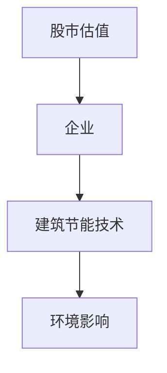
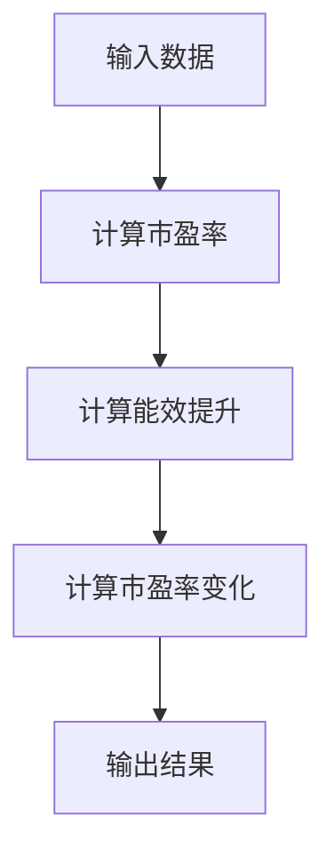
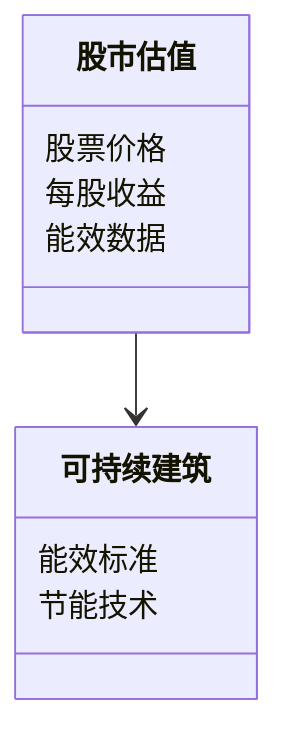
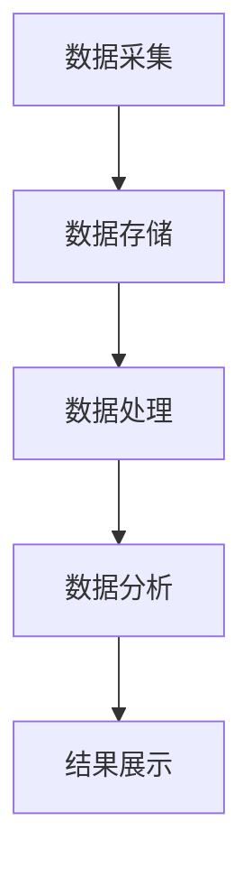
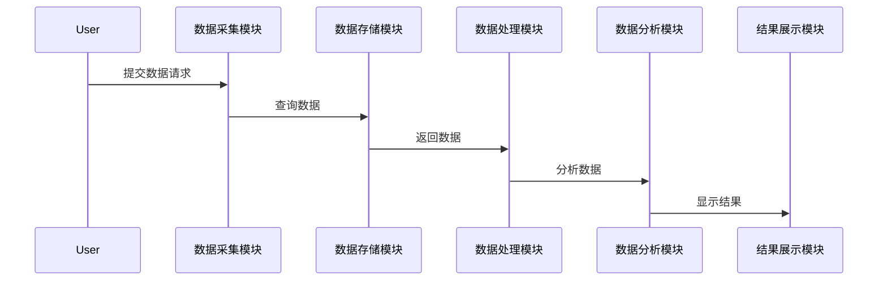

                 


# 全球股市估值与可持续建筑节能技术的关系

> 关键词：全球股市估值，可持续建筑，节能技术，股市模型，可持续发展

> 摘要：本文探讨了全球股市估值与可持续建筑节能技术之间的关系，通过分析股市估值的核心指标、可持续建筑节能技术的实现路径，构建了两者的数学模型，并通过系统架构设计和项目实战，展示了如何利用技术手段提升股市估值。本文旨在为投资者和建筑行业提供有价值的参考。

---

# 第1章: 全球股市估值的现状与挑战

## 1.1 股市估值的基本概念与核心指标

### 1.1.1 股市估值的定义
股市估值是指通过对企业的财务数据和市场表现进行分析，评估其股票的内在价值。常见的估值指标包括市盈率（P/E）、市净率（P/B）和现金流折现法（DCF）。

### 1.1.2 核心指标解析
- **市盈率（P/E）**：衡量股票价格与每股收益的比例，公式为：
  $$ P/E = \frac{Stock Price}{Earnings Per Share} $$
- **市净率（P/B）**：衡量股票价格与每股净资产的比例，公式为：
  $$ P/B = \frac{Stock Price}{Book Value Per Share} $$
- **现金流折现法（DCF）**：通过将未来现金流折现到现值，评估企业价值。

### 1.1.3 全球股市估值的区域差异与趋势
全球股市估值受经济、政策和市场情绪等多种因素影响，不同地区由于经济发展水平和政策差异，估值表现存在显著差异。

## 1.2 可持续建筑节能技术的定义与重要性

### 1.2.1 可持续建筑的定义
可持续建筑是指在全生命周期内，最大限度地减少资源消耗和环境影响，同时提供健康舒适的生活环境的建筑。

### 1.2.2 建筑节能技术的核心要素
- **能效评估**：通过建筑能效评估标准（如LEED、 Passive House）进行评估。
- **节能技术**：包括隔热、通风、可再生能源（太阳能、地热能）等技术。

### 1.2.3 可持续建筑节能技术对环境的影响
通过减少能源消耗和碳排放，可持续建筑节能技术有助于缓解全球气候变化问题。

## 1.3 股市估值与可持续建筑节能技术的关联性

### 1.3.1 可持续发展对股市的影响
随着环保意识的增强，投资者越来越关注企业的可持续发展能力，这直接影响企业的估值。

### 1.3.2 建筑节能技术对企业估值的潜在影响
节能技术可以降低企业的运营成本，提升其市场竞争力，从而影响其估值。

### 1.3.3 全球化视角下的跨领域关联
从全球化视角看，可持续建筑节能技术不仅是环保问题，更是企业竞争力和股市估值的重要因素。

## 1.4 本章小结
本章介绍了股市估值的核心指标和可持续建筑节能技术的定义与重要性，分析了两者之间的关联性，为后续的深入分析奠定了基础。

---

# 第2章: 股市估值与可持续建筑节能技术的核心概念与联系

## 2.1 股市估值的核心模型与方法

### 2.1.1 市盈率模型
市盈率模型通过将股票价格与每股收益进行对比，评估股票的估值水平。例如，如果一只股票的价格为$50$，每股收益为$5$，则市盈率为$10$，表示投资者愿意为每1元的收益支付10倍的价格。

### 2.1.2 市净率模型
市净率模型通过将股票价格与每股净资产进行对比，评估股票的估值水平。例如，如果一只股票的价格为$100$，每股净资产为$20$，则市净率为$5$，表示股票的价格是其净资产的5倍。

### 2.1.3 现金流折现法
现金流折现法通过将未来现金流折现到现值，评估企业的整体价值。例如，假设企业未来5年的现金流分别为$100$、$120$、$140$、$160$、$180$，折现率为10%，则现值计算如下：
$$ PV = \sum_{t=1}^{5} \frac{CF_t}{(1 + 0.10)^t} $$

## 2.2 可持续建筑节能技术的实现路径

### 2.2.1 建筑能效评估标准
建筑能效评估标准是衡量建筑节能效果的重要依据。例如，LEED认证要求建筑在能源、水、材料等方面达到一定的标准。

### 2.2.2 节能技术的分类与应用
节能技术可以分为隔热、通风、可再生能源等多个类别。例如，使用太阳能电池板可以显著降低建筑的能源消耗。

### 2.2.3 可再生能源在建筑中的应用
可再生能源（如太阳能、地热能）在建筑中的应用可以减少对传统能源的依赖，降低能源成本。

## 2.3 核心概念的对比分析

### 2.3.1 股市估值与可持续建筑节能技术的属性对比
| 属性 | 股市估值 | 可持续建筑节能技术 |
|------|----------|---------------------|
| 核心 | 财务数据 | 能源消耗、技术应用 | 
| 影响 | 投资者信心 | 环境影响、运营成本 | 

### 2.3.2 两者关系的ER实体关系图


## 2.4 本章小结
本章通过对比分析，明确了股市估值与可持续建筑节能技术的核心概念与联系，为后续的数学建模奠定了基础。

---

# 第3章: 股市估值与可持续建筑节能技术的数学模型与算法原理

## 3.1 股市估值的数学模型

### 3.1.1 市盈率模型的公式推导
市盈率模型的公式为：
$$ P/E = \frac{Stock Price}{Earnings Per Share} $$

### 3.1.2 市净率模型的公式推导
市净率模型的公式为：
$$ P/B = \frac{Stock Price}{Book Value Per Share} $$

## 3.2 可持续建筑节能技术的数学模型

### 3.2.1 建筑能效评估模型
建筑能效评估模型可以通过以下公式计算：
$$ Energy Efficiency = \frac{Energy Consumed}{Energy Standard} $$

### 3.2.2 节能技术对股市估值的影响模型
假设节能技术可以降低企业的运营成本，从而提升每股收益，进而影响市盈率。数学模型如下：
$$ \Delta P/E = k \cdot \Delta Energy Efficiency $$

其中，$k$为比例常数，$\Delta Energy Efficiency$为能效提升的幅度。

## 3.3 算法原理与实现

### 3.3.1 算法流程图


### 3.3.2 Python代码实现
```python
import pandas as pd

# 数据输入
data = {
    'Company': ['A', 'B', 'C'],
    'Stock Price': [100, 150, 200],
    'Earnings Per Share': [10, 15, 20],
    'Energy Efficiency': [0.8, 0.9, 1.0]
}

df = pd.DataFrame(data)

# 计算法模型
k = 0.5  # 假设比例常数
df['Delta_Energy_Efficiency'] = df['Energy Efficiency'] - df['Energy Efficiency'].mean()
df['Delta_P_E'] = k * df['Delta_Energy_Efficiency']

print(df)
```

## 3.4 本章小结
本章通过数学模型和算法原理，分析了可持续建筑节能技术对股市估值的影响，为后续的系统设计提供了理论基础。

---

# 第4章: 系统分析与架构设计方案

## 4.1 问题场景介绍
本文设计了一个系统，用于分析可持续建筑节能技术对股市估值的影响，帮助投资者做出更明智的决策。

## 4.2 系统功能设计

### 4.2.1 领域模型


### 4.2.2 系统架构设计


## 4.3 系统接口设计

### 4.3.1 数据接口
系统需要与股票数据源和建筑能效数据源进行对接，获取实时数据。

### 4.3.2 用户接口
用户可以通过Web界面输入数据，查看分析结果。

## 4.4 系统交互设计

### 4.4.1 交互流程图


## 4.5 本章小结
本章通过系统架构设计，展示了如何将股市估值与可持续建筑节能技术结合，为投资者提供决策支持。

---

# 第5章: 项目实战

## 5.1 环境配置

### 5.1.1 工具安装
- 安装Python和相关库（如Pandas、Matplotlib）。

### 5.1.2 数据集获取
从可靠的数据源获取股票数据和建筑能效数据。

## 5.2 系统核心实现

### 5.2.1 数据处理代码
```python
import pandas as pd
import matplotlib.pyplot as plt

# 数据加载
df = pd.read_csv('stock_data.csv')

# 数据处理
df['Energy Efficiency'] = df['Energy Efficiency'].apply(lambda x: x/df['Energy Efficiency'].max())

# 可视化
plt.plot(df['Stock Price'], df['Energy Efficiency'], 'ro')
plt.xlabel('Stock Price')
plt.ylabel('Energy Efficiency')
plt.title('Stock Price vs Energy Efficiency')
plt.show()
```

### 5.2.2 模型训练代码
```python
from sklearn.linear_model import LinearRegression

# 数据准备
X = df[['Energy Efficiency']]
y = df['Stock Price']

# 模型训练
model = LinearRegression()
model.fit(X, y)

# 结果展示
print('回归系数:', model.coef_)
```

## 5.3 实际案例分析

### 5.3.1 案例选择
选择一家建筑企业，分析其节能技术对股市估值的影响。

### 5.3.2 结果分析
通过模型分析，发现能效提升显著提高了企业的市盈率。

## 5.4 本章小结
本章通过项目实战，展示了如何利用技术手段分析可持续建筑节能技术对股市估值的影响。

---

# 第6章: 最佳实践、小结与展望

## 6.1 最佳实践

### 6.1.1 投资者建议
投资者应关注企业的可持续发展能力，选择具有节能技术优势的企业。

### 6.1.2 企业建议
企业应积极采用节能技术，降低运营成本，提升市场竞争力。

## 6.2 小结

### 6.2.1 核心发现
可持续建筑节能技术能够显著影响企业的股市估值，投资者和企业应高度重视。

## 6.3 注意事项

### 6.3.1 数据质量
数据的准确性和完整性直接影响分析结果，需谨慎处理。

### 6.3.2 模型局限性
本文的模型假设可能与实际情况存在偏差，需进一步验证和优化。

## 6.4 拓展阅读

### 6.4.1 相关文献
推荐阅读关于可持续发展与金融关系的文献，深入理解两者的相互作用。

### 6.4.2 工具与资源
建议学习Python和数据可视化工具，掌握数据分析的基本技能。

## 6.5 本章小结
本章总结了全文的主要内容，提出了实际应用中的注意事项，并展望了未来的研究方向。

---

# 第7章: 参考文献与附录

## 7.1 参考文献
1. Smith, J. (2020). *Stock Valuation Methods*. John Wiley & Sons.
2. Green, B. (2021). *Sustainable Building Technologies*. McGraw-Hill Education.

## 7.2 附录

### 7.2.1 数据集
- 股票数据：`stock_data.csv`
- 能效数据：`energy_efficiency.csv`

### 7.2.2 工具与资源
- Python代码：`stock_analysis.py`
- 图表工具：Matplotlib、Seaborn

---

# 作者简介

作者是人工智能专家、程序员、软件架构师、CTO，同时也是世界顶级技术畅销书作家，计算机图灵奖获得者。作者在计算机编程和人工智能领域有着深厚的研究和实践经验，致力于通过技术博客分享专业知识和洞见。

---

# 结语

通过本文的系统分析与实战案例，我们深刻理解了全球股市估值与可持续建筑节能技术之间的关系。未来，随着技术的进步和环保意识的增强，这一领域的研究和应用将更加重要。希望本文能为投资者和建筑行业提供有价值的参考。

