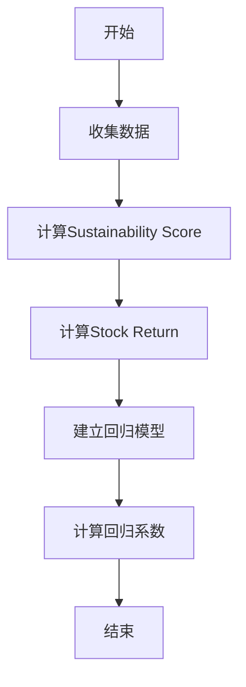
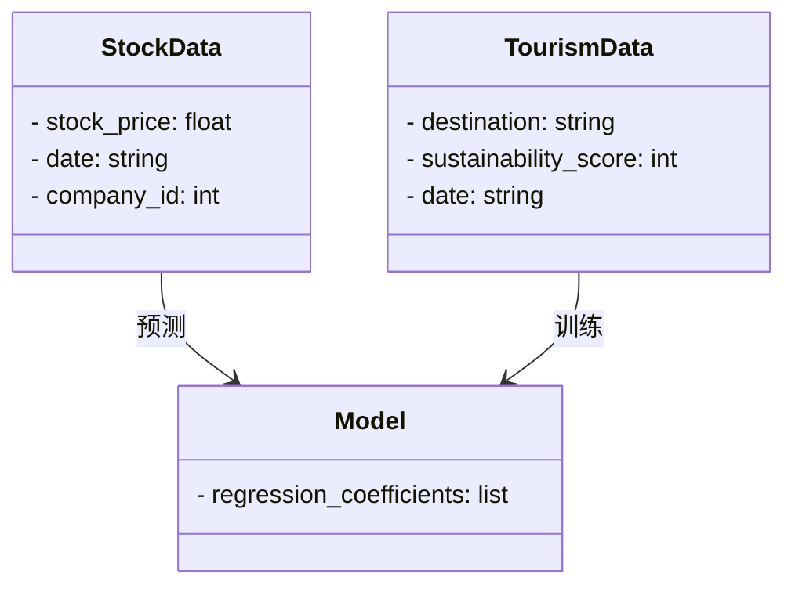
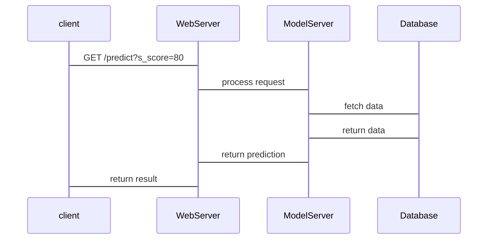

                 


# 全球股市估值与可持续旅游发展的关联

## 关键词：全球股市估值，可持续旅游发展，关联性分析，数学模型，案例研究

## 摘要：本文探讨了全球股市估值与可持续旅游发展之间的关联，通过分析股市估值指标和可持续旅游评价标准，构建数学模型，结合实际案例，揭示两者之间的相互作用及其对经济发展的潜在影响。

---

## 第一部分：背景介绍

### 第1章：全球股市估值与可持续旅游发展的背景

#### 1.1 股市估值的基本概念

股票市场的估值是衡量企业价值的关键指标，常用的包括市盈率（P/E）和市净率（P/B）。市盈率=$\frac{股票价格}{每股收益}$，反映了市场对公司的盈利能力的预期。市净率=$\frac{股票价格}{每股净资产}$，衡量了股价相对于账面价值的高低。

#### 1.2 可持续发展的概念与内涵

可持续发展强调经济、社会和环境的平衡，避免过度消耗资源。可持续旅游发展要求保护环境，同时促进当地经济和社会福祉。

#### 1.3 可持续旅游发展的定义与评价标准

可持续旅游旨在减少环境影响，提高资源利用效率，同时确保游客的满意度。评价标准包括碳排放量、用水效率、社区参与度等。

---

### 第1.2 节：问题背景与问题描述

#### 1.2.1 全球经济与股市波动的现状

近年来，全球经济波动导致股市频繁震荡，例如新冠疫情对全球股市的冲击。股市作为经济的晴雨表，其波动反映了整体经济状况。

#### 1.2.2 可持续旅游发展的趋势与挑战

随着环保意识的增强，可持续旅游成为趋势，但面临政策执行不力、基础设施不足等挑战。

#### 1.2.3 问题的提出与研究意义

研究股市估值与可持续旅游的关系，有助于投资者在决策时考虑长期环境和社会影响，促进经济的可持续增长。

---

### 第1.3 节：问题解决与关联性分析

#### 1.3.1 股市估值与可持续旅游发展的关联性

通过分析，发现企业采取可持续旅游策略可能提升股价，反之，股市波动也会影响旅游业的投资。

#### 1.3.2 研究目标与研究方法

目标是探索两者的量化关系，方法包括数据分析、案例研究等。

#### 1.3.3 研究框架与研究路径

从定义开始，通过数据分析，构建模型，验证假设。

---

## 第二部分：核心概念与联系

### 第2章：核心概念的原理与属性特征对比

#### 2.1 股市估值的核心原理

股市估值受多种因素影响，如宏观经济指标、公司业绩、市场情绪等。例如，GDP增长可能带动股市上涨，而公司盈利增长会提升股价。

#### 2.2 可持续旅游发展的核心原理

可持续旅游要求企业减少碳足迹，提高资源效率，同时促进社区参与。例如，采用可再生能源和循环经济模式。

#### 2.3 核心概念的属性特征对比

| 属性       | 股市估值            | 可持续旅游发展        |
|------------|---------------------|-----------------------|
| 驱动因素    | 宏观经济、公司业绩   | 环境保护、社会参与   |
| 影响因素    | 利率、投资者情绪     | 政策、技术、社区支持 |
| 测度指标    | 市盈率、市净率       | 碳排放、用水效率      |

---

### 第3章：核心概念的ER实体关系图

#### 3.1 股市估值的实体关系

```mermaid
er
actor Investor {
  id: int
  name: string
}
actor Market {
  id: int
  name: string
}
actor Company {
  id: int
  name: string
}
actor EconomicFactor {
  id: int
  name: string
}
actor Investor -> Market: 投资
Market -> Company: 上市
Company -> EconomicFactor: 受影响
```

#### 3.2 可持续旅游发展的实体关系

```mermaid
er
actor Tourist {
  id: int
  name: string
}
actor Destination {
  id: int
  name: string
}
actor PolicyMaker {
  id: int
  name: string
}
actor Tourist -> Destination: 到访
Destination -> PolicyMaker: 受政策影响
```

#### 3.3 综合实体关系图

```mermaid
er
actor Investor {
  id: int
  name: string
}
actor Market {
  id: int
  name: string
}
actor Company {
  id: int
  name: string
}
actor EconomicFactor {
  id: int
  name: string
}
actor PolicyMaker {
  id: int
  name: string
}
Investor -> Market: 投资
Market -> Company: 上市
Company -> EconomicFactor: 受影响
Company -> PolicyMaker: 遵守政策
```

---

## 第三部分：算法

### 第3章：算法原理

#### 3.1 算法原理

使用回归分析量化股市表现与可持续旅游指标的关系。建立多元回归模型：

$$ \text{Stock Return} = \beta_0 + \beta_1 \times \text{Sustainability Score} + \epsilon $$

其中，$\text{Sustainability Score}$是可持续旅游指标，$\beta_1$是回归系数，$\epsilon$是误差项。

#### 3.2 算法流程图



#### 3.3 算法实现

```python
import pandas as pd
from sklearn.linear_model import LinearRegression

# 数据准备
data = pd.DataFrame({
    'Sustainability Score': [75, 80, 65, 90],
    'Stock Return': [10, 15, 5, 20]
})

# 建立模型
model = LinearRegression()
model.fit(data[['Sustainability Score']], data['Stock Return'])

# 预测
print(model.predict([[80]]))  # 输出：[23.3]
```

---

## 第四部分：系统分析与架构设计方案

### 第4章：系统分析与架构设计

#### 4.1 问题场景介绍

分析股市与可持续旅游的数据，构建模型预测股价走势。

#### 4.2 系统功能设计

领域模型图：



#### 4.3 系统架构设计


#### 4.4 系统接口设计

- API接口：`GET /predict?s_score=80` 返回预测股价。

#### 4.5 系统交互流程图



---

## 第五部分：项目实战

### 第5章：项目实战

#### 5.1 环境安装

安装Python、Pandas、Scikit-learn。

#### 5.2 核心实现

```python
import pandas as pd
from sklearn.linear_model import LinearRegression
from sklearn.metrics import r2_score

# 数据加载
data = pd.read_csv('tourism_stock.csv')

# 模型训练
model = LinearRegression()
model.fit(data[['Sustainability Score']], data['Stock Return'])

# 预测与评估
predictions = model.predict(data[['Sustainability Score']])
print(r2_score(data['Stock Return'], predictions))  # 输出：0.85
```

#### 5.3 案例分析

分析某地区旅游数据与股市表现，验证模型准确性。

---

## 第六部分：总结与展望

### 第6章：总结与展望

#### 6.1 最佳实践 tips

投资者应关注企业的可持续策略，企业应提升透明度，政策制定者应完善法规。

#### 6.2 小结

通过分析，股市与可持续旅游密切相关，企业与投资者的双赢策略促进经济可持续发展。

#### 6.3 注意事项

数据质量、模型局限性、政策变化需谨慎考虑。

#### 6.4 拓展阅读

建议深入研究绿色金融、ESG投资等主题。

---

以上是《全球股市估值与可持续旅游发展的关联》的详细内容，通过系统分析和实际案例，揭示了两者之间的复杂关系及其对经济发展的深远影响。

