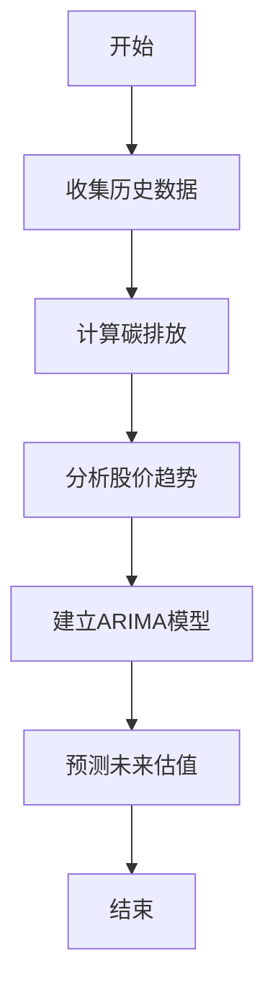
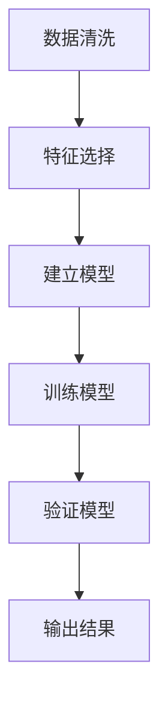
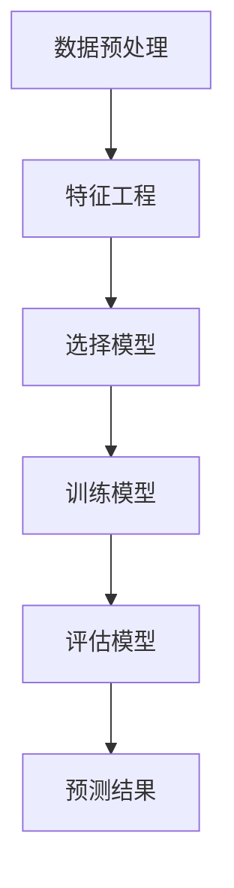
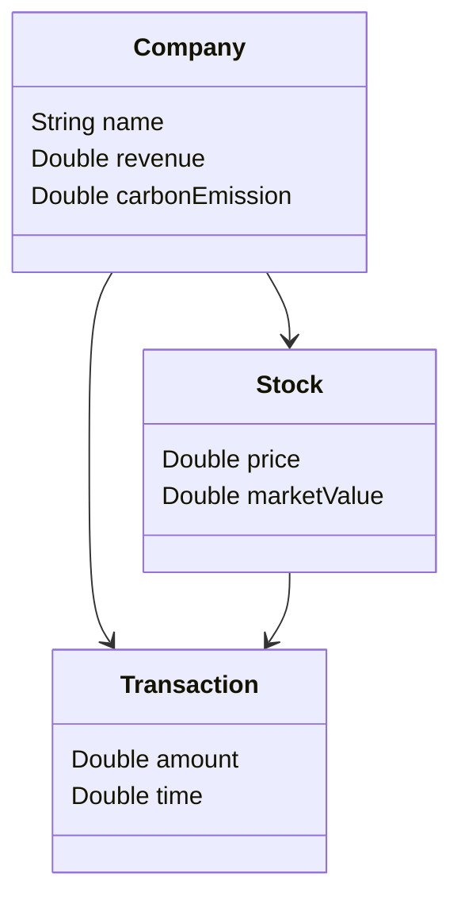
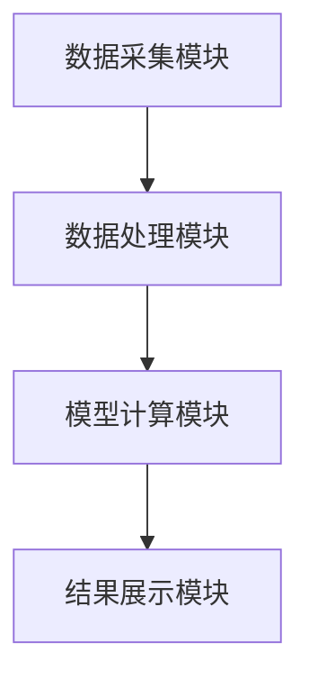

                 


# 全球股市估值与可持续旅游碳足迹计算技术的关联

> **关键词**：全球股市估值，可持续旅游，碳足迹，环境影响，技术关联，投资分析

> **摘要**：随着全球气候变化和环境保护意识的增强，可持续旅游和碳足迹计算逐渐成为社会关注的焦点。与此同时，股市估值作为金融市场的核心指标，其与可持续发展之间的关系也备受关注。本文将深入分析全球股市估值与可持续旅游碳足迹计算技术的关联，探讨如何通过技术手段量化碳足迹对股市估值的影响，为企业和投资者提供新的视角和决策支持。

---

## 第一部分：全球股市估值与可持续旅游碳足迹的背景与关联

### 第1章：全球股市估值与可持续旅游碳足迹的背景介绍

#### 1.1 问题背景

##### 1.1.1 全球股市估值的重要性  
股市估值是衡量企业价值的重要指标，直接影响投资者的决策和市场的稳定性。传统估值方法如市盈率（P/E）和市净率（P/B）基于企业的财务表现，但随着可持续发展理念的兴起，环境、社会和治理（ESG）因素逐渐成为影响股市估值的关键因素。

##### 1.1.2 可持续旅游与碳足迹的概念  
可持续旅游强调在满足旅游需求的同时，减少对环境的负面影响。碳足迹则是量化人类活动对气候变化贡献的重要指标，涵盖旅游过程中的交通、住宿、餐饮等多个环节。

##### 1.1.3 问题的提出与研究意义  
随着全球气候变化加剧，投资者开始关注企业在可持续发展方面的表现。通过量化可持续旅游的碳足迹，可以评估其对股市估值的影响，为投资者提供更全面的决策依据。

#### 1.2 问题描述

##### 1.2.1 全球股市估值的核心问题  
股市估值的传统方法忽略了企业的环境影响，而随着ESG投资的兴起，企业碳足迹已成为影响估值的关键因素。

##### 1.2.2 可持续旅游碳足迹的计算难点  
碳足迹的计算涉及多个环节，数据获取复杂，且不同环节的权重难以量化。

##### 1.2.3 问题的边界与外延  
本文仅关注可持续旅游的碳足迹对股市估值的影响，不涉及其他行业的碳足迹计算。

#### 1.3 核心概念与关联

##### 1.3.1 核心概念的结构与组成  
- **股市估值**：市盈率、市净率、EV/EBITDA等指标。  
- **碳足迹**：涵盖交通、住宿、餐饮等多个环节的碳排放。

##### 1.3.2 核心概念的属性特征对比表  

| 属性       | 股市估值                          | 碳足迹计算                          |
|------------|-----------------------------------|-------------------------------------|
| 计算依据    | 财务数据（收入、利润、资产）      | 环境数据（能源消耗、碳排放）         |
| 影响因素    | 市场情绪、行业趋势、政策          | 技术水平、企业行为、政策             |
| 应用场景    | 投资决策、企业价值评估            | 可持续发展、环保政策制定             |

##### 1.3.3 ER实体关系图  

```mermaid
erd
  图标股票：Stock
  图标公司：Company
  图标碳排放：CarbonEmission
  图标交易：Transaction

  Company -[1..n]-> Stock
  Company --> CarbonEmission
  Stock --> Transaction
  CarbonEmission --> Transaction
```

---

## 第二部分：全球股市估值与可持续旅游碳足迹的核心概念与联系

### 第2章：股市估值与碳足迹的核心概念与联系

#### 2.1 股市估值的核心原理

##### 2.1.1 多元回归分析的数学模型  
股市估值可以通过多元回归模型预测，将碳排放数据作为自变量之一：  
$$ V = \beta_0 + \beta_1 \times \text{CarbonEmission} + \beta_2 \times \text{Revenue} + \epsilon $$  

##### 2.1.2 时间序列分析的算法流程  



##### 2.1.3 机器学习模型的预测方法  
使用随机森林或神经网络模型，将碳足迹与其他财务指标结合，预测股价波动。

#### 2.2 可持续旅游碳足迹的计算原理

##### 2.2.1 碳足迹的线性回归模型  
碳足迹的计算公式：  
$$ \text{CarbonFootprint} = a \times \text{Transportation} + b \times \text{Accommodation} + c \times \text{Food} + d \times \text{Other} $$  

##### 2.2.2 生命周期评价的计算方法  
通过生命周期评价（LCA）方法，量化旅游过程中每个环节的碳排放。

##### 2.2.3 碳足迹的量化与评估标准  
国际标准化组织（ISO）14040标准为碳足迹的计算提供了指导框架。

#### 2.3 核心概念的联系与对比

##### 2.3.1 股市估值与碳足迹的关联性分析  
通过回归分析发现，企业碳排放与股价呈现负相关关系：  
$$ \text{StockPrice} = \alpha - \beta \times \text{CarbonEmission} + \gamma \times \text{ESG} + \delta $$  

##### 2.3.2 两者的属性特征对比  
- 股市估值侧重于企业的财务表现和市场情绪。  
- 碳足迹侧重于企业的环境影响和可持续性。

##### 2.3.3 两者的ER实体关系图  

```mermaid
erd
  Company -[1..n]-> Stock
  Company --> CarbonEmission
  Stock --> Transaction
  CarbonEmission --> Transaction
```

---

## 第三部分：全球股市估值与可持续旅游碳足迹的算法原理

### 第3章：股市估值与碳足迹计算的算法原理

#### 3.1 股市估值的算法原理

##### 3.1.1 多元回归分析的实现步骤  



##### 3.1.2 时间序列分析的代码示例  

```python
from statsmodels.tsa.arima_model import ARIMA
import pandas as pd

# 假设df是包含股票价格和碳排放的数据
model = ARIMA(df['Price'], order=(5,1,0))
model_fit = model.fit()
预测结果 = model_fit.forecast(steps=10)
```

#### 3.2 碳足迹计算的算法原理

##### 3.2.1 碳足迹的线性回归模型  

```python
import numpy as np
from sklearn.linear_model import LinearRegression

X = np.array([[1, 2, 3], [4, 5, 6], [7, 8, 9]])  # 交通、住宿、餐饮
y = np.array([10, 15, 20])  # 碳足迹

model = LinearRegression()
model.fit(X, y)
预测 = model.predict(X)
```

##### 3.2.2 机器学习模型的实现步骤  



---

## 第四部分：全球股市估值与可持续旅游碳足迹的系统分析与架构设计

### 第4章：系统分析与架构设计方案

#### 4.1 问题场景介绍  
本文设计了一个系统，用于量化可持续旅游的碳足迹，并分析其对股市估值的影响。

#### 4.2 系统功能设计  



#### 4.3 系统架构设计  



#### 4.4 系统接口设计  
API接口设计：  
- `/api/carbon-footprint`：接收旅游数据，返回碳足迹。  
- `/api/stock-valuation`：接收企业数据，返回估值结果。

---

## 第五部分：全球股市估值与可持续旅游碳足迹的项目实战

### 第5章：项目实战

#### 5.1 环境安装  
安装Python和相关库（如Pandas、Scikit-learn、statsmodels）。

#### 5.2 核心代码实现  

```python
import pandas as pd
import numpy as np
from sklearn.linear_model import LinearRegression

# 数据加载
data = pd.read_csv('tourism_data.csv')

# 特征与目标变量分离
X = data[['transport', 'accommodation', 'food']]
y = data['carbon_footprint']

# 建立线性回归模型
model = LinearRegression()
model.fit(X, y)

# 预测碳足迹
预测结果 = model.predict(X)
```

#### 5.3 代码解读与分析  
通过代码实现碳足迹的计算，并结合股市估值模型，预测企业价值。

#### 5.4 实际案例分析  
以航空公司为例，分析碳排放对股价的影响。

---

## 第六部分：全球股市估值与可持续旅游碳足迹的最佳实践

### 第6章：最佳实践

#### 6.1 小结  
本文通过技术手段量化可持续旅游的碳足迹，并分析其对股市估值的影响，为企业和投资者提供新的视角。

#### 6.2 注意事项  
- 数据的准确性和完整性至关重要。  
- 算法的选择需根据具体场景调整。  

#### 6.3 拓展阅读  
建议阅读《可持续金融：ESG投资策略》和《气候变化与企业风险管理》。

---

通过以上分析，我们可以看到，全球股市估值与可持续旅游碳足迹的关联不仅是技术问题，更是社会和经济发展的关键议题。未来，随着技术的进步，这种关联将更加紧密，为企业和投资者提供更有力的支持。

