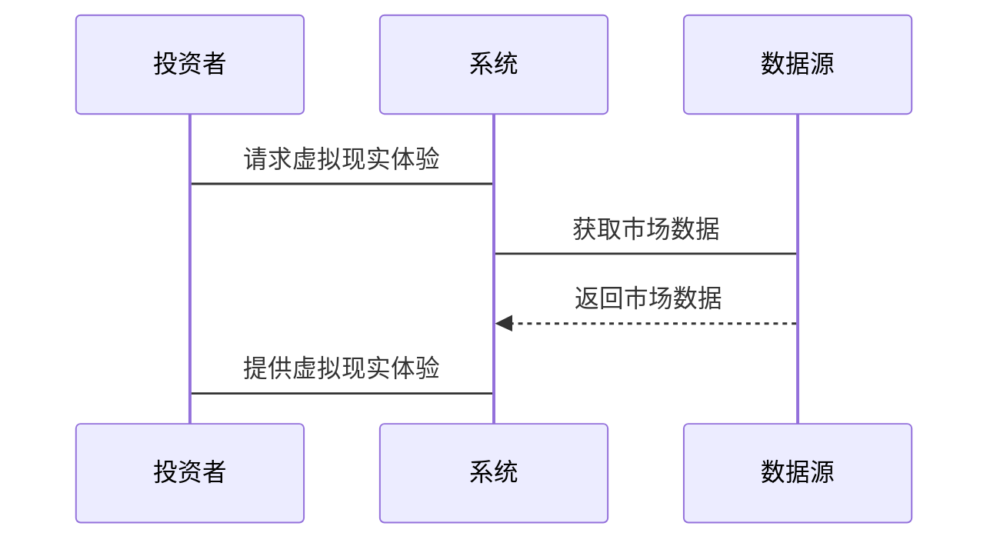

                 


# 全球股市估值与可持续旅游虚拟现实技术的关联

---

## 关键词：全球股市估值、可持续旅游、虚拟现实技术、投资者决策、风险评估、经济模型、技术应用

---

## 摘要：  
本文探讨了全球股市估值与可持续旅游虚拟现实技术之间的关联，分析了虚拟现实技术如何影响投资者决策、风险评估和可持续旅游体验。通过构建数学模型和系统架构，本文揭示了虚拟现实在提升股市估值和推动可持续旅游发展中的潜在作用，并展望了未来的研究方向。

---

## 第一章：全球股市估值与可持续旅游的背景介绍

### 1.1 全球股市估值的基本概念  
全球股市估值是衡量股市整体表现的重要指标，主要通过市值和市盈率等指标反映。股市估值受经济政策、企业盈利和市场情绪等多种因素影响。

### 1.2 可持续旅游的概念与意义  
可持续旅游强调在满足当代旅游需求的同时，保护环境和促进社会经济发展。其核心在于减少资源消耗和环境污染，推动旅游业的长期健康发展。

### 1.3 虚拟现实技术的基本原理  
虚拟现实（VR）技术通过计算机生成的三维环境，为用户提供沉浸式体验。其核心技术包括图形渲染、传感器技术和交互设计。

---

## 第二章：虚拟现实在旅游中的应用

### 2.1 虚拟旅游体验的实现方式  
虚拟现实在旅游中的应用包括虚拟旅游体验、虚拟导游和虚拟景区展示。通过VR技术，游客可以提前感受目的地的环境和氛围。

### 2.2 虚拟现实在旅游决策中的应用  
VR技术通过提供沉浸式体验，帮助游客做出更明智的旅游决策。例如，投资者可以通过VR技术评估旅游项目的经济效益。

### 2.3 虚拟现实在旅游风险管理中的应用  
VR技术可用于模拟自然灾害或公共卫生事件对旅游的影响，帮助制定应急计划和风险管理策略。

---

## 第三章：虚拟现实在全球股市估值中的关联

### 3.1 虚拟现实在股市分析中的应用  
VR技术通过沉浸式体验改变投资者的决策方式，帮助他们更好地理解市场动态和风险因素。

### 3.2 虚拟现实在股市风险评估中的应用  
通过VR技术模拟市场波动和经济环境变化，投资者可以更准确地评估投资风险并制定优化策略。

### 3.3 虚拟现实在投资策略优化中的应用  
VR技术帮助投资者构建虚拟投资环境，模拟不同策略下的市场表现，从而优化投资组合。

---

## 第四章：理论模型与数学分析

### 4.1 股市波动与虚拟现实技术的关系模型  
构建一个数学模型，描述股市波动与VR技术应用的关系。模型包括市场情绪、技术应用和经济指标三个核心变量。

### 4.2 数学模型的构建与推导  
通过回归分析和时间序列分析，推导出股市波动与VR技术应用的关系模型。公式如下：

$$ S(t) = \beta_1 VR(t) + \beta_2 E(t) + \epsilon $$

其中，$S(t)$ 表示股市波动，$VR(t)$ 表示虚拟现实技术的应用程度，$E(t)$ 表示经济指标，$\epsilon$ 为误差项。

---

## 第五章：系统架构设计

### 5.1 系统功能设计  
系统功能包括虚拟现实体验生成、市场数据分析和投资策略优化模块。

### 5.2 系统架构设计  
系统架构采用分层设计，包括数据采集层、数据处理层和用户交互层。

### 5.3 系统接口设计  
系统接口包括数据接口、用户界面和第三方服务接口。

### 5.4 系统交互流程  
通过Mermaid序列图展示系统交互流程：



---

## 第六章：项目实战

### 6.1 环境配置与工具安装  
安装必要的开发工具，如Unity、Python和数据可视化库。

### 6.2 核心代码实现  
实现虚拟现实体验生成和市场数据分析的核心代码，例如：

```python
import numpy as np
import pandas as pd

def calculate_market_fluctuation(data):
    # 数据预处理
    data = data.dropna()
    # 计算波动率
    volatility = np.std(data['returns'])
    return volatility

# 读取数据并计算波动率
data = pd.read_csv('market_data.csv')
result = calculate_market_fluctuation(data)
print(result)
```

### 6.3 实际案例分析  
分析一个具体案例，展示如何通过虚拟现实技术优化投资策略。

### 6.4 项目总结与反思  
总结项目成果，反思存在的问题，并提出改进建议。

---

## 第七章：结论与展望

### 7.1 研究总结  
总结研究发现，强调虚拟现实技术在提升股市估值和推动可持续旅游发展中的作用。

### 7.2 应用前景  
展望虚拟现实在全球股市估值和可持续旅游中的广泛应用前景。

### 7.3 未来研究方向  
提出未来的研究方向，包括更复杂的数学模型和更先进的系统架构设计。

---

## 参考文献  
（此处列出相关文献和参考资料）

---

## 思考与下一步行动  
在撰写过程中，我可能需要进一步验证数学模型的准确性，并优化系统的交互流程。此外，还需要收集更多的实际案例，以增强文章的说服力。

