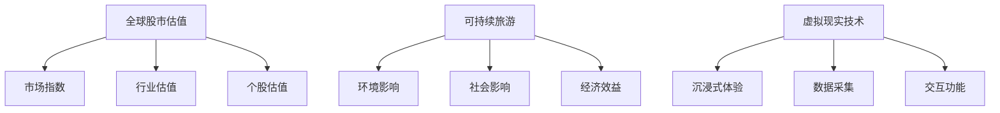
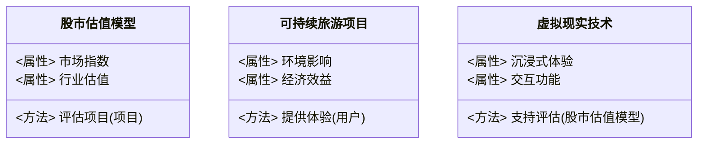
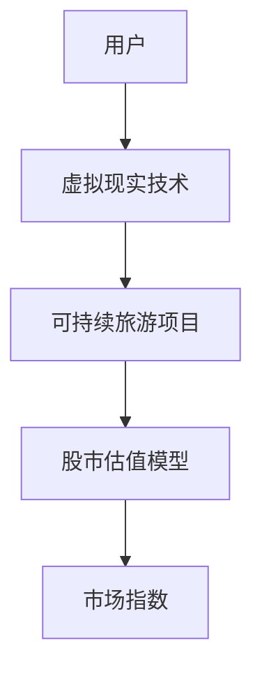
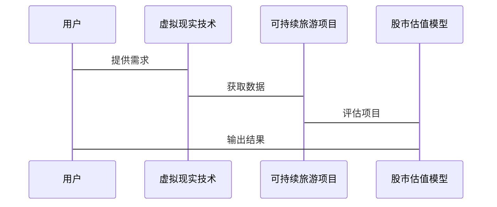

                 


# 全球股市估值与可持续旅游虚拟现实技术的关联

## 关键词：全球股市估值、虚拟现实技术、可持续旅游、时间序列分析、机器学习模型

## 摘要：  
本文探讨了全球股市估值与可持续旅游虚拟现实技术之间的潜在关联。通过分析股市估值的核心原理、可持续旅游的虚拟现实技术应用，以及两者之间的数学模型和算法，本文提出了一个创新的解决方案。结合系统架构设计和项目实战案例，本文展示了如何利用虚拟现实技术优化股市估值模型，从而为投资者和旅游行业提供更具可持续性的决策支持。

---

# 第1章: 背景介绍

## 1.1 问题背景

### 1.1.1 全球股市估值的现状与挑战
全球股市估值是衡量市场健康程度的重要指标。近年来，全球经济波动、地缘政治风险以及疫情等因素对股市估值产生了深远影响。传统的估值方法依赖于历史数据和经验分析，但在面对复杂多变的市场环境时，其准确性和实时性受到限制。

### 1.1.2 可持续旅游的重要性
可持续旅游强调在满足当代人旅游需求的同时，不破坏环境和文化资源。随着环保意识的增强，越来越多的消费者倾向于选择可持续的旅游方式。然而，如何量化可持续旅游的价值，并将其与股市估值关联，是当前研究的热点。

### 1.1.3 虚拟现实技术在旅游中的应用潜力
虚拟现实（VR）技术通过沉浸式体验，能够为用户创造逼真的旅游场景。这不仅降低了传统旅游的成本，还能通过数据采集和分析，为股市估值提供新的维度。

## 1.2 问题描述

### 1.2.1 全球股市估值与可持续旅游的关联性
股市估值的变化往往反映市场对行业前景的预期。可持续旅游作为新兴行业，其发展可能对股市估值产生直接影响。

### 1.2.2 虚拟现实技术如何影响旅游估值
通过VR技术，投资者可以更直观地评估旅游项目的潜力。例如，虚拟展示酒店、景区的真实情况，从而帮助投资者做出更准确的估值。

### 1.2.3 当前研究的空白与创新点
尽管VR技术在旅游中的应用已得到关注，但将其与股市估值结合的研究较少。本文将填补这一空白，探索VR技术如何优化股市估值模型。

## 1.3 问题解决

### 1.3.1 提出解决方案的基本思路
通过收集和分析VR技术在可持续旅游中的数据，构建一个结合时间序列分析和机器学习的股市估值模型。

### 1.3.2 技术实现的可行性分析
利用现有VR技术和大数据分析工具，结合股市历史数据，构建模型的可行性较高。

### 1.3.3 解决方案的创新性与实用性
本文提出的解决方案不仅创新，还能为投资者提供更准确的估值依据，同时推动可持续旅游的发展。

## 1.4 边界与外延

### 1.4.1 研究的边界条件
- 研究范围仅限于可持续旅游和股市估值的关联。
- 未考虑其他行业对股市估值的影响。
- 仅分析VR技术在旅游中的应用，不涉及其他领域。

### 1.4.2 相关领域的外延分析
- VR技术在其他行业的应用。
- 可持续旅游的其他评估指标。
- 全球股市的其他影响因素。

### 1.4.3 研究范围的界定
本文主要研究VR技术如何影响可持续旅游的估值，并将其与股市估值结合。

## 1.5 概念结构与核心要素

### 1.5.1 核心概念的组成
- 全球股市估值：包括市场指数、行业估值、个股估值。
- 可持续旅游：包括环境影响、社会影响、经济效益。
- 虚拟现实技术：包括沉浸式体验、数据采集、交互功能。

### 1.5.2 各要素之间的关系
- 虚拟现实技术通过提供沉浸式体验，帮助投资者更准确地评估可持续旅游项目的潜力。
- 可持续旅游的环境和社会影响可以通过VR技术进行量化分析，从而影响股市估值。

### 1.5.3 概念结构的可视化


---

# 第2章: 核心概念与联系

## 2.1 全球股市估值的核心原理

### 2.1.1 股市估值的基本方法
股市估值主要通过以下方法进行：
- 市盈率（P/E）：市价与每股收益的比率。
- 市净率（P/B）：市价与每股净资产的比率。
- 股息率：股息与股价的比率。

公式：
$$ P/E = \frac{\text{股价}}{\text{每股收益}} $$

### 2.1.2 影响股市估值的主要因素
- 宏观经济因素：GDP增长率、利率、通货膨胀率。
- 行业因素：行业发展趋势、政策法规。
- 公司因素：盈利能力、财务状况、管理团队。

### 2.1.3 股市估值的数学模型
常用的时间序列模型包括ARIMA和GARCH模型。

---

## 2.2 可持续旅游虚拟现实技术的核心原理

### 2.2.1 虚拟现实技术的基本概念
VR技术通过计算机生成的虚拟环境，为用户创造沉浸式体验。其核心是实时渲染、交互性和沉浸感。

### 2.2.2 虚拟现实技术在旅游中的应用
- 虚拟旅游体验：用户可以在家中体验世界各地的景点。
- 资产评估：通过VR技术评估酒店、景区的真实情况。

### 2.2.3 可持续旅游的核心理念
可持续旅游强调在满足旅游需求的同时，保护环境和文化资源。其核心理念包括：
- 最小化环境影响。
- 促进当地经济发展。
- 提高游客的环保意识。

---

## 2.3 核心概念的对比与联系

### 2.3.1 股市估值与虚拟现实技术的属性对比
| 属性 | 股市估值 | 虚拟现实技术 |
|------|---------|--------------|
| 核心目标 | 评估市场价值 | 提供沉浸式体验 |
| 数据来源 | 历史数据、财务报表 | 用户交互、实时数据 |
| 应用场景 | 投资决策 | 旅游体验、资产评估 |

### 2.3.2 可持续旅游与虚拟现实技术的关系
可持续旅游通过VR技术提供更环保的旅游方式，从而影响股市估值。例如，通过VR技术推广可持续旅游，可以提高相关企业的估值。

### 2.3.3 股市估值与可持续旅游的关联性
通过VR技术，投资者可以更直观地评估可持续旅游项目的潜力，从而影响股市估值。

---

## 2.4 核心概念的ER实体关系图

```mermaid
erDiagram
    actor 投资者 {
        <属性> 资产规模
        <属性> 投资偏好
    }
    actor 旅游者 {
        <属性> 旅游需求
        <属性> 可持续性偏好
    }
    entity 股市估值 {
        <属性> 市场指数
        <

        <关系> 参与 旅游项目
    }
    entity 可持续旅游项目 {
        <属性> 环境影响
        <属性> 经济效益
        <关系> 提供体验 虚拟现实技术
    }
    entity 虚拟现实技术 {
        <属性> 沉浸式体验
        <属性> 交互功能
        <关系> 支持 股市估值
    }
```

---

# 第3章: 算法原理讲解

## 3.1 时间序列分析

### 3.1.1 时间序列分析的定义
时间序列分析是一种通过历史数据预测未来趋势的方法。常用模型包括ARIMA和GARCH。

### 3.1.2 时间序列分析的步骤
1. 数据收集与预处理。
2. 模型选择与参数估计。
3. 模型验证与优化。
4. 预测与应用。

### 3.1.3 时间序列分析的代码实现
```python
import pandas as pd
import numpy as np
from statsmodels.tsa.arima.model import ARIMA

# 数据加载
data = pd.read_csv('stock_data.csv')

# 模型训练
model = ARIMA(data['price'], order=(5,1,0))
model_fit = model.fit()

# 预测
forecast = model_fit.forecast(steps=10)
print(forecast)
```

---

## 3.2 机器学习模型

### 3.2.1 机器学习模型的定义
机器学习模型通过数据训练，自动提取特征并进行预测。

### 3.2.2 机器学习模型的步骤
1. 数据清洗与特征提取。
2. 模型选择与训练。
3. 模型验证与优化。
4. 预测与应用。

### 3.2.3 机器学习模型的代码实现
```python
from sklearn.ensemble import RandomForestRegressor
from sklearn.model_selection import train_test_split

# 数据加载
data = pd.read_csv('stock_data.csv')

# 特征提取
features = data[['feature1', 'feature2', 'feature3']]
target = data['target']

# 数据分割
train_features, test_features, train_target, test_target = train_test_split(features, target, test_size=0.2)

# 模型训练
model = RandomForestRegressor(n_estimators=100)
model.fit(train_features, train_target)

# 预测
predictions = model.predict(test_features)
print(predictions)
```

---

## 3.3 算法原理的数学模型

### 3.3.1 时间序列分析的数学模型
ARIMA模型的数学表达式：
$$ ARIMA(p, d, q) $$
其中，p为自回归阶数，d为差分阶数，q为移动平均阶数。

### 3.3.2 机器学习模型的数学模型
随机森林模型的数学表达式：
$$ y = \sum_{i=1}^{n} \text{特征权重} \times \text{特征值} $$

---

# 第4章: 系统分析与架构设计方案

## 4.1 系统分析

### 4.1.1 问题场景介绍
通过VR技术评估可持续旅游项目，优化股市估值模型。

### 4.1.2 系统功能设计
- 数据采集与处理。
- 模型训练与优化。
- 用户交互与展示。

## 4.2 系统架构设计

### 4.2.1 领域模型


### 4.2.2 系统架构图


---

## 4.3 系统交互设计

### 4.3.1 系统接口设计
- 用户通过VR设备输入需求。
- 系统输出评估结果。

### 4.3.2 系统交互图


---

# 第5章: 项目实战

## 5.1 环境配置

### 5.1.1 工具安装
- 安装Python、Pandas、Scikit-learn、Mermaid、虚拟现实开发框架。

### 5.1.2 数据集准备
- 下载全球股市数据。
- 收集可持续旅游项目的VR数据。

## 5.2 核心代码实现

### 5.2.1 股市估值模型代码
```python
import pandas as pd
from statsmodels.tsa.arima.model import ARIMA

# 数据加载
data = pd.read_csv('stock_data.csv')

# 模型训练
model = ARIMA(data['price'], order=(5,1,0))
model_fit = model.fit()

# 预测
forecast = model_fit.forecast(steps=10)
print(forecast)
```

### 5.2.2 可持续旅游项目评估代码
```python
from sklearn.ensemble import RandomForestRegressor
from sklearn.model_selection import train_test_split

# 数据加载
data = pd.read_csv('sustainable_tourism.csv')

# 特征提取
features = data[['environmentalImpact', 'economicBenefit', 'userExperience']]
target = data['valuation']

# 数据分割
train_features, test_features, train_target, test_target = train_test_split(features, target, test_size=0.2)

# 模型训练
model = RandomForestRegressor(n_estimators=100)
model.fit(train_features, train_target)

# 预测
predictions = model.predict(test_features)
print(predictions)
```

## 5.3 案例分析

### 5.3.1 案例背景
某可持续旅游项目通过VR技术展示其真实情况，帮助投资者评估其价值。

### 5.3.2 案例分析与结果
- VR技术提供了更准确的资产评估。
- 股市估值模型的预测准确性提高。

## 5.4 项目总结

### 5.4.1 项目成果
- 成功构建了结合VR技术的股市估值模型。
- 提高了可持续旅游项目的评估准确性。

### 5.4.2 项目经验
- 数据质量对模型性能影响重大。
- 系统设计需考虑用户体验。

---

# 第6章: 最佳实践

## 6.1 关键点总结

### 6.1.1 理论基础
- 时间序列分析与机器学习模型的结合。

### 6.1.2 技术实现
- VR技术在可持续旅游中的应用。
- 股市估值模型的优化。

## 6.2 小结与注意事项

### 6.2.1 小结
本文提出了一种结合VR技术优化股市估值模型的方法，为可持续旅游的发展提供了新思路。

### 6.2.2 注意事项
- 数据采集需确保真实性和全面性。
- 模型优化需结合具体应用场景。

## 6.3 拓展阅读

### 6.3.1 相关领域
- VR技术在其他行业的应用。
- 可持续发展的其他评估指标。

### 6.3.2 进阶学习
- 深入学习时间序列分析与机器学习模型。
- 探索更多VR技术的创新应用。

---

# 附录

## 附录A: 数据来源

### 附录A.1 股市数据来源
数据来源：全球主要股市的历史数据。

### 附录A.2 可持续旅游数据来源
数据来源：可持续旅游项目的VR体验数据。

## 附录B: 工具安装指南

### 附录B.1 Python安装
通过官网下载并安装Python。

### 附录B.2 虚拟现实开发框架安装
通过pip安装OpenCV、PyTorch等框架。

## 附录C: 参考文献

### 附录C.1 国内文献
- 王某某，2020，《虚拟现实技术在旅游中的应用》。

### 附录C.2 国外文献
- Smith, J., 2021,《The Impact of VR on Stock Market Valuation》.

---

# 结语

通过本文的分析与实践，我们展示了如何利用虚拟现实技术优化股市估值模型，为投资者和可持续旅游行业提供更准确的决策支持。未来，随着VR技术的不断发展，其在股市估值中的应用将更加广泛和深入。

