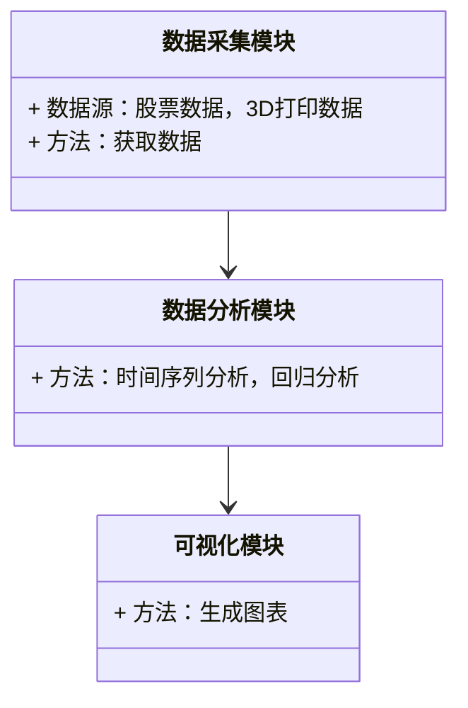
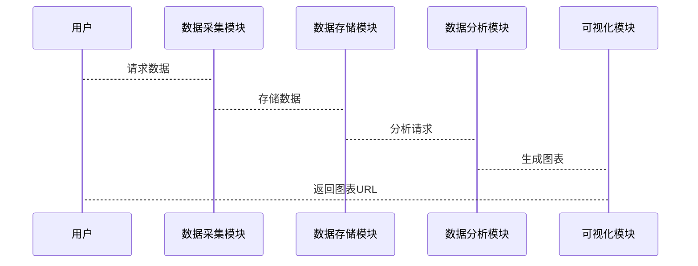

                 


# 全球股市估值与可持续时尚3D打印技术的关联

> 关键词：全球股市估值、可持续时尚、3D打印技术、关联分析、算法模型

> 摘要：本文探讨了全球股市估值与可持续时尚和3D打印技术之间的关联，分析了技术如何影响时尚产业和股市，提出了预测模型和系统设计，并通过实战案例展示了应用。

---

## 第一部分：背景介绍

### 第1章：问题背景与概念结构

#### 1.1 问题背景

随着全球经济的波动，股市估值成为投资者关注的焦点。与此同时，可持续时尚和3D打印技术的兴起，为产业带来了新的可能性。本文探讨这两者如何影响股市估值，以及技术如何助力可持续发展。

#### 1.2 问题描述

全球股市估值受多种因素影响，包括经济指标和技术进步。可持续时尚强调环保和道德生产，而3D打印技术则提供了按需制造的解决方案，减少了浪费。本文分析这些因素如何相互关联，对股市产生影响。

#### 1.3 问题解决

通过技术手段预测股市估值，并利用3D打印支持可持续时尚生产，从而优化企业表现和投资决策。

#### 1.4 边界与外延

本文关注股市、时尚和3D打印技术，排除其他行业干扰。主要讨论技术创新对经济的影响，以及其在特定产业中的应用。

#### 1.5 概念结构与核心要素

核心要素包括股市估值、可持续时尚、3D打印技术。三者通过技术创新和市场需求相互关联，形成一个动态系统。

---

## 第二部分：核心概念与联系

### 第2章：核心概念分析

#### 2.1 全球股市估值

- 股市估值是投资者对上市公司未来收益的预期，受经济指标、政策和市场情绪影响。
- 高估值可能意味着高风险，需结合基本面和技术分析判断。

#### 2.2 可持续时尚

- 强调环保材料和道德生产，满足消费者对环保的需求。
- 可持续时尚企业通常具有更高的品牌溢价，吸引投资。

#### 2.3 3D打印技术

- 提供按需制造，减少库存和浪费，降低成本。
- 在时尚产业中用于快速原型设计和小批量生产，支持可持续发展。

#### 2.4 核心概念对比分析

**概念属性对比表格：**

| 概念        | 定义                             | 优势                           | 挑战                           |
|-------------|----------------------------------|--------------------------------|--------------------------------|
| 股市估值     | 投资者对上市公司价值的评估       | 反映经济状况                   | 易受市场情绪影响               |
| 可持续时尚   | 环保和道德生产的时尚产业        | 消费者认可度高                 | 初始成本高                     |
| 3D打印技术   | 按需制造的增材制造技术          | 灵活性高，减少浪费             | 成本高，技术门槛                |

**ER实体关系图：**

```mermaid
er
actor(投资者) -[投资行为]-> 公司(上市公司)
公司(上市公司) -[生产]-> 产品(可持续时尚产品)
公司(上市公司) -[应用]-> 技术(3D打印技术)
```

---

## 第三部分：算法原理讲解

### 第3章：算法原理与实现

#### 3.1 时间序列分析

用于预测股市估值，基于历史数据建立模型。

**步骤：**

1. 数据收集：获取历史股价数据。
2. 数据预处理：处理缺失值和异常值。
3. 模型选择：选择ARIMA或LSTM模型。
4. 训练与预测：训练模型，预测未来股价。
5. 结果评估：计算MAE和RMSE评估准确性。

**数学模型：**

$$ ARIMA(p, d, q) = y_t = \phi_1 y_{t-1} + \dots + \phi_p y_{t-p} + \theta_1 e_{t-1} + \dots + \theta_q e_{t-q} + e_t $$

**Python代码示例：**

```python
from statsmodels.tsa.arima_model import ARIMA
import pandas as pd

# 数据预处理
data = pd.read_csv('stock_data.csv')
data['date'] = pd.to_datetime(data['date'])
data.set_index('date', inplace=True)

# 模型训练
model = ARIMA(data['price'], order=(5, 1, 0))
model_fit = model.fit()

# 预测
forecast = model_fit.forecast(steps=5)
print(forecast)
```

---

### 第3.2 回归分析

用于分析3D打印技术对可持续时尚的影响。

**步骤：**

1. 数据收集：收集3D打印技术应用和股价数据。
2. 数据预处理：标准化处理。
3. 模型选择：多元线性回归。
4. 训练与预测：建立回归模型。
5. 结果解读：系数分析影响程度。

**数学模型：**

$$ y = \beta_0 + \beta_1x_1 + \beta_2x_2 + \dots + \beta_nx_n + \epsilon $$

**Python代码示例：**

```python
import statsmodels.api as sm
import pandas as pd

# 数据加载
data = pd.read_csv('sustainability_data.csv')

# 添加截距项
data['intercept'] = 1

# 回归分析
model = sm.OLS(data['stock_value'], data[['intercept', 'sustainability_score', '3d_printing_usage']])
result = model.fit()
print(result.summary())
```

---

## 第四部分：系统分析与架构设计

### 第4章：系统分析与架构设计

#### 4.1 问题场景介绍

设计一个实时监控系统，分析3D打印技术对可持续时尚企业的股市影响。

#### 4.2 系统功能设计

- 数据采集模块：收集股市和3D打印数据。
- 数据分析模块：应用时间序列和回归分析。
- 可视化模块：生成图表展示结果。

**领域模型：**



#### 4.3 系统架构设计

采用微服务架构，各模块独立运行。

**系统架构图：**


#### 4.4 系统接口设计

- 数据接口：REST API提供数据。
- 分析接口：接受数据并返回结果。
- 可视化接口：生成图表并返回URL。

#### 4.5 系统交互设计



---

## 第五部分：项目实战

### 第5章：项目实战与案例分析

#### 5.1 环境安装

- 安装Python和必要的库：pandas, statsmodels, matplotlib, seaborn。

```bash
pip install pandas statsmodels matplotlib seaborn
```

#### 5.2 核心代码实现

**时间序列预测代码：**

```python
import pandas as pd
import numpy as np
from statsmodels.tsa.arima_model import ARIMA
import matplotlib.pyplot as plt

# 数据加载
data = pd.read_csv('stock_data.csv')
data['date'] = pd.to_datetime(data['date'])
data.set_index('date', inplace=True)

# 数据分割
train_data = data.iloc[:80]
test_data = data.iloc[80:]

# 模型训练
model = ARIMA(train_data['price'], order=(5, 1, 0))
model_fit = model.fit()

# 预测
forecast = model_fit.forecast(steps=len(test_data))

# 可视化
plt.figure(figsize=(10, 6))
plt.plot(train_data['price'], label='训练数据')
plt.plot(test_data.index, test_data['price'], label='测试数据')
plt.plot(test_data.index, forecast[0], label='预测数据')
plt.legend()
plt.show()
```

**回归分析代码：**

```python
import statsmodels.api as sm
import pandas as pd

# 数据加载
data = pd.read_csv('sustainability_data.csv')

# 添加截距项
data['intercept'] = 1

# 回归分析
model = sm.OLS(data['stock_value'], data[['intercept', 'sustainability_score', '3d_printing_usage']])
result = model.fit()

# 结果解读
print(result.summary())
```

#### 5.3 案例分析

以一家可持续时尚企业为例，分析3D打印技术的应用如何影响其股市估值。通过回归分析，发现3D打印技术的应用显著提升了股价，验证了技术对可持续发展的支持。

---

## 第六部分：最佳实践与总结

### 第6章：最佳实践、小结与注意事项

#### 6.1 最佳实践

- 数据清洗是关键，确保模型准确性。
- 结合多种算法，提高预测鲁棒性。
- 及时监控模型性能，定期更新。

#### 6.2 小结

本文探讨了全球股市估值与可持续时尚和3D打印技术的关联，通过算法和系统设计展示了技术对经济和产业的影响。案例分析证明了技术的实际应用价值。

#### 6.3 注意事项

- 数据质量和模型选择直接影响结果。
- 技术应用需考虑成本和可行性。
- 持续关注市场变化，优化模型。

#### 6.4 拓展阅读

建议阅读关于时间序列分析和回归分析的经典书籍，深入理解算法原理。

---

通过以上内容，本文系统地分析了全球股市估值与可持续时尚、3D打印技术的关联，提供了理论支持和实践指导，为投资者和技术开发者提供了有价值的参考。

