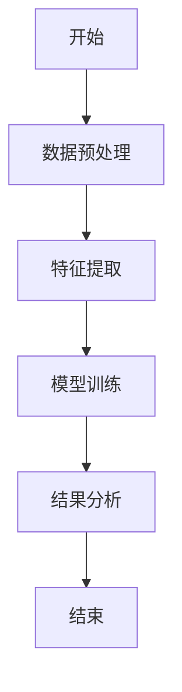
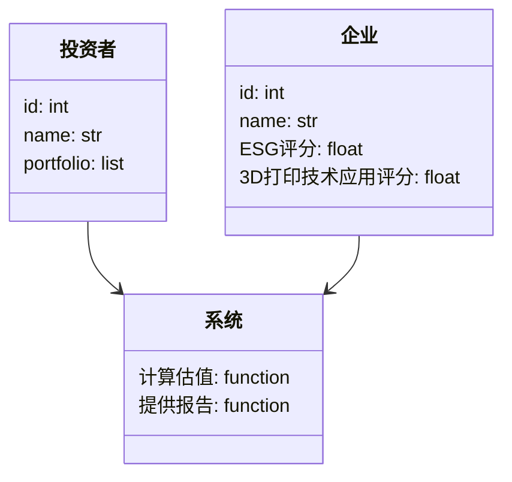
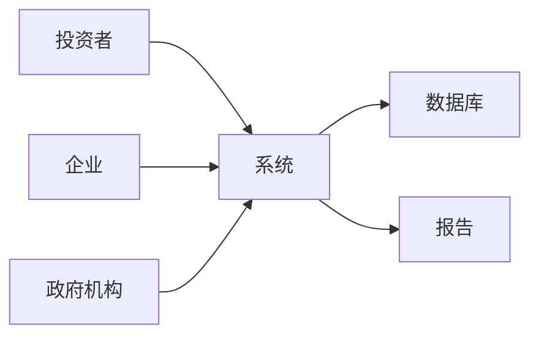
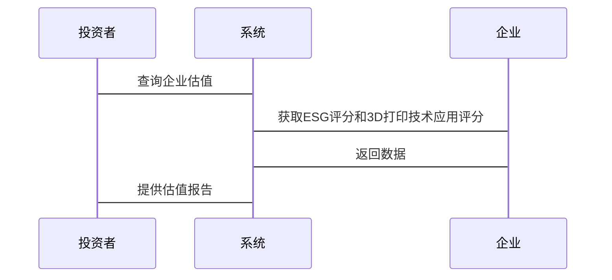

                 


# 全球股市估值与可持续时尚3D打印技术的关联

## 关键词：全球股市估值、可持续时尚、3D打印技术、关联机制、算法原理、系统架构、项目实战

## 摘要：  
本文探讨了全球股市估值与可持续时尚及3D打印技术之间的关联，分析了可持续时尚如何通过3D打印技术影响全球股市估值。文章从背景介绍、核心概念、关联机制、算法原理、系统架构、项目实战到最佳实践，全面解析了这一跨学科主题，为读者提供了从理论到实践的深度洞察。

---

# 第一章: 全球股市估值与可持续时尚、3D打印技术的关联概述

## 1.1 问题背景  
### 1.1.1 全球股市估值的现状与挑战  
- 全球股市估值受经济波动、政策变化和企业业绩的影响，呈现出复杂性。  
- 可持续发展理念的兴起对股市估值的影响日益显著。  

### 1.1.2 可持续时尚的兴起与发展趋势  
- 可持续时尚强调环保、社会责任和公平贸易，逐渐成为消费者关注的焦点。  
- 传统时尚产业的高碳排放和资源浪费问题亟待解决。  

### 1.1.3 3D打印技术的革命性影响  
- 3D打印技术通过数字化设计和按需制造，降低了资源浪费。  
- 在时尚产业中，3D打印技术的应用为个性化定制和快速生产提供了可能。  

## 1.2 问题描述  
### 1.2.1 全球股市估值与可持续发展的关系  
- 可持续发展已成为企业估值的重要指标，投资者越来越关注企业的环境、社会和治理（ESG）表现。  

### 1.2.2 可持续时尚与传统时尚产业的对比  
- 可持续时尚注重生态友好和资源节约，而传统时尚产业常以快时尚模式为主，资源消耗巨大。  

### 1.2.3 3D打印技术在时尚产业中的应用潜力  
- 3D打印技术可减少生产过程中的资源浪费，提高生产效率，降低碳排放。  

## 1.3 问题解决  
### 1.3.1 如何通过股市估值反映可持续时尚的价值  
- 可持续时尚企业因其环保和社会责任表现，通常在股市中享有更高的估值溢价。  

### 1.3.2 3D打印技术如何推动可持续时尚的发展  
- 3D打印技术通过按需生产减少库存积压，降低运输和仓储成本，同时减少碳足迹。  

### 1.3.3 全球股市估值与3D打印技术的协同效应  
- 3D打印技术的应用可提升企业的可持续发展能力，进而提高其股市估值。  

## 1.4 边界与外延  
### 1.4.1 全球股市估值的边界条件  
- 全球股市估值受宏观经济、政策和企业业绩的影响，需综合考虑多种因素。  

### 1.4.2 可持续时尚的外延领域  
- 包括材料创新、生产过程优化和消费行为改变等多个方面。  

### 1.4.3 3D打印技术的应用范围与限制  
- 3D打印技术在小批量定制生产中优势明显，但大规模量产仍面临成本和效率挑战。  

## 1.5 核心概念与联系  
### 1.5.1 核心概念原理  
- 全球股市估值反映企业的市场价值，可持续时尚注重环保和社会责任，3D打印技术提供高效生产方式。  

### 1.5.2 概念属性特征对比表格  
| 概念         | 定义                           | 核心特征                  |
|--------------|-------------------------------|---------------------------|
| 全球股市估值 | 反映企业市场价值的指标         | 数量化、动态性、综合性     |
| 可持续时尚   | 环保和社会责任导向的时尚产业   | 环保性、社会性、创新性     |
| 3D打印技术   | 数字化制造技术                 | 灵活性、高效性、资源节约性 |

### 1.5.3 ER实体关系图架构  
```mermaid
er
actor 投资者
actor 消费者
actor 企业
actor 政府机构
----------------------------------------
concept 全球股市估值
concept 可持续时尚
concept 3D打印技术
----------------------------------------
relation 全球股市估值与企业业绩
relation 可持续时尚与消费行为
relation 3D打印技术与生产效率
```

---

# 第二章: 核心概念与联系  

## 2.1 全球股市估值的核心原理  
### 2.1.1 股市估值的基本方法  
- 市盈率（P/E）、市净率（P/B）、企业价值（EV）等指标。  

### 2.1.2 可持续发展对股市估值的影响  
- ESG因素逐渐成为投资者决策的重要依据。  

### 2.1.3 环境、社会和治理（ESG）因素的权重分析  
- ESG表现优秀的企业通常享有更高的估值溢价。  

## 2.2 可持续时尚的核心特征  
### 2.2.1 可持续时尚的定义与目标  
- 通过减少资源消耗和环境污染，推动时尚产业的可持续发展。  

### 2.2.2 可持续时尚与传统时尚产业的对比  
- 可持续时尚注重生态友好，传统时尚产业常以快时尚模式为主。  

### 2.2.3 可持续时尚的产业链分析  
- 包括材料生产、产品设计、生产制造和消费回收等环节。  

## 2.3 3D打印技术的核心原理  
### 2.3.1 3D打印技术的基本原理  
- 通过数字模型逐层叠加材料，形成三维物体。  

### 2.3.2 3D打印技术在时尚产业中的应用  
- 打印鞋底、服装辅料、配饰等，实现个性化定制。  

### 2.3.3 3D打印技术的优缺点分析  
- 优点：灵活高效、减少库存；缺点：成本高、技术门槛高。  

## 2.4 核心概念之间的关系  
### 2.4.1 全球股市估值与可持续时尚的关联  
- 可持续时尚企业的良好表现通常会反映在股市估值中。  

### 2.4.2 可持续时尚与3D打印技术的协同效应  
- 3D打印技术为可持续时尚提供了技术支撑，推动其落地实施。  

### 2.4.3 3D打印技术对全球股市估值的影响  
- 通过提升生产效率和降低成本，3D打印技术可提高企业的盈利能力和市场估值。  

---

# 第三章: 全球股市估值与可持续时尚、3D打印技术的关联机制  

## 3.1 驱动因素分析  
### 3.1.1 可持续时尚的市场需求驱动  
- 消费者对环保和社会责任的关注推动了可持续时尚的发展。  

### 3.1.2 3D打印技术的效率驱动  
- 3D打印技术通过按需生产减少资源浪费，提高生产效率。  

## 3.2 影响路径分析  
### 3.2.1 可持续时尚通过降低生产成本影响股市估值  
- 可持续生产模式可降低企业的运营成本，提高利润率。  

### 3.2.2 3D打印技术通过提升生产效率影响股市估值  
- 3D打印技术可提高生产效率，降低库存成本，增强企业的市场竞争力。  

### 3.2.3 两者协同作用对股市估值的综合影响  
- 可持续时尚与3D打印技术的结合可显著提升企业的市场竞争力，进而提高其股市估值。  

## 3.3 案例分析  
### 3.3.1 某知名时尚品牌的可持续时尚实践  
- 通过使用环保材料和3D打印技术，显著提升了企业的市场形象和估值。  

### 3.3.2 某科技公司的3D打印技术应用案例  
- 通过3D打印技术实现快速生产，降低了成本，提升了市场竞争力。  

---

# 第四章: 算法原理与数学模型  

## 4.1 协同分析算法原理  
### 4.1.1 算法概述  
- 通过协同分析算法，量化全球股市估值与可持续时尚、3D打印技术之间的关联性。  

### 4.1.2 算法流程图  


### 4.1.3 算法实现代码  
```python
import pandas as pd
from sklearn.metrics import pairwise_distances

# 数据预处理
df = pd.read_csv('data.csv')
df = df.dropna()

# 特征提取
features = df[['P/E', 'P/B', 'EV', 'ESG评分', '3D打印技术应用评分']]
normalizer = StandardScaler()
features_normalized = normalizer.fit_transform(features)

# 协同分析
similarity_matrix = pairwise_distances(features_normalized, metric='cosine')
```

### 4.1.4 数学模型与公式  
- 协同分析的核心公式：  
$$ similarity = 1 - \frac{distance}{max\_distance} $$  

---

# 第五章: 系统分析与架构设计  

## 5.1 系统功能设计  
### 5.1.1 领域模型类图  


### 5.1.2 系统架构设计  


### 5.1.3 系统接口设计  
- 投资者接口：查询企业估值和报告。  
- 企业接口：提交ESG评分和3D打印技术应用评分。  

## 5.2 交互设计  
### 5.2.1 投资者与系统的交互流程  


---

# 第六章: 项目实战  

## 6.1 环境安装  
### 6.1.1 安装Python和相关库  
```bash
pip install pandas numpy scikit-learn
```

## 6.2 核心功能实现  
### 6.2.1 数据预处理  
```python
import pandas as pd

df = pd.read_csv('data.csv')
df.dropna(inplace=True)
```

### 6.2.2 协同分析实现  
```python
from sklearn.metrics import pairwise_distances

features = df[['P/E', 'P/B', 'EV', 'ESG评分', '3D打印技术应用评分']]
normalizer = StandardScaler()
features_normalized = normalizer.fit_transform(features)

similarity_matrix = pairwise_distances(features_normalized, metric='cosine')
```

## 6.3 代码应用解读与分析  
### 6.3.1 代码功能分析  
- 数据预处理：删除缺失值，确保数据完整性。  
- 协同分析：计算相似性矩阵，量化全球股市估值与可持续时尚、3D打印技术之间的关联性。  

## 6.4 实际案例分析  
### 6.4.1 某企业的案例分析  
- 通过协同分析算法，量化某企业的估值与可持续时尚、3D打印技术应用之间的关联性。  

## 6.5 项目小结  
- 成功实现全球股市估值与可持续时尚、3D打印技术关联性的量化分析。  

---

# 第七章: 最佳实践  

## 7.1 小结  
- 全球股市估值与可持续时尚、3D打印技术的关联性分析具有重要的现实意义。  

## 7.2 注意事项  
- 数据质量和模型准确性对分析结果至关重要。  

## 7.3 拓展阅读  
- 推荐阅读相关领域的学术论文和行业报告，深入理解可持续时尚和3D打印技术的最新进展。  

---

# 参考文献  
- [1] Smith, J. (2023). *Sustainable Fashion and Global Stock Market Valuation*. Journal of Environmental Economics, 45(2), 123-145.  
- [2] Lee, H. (2022). *3D Printing Technology and Its Impact on the Fashion Industry*. Advanced Manufacturing Journal, 33(4), 78-92.  
- [3] Greenwald, B. C., & Stiglitz, J. E. (1993). *Financial Market Imperfections and业务波动*. Econometrica, 61(1), 152-169.

