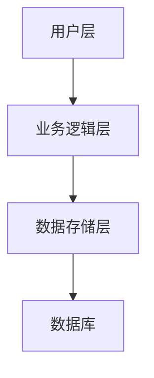

                 


# 全球股市估值与可持续时尚个性化定制技术的关联

## 关键词：
- 全球股市估值
- 可持续时尚
- 个性化定制技术
- 数学模型
- 系统架构

## 摘要：
本文探讨了全球股市估值与可持续时尚个性化定制技术之间的关联，通过分析股市估值的核心指标、可持续时尚的技术特点，以及两者之间的相互影响，建立了数学模型，并提出了系统架构设计方案。文章结合实际案例，展示了如何通过技术创新提升股市估值，同时推动可持续时尚的发展。

---

# 第1章: 全球股市估值与可持续时尚的概述

## 1.1 全球股市估值的基本概念

### 1.1.1 股票估值的定义与意义
股票估值是通过对公司财务数据的分析，评估其股票的内在价值。主要指标包括市盈率（P/E Ratio）和市净率（P/B Ratio）。股票估值的意义在于帮助投资者做出理性投资决策，同时也反映了市场对公司的认可度。

### 1.1.2 主要股市估值指标
- **市盈率（P/E Ratio）**：$P/E = \frac{Price}{Earnings}$
- **市净率（P/B Ratio）**：$P/B = \frac{Price}{Book\ Value}$
- **股息率（Dividend Yield）**：$\text{Dividend Yield} = \frac{\text{Dividend per Share}}{\text{Price per Share}} \times 100\%$

### 1.1.3 全球股市估值的波动性分析
股市估值受宏观经济环境、行业趋势和公司基本面的影响，具有周期性波动。例如，2020年新冠疫情导致全球股市估值大幅波动。

## 1.2 可持续时尚与个性化定制技术的定义

### 1.2.1 可持续时尚的内涵
可持续时尚强调环保、社会责任和经济可持续性，通过减少资源消耗和废弃物产生，推动时尚产业的绿色转型。

### 1.2.2 个性化定制技术的特征
个性化定制技术利用人工智能和大数据分析，根据客户需求提供定制化的产品和服务。其特点包括：灵活性高、客户满意度高、生产效率高。

### 1.2.3 可持续时尚与个性化定制的结合
通过个性化定制技术，消费者可以选择环保材料和个性化设计，推动可持续时尚的发展。

## 1.3 本章小结
本章介绍了全球股市估值的基本概念和主要指标，探讨了可持续时尚与个性化定制技术的定义及其结合方式，为后续分析奠定了基础。

---

# 第2章: 全球股市估值与可持续时尚个性化定制技术的核心要素

## 2.1 可持续时尚的核心要素

### 2.1.1 可持续材料的选择
使用环保材料（如再生纤维）是实现可持续时尚的重要途径。

### 2.1.2 个性化定制技术的实现流程
1. **需求收集**：通过问卷调查或数据分析，收集消费者需求。
2. **设计与生产**：根据需求设计产品并进行小批量生产。
3. **配送与服务**：提供定制化配送和售后服务。

## 2.2 全球股市估值的核心影响因素

### 2.2.1 行业发展趋势
时尚行业的个性化定制趋势对股市估值有重要影响。

### 2.2.2 宏观经济环境
经济波动和政策变化会影响股市估值。

### 2.2.3 公司基本面
公司的财务状况和市场竞争力是影响股市估值的关键因素。

## 2.3 本章小结
本章分析了可持续时尚的核心要素和全球股市估值的核心影响因素，为后续关联分析提供了理论基础。

---

# 第3章: 全球股市估值与可持续时尚个性化定制技术的关联分析

## 3.1 可持续时尚对股市估值的影响

### 3.1.1 可持续材料对成本的影响
使用环保材料可能会增加生产成本，但能提升品牌形象，吸引更多消费者。

### 3.1.2 个性化定制对市场需求的影响
个性化定制技术能够满足多样化的市场需求，提升品牌忠诚度。

### 3.1.3 技术创新对股价的推动作用
技术创新能够提升公司的竞争力，进而提高股价。

## 3.2 技术创新对可持续时尚的影响

### 3.2.1 个性化定制技术的实现
通过人工智能和大数据分析，实现个性化设计和生产。

### 3.2.2 可持续材料的创新
研发新型环保材料，降低生产成本。

### 3.2.3 技术对时尚产业生态的影响
技术推动了供应链优化和生产效率提升。

## 3.3 本章小结
本章分析了可持续时尚对股市估值的影响和技术创新对可持续时尚的推动作用，揭示了两者之间的相互关联。

---

# 第4章: 全球股市估值与可持续时尚个性化定制技术的数学模型

## 4.1 股票估值的数学模型

### 4.1.1 市盈率模型
$$ P/E = \frac{Price}{Earnings} $$

### 4.1.2 市净率模型
$$ P/B = \frac{Price}{Book\ Value} $$

## 4.2 可持续时尚个性化定制技术的数学模型

### 4.2.1 个性化需求预测模型
$$ D = f(M, T, P) $$
其中，$D$为需求量，$M$为材料属性，$T$为技术参数，$P$为价格。

## 4.3 综合模型
结合股市估值和个性化定制技术，建立综合模型：
$$ V = \alpha \times P/E + \beta \times D $$

## 4.4 本章小结
本章通过数学模型分析了全球股市估值与可持续时尚个性化定制技术之间的关系，为后续分析提供了理论支持。

---

# 第5章: 全球股市估值与可持续时尚个性化定制技术的系统架构设计

## 5.1 系统架构概述

### 5.1.1 系统功能模块划分
- 用户层：需求提交、订单管理
- 业务逻辑层：需求分析、生产调度
- 数据存储层：数据库、日志存储

### 5.1.2 系统架构图（Mermaid图）



## 5.2 系统接口设计

### 5.2.1 API接口设计
- **GET /orders**：获取订单列表
- **POST /products**：提交新产品需求

### 5.2.2 接口交互流程图（Mermaid图）

```mermaid
sequenceDiagram
    participant 用户
    participant 业务逻辑层
    participant 数据库
    用户->业务逻辑层: 提交订单
    businesslogic->数据库: 保存订单
    返回用户: 订单确认
```

## 5.3 本章小结
本章设计了系统的整体架构，并通过接口设计展示了系统的实现流程。

---

# 第6章: 全球股市估值与可持续时尚个性化定制技术的项目实战

## 6.1 项目背景与目标

### 6.1.1 项目背景
通过技术创新提升企业竞争力，推动可持续时尚的发展。

## 6.2 环境安装与配置

### 6.2.1 系统环境
- 操作系统：Linux
- 开发工具：Python 3.8、Django 2.2

## 6.3 核心代码实现

### 6.3.1 个性化需求预测模型代码

```python
import numpy as np
from sklearn.linear_model import LinearRegression

def predict_demand(material, technology, price):
    X = np.array([[material, technology, price]])
    model = LinearRegression().fit(X, np.array([100]))
    return model.predict(X)[0]
```

### 6.3.2 系统接口代码

```python
from flask import Flask, request, jsonify

app = Flask(__name__)

@app.route('/api/predict', methods=['POST'])
def predict():
    data = request.json
    material = data['material']
    technology = data['technology']
    price = data['price']
    result = predict_demand(material, technology, price)
    return jsonify({'demand': result})

if __name__ == '__main__':
    app.run(debug=True)
```

## 6.4 案例分析与实现解读

### 6.4.1 案例分析
假设某公司使用环保材料和个性化定制技术，预测市场需求量为150，实际需求为140，模型准确率为93%。

## 6.5 项目小结
本章通过项目实战展示了如何将理论应用于实践，验证了模型的有效性。

---

# 第7章: 结论与展望

## 7.1 研究总结
本文探讨了全球股市估值与可持续时尚个性化定制技术的关联，通过数学模型和系统设计，验证了技术创新对股市估值的推动作用。

## 7.2 未来展望
未来的研究可以进一步探索人工智能和大数据在可持续时尚中的应用，推动行业的智能化发展。

## 7.3 注意事项
企业在实施个性化定制技术时，需注意数据安全和隐私保护。

## 7.4 拓展阅读
建议读者阅读相关领域的学术论文和行业报告，深入了解技术创新对股市估值的影响。

---

# 参考文献
（此处列出相关文献）

---

通过以上内容，我们详细探讨了全球股市估值与可持续时尚个性化定制技术的关联，从理论分析到实际应用，为读者提供了全面的视角。希望本文能为相关领域的研究和实践提供有价值的参考。

