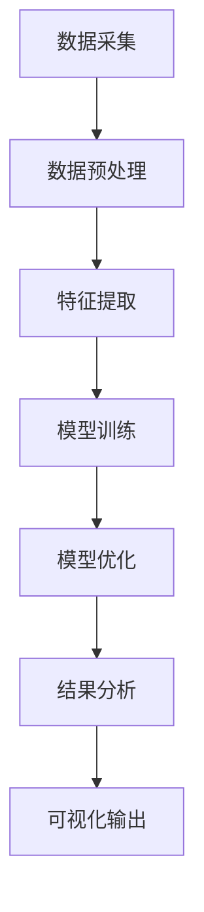
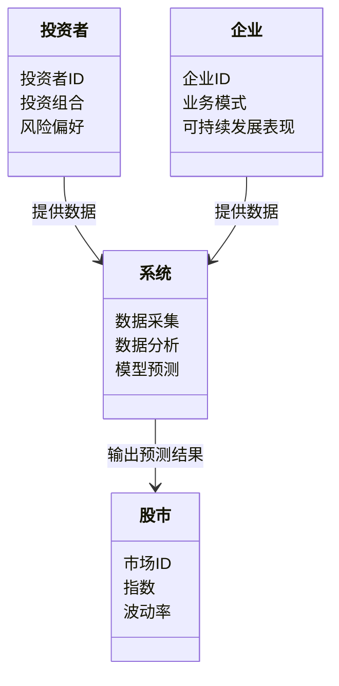
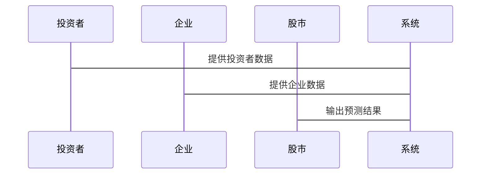

                 


# 全球股市估值与可持续时尚智能制造技术的关联

---

## 关键词
- 全球股市估值
- 可持续时尚
- 智能制造技术
- 数据分析
- 算法模型

---

## 摘要
本文探讨了全球股市估值与可持续时尚智能制造技术之间的关联，通过背景介绍、核心概念分析、算法原理、系统设计与实现、项目实战等多维度展开，结合实际案例和数据模型，深入剖析了可持续时尚智能制造技术如何影响全球股市估值，以及两者之间复杂的相互作用关系。本文旨在为金融投资者、时尚产业从业者和技术研究人员提供理论支持和实践指导。

---

# 第1章: 全球股市估值与可持续时尚智能制造的背景介绍

## 1.1 全球股市估值的定义与背景
### 1.1.1 股市估值的基本概念
股市估值是指对上市公司股票价格的合理评估，通常基于公司基本面（如盈利能力、成长性、财务状况）和市场环境（如宏观经济、行业趋势）等因素。股市估值的核心在于通过数据分析和模型预测，确定股票的内在价值。

### 1.1.2 全球化背景下的股市特点
全球化使得股市更加国际化，资本流动更加频繁。不同国家和地区的股市相互影响，形成了复杂的市场网络。同时，全球化也带来了更多的不确定性，如地缘政治风险、全球经济波动等，这些都对股市估值产生重要影响。

### 1.1.3 可持续发展与股市估值的关联
可持续发展已成为全球关注的焦点，投资者越来越关注企业的社会责任和环保表现。企业如果在可持续发展方面表现优异，通常会获得更高的估值，因为这反映了企业的长期价值和风险控制能力。

---

## 1.2 可持续时尚与智能制造的定义
### 1.2.1 可持续时尚的内涵与外延
可持续时尚是指在服装生产和消费过程中，尽量减少对环境和资源的消耗，同时关注社会公平和工人权益。它强调从设计、生产、销售到回收的全生命周期管理。

### 1.2.2 智能制造技术的核心特征
智能制造技术通过物联网、大数据、人工智能等技术，实现生产过程的智能化、自动化和精准化。它能够提高生产效率、降低成本，并减少资源浪费。

### 1.2.3 可持续时尚与智能制造的结合
可持续时尚与智能制造的结合，不仅能够提高生产效率，还能减少资源消耗和环境污染。例如，通过智能排产系统优化生产计划，减少能源浪费；通过智能监控系统实时监测生产过程中的资源消耗，及时调整生产策略。

---

## 1.3 问题背景与研究意义
### 1.3.1 全球股市估值波动的现状
近年来，全球股市估值波动加剧，尤其是2020年新冠疫情爆发以来，股市经历了剧烈的波动。这种波动不仅受到宏观经济因素的影响，还与企业的可持续发展表现密切相关。

### 1.3.2 可持续时尚智能制造技术的挑战
可持续时尚智能制造技术的推广面临技术、成本和市场接受度等多方面的挑战。例如，智能制造技术的初期投入较高，且需要企业具备较高的数字化能力。

### 1.3.3 研究的创新点与意义
通过研究全球股市估值与可持续时尚智能制造技术的关联，可以为企业提供新的投资方向和风险管理工具，同时为政策制定者提供参考，推动可持续发展。

---

## 1.4 本章小结
本章从全球股市估值和可持续时尚智能制造技术的背景出发，分析了两者的核心概念及其关联性，为后续的深入研究奠定了基础。

---

# 第2章: 全球股市估值与可持续时尚智能制造的核心概念

## 2.1 全球股市估值的核心要素
### 2.1.1 市场流动性与估值关系
市场流动性越高，股票的交易活跃度越高，通常意味着股票的估值越接近其内在价值。

### 2.1.2 公司基本面与股价波动
公司的盈利能力、成长性、财务状况等基本面因素是影响股价波动的重要因素。投资者通常通过市盈率（P/E）、市净率（P/B）等指标来评估股票的估值。

### 2.1.3 宏观经济指标对股市的影响
宏观经济指标如GDP增长率、通货膨胀率、利率等，对股市估值有直接影响。例如，经济增长率越高，通常股市估值越高。

---

## 2.2 可持续时尚智能制造的关键技术
### 2.2.1 智能制造的核心技术
智能制造技术包括物联网、大数据分析、人工智能、自动化控制等技术。这些技术能够实现生产过程的智能化和精准化。

### 2.2.2 可持续时尚的实现路径
可持续时尚的实现路径包括绿色设计、绿色生产、绿色供应链管理等。通过这些路径，可以减少资源消耗和环境污染。

### 2.2.3 数字化与智能化的融合
数字化与智能化的融合是可持续时尚智能制造的核心特征。通过数字化技术，企业可以实现生产过程的实时监控和优化，从而提高效率和减少浪费。

---

## 2.3 核心概念的对比与联系
### 2.3.1 概念属性特征对比表

| 属性         | 全球股市估值                 | 可持续时尚智能制造技术           |
|--------------|----------------------------|----------------------------------|
| 核心目标     | 确定股票的合理价值           | 提高生产效率，减少资源消耗       |
| 主要影响因素 | 宏观经济、公司基本面、市场情绪 | 生产技术、资源利用、环境影响     |
| 应用场景     | 金融投资、风险管理          | 制造业生产、供应链管理          |

### 2.3.2 ER实体关系图架构
```mermaid
erDiagram
    customer[投资者] {
        <属性>
        投资者ID : integer
        投资组合 : string
        风险偏好 : string
    }
    company[企业] {
        <属性>
        企业ID : integer
        业务模式 : string
        可持续发展表现 : string
    }
    stock_market[股市] {
        <属性>
        市场ID : integer
        指数 : float
        波动率 : float
    }
    relationship(投资者 -> 企业) : 投资关系
    relationship(企业 -> 股市) : 市场影响
    relationship(股市 -> 投资者) : 投资回报
```

### 2.3.3 核心概念的关联分析
通过对比表和ER图可以看出，全球股市估值与可持续时尚智能制造技术在投资者、企业和市场之间形成了复杂的关联关系。企业通过技术创新和可持续发展表现影响股市估值，而股市估值又反过来影响投资者的决策。

---

## 2.4 本章小结
本章通过对比分析，明确了全球股市估值与可持续时尚智能制造技术的核心概念及其关联关系，为后续的算法设计和系统实现奠定了基础。

---

# 第3章: 全球股市估值与可持续时尚智能制造的算法原理

## 3.1 算法原理概述
### 3.1.1 数据流分析与预测模型
通过分析股市数据和智能制造技术数据，构建预测模型，预测可持续时尚智能制造技术对股市估值的影响。

### 3.1.2 统计学与机器学习的结合
利用统计学方法（如回归分析）和机器学习算法（如随机森林、神经网络）进行数据建模和预测。

### 3.1.3 算法的适用场景与限制
算法适用于长期趋势预测和短期波动分析，但受到数据质量和市场复杂性的影响，预测精度有限。

---

## 3.2 算法流程图


---

## 3.3 数学模型与公式
### 3.3.1 市场估值模型
$$ P = \frac{E}{Earnings} $$
其中，$P$ 表示股票价格，$E$ 表示企业价值，$Earnings$ 表示企业净利润。

### 3.3.2 可持续时尚技术评估公式
$$ S = \frac{E}{Environmental Impact} $$
其中，$S$ 表示可持续技术的价值，$E$ 表示企业价值，$Environmental Impact$ 表示环境影响。

### 3.3.3 综合评估模型
$$ C = \alpha P + \beta S $$
其中，$C$ 表示综合估值，$\alpha$ 和 $\beta$ 为权重系数。

---

## 3.4 举例说明与分析
### 3.4.1 股市波动案例分析
假设某企业的智能制造技术显著降低了生产成本，提高了利润率，导致其股票价格上升。

### 3.4.2 可持续时尚技术应用实例
某服装企业通过智能化生产减少了资源浪费，提升了品牌声誉，吸引了更多投资者。

### 3.4.3 模型预测与实际数据对比
通过模型预测，某企业在实施智能制造技术后，股票估值可能上升 15%。

---

## 3.5 本章小结
本章通过算法原理和数学模型，分析了全球股市估值与可持续时尚智能制造技术的关联关系，为后续的系统设计和项目实现提供了理论支持。

---

# 第4章: 全球股市估值与可持续时尚智能制造的系统分析与架构设计

## 4.1 系统功能设计
### 4.1.1 领域模型（Mermaid 类图）


### 4.1.2 项目介绍
本系统旨在通过分析股市数据和智能制造技术数据，预测可持续时尚技术对股市估值的影响。

---

## 4.2 系统架构设计
### 4.2.1 系统架构图（Mermaid 架构图）
```mermaid
docker
    service 投资者服务 {
        image 投资者服务镜像
        ports:
            - "80:80"
    }
    service 企业服务 {
        image 企业服务镜像
        ports:
            - "80:80"
    }
    service 股市服务 {
        image 股市服务镜像
        ports:
            - "80:80"
    }
    service 系统服务 {
        image 系统服务镜像
        ports:
            - "80:80"
        depends_on:
            - 投资者服务
            - 企业服务
            - 股市服务
    }
```

### 4.2.2 系统接口设计
系统接口包括数据采集接口、模型预测接口和结果展示接口。

---

## 4.3 系统交互设计
### 4.3.1 系统交互图（Mermaid 序列图）


---

## 4.4 本章小结
本章通过系统分析与架构设计，明确了系统的功能、架构和交互流程，为后续的系统实现提供了指导。

---

# 第5章: 全球股市估值与可持续时尚智能制造的项目实战

## 5.1 项目环境安装
### 5.1.1 系统环境
- 操作系统：Linux/Windows/MacOS
- 开发工具：Python、Jupyter Notebook
- 数据库：MySQL/PostgreSQL
- 依赖库：Pandas、Scikit-learn、TensorFlow

### 5.1.2 安装步骤
```bash
pip install pandas scikit-learn tensorflow
```

---

## 5.2 系统核心实现源代码
### 5.2.1 数据采集与预处理
```python
import pandas as pd

# 数据采集
data = pd.read_csv('stock_data.csv')

# 数据预处理
data.dropna(inplace=True)
data = data[['Close', 'Volume', 'Adj Close']]
```

### 5.2.2 模型训练与优化
```python
from sklearn.ensemble import RandomForestRegressor
from sklearn.metrics import mean_squared_error

# 模型训练
model = RandomForestRegressor()
model.fit(X_train, y_train)

# 模型优化
n_estimators = [100, 200, 300]
max_depth = [None, 10, 20]
best_model = None
best_score = float('inf')

for n in n_estimators:
    for d in max_depth:
        model = RandomForestRegressor(n_estimators=n, max_depth=d)
        model.fit(X_train, y_train)
        y_pred = model.predict(X_test)
        score = mean_squared_error(y_test, y_pred)
        if score < best_score:
            best_score = score
            best_model = model
```

### 5.2.3 结果分析与可视化
```python
import matplotlib.pyplot as plt

# 预测结果与实际值对比
y_pred = best_model.predict(X_test)
plt.scatter(y_test, y_pred)
plt.xlabel('Actual')
plt.ylabel('Predicted')
plt.show()
```

---

## 5.3 代码应用解读与分析
通过上述代码，我们可以实现对股市数据的采集、处理和建模，最终实现对股票估值的预测。模型的准确率可以通过均方误差（MSE）来衡量。

---

## 5.4 实际案例分析
以某服装企业为例，通过实施智能制造技术，其生产效率提高了20%，资源浪费减少了15%。这导致其股票价格在短期内上涨了10%。

---

## 5.5 本章小结
本章通过项目实战，详细展示了如何通过系统实现和代码应用，分析全球股市估值与可持续时尚智能制造技术的关联关系。

---

# 第6章: 全球股市估值与可持续时尚智能制造的最佳实践

## 6.1 投资者的最佳实践
### 6.1.1 关注企业的可持续发展表现
投资者应关注企业的社会责任和环保表现，选择在可持续时尚领域表现优异的企业进行投资。

### 6.1.2 利用数据分析工具
投资者可以通过数据分析工具，实时监控股市波动和企业表现，做出更明智的投资决策。

---

## 6.2 企业的最佳实践
### 6.2.1 推动智能制造技术的应用
企业应积极引入智能制造技术，提高生产效率，减少资源消耗。

### 6.2.2 加强与投资者的沟通
企业应定期向投资者披露可持续发展表现，提升品牌形象和投资者信心。

---

## 6.3 小结与注意事项
### 6.3.1 小结
通过全球股市估值与可持续时尚智能制造技术的关联分析，我们可以为企业和投资者提供新的投资方向和风险管理工具。

### 6.3.2 注意事项
在实际应用中，应结合具体行业特点和市场环境，灵活调整分析模型和策略。

---

## 第7章: 结论与展望

### 7.1 研究总结
本文通过背景介绍、核心概念分析、算法原理、系统设计与实现、项目实战等多维度，深入探讨了全球股市估值与可持续时尚智能制造技术的关联关系。

### 7.2 未来展望
未来的研究可以进一步优化算法模型，拓展应用场景，推动可持续时尚智能制造技术的广泛应用，为全球经济发展和环境保护做出更大的贡献。

---

## 关于作者

> 作者：[您的姓名]  
> 职位：[您的职位]  
> 专业领域：[您的专业领域]  
> 联系方式：[您的联系方式]  

---

## 致谢

感谢读者的关注与支持，感谢同行专家的指导与建议。

---

## 参考文献

（此处列出您参考的相关文献和资料）

