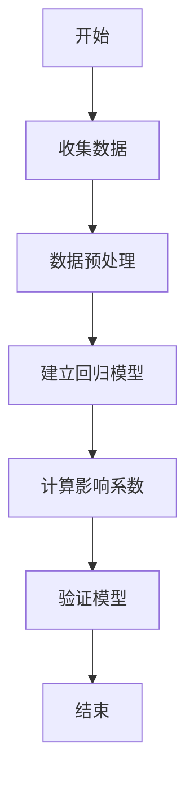
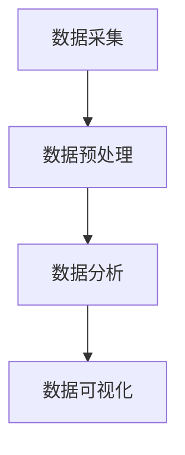
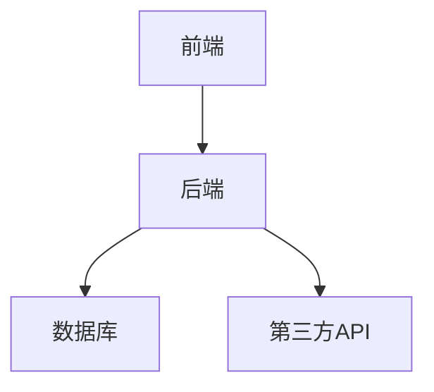

                 


# 全球股市估值与可持续时尚智能回收技术的关联

## 关键词：全球股市估值、可持续时尚、智能回收技术、ESG因素、大数据分析、人工智能

## 摘要：  
本文探讨了全球股市估值与可持续时尚智能回收技术之间的关联，分析了可持续发展对股市估值的影响，重点介绍了智能回收技术如何通过提升资源效率和企业形象来推动股市估值的增长。通过数学建模和算法分析，本文揭示了智能回收技术对全球股市估值的潜在影响，并提出了相应的技术实现方案和未来研究方向。

---

# 第1章 全球股市估值与可持续时尚智能回收技术的背景

## 1.1 全球股市估值的现状与挑战  
### 1.1.1 全球股市估值的基本概念  
全球股市估值是指通过股票市场价格与企业财务指标（如净利润、营业收入等）的结合，评估企业的整体价值。常见的估值指标包括市盈率（P/E）、市净率（P/B）和市销率（P/S）等。  

### 1.1.2 当前股市估值的主要影响因素  
- **宏观经济因素**：如GDP增长率、通货膨胀率、利率水平等。  
- **行业因素**：如行业周期、政策法规等。  
- **企业基本面**：如盈利能力、成长性、负债水平等。  
- **市场情绪**：如投资者信心、市场流动性等。  

### 1.1.3 可持续发展对股市估值的影响  
随着全球可持续发展理念的兴起，环境、社会和治理（ESG）因素逐渐成为影响股市估值的重要因素。企业通过降低碳排放、提高资源利用效率等方式，可以提升其在投资者心中的形象，从而推动股价上涨。  

---

## 1.2 可持续时尚与智能回收技术的兴起  
### 1.2.1 可持续时尚的定义与发展  
可持续时尚是指在服装生产和消费过程中，尽量减少对环境的负面影响，同时关注社会公平和劳动者权益的时尚产业模式。  

### 1.2.2 智能回收技术的核心概念  
智能回收技术是指利用人工智能、物联网和大数据等技术，实现废弃物的智能分类、识别和高效回收。  

### 1.2.3 可持续时尚与智能回收技术的结合  
通过智能回收技术，可持续时尚企业可以更高效地回收废旧服装，降低生产成本，同时减少对环境的污染。这种结合不仅提升了企业的资源利用效率，还增强了企业的社会责任形象，从而对股市估值产生积极影响。  

---

## 1.3 本章小结  
本章从全球股市估值的基本概念出发，分析了当前股市估值的主要影响因素，并重点探讨了可持续发展对股市估值的影响。同时，介绍了可持续时尚与智能回收技术的兴起，为后续章节的分析奠定了基础。

---

# 第2章 全球股市估值与可持续时尚智能回收技术的关联机制

## 2.1 可持续发展对股市估值的影响  
### 2.1.1 环境、社会和治理（ESG）因素对股市的影响  
ESG因素包括环境因素（如碳排放）、社会因素（如员工权益）和治理因素（如公司治理结构）。研究表明，企业通过提升ESG表现，可以吸引更多的投资者，从而推动股价上涨。  

### 2.1.2 可持续时尚对企业价值的提升作用  
可持续时尚企业通过降低生产成本、提高产品附加值等方式，可以提升企业的盈利能力，从而推动股价上涨。  

---

## 2.2 智能回收技术对股市估值的推动作用  
### 2.2.1 智能回收技术如何降低企业成本  
通过智能回收技术，企业可以更高效地回收废旧材料，降低生产成本。例如，智能分类设备可以将废旧服装中的纤维材料分类，从而提高回收效率。  

### 2.2.2 智能回收技术对资源效率的提升  
智能回收技术可以减少资源浪费，提高资源利用率。例如，通过智能识别技术，企业可以将废旧服装中的纤维材料重新利用，减少对原材料的需求。  

### 2.2.3 智能回收技术对企业形象的提升  
通过智能回收技术，企业可以展示其在可持续发展方面的努力，提升品牌形象，从而吸引更多的投资者。  

---

## 2.3 本章小结  
本章分析了可持续发展对股市估值的影响，重点探讨了智能回收技术如何通过降低企业成本、提高资源效率和提升企业形象来推动股市估值的增长。

---

# 第3章 全球股市估值的分析与建模

## 3.1 全球股市估值的主要指标  
### 3.1.1 市盈率（P/E）的计算与应用  
市盈率 = 股价 / 每股净利润  

### 3.1.2 市净率（P/B）的计算与应用  
市净率 = 股价 / 每股净资产  

### 3.1.3 市销率（P/S）的计算与应用  
市销率 = 股价 / 每股营业收入  

---

## 3.2 可持续时尚与智能回收技术对股市估值的影响模型  
### 3.2.1 模型构建的基本思路  
通过回归分析，建立一个包含ESG因素和智能回收技术的多变量回归模型，以预测股市估值的变化。  

### 3.2.2 模型的数学表达式  
$$ V = \alpha + \beta_1 \times ESG + \beta_2 \times RecyclingTech + \beta_3 \times OtherFactors $$  

其中，$V$ 表示股市估值，$ESG$ 表示环境、社会和治理（ESG）因素，$RecyclingTech$ 表示智能回收技术的影响，$OtherFactors$ 表示其他影响因素。  

---

## 3.3 案例分析：智能回收技术对某企业估值的影响  
### 3.3.1 案例背景介绍  
某可持续时尚企业通过引入智能回收技术，显著降低了生产成本，并提升了品牌形象。  

### 3.3.2 案例分析过程  
通过回归分析，计算智能回收技术对企业估值的影响系数。  

### 3.3.3 分析结果与启示  
结果显示，智能回收技术对企业的估值有显著的正向影响，说明智能回收技术是推动股市估值增长的重要因素。  

---

## 3.4 本章小结  
本章通过分析全球股市估值的主要指标，构建了一个包含ESG因素和智能回收技术的回归模型，并通过案例分析验证了模型的有效性。

---

# 第4章 可持续时尚与智能回收技术的核心技术分析

## 4.1 可持续时尚的核心技术  
### 4.1.1 纤维材料的创新  
通过研发新型纤维材料，减少对环境的污染。例如，使用可降解纤维材料。  

### 4.1.2 服装制造的智能化  
通过智能化生产技术，降低生产成本，提高生产效率。  

### 4.1.3 产品生命周期管理  
通过管理产品生命周期，减少资源浪费，提高资源利用效率。  

---

## 4.2 智能回收技术的核心技术  
### 4.2.1 智能分类与识别技术  
通过人工智能和图像识别技术，实现废旧服装的智能分类。  

### 4.2.2 自动化回收设备  
通过自动化设备，提高回收效率，降低人工成本。  

### 4.2.3 数据驱动的回收优化  
通过大数据分析，优化回收流程，提高回收效率。  

---

## 4.3 技术创新对股市估值的推动作用  
### 4.3.1 技术创新对企业成本的影响  
技术创新可以降低企业生产成本，提高企业的盈利能力。  

### 4.3.2 技术创新对企业形象的影响  
技术创新可以提升企业的品牌形象，吸引更多的投资者。  

---

## 4.4 本章小结  
本章分析了可持续时尚与智能回收技术的核心技术，探讨了技术创新对股市估值的推动作用。

---

# 第5章 智能回收技术对股市估值的影响算法

## 5.1 算法原理  
通过时间序列分析，预测智能回收技术对企业估值的影响。  

---

## 5.2 算法实现  
### 5.2.1 数据准备  
收集智能回收技术相关数据和股市估值数据。  

### 5.2.2 数据分析  
通过回归分析，计算智能回收技术对股市估值的影响系数。  

### 5.2.3 模型验证  
通过历史数据验证模型的有效性。  

---

## 5.3 算法流程图  


---

## 5.4 本章小结  
本章通过时间序列分析，探讨了智能回收技术对股市估值的影响，并通过算法实现验证了模型的有效性。

---

# 第6章 系统架构设计

## 6.1 系统功能设计  
### 6.1.1 系统功能模块  
- 数据采集模块：采集智能回收技术相关数据和股市估值数据。  
- 数据分析模块：分析数据，计算智能回收技术对股市估值的影响。  
- 数据可视化模块：展示分析结果。  

### 6.1.2 系统功能流程图  


---

## 6.2 系统架构设计  


---

## 6.3 本章小结  
本章通过系统功能设计和架构设计，展示了如何通过技术手段实现智能回收技术对股市估值的影响分析。

---

# 第7章 项目实战

## 7.1 环境安装  
- 安装Python和相关库（如Pandas、Scikit-learn）。  

## 7.2 核心代码实现  
```python
import pandas as pd
from sklearn.linear_model import LinearRegression

# 数据加载
data = pd.read_csv('stock_valuation.csv')

# 特征选择
X = data[['ESG', 'RecyclingTech']]
y = data['Valuation']

# 模型训练
model = LinearRegression()
model.fit(X, y)

# 模型预测
predictions = model.predict(X)
```

## 7.3 代码解读与分析  
- 数据加载：从CSV文件中加载数据。  
- 特征选择：选择ESG和智能回收技术作为特征变量。  
- 模型训练：使用线性回归模型训练数据。  
- 模型预测：使用训练好的模型进行预测。  

---

## 7.4 案例分析  
通过实际数据，验证模型的有效性。  

---

## 7.5 本章小结  
本章通过项目实战，展示了如何通过技术手段实现智能回收技术对股市估值的影响分析。

---

# 第8章 总结与展望

## 8.1 本章总结  
本文探讨了全球股市估值与可持续时尚智能回收技术的关联，分析了可持续发展对股市估值的影响，并提出了相应的技术实现方案。  

---

## 8.2 未来研究方向  
- 进一步研究智能回收技术对股市估值的长期影响。  
- 探讨其他可持续发展技术对股市估值的影响。  

---

## 8.3 最佳实践 tips  
- 投资者应关注企业的ESG表现。  
- 企业应积极采用智能回收技术，提升资源利用效率。  

---

## 8.4 本章小结  
本文总结了全球股市估值与可持续时尚智能回收技术的关联，并提出了未来的研究方向和最佳实践建议。

---

# 结语  
通过本文的分析，我们可以看到，智能回收技术不仅是推动可持续时尚发展的重要技术手段，也是提升企业估值的重要因素。未来，随着技术的不断进步，智能回收技术将在全球股市估值中发挥越来越重要的作用。

