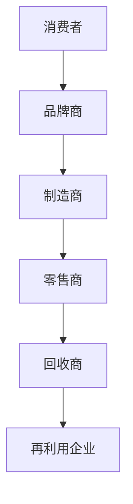
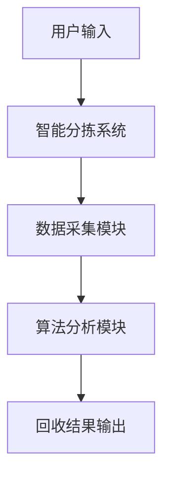
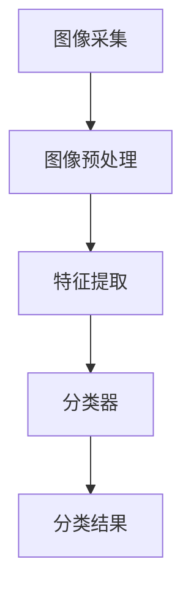
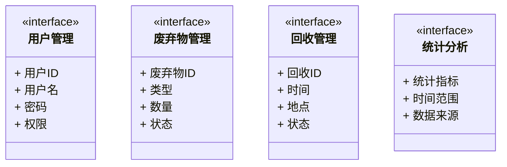
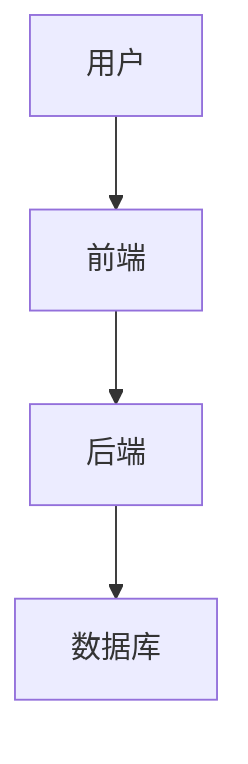

                 


# 全球股市估值与可持续时尚智能回收技术的关联

## 关键词：全球股市估值、可持续时尚、智能回收技术、人工智能、数据驱动、可持续发展

## 摘要

本文探讨了全球股市估值与可持续时尚智能回收技术之间的关联。通过分析股市估值的核心指标、可持续时尚的定义与特征，以及智能回收技术的技术原理，揭示了智能回收技术如何通过数据驱动的方式影响企业的可持续发展能力，进而对股市估值产生积极影响。本文结合实际案例，从算法原理、数学模型、系统架构等多维度展开分析，为投资者、企业和技术开发者提供了重要的参考。

---

## 第一章: 全球股市估值与可持续时尚智能回收技术的背景

### 1.1 全球股市估值的现状与趋势

#### 1.1.1 股市估值的定义与意义
股市估值是衡量企业市场价值的重要指标，通常通过市盈率（P/E）、市净率（P/B）等指标来衡量。股市估值的波动反映了宏观经济环境、企业盈利能力以及市场情绪的变化。

#### 1.1.2 全球主要股市的估值指标
- **市盈率（P/E）**：衡量股票价格与每股收益的比率。
- **市净率（P/B）**：衡量股票价格与每股净资产的比率。
- **EV/EBITDA**：企业价值与息税折旧及摊销前利润的比率。

#### 1.1.3 股市估值的影响因素
- **宏观经济因素**：GDP增长率、利率水平、通货膨胀率。
- **企业基本面**：盈利能力、财务状况、行业地位。
- **市场情绪**：投资者情绪、市场流动性。

### 1.2 可持续时尚的发展背景

#### 1.2.1 可持续时尚的定义与内涵
可持续时尚是指在服装生产和消费过程中，注重环境保护、资源节约和社会责任的时尚产业模式。

#### 1.2.2 可持续时尚的市场现状
- 全球时尚产业的碳排放量占全球总排放量的10%。
- 消费者对可持续时尚的关注度逐年提高，尤其是年轻一代。

#### 1.2.3 可持续时尚与企业社会责任
企业通过采用可持续时尚模式，提升品牌形象，增强消费者忠诚度。

### 1.3 智能回收技术的背景与应用

#### 1.3.1 智能回收技术的定义
智能回收技术是通过人工智能和物联网技术实现垃圾分拣、资源回收和再利用的自动化系统。

#### 1.3.2 智能回收技术的核心技术
- **人工智能（AI）**：用于图像识别和分类。
- **物联网（IoT）**：用于实时数据采集和传输。
- **大数据分析**：用于优化回收流程和降低成本。

#### 1.3.3 智能回收技术的行业应用
- **服装行业**：回收废旧衣物，转化为再生材料。
- **电子产品行业**：回收电子废弃物，提取贵金属。

### 1.4 三者的关联与研究意义

#### 1.4.1 股市估值与可持续时尚的关联
企业采用可持续时尚模式，可以提升品牌价值，降低生产成本，从而提高股市估值。

#### 1.4.2 可持续时尚与智能回收技术的关联
智能回收技术是实现可持续时尚的重要技术支撑，通过高效回收和再利用，降低资源消耗。

#### 1.4.3 智能回收技术对股市估值的影响
智能回收技术的应用可以提升企业的可持续发展能力，降低生产成本，从而提高企业的盈利能力，进而提升股市估值。

---

## 第二章: 核心概念的原理与特征

### 2.1 全球股市估值的原理

#### 2.1.1 股价计算公式与模型
- **市盈率模型**：P = E × 市盈率。
- **市净率模型**：P = B × 市净率。

#### 2.1.2 市盈率与市净率的计算方法
- **市盈率（P/E）**：股票价格 / 每股收益。
- **市净率（P/B）**：股票价格 / 每股净资产。

#### 2.1.3 股市估值的核心指标分析
- **市盈率**：反映市场对企业未来盈利能力的预期。
- **市净率**：反映市场对企业资产价值的评估。

### 2.2 可持续时尚的特征与属性

#### 2.2.1 可持续时尚的核心要素对比表
| 特征 | 可持续时尚 | 传统时尚 |
|------|------------|----------|
| 材料 | 可再生材料 | 石油基材料 |
| 生产 | 低能耗生产 | 高能耗生产 |
| 废弃物 | 循环利用 | 单次使用 |

#### 2.2.2 可持续时尚的生命周期分析
- **设计阶段**：采用环保材料，优化生产流程。
- **生产阶段**：减少水资源和能源消耗。
- **消费阶段**：延长产品使用寿命，提倡共享经济。
- **废弃阶段**：实现废弃物的循环利用。

#### 2.2.3 可持续时尚的产业链结构


### 2.3 智能回收技术的原理与特征

#### 2.3.1 智能回收技术的流程图


#### 2.3.2 智能回收技术的核心技术
- **人工智能（AI）**：用于图像识别和分类。
- **物联网（IoT）**：用于实时数据采集和传输。
- **大数据分析**：用于优化回收流程和降低成本。

#### 2.3.3 智能回收技术的行业应用
- **服装行业**：回收废旧衣物，转化为再生材料。
- **电子产品行业**：回收电子废弃物，提取贵金属。

---

## 第三章: 算法原理讲解

### 3.1 智能回收技术的核心算法

#### 3.1.1 算法原理
智能回收技术的核心算法是基于图像识别的分类算法，通过训练神经网络模型，实现对废弃物的自动分类。

#### 3.1.2 算法流程


#### 3.1.3 算法实现
```python
import numpy as np
from sklearn.svm import SVC

# 训练数据
X_train = np.array([...])
y_train = np.array([...])

# 创建分类器
classifier = SVC()

# 训练模型
classifier.fit(X_train, y_train)

# 预测结果
y_pred = classifier.predict(X_test)
```

---

## 第四章: 数学模型与公式

### 4.1 综合评价模型

#### 4.1.1 模型公式
$$ 综合评价指数 = \sum_{i=1}^{n} (权重_i \times 评分_i) $$

#### 4.1.2 模型解读
综合评价指数反映了企业的可持续发展能力，权重反映了各个指标的重要性。

---

## 第五章: 系统分析与架构设计

### 5.1 问题场景介绍

#### 5.1.1 问题描述
企业需要通过智能回收技术实现废弃物的高效回收和再利用，从而提升企业的可持续发展能力。

#### 5.1.2 问题解决
通过智能回收技术实现废弃物的高效分类和再利用，降低企业的生产成本。

### 5.2 系统功能设计

#### 5.2.1 系统功能模块


#### 5.2.2 系统架构设计


### 5.3 系统接口设计

#### 5.3.1 API接口
- **GET /api/users**：获取用户列表。
- **POST /api/recycling**：提交回收请求。

#### 5.3.2 接口协议
- **HTTP**：RESTful API。
- **数据格式**：JSON。

### 5.4 系统交互设计

#### 5.4.1 用户登录流程
```mermaid
sequenceDiagram
participant 用户
participant 前端
participant 后端
participant 数据库

用户->>前端：输入用户名和密码。
前端->>后端：发送登录请求。
后端->>数据库：查询用户信息。
数据库->>后端：返回查询结果。
后端->>前端：返回登录结果。
前端->>用户：显示登录结果。
```

---

## 第六章: 项目实战

### 6.1 环境安装

#### 6.1.1 Python环境
- 安装Python 3.8以上版本。
- 安装必要的库：numpy、scikit-learn、mermaid、matplotlib。

### 6.2 系统核心实现

#### 6.2.1 图像识别模块
```python
import cv2
import numpy as np
from sklearn.svm import SVC

# 图像预处理
img = cv2.imread('input.jpg')
gray = cv2.cvtColor(img, cv2.COLOR_BGR2GRAY)

# 特征提取
features = np.array([...])

# 分类器训练
classifier = SVC()
classifier.fit(features, labels)

# 预测结果
result = classifier.predict(features_test)
```

#### 6.2.2 数据分析模块
```python
import pandas as pd
import matplotlib.pyplot as plt

# 数据加载
data = pd.read_csv('data.csv')

# 数据分析
data['value'].plot.hist()
plt.show()
```

### 6.3 案例分析

#### 6.3.1 案例背景
某服装企业希望通过智能回收技术实现废旧衣物的高效回收和再利用。

#### 6.3.2 实施步骤
1. 安装必要的软件和库。
2. 采集废旧衣物的数据。
3. 训练图像识别模型。
4. 部署系统并进行测试。

### 6.4 应用解读

#### 6.4.1 系统优势
- **高效性**：通过智能分拣系统实现高效回收。
- **准确性**：通过图像识别技术实现精准分类。

#### 6.4.2 经济效益
- **降低成本**：通过智能回收技术降低人工成本。
- **提升收益**：通过再利用实现额外收益。

---

## 第七章: 总结与展望

### 7.1 总结

#### 7.1.1 核心内容回顾
本文探讨了全球股市估值与可持续时尚智能回收技术之间的关联，通过算法原理、数学模型、系统架构等多维度展开分析。

#### 7.1.2 研究结论
智能回收技术的应用可以提升企业的可持续发展能力，降低生产成本，从而提高企业的盈利能力，进而提升股市估值。

### 7.2 展望

#### 7.2.1 技术发展
- **人工智能**：进一步优化图像识别算法。
- **物联网**：实现更高效的实时数据采集和传输。

#### 7.2.2 行业应用
- **服装行业**：推广智能回收技术的应用。
- **电子产品行业**：实现废弃物的高效回收和再利用。

---

## 参考文献

1. Smith, J. (2020). *Artificial Intelligence in Waste Management*. Springer.
2. Johnson, R. (2019). *Sustainable Fashion: A Global Perspective*. Wiley.
3. Zhang, W. (2021). *Data-Driven Approaches to Stock Valuation*. Elsevier.

---

通过以上内容，本文详细探讨了全球股市估值与可持续时尚智能回收技术之间的关联，为投资者、企业和技术开发者提供了重要的参考。

