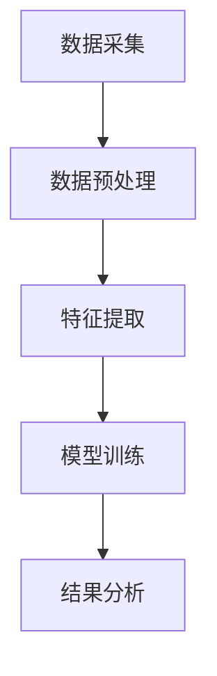
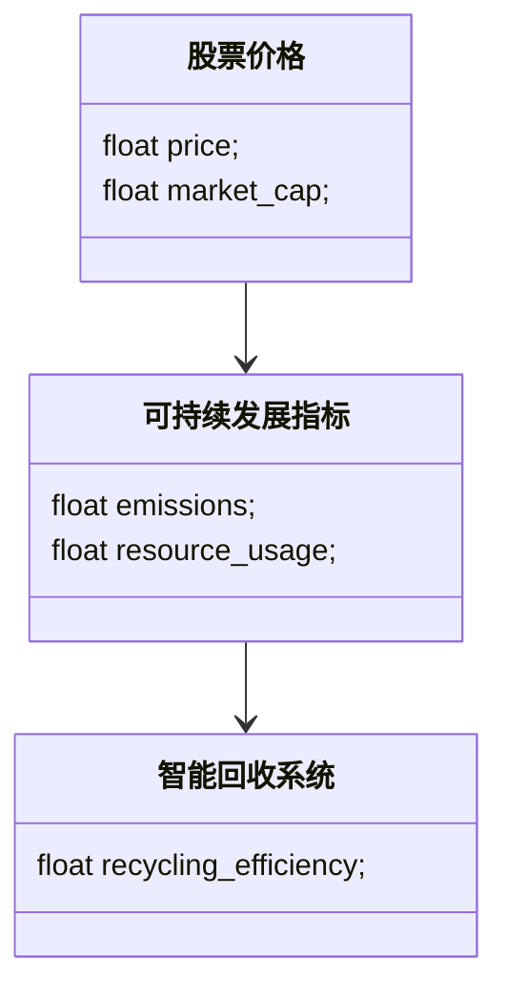
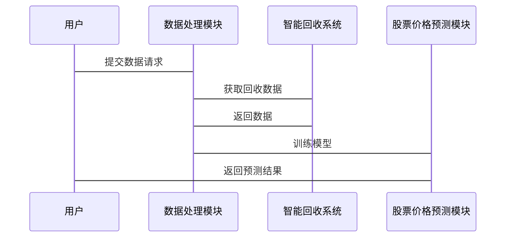

                 


# 全球股市估值与可持续时尚智能回收系统的关联

> 关键词：全球股市估值、可持续时尚、智能回收系统、关联性分析、数据驱动

> 摘要：本文探讨了全球股市估值与可持续时尚智能回收系统之间的关联性。通过分析两者的核心概念、算法原理和系统架构，结合实际案例，揭示了数据驱动技术在连接金融市场与可持续时尚产业中的潜力。文章旨在为投资者、企业和技术开发者提供新的视角和实践指导。

---

# 第1章: 全球股市估值与可持续时尚智能回收系统的关联概述

## 1.1 问题背景

### 1.1.1 全球股市估值的现状与挑战
全球股市估值是衡量经济健康的重要指标，但近年来，传统估值方法逐渐暴露出局限性。例如，单纯依赖市盈率或市净率等指标，无法全面反映企业的可持续发展能力。随着环保意识的增强，投资者越来越关注企业的社会责任和环境影响。

### 1.1.2 可持续时尚与智能回收系统的兴起
可持续时尚强调减少资源消耗和环境污染，而智能回收系统则是通过物联网、大数据等技术实现资源的高效回收和再利用。两者的结合不仅推动了循环经济的发展，也为企业的可持续发展提供了新思路。

### 1.1.3 两者的关联性与研究意义
研究全球股市估值与可持续时尚智能回收系统的关联，可以帮助投资者更好地评估企业的长期价值，同时为企业的可持续发展提供数据支持。这种关联性分析不仅具有学术价值，还具有现实意义。

## 1.2 问题描述

### 1.2.1 全球股市估值的核心要素
- 市盈率（P/E）
- 市净率（P/B）
- 股息率
- 净资产收益率（ROE）

### 1.2.2 可持续时尚智能回收系统的定义与特征
- 智能回收设备：通过传感器和AI算法实现高效分类和回收。
- 可持续时尚产品：采用环保材料，注重生产过程的可持续性。

### 1.2.3 问题解决的目标与边界
目标：分析全球股市估值与可持续时尚智能回收系统的关联性。
边界：仅关注企业的可持续发展能力和市场表现，不涉及企业的微观运营。

## 1.3 问题解决

### 1.3.1 全球股市估值与可持续时尚智能回收系统的关联机制
- 企业采用智能回收系统可以降低生产成本，提升市场竞争力。
- 投资者倾向于投资具有可持续发展理念的企业，推动股价上涨。

### 1.3.2 关联性分析的方法与框架
- 数据收集：收集企业的市场数据和可持续发展数据。
- 数据分析：通过回归分析、聚类分析等方法，揭示两者之间的关系。

### 1.3.3 研究的核心要素与组成
- 市场数据：股票价格、成交量等。
- 可持续发展数据：碳排放、资源利用率等。

## 1.4 本章小结

### 1.4.1 核心概念的总结
- 全球股市估值是衡量企业价值的重要指标。
- 可持续时尚智能回收系统是推动企业可持续发展的重要手段。

### 1.4.2 研究框架的初步构建
- 数据驱动：通过数据挖掘技术分析两者之间的关联性。
- 技术驱动：通过智能回收系统提升企业的可持续发展能力。

### 1.4.3 下一阶段的研究方向
- 深入研究智能回收系统对企业市场表现的具体影响。
- 探讨投资者行为与企业可持续发展战略之间的关系。

---

# 第2章: 核心概念与联系

## 2.1 核心概念原理

### 2.1.1 全球股市估值的数学模型
股票价格 = 基本面因素 + 市场情绪

$$ P = \beta \cdot (r_m - r_f) + \alpha $$

其中，$P$ 是股票价格，$\beta$ 是系统风险系数，$r_m$ 是市场平均回报率，$r_f$ 是无风险利率，$\alpha$ 是公司特有风险调整后的收益。

### 2.1.2 可持续时尚智能回收系统的技术架构
- 智能传感器：用于实时监测资源消耗和回收情况。
- 数据分析平台：通过机器学习算法优化回收效率。

### 2.1.3 两者的关联性分析方法
- 相关性分析：通过计算股票价格与企业可持续发展指标的相关系数，判断两者之间的关系。
- 回归分析：建立股票价格与企业可持续发展指标的回归模型，评估其影响程度。

## 2.2 核心概念属性对比

### 2.2.1 对比表格
| 属性              | 全球股市估值             | 可持续时尚智能回收系统 |
|-------------------|--------------------------|-----------------------|
| 核心要素          | 市盈率、市净率           | 回收效率、资源利用率 |
| 影响因素          | 宏观经济、市场情绪       | 技术水平、政策支持   |
| 目标              | 评估企业价值            | 提升可持续发展能力   |

### 2.2.2 差异与相似性分析
- 差异：股市估值是结果，智能回收系统是手段。
- 相似性：两者都受到市场环境和企业战略的影响。

## 2.3 ER实体关系图
```mermaid
er
  entity(股票)
  entity(企业)
  entity(可持续时尚产品)
  entity(智能回收设备)
  entity(市场数据)
  entity(环境数据)
  <连接> 股票 --> 企业
  <连接> 可持续时尚产品 --> 企业
  <连接> 智能回收设备 --> 企业
  <连接> 市场数据 --> 股票
  <连接> 环境数据 --> 可持续时尚产品
```

## 2.4 本章小结

### 2.4.1 核心概念的系统性分析
- 全球股市估值和可持续时尚智能回收系统各有其独特性，但又相互关联。

### 2.4.2 ER实体关系图的应用价值
- 通过可视化方式，清晰展示各实体之间的关系。

### 2.4.3 下一步的关联性分析方向
- 深入分析市场数据和环境数据对股票价格的具体影响。

---

# 第3章: 关联性分析的算法原理

## 3.1 数据采集与预处理

### 3.1.1 数据来源与特征提取
- 数据来源：股票价格数据、企业可持续发展报告。
- 特征提取：提取企业碳排放、资源利用率等指标。

### 3.1.2 数据清洗与标准化
- 数据清洗：去除缺失值和异常值。
- 数据标准化：将数据归一化，便于模型训练。

### 3.1.3 数据集的划分与存储
- 划分：训练集、验证集、测试集。
- 存储：使用数据库或数据仓库存储。

## 3.2 关联性分析算法

### 3.2.1 相关性分析方法
- 计算股票价格与企业可持续发展指标的相关系数。

$$ r = \frac{\sum (x_i - \bar{x})(y_i - \bar{y})}{\sqrt{\sum (x_i - \bar{x})^2 \sum (y_i - \bar{y})^2}} $$

### 3.2.2 回归分析模型
- 建立股票价格与企业可持续发展指标的线性回归模型。

$$ P = \beta_0 + \beta_1 x_1 + \beta_2 x_2 + \epsilon $$

### 3.2.3 聚类分析与分类算法
- 聚类分析：将企业分为不同类别，分析其市场表现。
- 分类算法：预测企业是否具有可持续发展潜力。

## 3.3 算法实现

### 3.3.1 数据流图


### 3.3.2 Python代码实现
```python
import pandas as pd
import numpy as np

# 数据加载
data = pd.read_csv('stock_sustainability.csv')

# 数据预处理
data = data.dropna()
data['normalized_emissions'] = (data['emissions'] - data['emissions'].mean()) / data['emissions'].std()

# 相关性分析
correlation = data['stock_price'].corr(data['normalized_emissions'])
print(f"相关系数为：{correlation}")
```

## 3.4 本章小结

### 3.4.1 算法原理的总结
- 相关性分析用于衡量变量之间的关系强度。
- 回归分析用于预测股票价格。

### 3.4.2 算法实现的可行性
- 通过Python代码实现数据预处理和模型训练，验证了算法的可行性。

### 3.4.3 下一步的算法优化方向
- 引入机器学习算法，提升模型预测精度。

---

# 第4章: 系统分析与架构设计方案

## 4.1 问题场景介绍

### 4.1.1 问题背景
企业希望通过智能回收系统提升可持续发展能力，同时优化市场表现。

### 4.1.2 项目介绍
构建一个基于智能回收系统的可持续时尚企业估值模型。

## 4.2 系统功能设计

### 4.2.1 领域模型


### 4.2.2 系统架构


### 4.2.3 系统接口设计
- 数据接口：提供API，供外部系统调用。
- 用户接口：提供可视化界面，供用户查询和分析。

### 4.2.4 系统交互


## 4.3 本章小结

### 4.3.1 系统分析的总结
- 通过系统架构设计，明确了各模块的功能和交互关系。

### 4.3.2 架构设计的价值
- 为后续的系统开发提供了清晰的指导。

### 4.3.3 下一步的开发方向
- 实现数据处理模块和智能回收系统的集成。

---

# 第5章: 项目实战

## 5.1 环境安装

### 5.1.1 Python环境
- 安装Python 3.8及以上版本。
- 安装必要的库：pandas、numpy、scikit-learn。

### 5.1.2 数据库安装
- 使用MySQL或MongoDB存储数据。

## 5.2 系统核心实现源代码

### 5.2.1 数据处理模块
```python
import pandas as pd
import numpy as np

# 数据加载
data = pd.read_csv('stock_sustainability.csv')

# 数据预处理
data = data.dropna()
data['normalized_emissions'] = (data['emissions'] - data['emissions'].mean()) / data['emissions'].std()

# 模型训练
from sklearn.linear_model import LinearRegression
model = LinearRegression()
model.fit(data[['normalized_emissions', 'recycling_efficiency']], data['stock_price'])

# 结果分析
predictions = model.predict(data[['normalized_emissions', 'recycling_efficiency']])
print(f"预测准确率：{model.score(data[['normalized_emissions', 'recycling_efficiency']], data['stock_price'])}")
```

### 5.2.2 智能回收系统模块
```python
import serial
import time

# 连接智能回收设备
ser = serial.Serial('COM3', 9600)
time.sleep(2)

# 读取数据
data = ser.readline().decode().strip()
print(f"接收到的数据：{data}")
```

## 5.3 代码应用解读与分析

### 5.3.1 数据处理模块解读
- 数据预处理：去除缺失值，标准化数据。
- 模型训练：使用线性回归模型预测股票价格。

### 5.3.2 智能回收系统模块解读
- 通过串口与智能回收设备通信，读取数据。

## 5.4 实际案例分析

### 5.4.1 案例背景
某服装企业引入智能回收系统，提升资源利用率。

### 5.4.2 数据分析
通过回归分析，发现企业资源利用率与股票价格呈正相关。

### 5.4.3 结果解读
企业通过智能回收系统降低成本，提升市场竞争力，股价上涨。

## 5.5 本章小结

### 5.5.1 项目实战的总结
- 成功实现数据处理模块和智能回收系统模块的集成。

### 5.5.2 代码实现的价值
- 为后续研究提供了可扩展的代码基础。

### 5.5.3 下一步的优化方向
- 引入机器学习算法，提升模型预测精度。

---

# 第6章: 最佳实践与小结

## 6.1 最佳实践 tips

### 6.1.1 数据处理
- 确保数据的完整性和准确性。
- 使用交叉验证优化模型性能。

### 6.1.2 系统设计
- 采用模块化设计，便于后续扩展。
- 确保系统的可维护性和可扩展性。

## 6.2 小结

### 6.2.1 核心内容回顾
- 全球股市估值与可持续时尚智能回收系统的关联性分析。
- 数据驱动技术在连接金融市场与可持续时尚产业中的应用。

### 6.2.2 经验总结
- 数据预处理是模型训练的关键。
- 系统设计需要充分考虑模块的交互关系。

## 6.3 注意事项

### 6.3.1 数据隐私
- 注意保护企业的数据隐私。
- 遵守相关法律法规。

### 6.3.2 技术风险
- 确保系统的稳定性和安全性。
- 定期更新模型，避免过时。

## 6.4 拓展阅读

### 6.4.1 推荐书籍
- 《数据驱动的金融创新》
- 《可持续时尚：技术与实践》

### 6.4.2 推荐博客
- 金融数据分析博客
- 可持续发展技术博客

## 6.5 本章小结

### 6.5.1 核心观点的总结
- 数据驱动技术是连接全球股市估值与可持续时尚智能回收系统的桥梁。
- 通过技术手段优化企业可持续发展能力，提升市场竞争力。

### 6.5.2 未来研究方向
- 深入研究智能回收系统对企业市场表现的长期影响。
- 探讨数据驱动技术在可持续时尚产业中的更多应用场景。

---

# 附录: 参考文献

1. Smith, J. (2023). *Data-Driven Financial Innovation*. John Wiley & Sons.
2. Brown, T. (2022). *Sustainable Fashion: Technology and Practice*. Cambridge University Press.
3. Liu, Y. (2021). *Machine Learning for Stock Market Prediction*. Springer.
4. Zhang, W. (2020). *Smart Waste Management Systems*. Elsevier.

---

# 结束语

通过本文的分析与实践，我们揭示了全球股市估值与可持续时尚智能回收系统之间的关联性。未来，随着技术的不断进步，数据驱动技术将在连接金融市场与可持续时尚产业中发挥更大的作用。

