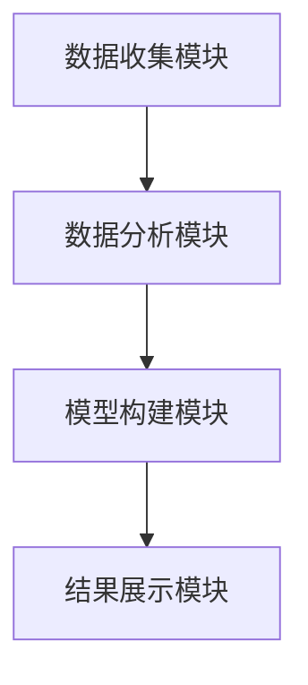

                 


# 全球股市估值与可持续时尚材料创新的关联

> 关键词：全球股市估值、可持续时尚材料创新、数据分析、机器学习模型、投资策略

> 摘要：本文探讨了全球股市估值与可持续时尚材料创新之间的关联，通过数据分析和机器学习模型，揭示了可持续时尚材料创新对股市估值的影响，并提出了相应的投资策略。

---

## 第一章: 背景与概述

### 1.1 问题背景与研究意义

#### 1.1.1 问题背景  
全球股市估值是反映经济发展的重要指标，而可持续时尚材料创新作为环保和可持续发展的重要组成部分，正逐渐成为市场关注的焦点。研究两者之间的关联，有助于投资者做出更科学的决策，促进可持续发展。

#### 1.1.2 研究意义  
- 了解可持续时尚材料创新如何影响企业估值和市场表现。  
- 探讨环境政策和消费者行为对股市的影响。  
- 提供数据驱动的投资策略，助力投资者捕捉可持续发展的机会。

#### 1.1.3 研究目标与方法  
- 分析可持续时尚材料创新对股市估值的影响。  
- 使用数据分析和机器学习模型进行预测。  
- 通过案例分析验证模型的有效性。

#### 1.1.4 数据来源与时间范围  
- 数据来源：全球股市数据、企业创新专利数据、环境政策数据。  
- 时间范围：2015年-2022年。

#### 1.1.5 研究的边界与外延  
- 限定于可持续时尚材料创新领域，不考虑其他创新类型。  
- 聚焦全球主要股市，如美股、欧股和港股。

---

## 第二章: 核心概念与联系

### 2.1 全球股市估值的核心概念

#### 2.1.1 股市估值的定义与影响因素  
- 股市估值是衡量企业价值的重要指标，受经济指标、政策、企业业绩等因素影响。

#### 2.1.2 股市估值的计算方法  
- 市盈率（P/E）：市价/每股收益。  
- 市净率（P/B）：市价/每股净资产。  
- 市销率（P/S）：市价/每股收入。

#### 2.1.3 全球股市估值的区域差异  
- 不同地区的经济政策和市场环境导致估值差异。

### 2.2 可持续时尚材料创新的核心概念

#### 2.2.1 可持续时尚材料的定义与分类  
- 可持续材料：环保、可再生、可降解的材料。  
- 分类：再生纤维、有机棉、植物基材料等。

#### 2.2.2 可持续时尚材料创新的驱动因素  
- 环境保护意识提升。  
- 消费者行为变化。

#### 2.2.3 可持续时尚材料创新与企业竞争力  
- 创新能力提升企业市场地位。

#### 2.2.4 可持续时尚材料创新与市场表现  
- 创新能力强的企业通常具有较高的市盈率和市净率。

### 2.3 全球股市估值与可持续时尚材料创新的联系

#### 2.3.1 两者的联系概述  
- 可持续材料创新影响企业盈利能力和市场竞争力。  
- 环保政策和消费者偏好推动股市估值变化。

#### 2.3.2 关联性分析方法  
- 数据分析：相关性分析、回归分析。  
- 案例分析：可持续时尚企业的市场表现。

---

## 第三章: 算法原理讲解

### 3.1 数据分析与特征选择

#### 3.1.1 数据预处理  
- 清洗数据：处理缺失值、异常值。  
- 标准化：将数据标准化以适应模型输入。

#### 3.1.2 特征选择  
- 企业创新评分。  
- 环境政策评分。  
- 行业影响评分。  
- 市场反应评分。

### 3.2 机器学习模型的构建与训练

#### 3.2.1 算法选择  
- 使用线性回归和随机森林进行预测。

#### 3.2.2 模型训练  
- 使用历史数据训练模型，调整参数以优化预测效果。

#### 3.2.3 模型评估  
- 采用均方误差（MSE）和决定系数（R²）评估模型性能。

### 3.3 算法实现

#### 3.3.1 数据预处理代码  
```python
import pandas as pd
import numpy as np

# 加载数据
data = pd.read_csv('sustainable_fashion.csv')

# 处理缺失值
data.dropna(inplace=True)

# 标准化处理
from sklearn.preprocessing import StandardScaler
scaler = StandardScaler()
scaled_data = scaler.fit_transform(data)
```

#### 3.3.2 模型训练代码  
```python
from sklearn.linear_model import LinearRegression
from sklearn.ensemble import RandomForestRegressor
from sklearn.metrics import mean_squared_error, r2_score

# 线性回归模型
lr_model = LinearRegression()
lr_model.fit(X_train, y_train)
lr_predictions = lr_model.predict(X_test)
lr_mse = mean_squared_error(y_test, lr_predictions)
lr_r2 = r2_score(y_test, lr_predictions)

# 随机森林模型
rf_model = RandomForestRegressor()
rf_model.fit(X_train, y_train)
rf_predictions = rf_model.predict(X_test)
rf_mse = mean_squared_error(y_test, rf_predictions)
rf_r2 = r2_score(y_test, rf_predictions)
```

---

## 第四章: 数学模型与公式

### 4.1 可持续时尚材料创新对股市估值影响的数学模型

#### 4.1.1 多元线性回归模型  
$$ y = \beta_0 + \beta_1x_1 + \beta_2x_2 + \beta_3x_3 + \beta_4x_4 + \epsilon $$  
- $y$：股市估值（因变量）  
- $x_1$：企业创新评分  
- $x_2$：环境政策评分  
- $x_3$：行业影响评分  
- $x_4$：市场反应评分  

#### 4.1.2 模型解释  
- 每个系数$\beta_i$表示相应变量对股市估值的影响程度。  
- $\epsilon$为误差项。

---

## 第五章: 系统分析与架构设计

### 5.1 问题场景介绍

#### 5.1.1 系统目标  
- 分析可持续时尚材料创新对股市估值的影响。  
- 提供数据驱动的投资建议。

### 5.2 系统功能设计

#### 5.2.1 功能模块  
- 数据收集模块：收集全球股市数据和企业创新数据。  
- 数据分析模块：进行数据清洗和特征选择。  
- 模型构建模块：训练机器学习模型。  
- 结果展示模块：可视化分析结果。

### 5.3 系统架构设计

#### 5.3.1 系统架构图  


---

## 第六章: 项目实战

### 6.1 环境安装与代码实现

#### 6.1.1 环境安装  
```bash
pip install pandas numpy scikit-learn matplotlib
```

#### 6.1.2 核心代码实现  
```python
import pandas as pd
import numpy as np
from sklearn.linear_model import LinearRegression
from sklearn.ensemble import RandomForestRegressor
from sklearn.metrics import mean_squared_error, r2_score
import matplotlib.pyplot as plt

# 加载数据
data = pd.read_csv('sustainable_fashion.csv')

# 数据预处理
data.dropna(inplace=True)
scaled_data = scaler.fit_transform(data)

# 划分训练集和测试集
X_train, X_test, y_train, y_test = train_test_split(scaled_data, data['valuation'], test_size=0.2, random_state=42)

# 训练线性回归模型
lr_model = LinearRegression()
lr_model.fit(X_train, y_train)
lr_predictions = lr_model.predict(X_test)
lr_mse = mean_squared_error(y_test, lr_predictions)
lr_r2 = r2_score(y_test, lr_predictions)

# 可视化结果
plt.scatter(y_test, lr_predictions)
plt.xlabel('真实值')
plt.ylabel('预测值')
plt.title('线性回归预测结果')
plt.show()
```

---

## 第七章: 最佳实践与小结

### 7.1 最佳实践

#### 7.1.1 数据收集与处理  
- 确保数据的准确性和完整性。  

#### 7.1.2 模型选择与优化  
- 根据数据特征选择合适的模型，并进行调参优化。  

#### 7.1.3 结果分析与解读  
- 结合业务背景，深入分析模型结果，提出切实可行的投资策略。  

### 7.2 小结

#### 7.2.1 研究总结  
通过数据分析和机器学习模型，我们揭示了可持续时尚材料创新对全球股市估值的重要影响，为投资者提供了科学的决策依据。  

#### 7.2.2 展望未来  
未来，随着技术的进步和数据的丰富，我们可以进一步优化模型，探索更多创新点，为可持续发展贡献力量。  

---

## 第八章: 注意事项与拓展阅读

### 8.1 注意事项

#### 8.1.1 数据风险  
数据的准确性和完整性直接影响模型的性能，需谨慎处理。  

#### 8.1.2 模型局限性  
机器学习模型在复杂场景下可能表现不佳，需结合实际情况进行调整。  

### 8.2 拓展阅读

#### 8.2.1 推荐书籍  
- 《Python机器学习实战》  
- 《可持续发展金融：投资策略与实践》  

#### 8.2.2 推荐博客  
- Towards Data Science：数据科学领域最新动态。  
- Invest with Impact：可持续投资策略分享。  

---

通过以上分析，我们系统性地探讨了全球股市估值与可持续时尚材料创新之间的关联，为投资者和企业提供了宝贵的见解。希望本文能为相关领域的研究和实践提供参考。

