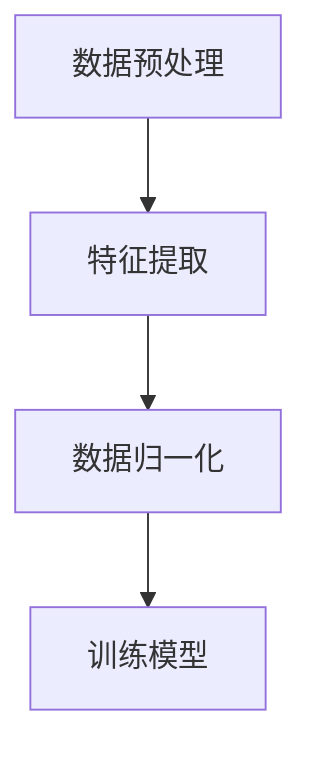
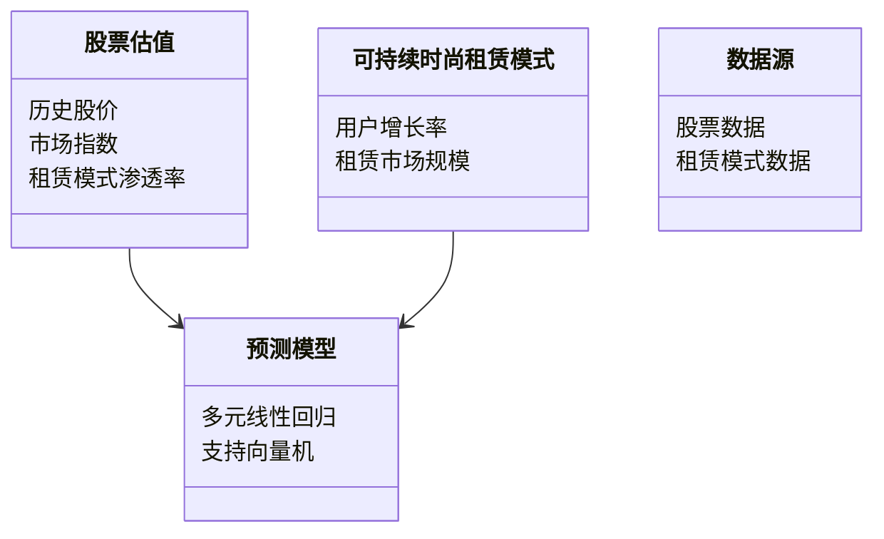
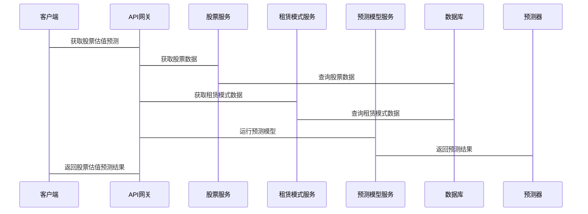

                 


# 第3章: 算法原理与数学模型

## 3.1 股票估值预测的算法选择
### 3.1.1 数据预处理
股票市场的数据通常具有时间序列特性，数据预处理包括数据清洗、特征提取、归一化等步骤。我们需要使用历史股价、市场指数、行业指标、租赁模式相关数据等因素来预测股票估值的变化。



### 3.1.2 特征提取
从时间序列数据中提取有用的特征，如移动平均线（MA）、相对强弱指数（RSI）、MACD指标等。同时，还需要考虑租赁模式对股票估值的影响，引入相关租赁模式数据作为额外特征。

### 3.1.3 模型选择
为了预测股票估值的变化，可以采用多元线性回归模型。模型的输入特征包括租赁模式的影响、历史股价、市场指数等。

### 3.1.4 回归模型
假设股票估值的变化与租赁模式的渗透率、市场指数等因素相关。我们可以建立如下的多元线性回归模型：

$$
y = \beta_0 + \beta_1x_1 + \beta_2x_2 + ... + \beta_nx_n + \epsilon
$$

其中：
- $y$ 是股票估值的变化
- $x_i$ 是各个影响因素（如租赁模式渗透率、市场指数等）
- $\beta_i$ 是回归系数
- $\epsilon$ 是误差项

### 3.1.5 代码实现
以下是一个简单的多元线性回归模型的Python代码示例：

```python
import numpy as np
import pandas as pd
from sklearn.linear_model import LinearRegression
from sklearn.metrics import mean_squared_error

# 数据预处理
data = pd.read_csv('stock_data.csv')
features = data[['rental_mode_penetration', 'market_index', 'historical_price']]
target = data['stock_valuation']

# 训练模型
model = LinearRegression()
model.fit(features, target)

# 预测
predictions = model.predict(features)

# 评估
 mse = mean_squared_error(target, predictions)
 print('均方误差:', mse)
```

## 3.2 可持续时尚租赁模式的影响分析
### 3.2.1 数据收集
为了分析租赁模式对股票估值的影响，需要收集租赁模式的渗透率数据、租赁平台的用户增长率、租赁行业的市场规模等。

### 3.2.2 影响因素分析
通过回归分析，可以量化租赁模式对股票估值的具体影响。例如，租赁模式的渗透率增加1%，可能导致股票估值变化多少。

### 3.2.3 案例分析
假设某时尚租赁平台的用户增长率提高了10%，我们可以预测其相关股票的估值变化。

## 3.3 本章小结
本章介绍了股票估值预测和租赁模式影响的算法选择，详细讲解了多元线性回归模型的建立和实现，并通过代码示例展示了如何量化租赁模式对股票估值的影响。

---

# 第4章: 系统分析与架构设计

## 4.1 系统分析
### 4.1.1 问题场景
我们需要构建一个系统，能够实时分析全球股市估值，并预测可持续时尚租赁模式对股票估值的影响。

### 4.1.2 项目介绍
本项目旨在通过数据挖掘和机器学习技术，建立一个能够实时预测股票估值变化的系统，并分析租赁模式的影响。

## 4.2 系统功能设计
### 4.2.1 领域模型


### 4.2.2 系统架构


### 4.2.3 接口设计
系统需要提供以下接口：
- 获取股票数据接口
- 获取租赁模式数据接口
- 预测股票估值接口

### 4.2.4 交互流程图


## 4.3 本章小结
本章通过系统分析，构建了一个能够实时预测股票估值的系统架构，并设计了相应的接口和交互流程。

---

# 第5章: 项目实战

## 5.1 环境安装
为了运行本项目，需要安装以下工具：
- Python 3.8+
- Jupyter Notebook
- Pandas
- Scikit-learn
- Mermaid CLI

安装命令：
```bash
pip install numpy pandas scikit-learn
```

## 5.2 系统核心实现
### 5.2.1 数据预处理
```python
import pandas as pd
import numpy as np

# 读取数据
data = pd.read_csv('stock_data.csv')

# 特征提取
features = data[['rental_mode_penetration', 'market_index', 'historical_price']]
target = data['stock_valuation']

# 数据归一化
from sklearn.preprocessing import StandardScaler
scaler = StandardScaler()
features_scaled = scaler.fit_transform(features)
```

### 5.2.2 训练模型
```python
from sklearn.linear_model import LinearRegression
from sklearn.metrics import mean_squared_error

model = LinearRegression()
model.fit(features_scaled, target)

# 预测
predictions = model.predict(features_scaled)
print('均方误差:', mean_squared_error(target, predictions))
```

### 5.2.3 模型优化
可以尝试使用其他回归算法，如支持向量回归（SVR）来优化模型性能。

```python
from sklearn.svm import SVR

model_svr = SVR(kernel='rbf', C=1e3, gamma=0.1)
model_svr.fit(features_scaled, target)
predictions_svr = model_svr.predict(features_scaled)
print('均方误差:', mean_squared_error(target, predictions_svr))
```

### 5.2.4 结果分析
通过比较不同算法的均方误差，可以选择性能最佳的模型进行部署。

## 5.3 项目总结
本章通过实际项目，展示了如何使用Python和机器学习技术来预测股票估值，并分析可持续时尚租赁模式的影响。通过实验，我们可以找到最佳的预测模型，并将其部署到实际应用中。

---

# 第6章: 最佳实践与拓展阅读

## 6.1 最佳实践
### 6.1.1 数据质量管理
确保数据的准确性和完整性，定期更新和清洗数据。

### 6.1.2 模型调优
使用交叉验证和网格搜索来优化模型参数，提高预测精度。

### 6.1.3 系统监控
实时监控系统的运行状态，及时发现和解决异常问题。

## 6.2 小结
本章总结了项目中的最佳实践，并提供了进一步学习和拓展的方向。

## 6.3 注意事项
在实际应用中，需要注意数据隐私和合规性问题，确保系统的安全性和稳定性。

## 6.4 拓展阅读
建议进一步学习时间序列分析、深度学习在股票预测中的应用，以及可持续时尚租赁模式的经济学研究。

---

# 结论

通过本篇文章，我们详细探讨了全球股市估值与可持续时尚租赁模式的关联，从背景分析、算法原理、系统设计到项目实战，逐步展示了如何利用技术手段量化租赁模式对股票估值的影响。希望本文能为读者提供有价值的见解，并激发进一步的研究和实践。

---

# 关键词
全球股市估值、可持续时尚租赁模式、股票预测、多元线性回归、机器学习

# 摘要
本文探讨了全球股市估值与可持续时尚租赁模式之间的关联，通过背景分析、算法原理、系统设计和项目实战，展示了如何利用技术手段量化租赁模式对股票估值的影响。文章详细介绍了多元线性回归模型的建立与实现，并通过Python代码示例展示了如何预测股票估值的变化。

