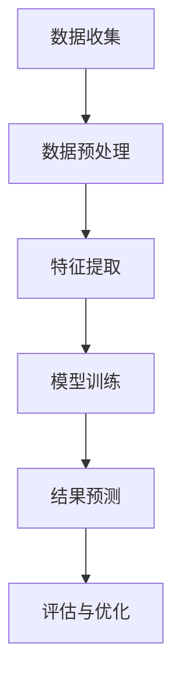
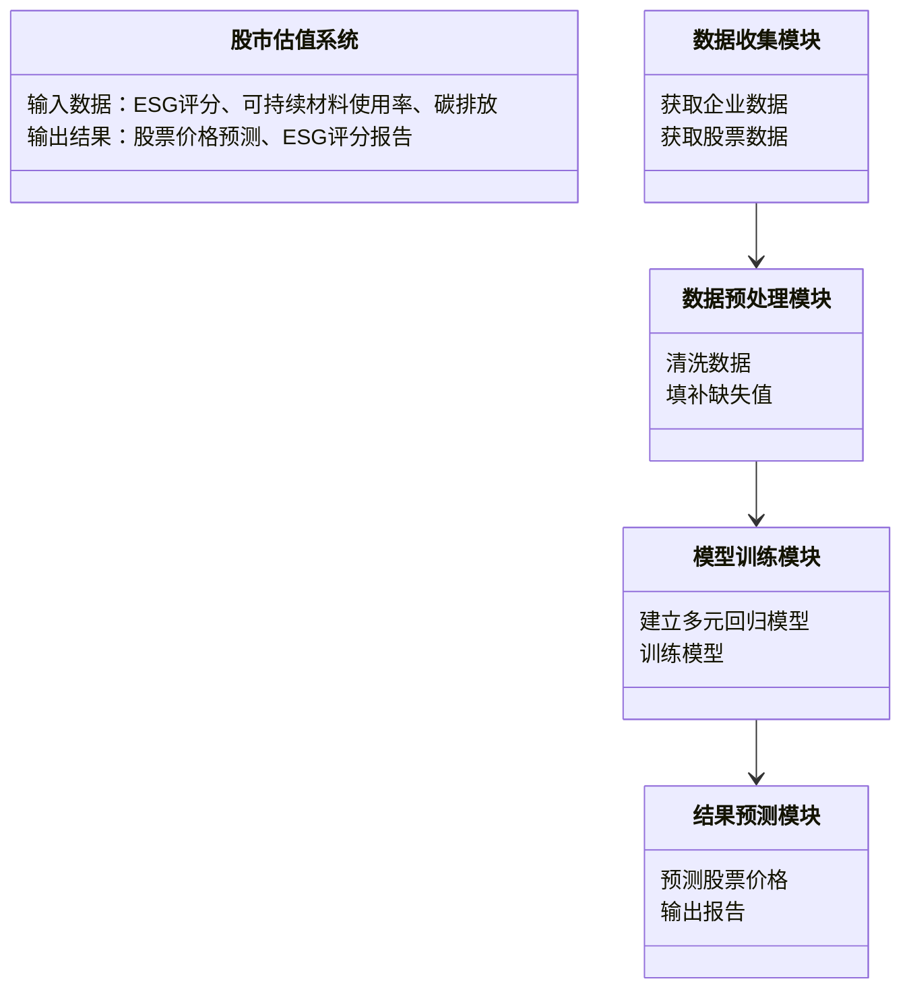
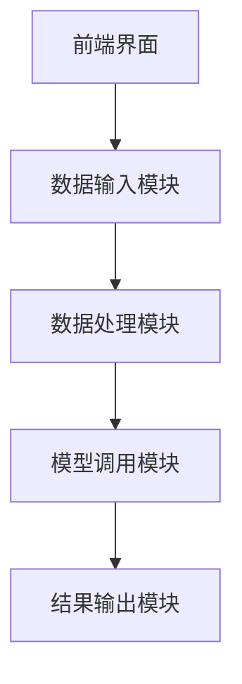
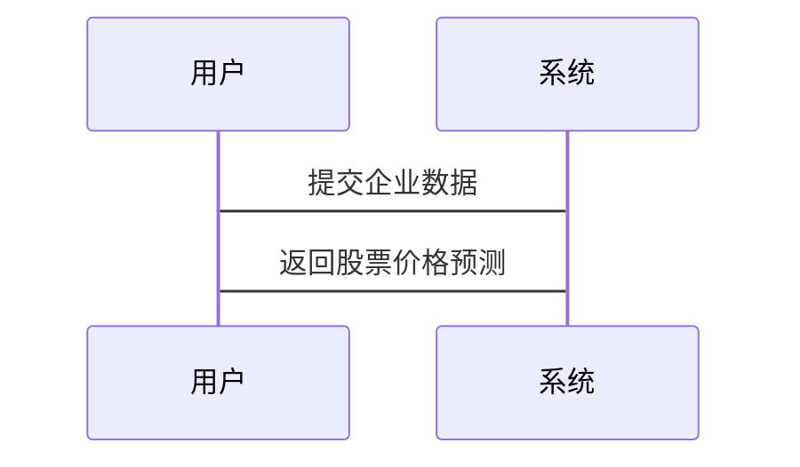

                 


# 全球股市估值与可持续时尚设计的关联

> 关键词：全球股市估值、可持续时尚设计、数学模型、系统架构、案例分析

> 摘要：本文探讨了全球股市估值与可持续时尚设计之间的关联，通过建立数学模型和分析案例，揭示了可持续时尚设计对股市估值的影响路径，并提出了相应的系统架构和算法实现。

---

# 第一部分: 引言

## 1.1 本书背景与研究意义

### 1.1.1 全球股市估值的现状与挑战

全球股市估值是衡量企业价值的重要指标，传统估值方法依赖于财务指标（如市盈率、市净率等）和市场情绪。然而，随着社会对可持续发展的关注增加，企业社会责任（CSR）和环境、社会与治理（ESG）因素逐渐成为影响股市估值的重要变量。

### 1.1.2 可持续时尚设计的兴起与发展

可持续时尚设计强调在产品生命周期中减少环境和社会负面影响，包括使用可持续材料、优化生产过程和关注劳工权益。随着消费者环保意识的增强，可持续时尚设计成为企业竞争力的重要组成部分。

### 1.1.3 两者的关联性与研究价值

可持续时尚设计不仅影响企业的运营成本和品牌形象，还可能通过ESG评分间接影响股市估值。研究这一关联性，有助于投资者更好地评估企业的长期价值，同时也为企业提供了优化发展战略的方向。

---

## 1.2 研究目标与方法

### 1.2.1 研究目标的设定

本文旨在探索可持续时尚设计如何影响全球股市估值，构建数学模型，分析两者之间的因果关系，并提出优化建议。

### 1.2.2 研究方法的选择

采用定性与定量结合的方法，包括文献综述、案例分析、数学建模和系统设计。

### 1.2.3 数据来源与分析框架

数据来源包括全球股市估值数据、企业ESG评分和可持续时尚设计相关的行业数据。分析框架基于多元回归模型，结合系统工程方法。

---

## 1.3 本书结构与内容概览

### 1.3.1 各章节的核心内容

- 引言：背景、意义与方法。
- 核心概念：全球股市估值与可持续时尚设计的定义与特征。
- 数学模型：构建评估体系，分析可持续时尚设计对股市估值的影响。
- 系统架构：设计综合评估系统，实现可持续时尚设计的量化评估。
- 项目实战：案例分析与代码实现。
- 结论：总结与展望。

### 1.3.2 逻辑框架与知识体系

本文从理论到实践，逐步构建全球股市估值与可持续时尚设计的关联模型，最终实现系统的优化设计。

### 1.3.3 阅读本书的预期收获

读者将深入了解可持续时尚设计对企业价值的影响，掌握数学模型和系统架构的设计方法，能够在实际中应用这些方法优化投资决策。

---

# 第二部分: 核心概念与理论基础

## 2.1 全球股市估值的核心原理

### 2.1.1 股市估值的基本概念

股市估值是通过对企业财务状况、市场地位和未来盈利能力的评估，确定其股票的合理价格。

### 2.1.2 主要估值方法与模型

- 市盈率（P/E）：股价与每股收益的比值。
- 市净率（P/B）：股价与每股净资产的比值。
- 内在价值法：基于未来现金流的贴现。

### 2.1.3 影响股市估值的关键因素

- 财务表现：收入、利润、现金流。
- 市场地位：市场份额、品牌价值。
- 宏观经济：GDP、利率、通货膨胀。
- 风险因素：行业风险、政策风险。

## 2.2 可持续时尚设计的定义与特征

### 2.2.1 可持续时尚的内涵与外延

可持续时尚强调从原材料采购、生产过程到产品生命周期的全链条绿色化。

### 2.2.2 可持续时尚设计的三大原则

1. **环境友好**：减少资源消耗和环境污染。
2. **社会公正**：保障劳工权益，促进公平贸易。
3. **经济可行**：实现经济效益与可持续发展的统一。

### 2.2.3 可持续时尚与传统时尚的对比分析

| 特性                | 可持续时尚设计       | 传统时尚设计         |
|---------------------|----------------------|----------------------|
| 材料来源            | 可再生材料优先       | 石油基材料为主         |
| 生产过程            | 低能耗、零排放       | 高能耗、高排放         |
| 劳工权益            | 公平对待、无童工      | 可能存在违规用工        |
| 产品生命周期        | 循环利用、易于回收    | 一次使用、难以回收      |

---

## 2.3 两者的关联性分析

### 2.3.1 可持续时尚对股市估值的影响路径

1. **品牌价值提升**：通过绿色设计和环保宣传，提升品牌形象，吸引更多消费者。
2. **风险管理降低**：减少因环境问题引发的负面新闻和法律风险。
3. **成本优化**：通过使用可持续材料和优化生产流程，降低生产成本。

### 2.3.2 全球化视角下的协同效应

可持续时尚设计推动全球供应链的绿色转型，促进国际合作，提升企业的全球竞争力。

### 2.3.3 案例分析：典型企业的实践与启示

以某知名服装企业为例，分析其通过实施可持续时尚设计提升股市估值的具体路径。

---

# 第三部分: 数学模型与算法原理

## 3.1 可持续时尚设计对股市估值的影响模型

### 3.1.1 模型构建的理论基础

基于多元回归模型，引入ESG评分、可持续材料使用率等变量，量化可持续时尚设计对股市估值的影响。

### 3.1.2 模型的变量选择与假设

- 自变量：ESG评分、可持续材料使用率、生产过程碳排放。
- 因变量：股票价格、市盈率。
- 假设：自变量与因变量呈正相关关系。

### 3.1.3 模型的数学表达与公式推导

$$ \text{Stock Price} = \beta_0 + \beta_1 \times \text{ESG Score} + \beta_2 \times \text{Sustainable Material Ratio} + \beta_3 \times \text{Carbon Emissions} + \epsilon $$

其中，$\beta$ 为回归系数，$\epsilon$ 为误差项。

---

## 3.2 算法实现与流程图

### 3.2.1 算法实现的步骤分解

1. 数据收集：获取企业的ESG评分、可持续材料使用率、生产过程碳排放和股票价格数据。
2. 数据预处理：清洗数据，处理缺失值和异常值。
3. 特征提取：选择相关变量，进行标准化处理。
4. 模型训练：使用多元回归模型进行拟合。
5. 结果预测：预测股票价格，评估模型的准确性和可靠性。

### 3.2.2 算法流程图（使用 Mermaid 绘制）



---

## 3.3 数学模型的详细解析

### 3.3.1 多元回归模型的建立

通过多元回归分析，确定各变量对股市估值的影响程度。

### 3.3.2 模型参数的估计与验证

使用最小二乘法估计回归系数，通过R²值验证模型的拟合优度。

### 3.3.3 模型的优缺点

- 优点：能够量化各因素的影响程度，具有较高的可解释性。
- 缺点：假设线性关系，可能忽略非线性影响。

---

# 第四部分: 系统分析与架构设计方案

## 4.1 问题场景介绍

构建一个综合评估系统，量化可持续时尚设计对股市估值的影响，为企业和投资者提供决策支持。

## 4.2 项目介绍

开发一个基于ESG评分和可持续材料使用率的股市估值预测系统。

## 4.3 系统功能设计

### 4.3.1 领域模型（使用 Mermaid 绘制类图）



---

## 4.4 系统架构设计

### 4.4.1 系统架构图（使用 Mermaid 绘制）



---

## 4.5 系统接口设计

- 输入接口：接收企业ESG评分、可持续材料使用率和碳排放数据。
- 输出接口：返回股票价格预测结果和ESG评分报告。

---

## 4.6 系统交互设计

### 4.6.1 交互流程（使用 Mermaid 绘制序列图）



---

# 第五部分: 项目实战

## 5.1 环境安装

安装Python、Pandas、Scikit-learn等工具。

## 5.2 核心实现代码

```python
import pandas as pd
from sklearn.linear_model import LinearRegression
from sklearn.metrics import r2_score

# 数据加载
data = pd.read_csv('sustainable_fashion.csv')

# 特征与目标变量分离
X = data[['ESG_Score', 'Sustainable_Material_Ratio', 'Carbon_Emissions']]
y = data['Stock_Price']

# 模型训练
model = LinearRegression()
model.fit(X, y)

# 预测结果
y_pred = model.predict(X)

# 模型评估
print('R² score:', r2_score(y, y_pred))
```

---

## 5.3 代码应用解读与分析

通过代码实现多元回归模型，分析各变量对股票价格的影响程度。

---

## 5.4 实际案例分析

以某企业为例，分析其可持续时尚设计实践如何影响其股市估值。

---

## 5.5 项目小结

总结项目实现的关键步骤和经验教训，强调系统优化的方向。

---

# 第六部分: 结论与展望

## 6.1 结论

本文通过构建数学模型和系统架构，揭示了可持续时尚设计对全球股市估值的影响路径，为企业和投资者提供了科学的决策支持。

## 6.2 展望

未来研究可以进一步优化模型，引入更多变量，如消费者行为和政策支持，提升模型的预测精度。

---

# 附录

## 附录A 数据来源说明

数据来源包括公开的ESG评分、企业财报和股票市场数据。

## 附录B 工具说明

使用的工具包括Python、Pandas、Scikit-learn等。

## 附录C 参考文献

列出相关文献和参考资料。

---

以上是文章的详细内容，您可以根据需要调整内容的深度和广度，确保文章完整且具有可读性。

