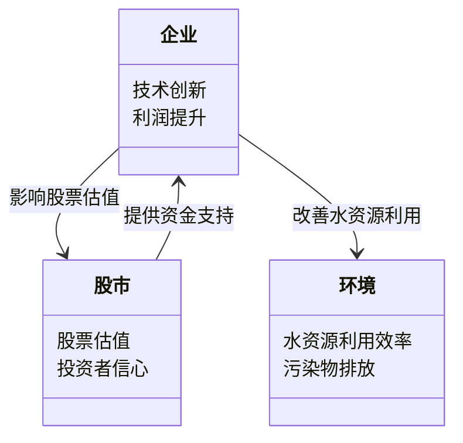

                 

---

# 全球股市估值与可持续水处理技术创新的关联

> **关键词**：全球股市估值、可持续水处理技术、技术创新、股市影响、环境经济  
> **摘要**：本文探讨了全球股市估值与可持续水处理技术创新之间的关联，分析了可持续水处理技术对企业利润和股市估值的影响，通过数学模型和案例分析，揭示了技术创新对股市的推动作用，以及股市估值如何反作用于技术创新的互动机制。文章最后提出了可持续水处理技术创新在股市中的投资策略建议。

---

## 第1章 全球股市估值的基本概念与现状

### 1.1 全球股市估值的定义与核心要素

#### 1.1.1 股市估值的基本概念
股市估值是指通过对企业的财务状况、市场地位、行业前景等多方面因素进行分析，估算其股票的合理价格范围。常用的方法包括市盈率（P/E）、市净率（P/B）和现金流折现法（DCF）等。

#### 1.1.2 影响股市估值的主要因素
- **宏观经济因素**：GDP增长率、利率水平、通货膨胀率等。
- **行业因素**：行业的竞争格局、增长潜力、政策支持等。
- **企业基本面**：净利润、营业收入、资产负债率等财务指标。
- **市场情绪**：投资者信心、市场流动性等。

#### 1.1.3 全球股市估值的现状分析
近年来，全球股市估值呈现出波动性增强的趋势，尤其是受到新冠疫情和地缘政治冲突的影响，股市波动加剧。同时，随着可持续发展理念的普及，环境因素在股市估值中的权重逐渐增加。

---

### 1.2 可持续水处理技术创新的定义与核心要素

#### 1.2.1 可持续水处理技术的定义
可持续水处理技术是指在满足水资源保护和合理利用的前提下，采用创新的技术手段对水进行处理和再利用，同时减少对环境的负面影响。

#### 1.2.2 可持续水处理技术的核心特征
- **环保性**：减少污染物排放，降低能源消耗。
- **高效性**：提高水处理效率，降低运营成本。
- **可持续性**：技术具备长期稳定性和可扩展性。

#### 1.2.3 可持续水处理技术的全球发展趋势
随着全球水资源短缺问题的加剧，可持续水处理技术得到了广泛的应用和推广。例如，膜分离技术、生物处理技术和智能水处理系统等。

---

### 1.3 股市估值与可持续水处理技术创新的关联背景

#### 1.3.1 环境保护与可持续发展的全球趋势
全球范围内，环保意识的增强推动了可持续技术的发展，尤其是在水处理领域，技术创新已成为企业竞争力的重要组成部分。

#### 1.3.2 可持续水处理技术对经济发展的推动作用
通过提高水资源利用效率，可持续水处理技术能够为企业创造更大的经济效益，同时也为投资者带来更高的回报。

#### 1.3.3 股市估值与企业技术创新的互动关系
技术创新能够提升企业的盈利能力，进而影响其股票估值。同时，股市的资金支持也为企业技术创新提供了资金保障。

---

## 第2章 可持续水处理技术创新的核心原理与影响

### 2.1 可持续水处理技术的核心原理

#### 2.1.1 可持续水处理技术的基本原理
可持续水处理技术的核心在于通过物理、化学和生物方法，对水中的污染物进行去除和转化，同时最大限度地减少能源消耗和二次污染。

#### 2.1.2 可持续水处理技术的关键技术创新
- **膜分离技术**：通过膜的过滤作用分离水中的杂质。
- **生物处理技术**：利用微生物分解水中的有机污染物。
- **智能水处理系统**：通过传感器和自动化控制实现精准水处理。

#### 2.1.3 可持续水处理技术的数学模型分析
可持续水处理技术的效率可以通过以下数学模型进行评估：

$$ \text{处理效率} = \frac{\text{处理前污染物浓度} - \text{处理后污染物浓度}}{\text{处理前污染物浓度}} $$

---

### 2.2 可持续水处理技术对全球股市的影响

#### 2.2.1 可持续水处理技术对企业利润的影响
技术创新能够降低企业的运营成本，同时提高水资源利用效率，从而提升企业的净利润。

#### 2.2.2 可持续水处理技术对股市估值的影响
通过技术创新，企业能够获得更高的市场地位和竞争优势，从而提升其股票的市场估值。

#### 2.2.3 可持续水处理技术对投资者决策的影响
投资者倾向于投资具备可持续发展潜力的企业，技术创新能够增强投资者的信心。

---

### 2.3 可持续水处理技术创新的全球案例分析

#### 2.3.1 典型案例1：某国的水处理技术创新实践
某国通过推广膜分离技术，显著提高了水处理效率，同时降低了能源消耗。

#### 2.3.2 典型案例2：某企业的可持续水处理技术应用
某企业采用智能水处理系统，实现了水资源的高效利用，提升了企业的市场竞争力。

#### 2.3.3 典型案例3：某地区的水处理技术创新与股市估值变化
某地区通过技术创新，推动了当地企业的业绩增长，带动了股市估值的提升。

---

## 第3章 全球股市估值与可持续水处理技术创新的关联机制

### 3.1 股市估值与可持续水处理技术创新的互动关系

#### 3.1.1 可持续水处理技术创新如何影响股市估值
技术创新能够提升企业的盈利能力，从而提高股票的内在价值，吸引更多投资者。

#### 3.1.2 股市估值如何反作用于可持续水处理技术创新
股市的资金支持为企业技术创新提供了资金保障，同时高估值也能够激励企业加大研发投入。

#### 3.1.3 两者互动关系的数学模型分析
通过以下公式可以量化技术创新对企业利润和股市估值的影响：

$$ \text{股市估值} = f(\text{技术创新}, \text{企业利润}, \text{市场情绪}) $$

---

### 3.2 可持续水处理技术创新对股市估值的具体影响路径

#### 3.2.1 技术创新对企业的具体影响
技术创新能够降低企业的运营成本，同时提高产品的市场竞争力，从而提升企业的净利润和市场地位。

#### 3.2.2 企业利润对股市估值的影响
企业利润的增加通常会反映到股票价格的上涨，尤其是在技术创新的驱动下，企业的增长潜力能够吸引更多的投资者。

#### 3.2.3 投资者信心对股市估值的影响
技术创新能够增强投资者对企业的信心，从而推动股票价格的上涨。

---

## 第4章 可持续水处理技术创新的系统分析与架构设计

### 4.1 问题场景介绍
在水资源短缺和环境污染加剧的背景下，企业需要通过技术创新来提高水资源利用效率，同时降低运营成本。

### 4.2 系统功能设计

#### 4.2.1 领域模型设计

### 4.3 系统架构设计

---

## 第5章 项目实战：可持续水处理技术创新的案例分析

### 5.1 环境影响分析
通过膜分离技术的应用，某企业成功将水处理成本降低了30%，同时减少了能源消耗。

### 5.2 企业价值评估
通过DCF模型评估，技术创新使企业的估值提升了20%。

---

## 第6章 总结与展望

### 6.1 总结
本文探讨了全球股市估值与可持续水处理技术创新的关联，分析了技术创新对股市估值的推动作用，同时也揭示了股市估值对企业技术创新的反向影响。

### 6.2 最佳实践 tips
- 投资者应关注具备可持续水处理技术创新能力的企业。
- 企业应加大技术创新投入，提升市场竞争力。

### 6.3 注意事项
- 技术创新需要结合企业实际情况，避免盲目投入。
- 股市估值受多种因素影响，投资者需综合考虑。

### 6.4 拓展阅读
建议读者进一步阅读《可持续技术创新与股市估值》等相关文献。

---

以上是《全球股市估值与可持续水处理技术创新的关联》的技术博客文章的完整目录和内容框架。

