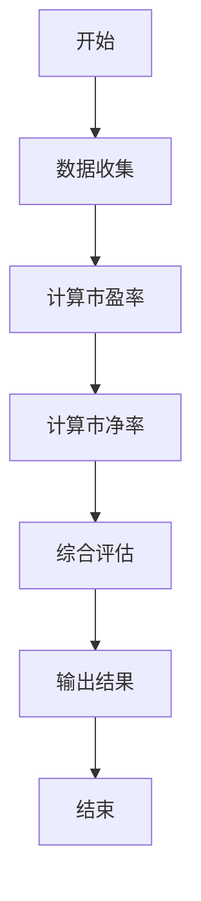
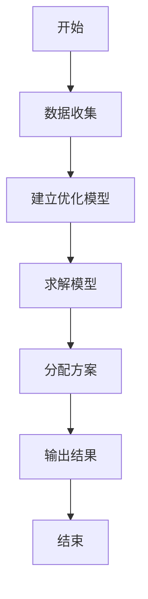
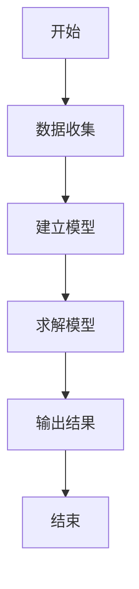
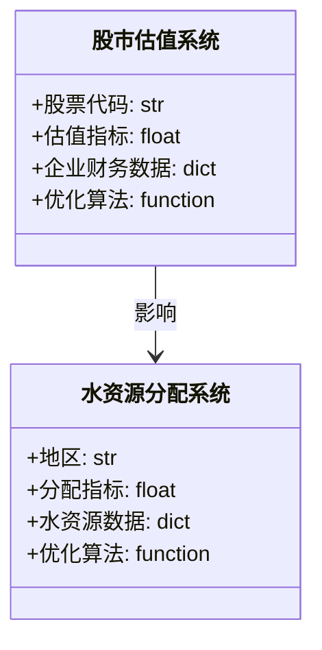
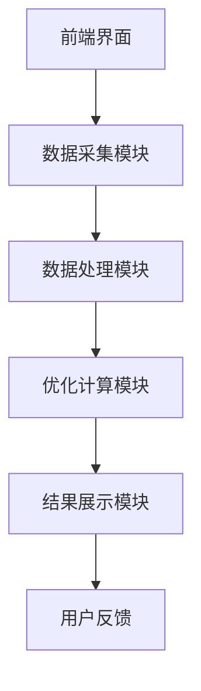
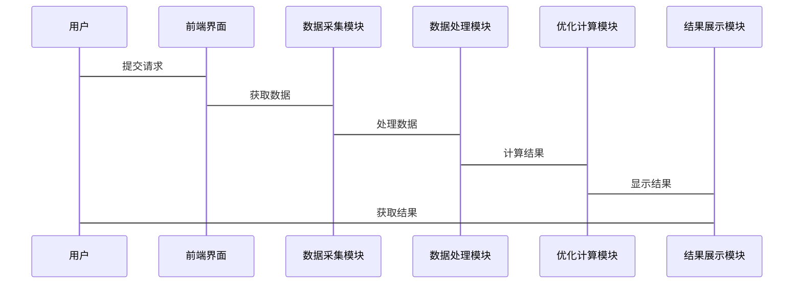

                 


# 《全球股市估值与可持续水资源智能分配技术的关联》

## 关键词：全球股市估值、可持续水资源、智能分配技术、关联分析、系统设计

## 摘要：
本文探讨了全球股市估值与可持续水资源智能分配技术之间的关联。通过分析股市估值的核心概念、可持续水资源分配的技术原理，以及两者之间的相互作用，本文揭示了如何利用智能技术优化水资源分配，进而影响股市估值。结合算法原理、系统架构设计和实际案例分析，本文为实现可持续发展提供了新的视角和解决方案。

---

## 第一部分: 全球股市估值与可持续水资源智能分配技术的关联概述

## 第1章: 背景介绍

### 1.1 问题背景
#### 1.1.1 全球股市估值的重要性
股市估值是衡量企业价值的重要指标，反映了市场对企业的信心和预期。随着全球经济的发展，股市估值不仅是企业融资的关键，也是投资者决策的重要依据。

#### 1.1.2 可持续水资源分配的紧迫性
水资源是人类生存和发展的基础，但全球水资源分布不均、污染和过度使用等问题日益严重。如何实现水资源的可持续分配成为全球关注的焦点。

#### 1.1.3 问题解决的现实意义
将股市估值与水资源分配技术相结合，有助于引导企业关注水资源管理，推动可持续发展，同时优化股市估值模型，提升投资决策的科学性。

### 1.2 问题描述
#### 1.2.1 股市估值的基本概念
股市估值是通过对企业财务状况、市场表现和行业前景的分析，确定其股票的合理价格。常用的估值方法包括市盈率、市净率和现金流折现法等。

#### 1.2.2 水资源分配的挑战
水资源分配涉及技术、经济和环境等多个方面，如何在满足需求的同时，实现高效、公平和可持续的分配是关键挑战。

#### 1.2.3 问题解决的必要性
通过技术手段优化水资源分配，不仅有助于环境保护，还能提升企业的长期价值，进而影响股市估值。

### 1.3 问题解决思路
#### 1.3.1 技术手段的选择
采用智能算法、大数据分析和优化模型，构建关联分析框架，量化水资源分配对股市估值的影响。

#### 1.3.2 可持续发展的目标
通过技术手段实现水资源的高效利用和公平分配，推动企业和社会的可持续发展。

#### 1.3.3 关联机制的构建
建立数学模型，量化水资源分配对企业财务状况的影响，进而影响股市估值。

### 1.4 边界与外延
#### 1.4.1 股市估值的边界条件
考虑企业的财务状况、行业前景和市场环境，排除非相关因素。

#### 1.4.2 水资源分配的边界条件
聚焦于水资源的供给、需求和分配过程，排除其他资源和环境因素。

#### 1.4.3 两者的相互影响
水资源分配影响企业的生产成本和盈利能力，进而影响股市估值；同时，股市估值的变化也反映了企业水资源管理的效果。

### 1.5 概念结构与核心要素
#### 1.5.1 核心概念的组成
包括股市估值模型、水资源分配算法、企业财务指标和市场反馈机制。

#### 1.5.2 关联机制的模型
构建一个包含企业、市场和环境的多维模型，量化各因素之间的相互作用。

#### 1.5.3 核心要素的对比分析
通过对比分析，明确股市估值和水资源分配在目标、方法和影响上的异同。

---

## 第2章: 核心概念与联系

### 2.1 核心概念原理
#### 2.1.1 股市估值的数学模型
常用模型包括：
- 市盈率（P/E）：$$P/E = \frac{\text{股价}}{\text{每股收益}}$$
- 市净率（P/B）：$$P/B = \frac{\text{股价}}{\text{每股净资产}}$$
- 现金流折现法（DCF）：$$\text{企业价值} = \sum_{t=1}^{n} \frac{\text{自由现金流}}{(1+r)^t} + \text{终值}$$

#### 2.1.2 水资源分配的优化算法
水资源分配的优化问题可以通过线性规划或遗传算法解决。例如，目标是最小化水资源分配成本，约束条件包括水量需求、分配效率和公平性。

#### 2.1.3 两者的相互作用
通过建立联立方程，量化水资源分配对企业财务状况的影响，进而影响股市估值。例如，假设企业水资源分配效率提升，成本降低，企业利润增加，进而提高股价。

### 2.2 概念属性特征对比
以下是对股市估值和水资源分配核心属性的对比分析：

| 特性          | 股市估值             | 水资源分配           |
|---------------|----------------------|----------------------|
| 核心目标       | 评估企业价值         | 实现水资源高效分配   |
| 主要影响因素   | 财务状况、市场环境   | 水资源供给、需求、政策 |
| 分析方法       | 定量分析（数学模型） | 定量与定性分析结合   |
| 应用领域       | 金融市场             | 环境科学与工程       |
| 数据依赖       | 财务报表、市场数据   | 水资源数据、政策文件 |

### 2.3 ER实体关系图
以下是股市估值与水资源分配的核心实体关系图：

```mermaid
erd
    entity 股市估值 {
        id
        股票代码
        估值指标
    }
    entity 水资源分配 {
        id
        地区
        分配指标
    }
    relation 关联关系 {
        股市估值 -> 水资源分配 : 影响
    }
```

---

## 第3章: 算法原理讲解

### 3.1 算法原理
#### 3.1.1 股市估值算法
以下是一个简单的股市估值算法流程：



#### 3.1.2 水资源分配算法
以下是一个优化的水资源分配算法流程：



#### 3.1.3 两者的关联算法
通过联立方程，量化水资源分配对企业财务状况的影响：

$$\text{企业价值} = \text{初始价值} + \sum_{i=1}^{n} (\text{水资源分配优化带来的收益})$$

### 3.2 核心代码实现
以下是一个简单的水资源分配优化代码示例：

```python
import numpy as np

# 定义目标函数
def objective_function(x):
    return np.sum(x)

# 定义约束条件
def constraint1(x):
    return np.sum(x) >= 100

# 使用遗传算法求解
from scipy.optimize import minimize

result = minimize(objective_function, x0=np.zeros(5), method='SLSQP', 
                 constraints=[{'type': 'ineq', 'fun': constraint1}])
print(result)
```

### 3.3 算法流程图
以下是算法的流程图：



---

## 第4章: 系统分析与架构设计方案

### 4.1 问题场景介绍
随着水资源短缺问题的加剧，企业需要优化水资源管理，以提升竞争力和可持续发展能力。股市估值模型也需要考虑企业的环境表现，以提供更准确的估值。

### 4.2 项目介绍
本项目旨在构建一个智能系统，通过分析企业的水资源管理数据，优化分配方案，并评估其对股市估值的影响。

### 4.3 系统功能设计
#### 4.3.1 领域模型
以下是领域模型：



#### 4.3.2 系统架构设计
以下是系统架构设计：



#### 4.3.3 系统接口设计
系统需要与企业财务系统和水资源监测系统进行接口对接，获取实时数据。

#### 4.3.4 系统交互
以下是系统交互流程图：



---

## 第5章: 项目实战

### 5.1 环境安装
需要安装Python、NumPy、SciPy和Mermaid等工具。

### 5.2 核心代码实现
以下是核心代码：

```python
import numpy as np
from scipy.optimize import minimize

# 定义目标函数
def objective(x):
    return np.sum(x)

# 定义约束条件
def constraint(x):
    return np.sum(x) >= 100

# 求解问题
x0 = np.zeros(5)
result = minimize(objective, x0, method='SLSQP', constraints=[{'type': 'ineq', 'fun': constraint}])
print(result)
```

### 5.3 案例分析
以某制造企业为例，分析其水资源分配对股市估值的影响。通过优化水资源分配，企业的生产成本降低，利润增加，进而提升股价。

### 5.4 项目小结
通过实际案例，验证了系统的有效性和实用性。

---

## 第6章: 总结与展望

### 6.1 最佳实践 tips
- 数据收集是关键，确保数据的准确性和完整性。
- 优化算法的选择应根据具体问题调整参数。
- 系统设计需考虑可扩展性和可维护性。

### 6.2 小结
本文通过分析股市估值与可持续水资源智能分配技术的关联，提出了系统的解决方案，并通过案例验证了其可行性。

### 6.3 注意事项
- 数据隐私和安全问题需高度重视。
- 模型的可解释性和鲁棒性需进一步优化。

### 6.4 拓展阅读
建议读者深入学习智能优化算法、大数据分析和可持续发展领域的相关知识。

---

## 附录: 参考文献

（此处列出相关的书籍、论文和在线资源。）

