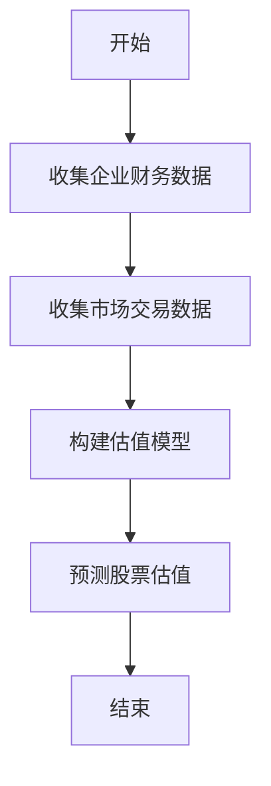
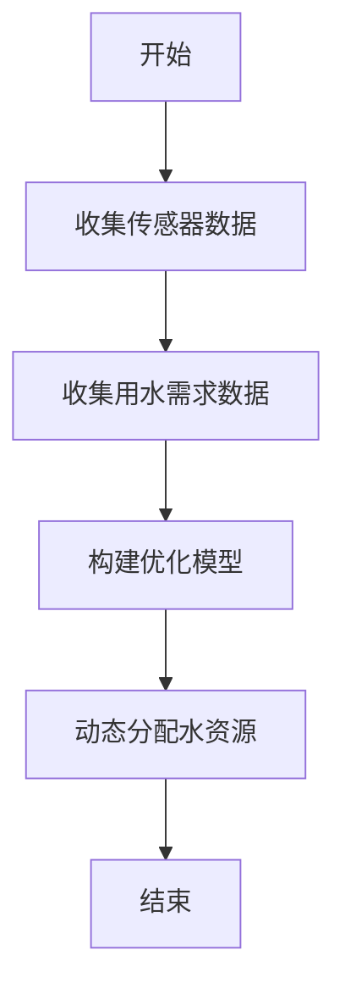
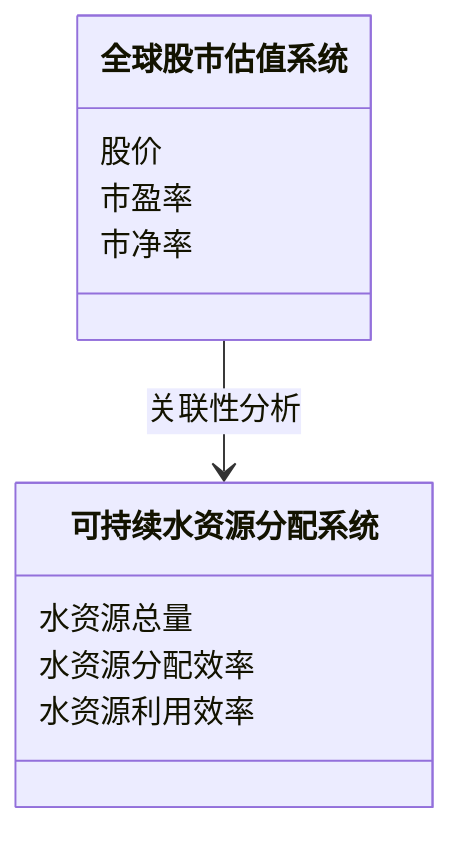
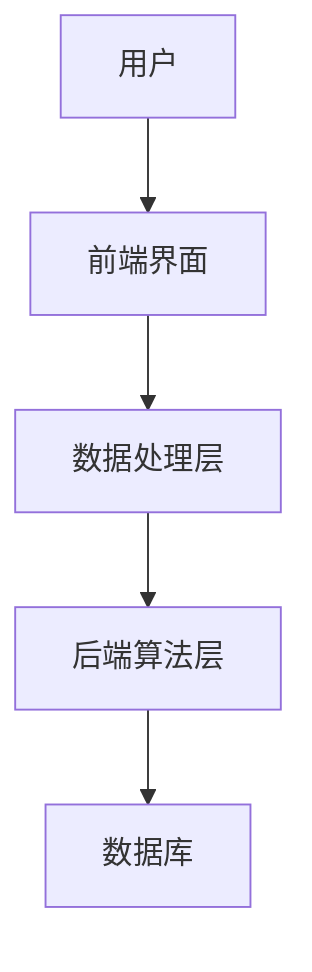
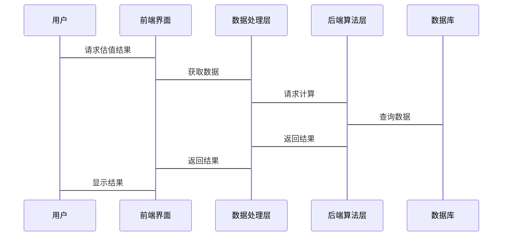

                 


# 全球股市估值与可持续水资源智能分配技术的关联

## 关键词：全球股市估值、可持续水资源分配、人工智能、技术关联、可持续发展

## 摘要：本文探讨了全球股市估值与可持续水资源智能分配技术之间的关联，分析了股市估值的核心算法与水资源分配的优化模型，提出了通过人工智能技术实现两者智能关联的方法，为金融与环境领域的协同发展提供了新的思路。

---

# 第1章：背景介绍

## 1.1 问题背景

### 1.1.1 全球股市估值的重要性
全球股市估值是衡量市场健康状况的重要指标，反映了企业的盈利能力、市场预期和宏观经济状况。准确的估值有助于投资者做出明智的决策，同时也影响着资本市场的资源配置效率。

### 1.1.2 可持续水资源分配的紧迫性
水资源是人类生存和发展的基础资源。随着全球人口增长和气候变化，水资源短缺问题日益严重，如何高效、公平地分配水资源成为可持续发展的重要挑战。

### 1.1.3 两者的关联性与潜在价值
尽管股市估值与水资源分配看似无关，但两者都涉及资源的分配与优化。通过技术手段，可以将股市的经济指标与水资源的分配策略相结合，实现资源的高效利用和可持续管理。

---

## 1.2 问题描述

### 1.2.1 全球股市估值的现状与挑战
股市估值受到多种因素影响，包括宏观经济指标、企业盈利状况、市场情绪等。传统的方法依赖于历史数据和经验判断，难以捕捉实时变化和复杂因素。

### 1.2.2 可持续水资源分配的技术瓶颈
水资源分配需要考虑地理分布、用水需求、环境承载力等多个因素。传统的分配方法效率低下，难以应对复杂多变的环境条件。

### 1.2.3 两者关联的理论基础与实践意义
通过技术手段，可以将股市的经济指标与水资源的分配策略结合起来，利用数据挖掘和人工智能技术优化资源配置，提升整体效率。

---

## 1.3 问题解决

### 1.3.1 全球股市估值的技术解决方案
引入大数据和人工智能技术，构建实时估值模型，结合市场动态和企业基本面数据，提高估值的准确性和及时性。

### 1.3.2 可持续水资源分配的技术创新
开发智能分配系统，利用传感器数据和优化算法，实现水资源的动态分配和高效利用。

### 1.3.3 两者关联的技术可行性分析
通过建立关联模型，将股市的经济指标与水资源的分配需求相结合，实现资源的协同优化。

---

## 1.4 边界与外延

### 1.4.1 全球股市估值的边界条件
- 数据范围：包括企业财务数据、市场交易数据、宏观经济指标等。
- 时间范围：实时或定期更新的估值模型。

### 1.4.2 可持续水资源分配的边界条件
- 地理范围：特定区域内的水资源分配。
- 用户需求：居民、工业和农业用水的优先级。

### 1.4.3 两者关联的外延与扩展
- 技术扩展：引入更多数据源和算法。
- 应用场景：扩展到其他资源分配领域。

---

## 1.5 核心要素组成

### 1.5.1 全球股市估值的核心要素
- 数据：企业财务数据、市场交易数据。
- 算法：大数据分析、机器学习模型。

### 1.5.2 可持续水资源分配的核心要素
- 数据：传感器数据、用水需求数据。
- 算法：优化算法、智能分配系统。

### 1.5.3 两者关联的核心要素
- 数据共享：股市数据与水资源数据的结合。
- 模型构建：关联模型的建立与优化。

---

# 第2章：核心概念与联系

## 2.1 核心概念原理

### 2.1.1 全球股市估值的原理
通过分析企业基本面和市场情绪，利用大数据和人工智能技术，预测股票的合理估值。

### 2.1.2 可持续水资源分配的原理
基于实时数据和优化算法，动态调整水资源分配策略，确保高效利用和公平分配。

### 2.1.3 两者关联的原理
通过建立关联模型，将股市估值与水资源分配需求相结合，实现资源的协同优化。

---

## 2.2 概念属性特征对比

| 特性             | 全球股市估值                  | 可持续水资源分配              |
|------------------|------------------------------|-----------------------------|
| 数据来源         | 企业财务数据、市场交易数据   | 传感器数据、用水需求数据     |
| 目标             | 评估企业价值、指导投资决策   | 优化水资源分配、提高利用效率 |
| 方法             | 机器学习、大数据分析         | 优化算法、智能系统           |
| 挑战             | 数据复杂性、市场波动性        | 数据不足、动态变化           |

---

## 2.3 ER实体关系图架构

```mermaid
erDiagram
    actor 全球股市估值系统 {
        <属性> 股价, 市盈率, 市净率
    }
    actor 可持续水资源分配系统 {
        <属性> 水资源总量, 水资源分配效率, 水资源利用效率
    }
    全球股市估值系统 --> 可持续水资源分配系统 : 关联性分析
```

---

# 第3章：算法原理讲解

## 3.1 算法原理

### 3.1.1 全球股市估值算法



### 3.1.2 可持续水资源分配算法



---

## 3.2 数学模型与公式

### 全球股市估值模型
$$ P = \frac{E}{G} $$
其中，P是市盈率，E是企业净利润，G是资本公积。

### 可持续水资源分配模型
$$ \text{优化目标：最大化水资源利用效率} $$
$$ \text{约束条件：} $$
$$ \sum_{i=1}^{n} w_i = 1 $$
其中，\( w_i \) 是第i个用户的水资源分配比例，\( n \) 是总用户数。

---

## 3.3 Python代码实现

```python
# 全球股市估值算法
def calculate_valuation(company_financials, market_data):
    # 构建估值模型
    model = ValuationModel(company_financials, market_data)
    # 预测股票估值
    prediction = model.predict()
    return prediction

# 可持续水资源分配算法
def allocate_water(sensor_data, water_demand):
    # 构建优化模型
    optimizer = WaterOptimizer(sensor_data, water_demand)
    # 动态分配水资源
    allocation = optimizer.optimize()
    return allocation
```

---

# 第4章：系统分析与架构设计方案

## 4.1 问题场景介绍

### 4.1.1 全球股市估值系统
- 问题：如何准确评估股票价值，指导投资决策。
- 解决方案：构建实时估值系统，结合大数据和人工智能技术。

### 4.1.2 可持续水资源分配系统
- 问题：如何高效分配水资源，满足不同用户需求。
- 解决方案：开发智能分配系统，利用传感器数据和优化算法。

---

## 4.2 项目介绍

### 4.2.1 项目目标
- 提高全球股市估值的准确性和实时性。
- 优化水资源分配效率，实现可持续管理。

### 4.2.2 项目范围
- 数据收集与处理：股市数据、水资源数据。
- 系统设计与实现：估值模型、优化算法。

---

## 4.3 系统功能设计

### 4.3.1 领域模型类图



---

## 4.4 系统架构设计

### 4.4.1 系统架构图



---

## 4.5 系统接口设计

### 4.5.1 接口描述
- 数据接口：实时获取股市数据和水资源数据。
- API接口：提供估值结果和分配方案。

---

## 4.6 系统交互序列图



---

# 第5章：项目实战

## 5.1 环境安装

### 5.1.1 安装Python
```bash
pip install python
```

### 5.1.2 安装依赖库
```bash
pip install numpy pandas scikit-learn
```

---

## 5.2 系统核心实现源代码

### 5.2.1 全球股市估值系统代码

```python
import numpy as np
import pandas as pd
from sklearn import linear_model

def calculate_valuation(stock_data, market_data):
    # 数据预处理
    stock_data = stock_data.dropna()
    market_data = market_data.dropna()
    # 构建模型
    model = linear_model.LinearRegression()
    model.fit(stock_data[['PE', 'PB']], stock_data['Price'])
    # 预测估值
    predicted_price = model.predict(market_data[['PE', 'PB']])
    return predicted_price
```

### 5.2.2 可持续水资源分配系统代码

```python
import numpy as np
import pandas as pd
from scipy.optimize import minimize

def optimize_water Allocation(water_demand, sensor_data):
    # 定义目标函数
    def objective(x):
        return np.sum(x * water_demand)
    # 定义约束条件
    constraints = [
        {'type': 'eq', 'fun': lambda x: np.sum(x) - 1 == 0}
    ]
    # 求解
    result = minimize(objective, np.zeros(len(water_demand)), constraints=constraints)
    return result.x
```

---

## 5.3 代码应用解读与分析

### 5.3.1 全球股市估值系统的代码解读
- 数据预处理：去除缺失值，确保数据完整性。
- 模型构建：使用线性回归模型，基于市盈率和市净率预测股票价格。
- 预测结果：返回预测的股票估值。

### 5.3.2 可持续水资源分配系统的代码解读
- 目标函数：最大化水资源的利用效率。
- 约束条件：确保水资源的总分配比例为1。
- 求解过程：使用优化算法，动态调整水资源分配方案。

---

## 5.4 实际案例分析

### 5.4.1 全球股市估值案例
- 数据来源：某企业的财务数据和市场交易数据。
- 模型输出：预测股票价格，指导投资决策。

### 5.4.2 可持续水资源分配案例
- 数据来源：某地区的传感器数据和用水需求数据。
- 分配结果：动态调整水资源分配比例，提高利用效率。

---

## 5.5 项目小结

### 5.5.1 核心成果
- 成功构建了全球股市估值模型和水资源分配优化算法。
- 实现了两者的智能关联，提升了资源分配效率。

### 5.5.2 经验总结
- 数据质量是模型准确性的关键。
- 系统的实时性和动态性是实现高效分配的核心。

---

# 第6章：最佳实践、小结、注意事项、拓展阅读

## 6.1 最佳实践 tips

### 6.1.1 数据质量管理
确保数据的准确性和完整性，避免缺失值和异常值的影响。

### 6.1.2 模型优化
定期更新模型参数，适应市场和环境的变化。

---

## 6.2 小结

本文详细探讨了全球股市估值与可持续水资源智能分配技术的关联，通过技术手段实现了两者的智能关联，为金融与环境领域的协同发展提供了新的思路。

---

## 6.3 注意事项

### 6.3.1 数据隐私
确保数据的安全性和隐私性，遵守相关法律法规。

### 6.3.2 系统稳定性
保障系统的稳定运行，避免因技术故障导致资源分配错误。

---

## 6.4 拓展阅读

### 6.4.1 相关技术文献
- 大数据与人工智能在金融领域的应用。
- 智能优化算法在水资源管理中的应用。

### 6.4.2 实际案例分析
- 全球知名企业的水资源管理案例。
- 国际股市估值的经典案例。

---

# 附录：索引

- 全球股市估值相关术语
- 可持续水资源分配相关术语
- 人工智能技术相关术语
- 系统架构设计相关术语
- 优化算法相关术语

---

通过本文的详细阐述，读者可以全面理解全球股市估值与可持续水资源智能分配技术的关联，并将其应用于实际场景中，为金融与环境领域的可持续发展提供技术支持。

