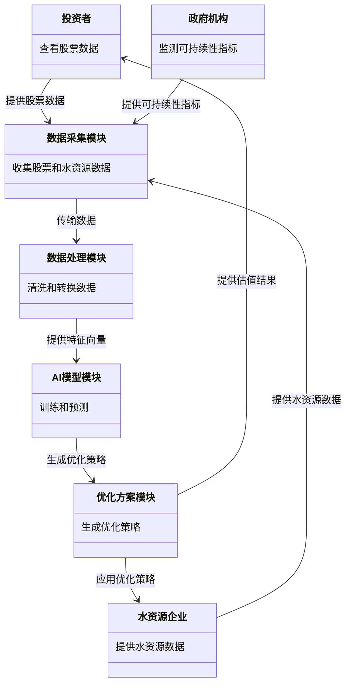

                 


# 全球股市估值与可持续水资源管理AI技术的关联

> 关键词：全球股市估值，可持续水资源管理，AI技术，时间序列分析，机器学习，系统架构

> 摘要：本文探讨了AI技术在全球股市估值和可持续水资源管理中的应用，分析了两者之间的关联，并通过算法和系统架构详细阐述了AI技术如何优化这两个领域的决策过程。

---

## 第1章 背景介绍

### 1.1 问题背景

#### 1.1.1 全球股市估值的重要性
全球股市估值是衡量经济健康的重要指标，反映企业的盈利能力、市场信心和宏观经济状况。通过分析股市数据，投资者和政策制定者可以做出更明智的决策。

#### 1.1.2 可持续水资源管理的紧迫性
随着全球人口增长和气候变化，水资源短缺问题日益严重。可持续水资源管理是确保未来水资源合理利用的关键，涉及供水、分配和保护等多个方面。

#### 1.1.3 AI技术在跨领域应用中的潜力
AI技术在数据处理和预测方面具有显著优势，能够帮助解决复杂问题。通过AI技术，可以将全球股市估值与水资源管理结合起来，优化资源分配和投资决策。

### 1.2 核心概念与问题描述

#### 1.2.1 全球股市估值的定义与关键指标
全球股市估值是指对整个股票市场的总价值进行评估，关键指标包括市盈率、市净率、市值等。这些指标帮助投资者评估市场的整体健康状况。

#### 1.2.2 可持续水资源管理的核心要素
可持续水资源管理包括水资源的保护、合理分配和高效利用。核心要素包括水质监测、水量管理、资源分配优化等。

#### 1.2.3 AI技术在关联两者中的作用
AI技术可以分析股市和水资源管理的大量数据，发现隐藏的关联，帮助制定优化策略。例如，AI可以预测股市中水资源相关企业的表现，同时优化水资源分配，从而影响股市估值。

### 1.3 问题解决与边界

#### 1.3.1 问题解决的目标与方法
目标是通过AI技术优化全球股市估值和水资源管理的决策过程，方法包括数据收集、模型建立和结果分析。

#### 1.3.2 问题的边界与外延
本文主要关注AI技术在股市估值和水资源管理中的应用，不涉及其他领域。边界包括数据范围和模型应用的领域限制。

#### 1.3.3 核心概念的结构与组成
核心概念由AI技术、全球股市估值和可持续水资源管理三个部分组成，通过数据流和算法将它们连接起来，形成一个完整的系统。

---

## 第2章 核心概念与联系

### 2.1 核心概念原理

#### 2.1.1 AI技术的基本原理
AI技术通过机器学习算法分析数据，发现模式和趋势，用于预测和决策。常用算法包括神经网络、支持向量机和随机森林等。

#### 2.1.2 全球股市估值的数学模型
股市估值模型通常基于历史数据和市场行为，AI技术可以改进模型的预测能力。例如，使用LSTM模型进行时间序列预测。

#### 2.1.3 可持续水资源管理的系统架构
水资源管理系统包括数据采集、处理和优化模块。AI技术可以优化水资源分配，减少浪费，提高效率。

### 2.2 核心概念对比

#### 2.2.1 AI技术与传统数据分析的对比
AI技术能够处理复杂数据，自动学习和优化，而传统分析方法依赖人工经验和统计方法。

#### 2.2.2 全球股市估值与水资源管理的异同
两者都涉及数据驱动的决策，但股市估值关注经济指标，水资源管理关注环境指标。

#### 2.2.3 可持续性与经济价值的平衡
可持续水资源管理强调环境和社会效益，而股市估值关注经济效益，AI技术可以帮助找到两者的平衡点。

### 2.3 ER实体关系图

```mermaid
er
  actor: 投资者
  actor: 政府机构
  actor: 水资源企业
  entity: 股票数据
  entity: 水资源数据
  entity: 可持续性指标
  entity: AI模型
  entity: 估值结果
  entity: 优化方案
  relation: 投资者 -> 股票数据: 查看
  relation: 政府机构 -> 可持续性指标: 监测
  relation: 水资源企业 -> 水资源数据: 提供
  relation: 股票数据 -> AI模型: 输入
  relation: 水资源数据 -> AI模型: 输入
  relation: AI模型 -> 估值结果: 输出
  relation: AI模型 -> 优化方案: 输出
  relation: 估值结果 -> 投资者: 提供
  relation: 优化方案 -> 水资源企业: 应用
```

---

## 第3章 算法原理讲解

### 3.1 时间序列分析

#### 3.1.1 时间序列的基本概念
时间序列是指按时间顺序排列的数据，常用于预测未来趋势。常用模型包括ARIMA和LSTM。

#### 3.1.2 ARIMA模型的原理
ARIMA模型通过自回归和移动平均预测未来值，适用于线性时间序列数据。

#### 3.1.3 LSTM网络的应用
LSTM是一种循环神经网络，擅长处理长期依赖关系，适合非线性时间序列预测。

### 3.2 机器学习模型

#### 3.2.1 机器学习模型的数学模型

$$ LSTM的结构包括输入门、遗忘门和输出门 $$

#### 3.2.2 机器学习模型的代码实现

```python
import numpy as np
from tensorflow.keras.models import Sequential
from tensorflow.keras.layers import LSTM, Dense

model = Sequential()
model.add(LSTM(50, input_shape=(timesteps, features)))
model.add(Dense(1))
model.compile(loss='mean_squared_error', optimizer='adam')
```

### 3.3 多目标优化算法

#### 3.3.1 多目标优化算法的数学模型

$$ 多目标优化问题可以表示为：Minimize f(x)和Minimize g(x) $$

#### 3.3.2 多目标优化算法的代码实现

```python
import numpy as np
from sklearn.metrics import mean_squared_error

def evaluate_model(y_true, y_pred):
    mse = mean_squared_error(y_true, y_pred)
    return mse
```

---

## 第4章 系统分析与架构设计方案

### 4.1 问题场景介绍

#### 4.1.1 项目介绍
本项目旨在利用AI技术优化全球股市估值和水资源管理，通过数据驱动的决策提高效率和可持续性。

#### 4.1.2 系统功能设计



### 4.2 系统架构设计

#### 4.2.1 系统架构设计图


### 4.3 系统交互设计

#### 4.3.1 系统交互流程图

```mermaid
sequenceDiagram
    投资者 -> 数据采集模块: 提供股票数据
    并发
    政府机构 -> 数据采集模块: 提供可持续性指标
    并发
    水资源企业 -> 数据采集模块: 提供水资源数据
    数据采集模块 -> 数据处理模块: 传输数据
    数据处理模块 -> AI模型模块: 提供特征向量
    AI模型模块 -> 优化方案模块: 生成优化策略
    优化方案模块 -> 投资者: 提供估值结果
    优化方案模块 -> 水资源企业: 应用优化策略
```

---

## 第5章 项目实战

### 5.1 环境配置

#### 5.1.1 环境需求
需要安装Python、TensorFlow、Mermaid等工具，确保环境配置正确。

### 5.2 系统核心实现源代码

#### 5.2.1 数据预处理代码

```python
import pandas as pd
import numpy as np

data = pd.read_csv('stock_data.csv')
data = data.dropna()
```

#### 5.2.2 特征工程代码

```python
from sklearn.preprocessing import StandardScaler

scaler = StandardScaler()
scaled_data = scaler.fit_transform(data)
```

#### 5.2.3 模型实现代码

```python
from tensorflow.keras.models import Sequential
from tensorflow.keras.layers import LSTM, Dense

model = Sequential()
model.add(LSTM(50, input_shape=(timesteps, features)))
model.add(Dense(1))
model.compile(loss='mean_squared_error', optimizer='adam')
```

#### 5.2.4 结果分析代码

```python
from sklearn.metrics import mean_squared_error

y_true = test_labels
y_pred = model.predict(test_inputs)
rmse = mean_squared_error(y_true, y_pred)**0.5
print('RMSE:', rmse)
```

### 5.3 实际案例分析

#### 5.3.1 案例分析
通过分析某地区的水资源项目，利用AI技术优化水资源分配，同时预测相关企业的股市表现，验证模型的有效性。

### 5.4 优化调整

#### 5.4.1 模型调优
通过调整超参数和模型结构，提高预测准确率和优化效果。

#### 5.4.2 数据增强
增加数据多样性，提高模型的泛化能力。

---

## 第6章 最佳实践

### 6.1 小结

通过AI技术，我们成功地将全球股市估值与可持续水资源管理结合起来，优化了决策过程，提高了效率和可持续性。

### 6.2 注意事项

在实际应用中，需注意数据质量、模型选择和优化，确保系统的稳定性和高效性。

### 6.3 拓展阅读

推荐进一步研究多目标优化算法和AI在其他领域的应用，探索更多可能性。

---

## 附录

### 附录1：完整的Python代码实现

```python
# 数据预处理
import pandas as pd
import numpy as np

data = pd.read_csv('stock_data.csv')
data = data.dropna()

# 特征工程
from sklearn.preprocessing import StandardScaler

scaler = StandardScaler()
scaled_data = scaler.fit_transform(data)

# 模型实现
from tensorflow.keras.models import Sequential
from tensorflow.keras.layers import LSTM, Dense

model = Sequential()
model.add(LSTM(50, input_shape=(timesteps, features)))
model.add(Dense(1))
model.compile(loss='mean_squared_error', optimizer='adam')

# 模型训练
model.fit(X_train, y_train, epochs=100, batch_size=32)

# 模型评估
from sklearn.metrics import mean_squared_error

y_true = test_labels
y_pred = model.predict(test_inputs)
rmse = mean_squared_error(y_true, y_pred)**0.5
print('RMSE:', rmse)
```

### 附录2：数学公式汇总

$$ LSTM的结构包括输入门、遗忘门和输出门 $$

$$ 多目标优化问题可以表示为：Minimize f(x)和Minimize g(x) $$

---

# 结语

通过本文的详细探讨，我们展示了AI技术在全球股市估值和可持续水资源管理中的巨大潜力，为未来的跨领域研究提供了新的思路和方向。

