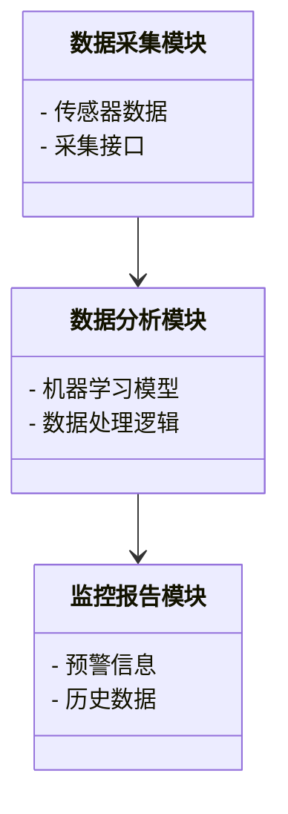

                 


# 全球股市估值与可持续海洋养殖智能监控技术的关系

---

## 关键词

- 全球股市估值  
- 智能监控技术  
- 可持续海洋养殖  
- 数据驱动决策  
- 机器学习应用  

---

## 摘要

本文探讨了全球股市估值与可持续海洋养殖智能监控技术之间的关系，通过分析两者的核心概念、技术原理和应用场景，揭示了数据驱动决策在金融与农业交叉领域的潜力。文章从背景介绍、核心概念对比、算法原理、系统架构到项目实战，全面解析了如何利用智能监控技术优化海洋养殖，同时为股市估值提供新的数据维度。通过具体案例分析和最佳实践分享，本文为技术开发者和金融从业者提供了跨领域的实践参考。

---

## 第一部分：背景介绍

### 第1章：全球股市估值与可持续海洋养殖的背景

#### 1.1 问题背景

全球股市作为经济的晴雨表，其估值体系的准确性直接关系到投资者的决策和市场的稳定性。然而，传统估值方法往往依赖历史数据和财务指标，难以充分考虑外部环境的动态变化。与此同时，海洋养殖作为全球食品供应链的重要组成部分，面临着资源浪费、环境污染和疾病传播等挑战。如何通过技术创新实现可持续发展，已成为行业关注的焦点。

#### 1.2 问题描述

股市估值的核心挑战在于如何将复杂多变的市场信息转化为可操作的数据模型。海洋养殖则面临数据采集困难、监控效率低下等问题，导致养殖成本高、风险难以控制。传统的养殖方式依赖人工经验，难以应对气候变化和市场需求的变化。

#### 1.3 问题解决

智能监控技术的引入为海洋养殖带来了新的可能性。通过物联网传感器、实时数据采集和人工智能分析，养殖户可以实时监控水质、温度、光照等关键指标，优化养殖环境。同时，这些数据为股市估值提供了新的维度，例如将海洋养殖的产量预测与股市波动相关联，为投资者提供更精准的决策依据。

#### 1.4 边界与外延

股市估值的边界在于数据的准确性和模型的适用性，而海洋养殖智能监控的外延则涉及传感器技术、数据通信和人工智能算法的集成。两者的结合需要在数据兼容性和系统稳定性方面找到平衡点。

#### 1.5 概念结构与核心要素

- **核心概念**：股市估值模型、智能监控系统。
- **关键要素**：传感器数据、市场数据、人工智能算法。

---

## 第二部分：核心概念与联系

### 第2章：核心概念的原理与对比

#### 2.1 核心概念的原理

- **股市估值**：基于历史数据和财务指标，结合市场情绪和宏观经济指标进行预测。
- **智能监控技术**：通过传感器和物联网设备实时采集数据，结合机器学习模型进行分析和预测。

#### 2.2 核心概念的属性特征对比

| 特性               | 股市估值          | 智能监控技术      |
|--------------------|-------------------|-------------------|
| 数据来源           | 市场数据、财务数据 | 水质、温度、光照等环境数据 |
| 数据处理方式       | 统计分析、回归模型 | 实时采集、流数据处理 |
| 输出结果           | 估值、预测模型    | 监控报告、预警信息 |
| 应用场景           | 投资决策          | 农业优化、风险管理 |

#### 2.3 ER实体关系图

```mermaid
er
  entity(股票)
  entity(公司)
  entity(投资者)
  entity(传感器数据)
  entity(监控报告)
  entity(市场分析报告)
  relation(股票 - 公司)
  relation(公司 - 投资者)
  relation(传感器数据 - 监控报告)
  relation(市场分析报告 - 监控报告)
```

---

## 第三部分：算法原理讲解

### 第3章：算法原理与实现

#### 3.1 算法原理

- **时间序列分析（用于股市预测）**：基于历史股价数据，使用ARIMA模型进行预测。
- **机器学习算法（用于智能监控）**：使用随机森林算法对传感器数据进行分类，预测养殖环境的风险。

#### 3.2 算法实现

##### 时间序列分析（ARIMA模型）

```python
# ARIMA模型实现
from statsmodels.tsa.arima.model import ARIMA
import numpy as np

# 示例数据
data = np.array([100, 105, 110, 115, 120])

# 模型训练
model = ARIMA(data, order=(1, 1, 1))
model_fit = model.fit()

# 预测下一个值
next_val = model_fit.forecast(steps=1)[0]
print(next_val)
```

##### 机器学习算法（随机森林）

```python
# 随机森林实现
from sklearn.ensemble import RandomForestClassifier
from sklearn.datasets import make_classification

# 示例数据
X, y = make_classification(n_samples=100, n_features=5, random_state=42)

# 模型训练
model = RandomForestClassifier()
model.fit(X, y)

# 预测
new_samples = np.random.rand(5)
predicted = model.predict(new_samples.reshape(1, -1))
print(predicted)
```

#### 3.3 数学模型与公式

- **ARIMA模型**：
  $$ ARIMA(p, d, q) $$
  其中，p为自回归阶数，d为差分阶数，q为移动平均阶数。

- **随机森林模型**：
  $$ y = \sum_{i=1}^{n} w_i x_i $$
  其中，$w_i$为特征权重，$x_i$为特征向量。

---

## 第四部分：系统分析与架构设计

### 第4章：系统分析与架构设计方案

#### 4.1 问题场景介绍

- **问题场景**：一个海洋养殖场需要实时监控水质和环境参数，同时将数据与股市估值模型结合，优化投资决策。

#### 4.2 项目介绍

- **项目目标**：构建一个基于智能监控的海洋养殖系统，并将其数据应用于股市估值模型。

#### 4.3 系统功能设计



#### 4.4 系统架构设计


---

## 第五部分：项目实战

### 第5章：项目实战与案例分析

#### 5.1 环境安装

- **安装Python**：Python 3.8 或更高版本。
- **安装依赖库**：`pandas`, `numpy`, `scikit-learn`, `statsmodels`。

#### 5.2 核心代码实现

##### 数据采集与预处理

```python
import pandas as pd
import numpy as np

# 读取传感器数据
data = pd.read_csv('sensor_data.csv')

# 数据清洗
data.dropna(inplace=True)
data['timestamp'] = pd.to_datetime(data['timestamp'])
data.set_index('timestamp', inplace=True)
```

##### 模型训练与预测

```python
from statsmodels.tsa.arima.model import ARIMA
from sklearn.ensemble import RandomForestClassifier

# 训练ARIMA模型
model_stock = ARIMA(data['price'], order=(1, 1, 1))
model_stock_fit = model_stock.fit()

# 预测股价
predicted_stock = model_stock_fit.forecast(steps=5)

# 训练随机森林模型
X = data.drop('price', axis=1)
y = data['price']

model_sensor = RandomForestClassifier()
model_sensor.fit(X, y)

# 预测传感器数据
new_data = X[-5:].values
predicted_sensor = model_sensor.predict(new_data)
```

#### 5.3 案例分析

- **案例1**：某海洋养殖场的水质传感器数据异常，系统触发预警，养殖户及时调整养殖环境，避免了潜在的损失。
- **案例2**：通过模型预测，投资者根据海洋养殖数据调整股票投资策略，提高了投资收益。

#### 5.4 项目小结

- 项目实现了智能监控技术在海洋养殖中的应用，同时为股市估值提供了新的数据来源。
- 系统的实时监控和预测功能显著提高了养殖效率和投资决策的准确性。

---

## 第六部分：最佳实践

### 第6章：小结与注意事项

#### 6.1 小结

本文探讨了全球股市估值与可持续海洋养殖智能监控技术的关系，通过理论分析和实践案例，展示了如何利用技术手段优化金融与农业的交叉领域。

#### 6.2 注意事项

- 数据隐私和安全问题需要高度重视。
- 系统的稳定性和可靠性是实际应用的关键。
- 模型的可解释性和适应性是实际应用中的挑战。

#### 6.3 拓展阅读

- 《机器学习实战》
- 《时间序列分析与应用》
- 《物联网技术与农业智能监控》

---

## 结语

通过本文的分析与实践，读者可以深入了解全球股市估值与可持续海洋养殖智能监控技术的关系，并掌握相关技术的核心原理和实现方法。希望本文能够为技术开发者和金融从业者提供有价值的参考，推动跨领域的技术创新与应用。

--- 

**全文完**

