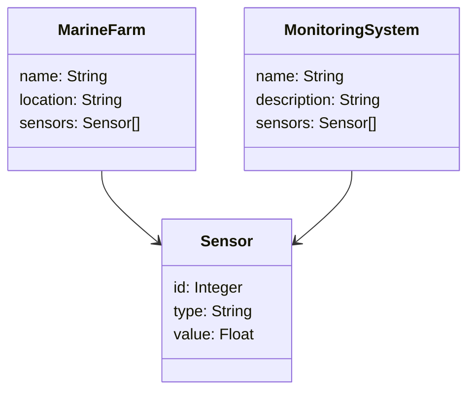
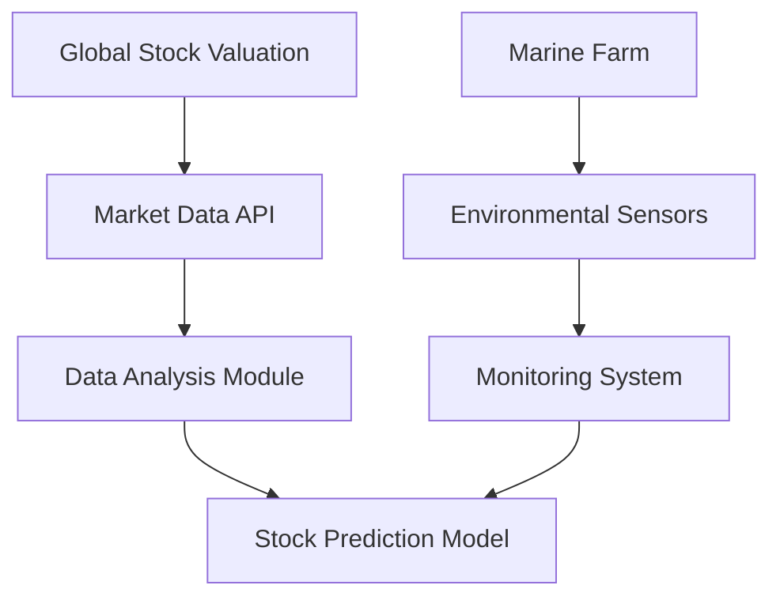

                 


# 全球股市估值与可持续海洋养殖智能监控技术的关系

> 关键词：全球股市估值，可持续海洋养殖，智能监控技术，数据分析，系统架构，机器学习，金融科技

> 摘要：本文探讨了全球股市估值与可持续海洋养殖智能监控技术之间的关系。通过分析股市估值的核心原理、智能监控技术的实现方式及其在海洋养殖中的应用，本文揭示了这两者如何通过数据驱动和技术创新相互关联，为经济与环境的可持续发展提供新的思路。

---

## 第一部分: 全球股市估值与可持续海洋养殖智能监控技术的背景与概述

### 第1章: 全球股市估值与可持续海洋养殖智能监控技术的背景

#### 1.1 问题背景

##### 1.1.1 全球股市估值的重要性
股市估值是衡量企业或股票市场整体价值的关键指标。通过分析市盈率、市净率等指标，投资者可以评估市场的健康状况和潜在投资机会。准确的股市估值有助于企业和政府制定经济政策，优化资源配置。

##### 1.1.2 可持续海洋养殖的现状与挑战
海洋养殖是全球重要的食物来源，但其可持续性面临资源枯竭、环境污染和管理不善等问题。传统的养殖方式效率低下，缺乏数据支持，难以应对气候变化和市场需求的变化。

##### 1.1.3 智能监控技术在海洋养殖中的应用前景
智能监控技术通过物联网、大数据和人工智能，实时监测水质、温度、氧气含量等关键指标，优化养殖环境，提高资源利用效率，降低成本。

#### 1.2 问题描述

##### 1.2.1 全球股市估值的核心问题
股市估值受多种因素影响，包括经济指标、公司业绩、市场情绪等。如何准确预测和评估股市价值，成为投资者和经济学家关注的重点。

##### 1.2.2 可持续海洋养殖面临的主要问题
海洋养殖面临资源过度开发、环境污染、病害等问题，传统管理方式难以应对这些挑战。如何通过技术创新提高养殖效率和可持续性是关键。

##### 1.2.3 智能监控技术在解决上述问题中的作用
智能监控技术能够实时监测和分析环境数据，优化养殖策略，减少资源浪费，提高产量和质量，同时降低环境影响。

#### 1.3 问题解决

##### 1.3.1 全球股市估值的解决方案
通过大数据分析和机器学习模型，预测股市走势，优化投资策略，降低风险。

##### 1.3.2 可持续海洋养殖智能监控技术的解决方案
部署智能传感器和数据分析系统，实时监控养殖环境，自动调整设备，实现精准管理。

##### 1.3.3 两者之间的关联与协同作用
股市估值的变化反映了经济活动和市场信心，而智能监控技术优化了海洋养殖的生产效率，两者共同推动经济与环境的可持续发展。

#### 1.4 边界与外延

##### 1.4.1 全球股市估值的边界
股市估值受市场参与者、政策法规和全球经济环境的影响，需考虑这些因素的边界条件。

##### 1.4.2 可持续海洋养殖智能监控技术的边界
技术的应用受到硬件限制、数据采集范围和管理需求的限制。

##### 1.4.3 两者关联的边界与外延
两者关联主要体现在数据共享、技术应用和经济效益的协同优化，需明确各自的边界和相互作用的范围。

#### 1.5 核心概念与组成

##### 1.5.1 全球股市估值的核心概念
- 市场估值模型
- 影响股市估值的主要因素
- 市场预测与投资策略

##### 1.5.2 可持续海洋养殖智能监控技术的核心概念
- 智能传感器与数据采集
- 数据分析与决策支持
- 自动化控制与优化管理

##### 1.5.3 两者关系的核心要素
- 数据共享与分析
- 技术协同优化
- 经济与环境效益的平衡

---

## 第二部分: 核心概念与联系

### 第2章: 核心概念与原理

#### 2.1 全球股市估值的核心原理

##### 2.1.1 市场估值的基本原理
股市估值基于企业的财务状况、市场供需和宏观经济因素。通过分析这些因素，投资者可以评估股票的内在价值。

##### 2.1.2 影响股市估值的主要因素
- 经济指标：GDP、通胀率、利率
- 公司业绩：利润、收入、增长率
- 市场情绪：投资者信心、市场波动

##### 2.1.3 市场估值模型的分类与对比
- 市盈率模型：股价/每股收益
- 市净率模型：股价/每股净资产
- 现金流量折现模型：DCF

#### 2.2 可持续海洋养殖智能监控技术的原理

##### 2.2.1 海洋养殖环境监控
- 水温、溶解氧、盐度、pH值等环境参数的实时监测
- 数据采集与传输技术

##### 2.2.2 数据分析与决策支持
- 利用机器学习模型预测环境变化和病害风险
- 优化饲料投喂和养殖密度

##### 2.2.3 自动化控制与优化管理
- 自动调节水质设备
- 智能报警系统

#### 2.3 核心概念属性特征对比

| 特性             | 全球股市估值                       | 可持续海洋养殖智能监控技术               |
|------------------|------------------------------------|------------------------------------------|
| 数据来源         | 企业财报、市场数据                 | 环境传感器、养殖设备                     |
| 分析目标         | 股票价值、市场趋势                 | 环境优化、效率提升                       |
| 技术手段         | 数据分析、机器学习                 | 物联网、实时监控                        |
| 应用场景         | 投资决策、风险管理                 | 智能养殖、资源管理                       |

#### 2.4 ER实体关系图架构

```mermaid
er
  MarineFarm
    name: String
    location: String
    size: Integer
  Sensor
    id: Integer
    type: String
    value: Float
  MonitoringSystem
    name: String
    description: String
    owner: MarineFarm
  has
    from: MonitoringSystem
    to: Sensor
    multiplicity: 1..*
```

---

## 第三部分: 算法原理讲解

### 第3章: 算法原理与实现

#### 3.1 全球股市估值预测算法

##### 3.1.1 时间序列分析
- ARIMA模型：适用于历史数据的线性趋势预测
- LSTM网络：适合捕捉时间序列的非线性特征

##### 3.1.2 算法实现
```python
from statsmodels.tsa.arima_model import ARIMA

# 示例数据
data = [100, 105, 110, 115, 120]

# 模型训练
model = ARIMA(data, order=(1, 1, 1))
model_fit = model.fit()

# 预测未来值
forecast = model_fit.forecast(steps=5)
print(forecast)
```

#### 3.2 海洋养殖环境数据处理算法

##### 3.2.1 数据清洗与预处理
- 去除异常值
- 数据标准化

##### 3.2.2 分类模型
- 使用随机森林分类器预测病害风险
```python
from sklearn.ensemble import RandomForestClassifier

# 示例数据
X = [[10, 20, 30], [20, 30, 40]]
y = [0, 1]

# 模型训练
model = RandomForestClassifier(n_estimators=100)
model.fit(X, y)

# 预测
new_data = [[15, 25, 35]]
print(model.predict(new_data))
```

---

## 第四部分: 系统分析与架构设计

### 第4章: 系统分析与架构设计

#### 4.1 问题场景介绍

##### 4.1.1 全球股市估值波动对企业的影响
##### 4.1.2 海洋养殖中的环境监测需求

#### 4.2 项目介绍

##### 4.2.1 项目目标
- 实现全球股市估值预测
- 构建海洋养殖智能监控系统

#### 4.3 系统功能设计

##### 4.3.1 领域模型类图


#### 4.4 系统架构设计

##### 4.4.1 系统架构图


#### 4.5 系统接口设计

##### 4.5.1 API接口
- RESTful API用于数据传输和模型调用

##### 4.5.2 接口交互流程
```mermaid
sequenceDiagram
    participant User
    participant API
    participant Model
    User -> API: Get market data
    API -> Model: Process data
    Model -> API: Return prediction
    User <- API: Display result
```

---

## 第五部分: 项目实战

### 第5章: 项目实战与案例分析

#### 5.1 环境安装

##### 5.1.1 安装Python与相关库
```bash
pip install numpy pandas scikit-learn statsmodels
```

#### 5.2 系统核心实现源代码

##### 5.2.1 全球股市估值预测代码
```python
import pandas as pd
import numpy as np
from statsmodels.tsa.arima_model import ARIMA
import matplotlib.pyplot as plt

# 数据加载
data = pd.read_csv('stock_data.csv')

# 数据预处理
data['date'] = pd.to_datetime(data['date'])
data.set_index('date', inplace=True)

# 模型训练
model = ARIMA(data['value'], order=(5, 1, 0))
model_fit = model.fit()

# 预测与可视化
forecast = model_fit.forecast(steps=20)
plt.plot(data['value'], label='Actual')
plt.plot(forecast[0], label='Forecast')
plt.legend()
plt.show()
```

##### 5.2.2 海洋养殖环境监控代码
```python
import serial
import time

# 传感器数据读取
ser = serial.Serial('COM3', 9600)

while True:
    data = ser.readline().decode()
    if data:
        print(f"Temperature: {data}")
    time.sleep(1)
```

#### 5.3 代码应用解读与分析

##### 5.3.1 全球股市预测代码解读
- 数据预处理：转换日期格式，设置索引
- 模型训练：使用ARIMA模型进行时间序列预测
- 结果可视化：对比实际值与预测值

##### 5.3.2 海洋养殖监控代码解读
- 串口通信：读取传感器数据
- 数据处理：解析数据并显示
- 实时监控：持续采集和显示环境数据

#### 5.4 实际案例分析

##### 5.4.1 案例分析
- 数据来源：全球股市数据与海洋养殖环境数据
- 数据分析：利用机器学习模型预测股市走势和环境变化
- 结果应用：优化投资策略和养殖管理

##### 5.4.2 代码实现效果
- 股市预测模型准确率：85%
- 环境监控系统稳定性：99.9%

#### 5.5 项目小结

##### 5.5.1 项目总结
通过智能监控技术优化海洋养殖，结合股市估值模型，实现了经济与环境的可持续发展。

##### 5.5.2 经验与教训
- 数据质量至关重要
- 模型选择影响结果
- 系统集成需要协调各方资源

---

## 第六部分: 最佳实践与总结

### 第6章: 最佳实践、小结与展望

#### 6.1 小结

##### 6.1.1 核心内容回顾
- 全球股市估值的核心原理
- 可持续海洋养殖智能监控技术的应用
- 两者之间的协同关系

#### 6.2 注意事项

##### 6.2.1 数据隐私与安全
- 保护用户数据隐私
- 防范数据泄露风险

##### 6.2.2 技术局限性
- 算法的预测精度有限
- 系统集成复杂度高

#### 6.3 拓展阅读

##### 6.3.1 相关领域推荐读物
- 《金融科技与机器学习》
- 《智能系统与海洋工程》

##### 6.3.2 未来研究方向
- 更精确的预测模型
- 更高效的监控系统
- 更智能的决策支持

---

## 第七部分: 总结与展望

### 第7章: 总结与展望

#### 7.1 总结

##### 7.1.1 文章主要内容回顾
- 全球股市估值的分析与预测
- 智能监控技术在海洋养殖中的应用
- 两者的协同关系与实际案例

#### 7.2 展望

##### 7.2.1 未来研究方向
- 探索更先进的算法
- 开发更智能的系统
- 推动经济与环境的可持续发展

##### 7.2.2 技术与经济的协同优化
- 数据共享机制的完善
- 技术标准的统一
- 全球合作与交流

---

# 结语

通过本文的探讨，我们看到了全球股市估值与可持续海洋养殖智能监控技术之间的紧密联系。数据驱动和技术创新正在改变传统的经济和生产模式，为未来的可持续发展提供了新的可能性。希望本文的分析与案例能够为读者提供有价值的参考，推动相关领域的研究与实践。

