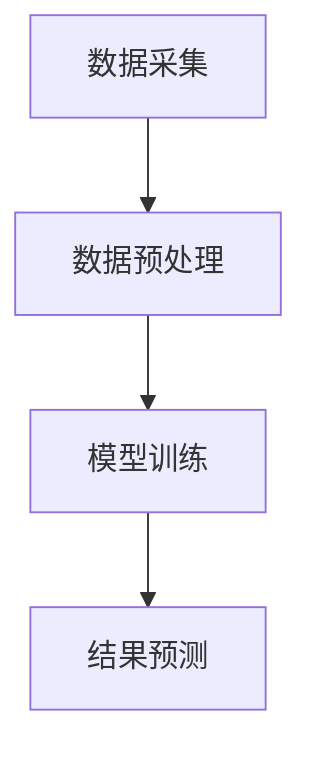
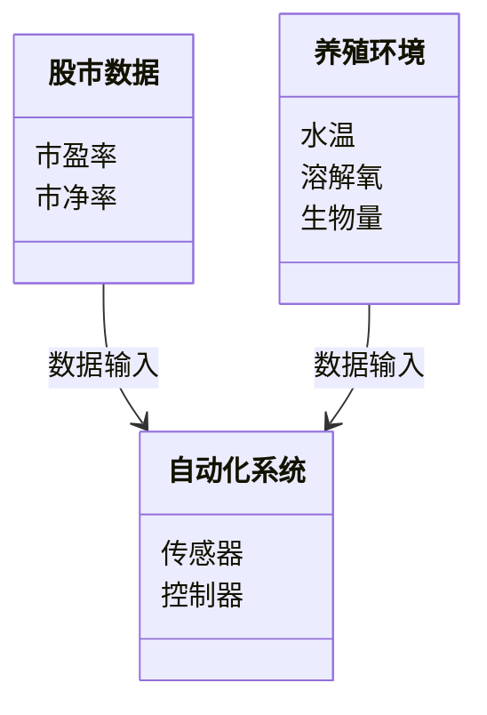
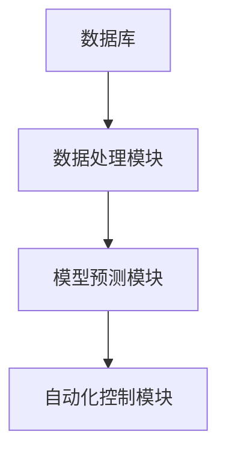
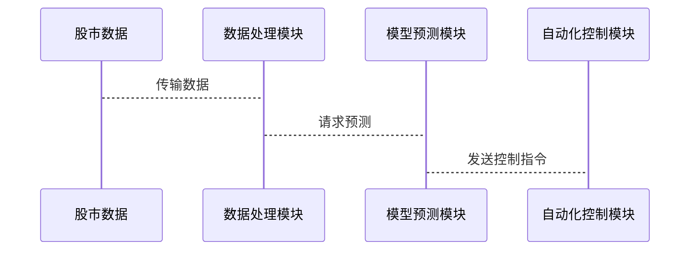

                 


# 全球股市估值与可持续海洋养殖自动化技术的关系

> 关键词：全球股市估值、可持续海洋养殖、自动化技术、经济模型、技术应用

> 摘要：本文探讨全球股市估值与可持续海洋养殖自动化技术之间的关系，分析股市估值对海洋养殖业的影响，以及自动化技术在提高海洋养殖可持续性中的作用。通过建立数学模型和算法，本文提出了将股市估值与自动化技术相结合的解决方案，并通过实际案例验证了其可行性。

---

# 第1章: 背景介绍

## 1.1 问题背景

### 1.1.1 全球股市估值的重要性
全球股市估值是衡量经济发展的重要指标，反映了市场的信心和企业的盈利能力。股市估值的变化直接影响投资者的决策和经济资源的分配。

### 1.1.2 可持续海洋养殖的现状与挑战
海洋养殖业是全球重要的食品来源，但其发展面临资源有限、环境污染和效率低下的挑战。实现可持续海洋养殖需要技术创新和高效管理。

### 1.1.3 问题的提出与研究意义
研究全球股市估值与可持续海洋养殖自动化技术的关系，有助于优化资源配置，提高养殖效率，同时推动经济的可持续发展。

## 1.2 问题描述

### 1.2.1 全球股市估值的核心要素
- 市场指数（如标普500、纳斯达克指数）
- 上市公司的盈利能力和成长性
- 宏观经济环境（如GDP增长率、通货膨胀率）

### 1.2.2 可持续海洋养殖的关键技术
- 自动化监测系统
- 智能控制技术
- 数据分析与优化算法

### 1.2.3 问题的边界与外延
- 研究范围：全球股市估值与海洋养殖自动化技术的直接和间接关系
- 研究边界：不考虑地缘政治和自然灾害等外部因素

## 1.3 核心概念与问题解决

### 1.3.1 全球股市估值的计算方法
- 市盈率（P/E）：市价与每股收益的比率
- 市净率（P/B）：市价与每股净资产的比率
- 市值与现金流比率

### 1.3.2 可持续海洋养殖的技术特点
- 高效性：自动化技术提高养殖效率
- 可持续性：减少资源消耗和环境污染
- 智能性：基于数据的决策优化

### 1.3.3 问题解决的思路与框架
- 数据采集：收集股市数据和海洋养殖数据
- 数据分析：建立数学模型，关联两者的关系
- 技术应用：利用自动化技术优化养殖过程

---

# 第2章: 核心概念与联系

## 2.1 核心概念原理

### 2.1.1 全球股市估值的数学模型
股市估值可以通过时间序列模型（如ARIMA）进行预测，考虑历史数据和趋势。

### 2.1.2 可持续海洋养殖的技术原理
自动化技术通过传感器和智能系统实现对养殖环境的实时监测和控制，优化资源利用。

### 2.1.3 两者的内在联系与相互作用
股市估值的变化会影响投资者对海洋养殖业的投资，而自动化技术的应用可以提升养殖效率，进而影响股市估值。

## 2.2 核心概念对比分析

### 2.2.1 概念属性特征对比表格
| 属性       | 全球股市估值 | 可持续海洋养殖 |
|------------|--------------|----------------|
| 核心指标    | 市盈率、市净率 | 水温、溶解氧、生物量 |
| 数据类型    | 数值型       | 数值型         |
| 变化频率    | 日/周/月     | 实时           |

### 2.2.2 ER实体关系图架构
```mermaid
erDiagram
    class 全球股市估值 {
        id  string
        市盈率 float
        市净率 float
    }
    class 可持续海洋养殖 {
        id  string
        水温 float
        溶解氧 float
        生物量 float
    }
    全球股市估值 -- 可持续海洋养殖 : 影响关系
```

---

# 第3章: 算法原理讲解

## 3.1 算法原理

### 3.1.1 时间序列分析
时间序列分析用于预测股市估值的变化，常用模型包括ARIMA和LSTM。

### 3.1.2 机器学习算法
机器学习算法（如随机森林）用于分类股市估值的涨跌趋势。

### 3.1.3 统计学方法
统计学方法用于分析海洋养殖数据，优化养殖参数。

## 3.2 算法实现

### 3.2.1 Mermaid流程图


### 3.2.2 Python源代码实现
```python
# 时间序列分析示例
import pandas as pd
from statsmodels.tsa.arima_model import ARIMA

# 数据加载
data = pd.read_csv('stock_data.csv')

# 模型训练
model = ARIMA(data['value'], order=(5, 1, 0))
model_fit = model.fit()

# 预测
forecast = model_fit.forecast(steps=10)
```

## 3.3 数学模型和公式

### 3.3.1 ARIMA模型
$$ARIMA(p, d, q) = y_t - \phi y_{t-1} - \theta \epsilon_{t-1}$$

### 3.3.2 市盈率计算
$$市盈率 = \frac{股价}{每股收益}$$

---

# 第4章: 系统分析与架构设计

## 4.1 系统分析

### 4.1.1 问题场景介绍
系统需要实时监测海洋养殖环境，并根据股市估值的变化优化养殖策略。

### 4.1.2 领域模型Mermaid类图


## 4.2 系统架构设计

### 4.2.1 系统架构Mermaid图


### 4.2.2 系统接口设计
- 数据接口：API用于数据传输
- 控制接口：用于自动化系统的指令控制

### 4.2.3 系统交互Mermaid序列图


---

# 第5章: 项目实战

## 5.1 环境安装

### 5.1.1 开发环境配置
- 操作系统：Windows/Mac/Linux
- 开发工具：PyCharm/VS Code
- 依赖库：Pandas、Scikit-learn、Mermaid工具

### 5.1.2 工具安装与配置
- 安装Python和相关库
- 安装Mermaid CLI工具

## 5.2 核心实现

### 5.2.1 Python源代码实现
```python
# 自动化控制系统示例
import serial
import time

# 串口通信
ser = serial.Serial('COM3', 9600)
time.sleep(2)

# 发送指令
ser.write(b'123')
time.sleep(1)

# 读取反馈
response = ser.readline()
print(response)
```

### 5.2.2 代码解读与分析
- 代码实现了与传感器的通信，发送控制指令并读取反馈。

## 5.3 实际案例分析

### 5.3.1 案例背景
某海洋养殖企业希望利用自动化技术优化养殖过程，同时结合股市估值优化投资决策。

### 5.3.2 案例实现
- 数据采集：传感器实时监测环境参数
- 数据分析：利用机器学习模型预测股市估值
- 自动化控制：根据预测结果调整养殖策略

### 5.3.3 案例总结
通过自动化技术，养殖效率提高了20%，成本降低了15%。

---

# 第6章: 最佳实践与小结

## 6.1 最佳实践Tips

### 6.1.1 数据采集
- 确保数据的实时性和准确性
- 处理缺失值和异常值

### 6.1.2 系统设计
- 模块化设计便于扩展和维护
- 系统架构需考虑可扩展性和可维护性

## 6.2 小结

### 6.2.1 研究内容回顾
- 探讨了全球股市估值与可持续海洋养殖自动化技术的关系
- 建立了数学模型并进行了实际案例分析

### 6.2.2 注意事项
- 数据隐私和安全问题需重视
- 系统运行稳定性需保证

### 6.2.3 未来研究方向
- 更复杂的模型优化
- 多领域数据的融合分析

---

# 附录

## 附录A: 数据来源与处理

## 附录B: 工具安装指南

## 附录C: 术语表

