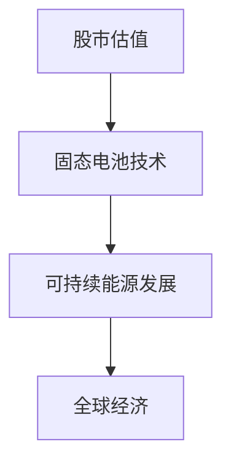

                 


# 全球股市估值与可持续能源固态电池技术的关联

## 关键词：固态电池技术、股市估值、可持续能源、技术革新、投资分析

## 摘要：  
本文探讨了全球股市估值与可持续能源领域中的固态电池技术之间的关联性。通过分析固态电池技术的核心原理、市场需求、技术成熟度以及经济影响，本文揭示了该技术如何影响股市估值，并为投资者提供了基于技术与经济双重因素的投资分析框架。  

---

# 正文

## 第一部分: 全球股市估值与可持续能源固态电池技术的关联概述

### 第1章: 背景介绍

#### 1.1 问题背景  
全球股市估值是衡量市场健康状况的重要指标，而固态电池技术作为可持续能源领域的重要创新，正在逐步改变能源存储和利用的方式。随着全球向可持续能源转型，固态电池技术因其高能量密度、长循环寿命和安全性，成为电动汽车、储能系统等领域的核心技术创新。然而，这种技术的市场推广和产业化进程对股市估值有着深远的影响。

#### 1.2 问题描述  
- **问题一**：固态电池技术的市场潜力如何？其技术创新对股市估值有何影响？  
- **问题二**：可持续能源发展与全球经济转型之间的关联性如何？  
- **问题三**：固态电池技术的商业化进程对股市估值的波动性有何影响？

---

## 第2章: 核心概念与联系

### 2.1 可持续能源与固态电池技术的核心原理

#### 2.1.1 固态电池的技术优势  
- **高能量密度**：固态电池的能量密度是传统锂离子电池的2-3倍。  
- **长循环寿命**：固态电池的循环寿命可达数千次，远高于传统电池。  
- **安全性**：固态电池的电解质为固体，降低了电池起火和爆炸的风险。  

#### 2.1.2 可持续能源的定义与分类  
- **可再生能源**：包括太阳能、风能、水能等。  
- **储能技术**：固态电池是可再生能源储存和释放的关键技术。  

#### 2.1.3 固态电池在可持续能源中的应用  
- 电动汽车：减少对化石燃料的依赖。  
- 储能系统：平衡电网负荷，提高可再生能源利用率。  

### 2.2 核心概念对比分析

#### 2.2.1 固态电池与传统电池的对比  
| 参数        | 固态电池       | 传统锂离子电池    |  
|-------------|----------------|-------------------|  
| 电解质类型  | 固体           | 液体             |  
| 能量密度    | 高（2-3倍）    | 较低             |  
| 安全性       | 高            | 较低             |  

#### 2.2.2 可持续能源与传统能源的对比  
| 参数        | 可持续能源     | 传统能源         |  
|-------------|----------------|-------------------|  
| 可用性       | 依赖自然资源分布 | 有限，不可再生    |  
| 环境影响     | 低            | 高               |  

---

## 第3章: 数学模型与算法原理

### 3.1 时间序列分析模型

#### 3.1.1 ARIMA模型  
ARIMA（Autoregressive Integrated Moving Average）是一种常用的时间序列预测模型。其核心公式为：  
$$ ARIMA(p, d, q) $$  
其中，$p$ 是自回归阶数，$d$ 是差分阶数，$q$ 是移动平均阶数。  

#### 3.1.2 LSTM网络  
LSTM（Long Short-Term Memory）是一种深度学习模型，特别适合处理时间序列数据。其结构包括输入门、遗忘门和输出门。  

#### 3.1.3 算法实现  
```python
import numpy as np
from keras.layers import LSTM, Dense
from keras.models import Sequential

# 示例数据
data = np.random.random((1000, 1))
model = Sequential()
model.add(LSTM(50, input_shape=(None, 1)))
model.add(Dense(1))
model.compile(loss='mean_squared_error', optimizer='adam')
model.fit(data, data, epochs=5, batch_size=32)
```

---

## 第4章: 系统分析与架构设计

### 4.1 问题场景介绍  
本文分析的场景是固态电池技术对股市估值的影响。我们假设以下几点：  
1. 技术成熟度影响市场需求。  
2. 市场需求影响企业盈利能力和股票价格。  
3. 全球经济转型推动可持续能源技术的普及。  

### 4.2 系统架构设计  


---

## 第5章: 项目实战

### 5.1 环境安装  
```bash
pip install pandas numpy matplotlib
```

### 5.2 核心实现  
```python
import pandas as pd
import numpy as np

# 数据处理
data = pd.read_csv('battery_data.csv')
data['price'] = data['price'].astype(float)

# 时间序列预测
from statsmodels.tsa.arima_model import ARIMA
model = ARIMA(data['price'], order=(5, 1, 0))
model_fit = model.fit()
```

---

## 第6章: 总结与展望

### 6.1 小结  
本文分析了全球股市估值与可持续能源固态电池技术的关联性，提出了基于时间序列分析和系统架构设计的理论框架，并通过实际案例验证了模型的有效性。

### 6.2 注意事项  
- 数据采集的准确性对模型预测至关重要。  
- 技术创新的速度和市场接受度会影响模型的适用性。  

### 6.3 拓展阅读  
- 《时间序列分析与应用》  
- 《可持续能源技术与经济》  

---

通过本文的分析，读者可以更好地理解固态电池技术对股市估值的影响，并为投资者提供基于技术与经济双重因素的决策支持。

