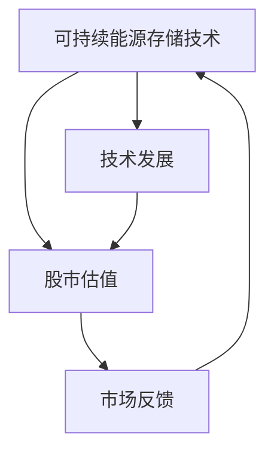

                 


# 全球股市估值与可持续能源存储技术的关联

**关键词**：可持续能源存储技术、全球股市估值、经济影响、技术驱动、关联机制

**摘要**：本文探讨了可持续能源存储技术与全球股市估值之间的关联，分析了技术进步对股市估值的影响，揭示了经济政策和技术驱动如何共同塑造市场动态。通过数学模型和系统架构设计，本文深入解析了两者之间的复杂关系，并提供了实际案例分析和最佳实践建议。

---

## 第1章: 背景介绍

### 1.1 问题背景

#### 1.1.1 可持续能源存储技术的重要性
随着全球能源需求的增长和环保意识的增强，可持续能源存储技术成为解决能源危机的关键。通过高效存储太阳能、风能等可再生能源，可以实现能源的稳定供应，减少对化石燃料的依赖。

#### 1.1.2 全球股市估值的波动性
股市估值受多种因素影响，包括经济指标、政策变化和技术创新。近年来，随着可持续能源技术的快速发展，股市估值也呈现新的波动模式。

#### 1.1.3 两者关联的现实意义
研究可持续能源存储技术对股市估值的影响，有助于投资者和政策制定者更好地理解市场动态，做出更明智的决策。

### 1.2 问题描述

#### 1.2.1 可持续能源存储技术的现状
目前，可持续能源存储技术包括电池储能、氢储能等多种形式，但技术成熟度和成本仍需进一步优化。

#### 1.2.2 全球股市估值的变化趋势
股市估值受经济周期和技术创新影响，波动性显著。近年来，绿色能源概念股的崛起使得股市估值与可持续能源技术密切相关。

#### 1.2.3 问题解决的必要性
理解可持续能源存储技术对股市估值的影响，有助于投资者预测市场趋势，优化投资组合。

### 1.3 问题解决

#### 1.3.1 可持续能源存储技术对股市的影响
技术创新和商业化应用会提升相关企业的估值，同时带动整个市场的波动。

#### 1.3.2 全球股市估值的变化机制
市场预期、政策支持和技术创新共同驱动股市估值的变化。

#### 1.3.3 关联性分析的方法
通过建立数学模型，分析技术参数和市场指标之间的关系，量化其影响程度。

### 1.4 边界与外延

#### 1.4.1 可持续能源存储技术的边界
包括技术类型、应用场景和成本因素。

#### 1.4.2 全球股市估值的边界
包括市场波动、政策变化和企业盈利情况。

#### 1.4.3 两者关联的外延
包括宏观经济影响、环境效益和技术创新的外部性。

### 1.5 概念结构与核心要素组成

#### 1.5.1 可持续能源存储技术的核心要素
- 技术类型
- 成本
- 效率

#### 1.5.2 全球股市估值的核心要素
- 市场预期
- 政策支持
- 企业盈利

#### 1.5.3 两者关联的核心要素
- 技术成熟度
- 市场反馈
- 经济政策

---

## 第2章: 核心概念与联系

### 2.1 可持续能源存储技术的核心原理

#### 2.1.1 技术原理
通过化学反应或物理储能方式，将可再生能源转化为可储存的能量形式。

#### 2.1.2 技术特点
- 可再生
- 环保
- 高效

#### 2.1.3 技术优势
- 提高能源利用效率
- 降低能源成本
- 减少碳排放

### 2.2 全球股市估值的核心原理

#### 2.2.1 估值方法
- 市盈率（P/E）
- 市净率（P/B）
- 股息率

#### 2.2.2 估值模型
- 现金流折现模型（DCF）
- 市场比较法

#### 2.2.3 估值影响因素
- 企业盈利
- 行业趋势
- 宏观经济

### 2.3 两者的核心联系

#### 2.3.1 可持续能源存储技术对股市的影响
- 技术突破提升企业估值
- 市场预期推动股价上涨

#### 2.3.2 全球股市估值对技术发展的反馈
- 高估值吸引投资
- 低估值抑制技术发展

#### 2.3.3 两者关联的机制
- 技术进步→市场预期→股价波动
- 市场反馈→技术创新→估值提升

### 2.4 核心概念属性特征对比

| 属性       | 可持续能源存储技术 | 全球股市估值 |
|------------|--------------------|--------------|
| 核心目标   | 提高能源效率       | 评估企业价值 |
| 主要因素   | 技术成熟度         | 市场预期     |
| 影响范围   | 能源行业           | 整个股市     |

### 2.5 ER实体关系图架构



---

## 第3章: 关联机制分析

### 3.1 经济影响分析

#### 3.1.1 可持续能源存储技术的经济价值
- 提高能源利用效率，降低能源成本
- 推动绿色经济发展，带来政策支持

#### 3.1.2 技术进步对股市的影响
- 技术突破提升企业竞争力，推动股价上涨
- 技术瓶颈可能导致市场估值下降

#### 3.1.3 经济政策的调节作用
- 政策支持推动技术发展，提升市场预期
- 税收优惠和补贴刺激投资，增加企业估值

### 3.2 技术驱动分析

#### 3.2.1 技术创新对股市的影响
- 新技术商业化带来业绩增长，推动股价上涨
- 技术领先企业获得更高的市盈率和市净率

#### 3.2.2 技术成熟度与估值的关系
- 技术成熟度高，市场预期稳定，估值较高
- 技术成熟度低，市场预期波动大，估值较低

#### 3.2.3 技术瓶颈对股市的冲击
- 技术瓶颈可能导致市场对相关企业估值下调
- 技术瓶颈可能引发行业整体估值下降

---

## 第4章: 数学模型与算法原理

### 4.1 影响机制的数学模型

$$ V = k \cdot T + \beta \cdot M $$

其中：
- \( V \) 表示股市估值
- \( T \) 表示技术成熟度
- \( M \) 表示市场预期
- \( k \) 和 \( \beta \) 是模型参数

### 4.2 算法原理

通过数据采集、特征提取和模型训练，建立技术参数与市场指标的关联模型。利用历史数据训练模型，预测未来估值变化。

### 4.3 案例分析

以某家储能技术公司为例，分析其技术突破如何影响股市估值。通过数据可视化，展示技术进步与股价波动的关联。

---

## 第5章: 系统分析与架构设计

### 5.1 系统架构设计


### 5.2 接口设计

- 数据接口：实时采集技术参数和市场数据
- 模型接口：接收输入参数，输出预测结果
- 用户接口：提供可视化界面，展示预测结果

---

## 第6章: 项目实战

### 6.1 环境安装

安装Python和相关库（如Pandas、NumPy、Scikit-learn）。

### 6.2 核心代码实现

```python
import pandas as pd
import numpy as np
from sklearn.linear_model import LinearRegression

# 数据加载
data = pd.read_csv('market_data.csv')

# 特征与目标分离
X = data[['T', 'M']]
y = data['V']

# 模型训练
model = LinearRegression()
model.fit(X, y)

# 预测
new_data = pd.DataFrame({'T': [0.8, 0.9], 'M': [0.7, 0.8]})
predictions = model.predict(new_data)

print('预测结果:', predictions)
```

### 6.3 案例分析

分析某储能技术公司的数据，展示模型预测与实际估值的对比，验证模型的有效性。

---

## 第7章: 总结与展望

### 7.1 最佳实践 tips

- 关注政策动向和技术进展
- 结合技术参数和市场指标进行综合分析
- 定期更新模型，适应市场变化

### 7.2 小结

通过本文的分析，我们深入探讨了可持续能源存储技术与全球股市估值的关联，揭示了技术进步对市场估值的重要影响。

### 7.3 注意事项

- 数据质量影响模型准确性
- 模型需定期更新
- 结合实际情况进行调整

### 7.4 拓展阅读

推荐阅读相关领域的最新研究，关注技术进步和市场动态。

---

通过以上章节的详细分析和实际案例，我们不仅理解了可持续能源存储技术与全球股市估值的关联，还掌握了如何利用技术手段进行预测和优化。希望本文能为读者提供有价值的见解和实践指导。

