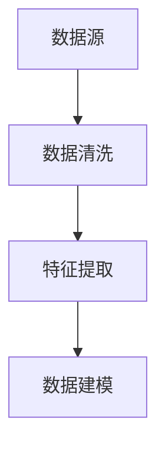
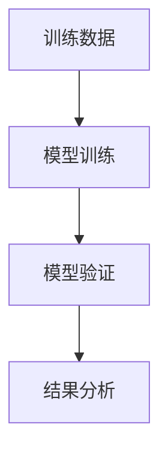
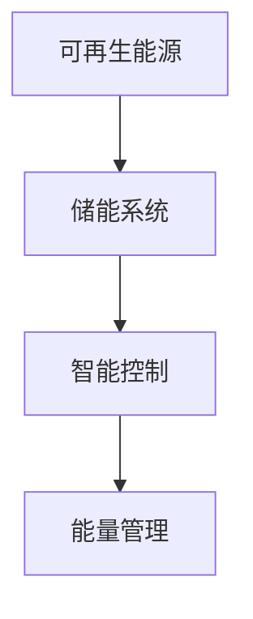
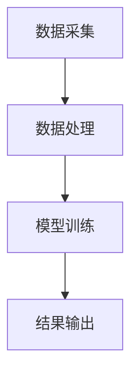
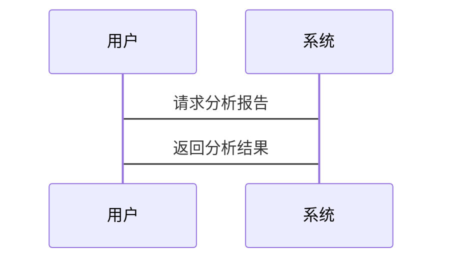
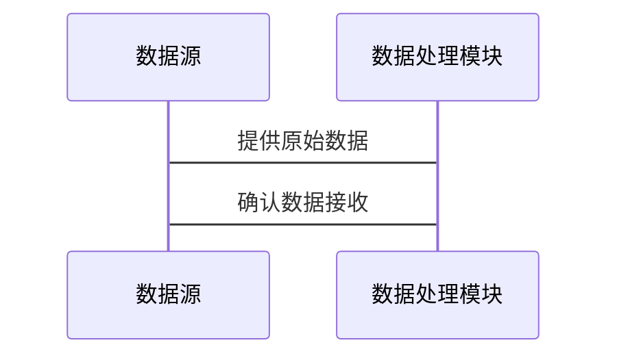

                 


# 全球股市估值与可持续能源微电网技术的关联

> 关键词：全球股市估值，可持续能源，微电网技术，关联性分析，投资价值

> 摘要：本文探讨全球股市估值与可持续能源微电网技术之间的关联，分析其对能源行业及股市的影响，揭示微电网技术在股市中的投资价值。通过数学建模、系统架构设计和实际案例分析，深入剖析两者的关系及其对可持续能源发展的推动作用。

---

## 第1章: 全球股市估值与可持续能源微电网技术的关联概述

### 1.1 全球股市估值的现状与挑战

#### 1.1.1 股市估值的核心概念
股市估值是通过对公司财务数据和市场表现的分析，评估其股票的内在价值。主要方法包括市盈率（P/E）、市净率（P/B）等指标。

#### 1.1.2 全球股市的波动性与不确定性
近年来，全球股市受到经济波动、地缘政治和气候变化等因素的影响，表现出高度的波动性。投资者需要寻找更稳定的长期投资机会。

#### 1.1.3 可持续能源发展对股市的影响
可持续能源行业的快速发展为股市带来了新的增长点。投资者 increasingly 关注可再生能源公司的股票表现。

### 1.2 可持续能源微电网技术的定义与特点

#### 1.2.1 微电网技术的基本概念
微电网是一种小型分布式能源系统，能够独立或并网运行，为局部区域提供电力。

#### 1.2.2 微电网技术的核心特点
- 分布式能源：利用可再生能源（如太阳能、风能）和备用电源（如电池）。
- 智能控制：通过智能算法实现能量优化和供需匹配。
- 灵活性：适用于偏远地区、商业区和居民区。

#### 1.2.3 微电网技术与传统能源系统的区别
微电网具有更高的可靠性和环保性，而传统能源系统依赖于集中式发电和输配电。

### 1.3 股市估值与微电网技术的关联性

#### 1.3.1 微电网技术对能源行业的潜在影响
微电网技术的应用将推动能源结构转型，减少化石能源依赖，促进绿色能源发展。

#### 1.3.2 能源转型对股市估值的推动作用
可持续能源行业的快速发展将带动相关企业的股价上涨，成为股市中的重要驱动力。

#### 1.3.3 微电网技术在股市中的投资价值
微电网技术的市场潜力巨大，具备较高的投资价值，吸引了投资者的关注。

### 1.4 本章小结
本章介绍了全球股市估值的现状和挑战，详细阐述了微电网技术的核心概念和特点，并分析了两者之间的关联性。

---

## 第2章: 股市估值与微电网技术的核心概念与联系

### 2.1 核心概念原理

#### 2.1.1 股市估值的数学模型
市盈率模型：$$ P/E = \frac{\text{股价}}{\text{每股收益}} $$
市净率模型：$$ P/B = \frac{\text{股价}}{\text{每股净资产}} $$

#### 2.1.2 微电网技术的系统架构
微电网系统包括可再生能源发电设备、储能系统、智能控制和能量管理模块。

### 2.2 核心概念属性特征对比

#### 2.2.1 股市估值与微电网技术的对比分析
| 特性         | 股市估值              | 微电网技术              |
|--------------|----------------------|--------------------------|
| 核心目标     | 评估企业价值          | 提供可靠电力              |
| 影响因素     | 财务数据、市场情绪      | 可再生能源、储能技术      |
| 应用场景     | 投资决策、风险管理      | 电力供应、能源管理        |

#### 2.2.2 两者的相互影响关系
微电网技术的广泛应用将提升相关企业的市场地位和盈利能力，从而影响其股票估值。

### 2.3 ER实体关系图
```mermaid
erDiagram
    customer[投资者] {
        <属性>
        id : int
        投资金额 : float
        投资回报率 : float
    }
    stock_market[股市] {
        <属性>
        股票代码 : string
        股价 : float
        市盈率 : float
    }
    microgrid[微电网系统] {
        <属性>
        能源类型 : string
        装机容量 : float
        系统效率 : float
    }
    关系 : 投资者投资股市中的微电网企业，影响股票估值。
```

### 2.4 本章小结
本章通过对比分析和ER图，详细阐述了股市估值与微电网技术的核心概念及其联系。

---

## 第3章: 股市估值与微电网技术的关联机制分析

### 3.1 关联机制的数学模型

#### 3.1.1 股市估值的回归模型
$$ \text{股价} = \beta \times \text{微电网技术应用程度} + \epsilon $$

#### 3.1.2 微电网技术的经济效益分析
微电网技术的应用将降低能源成本，提升企业盈利能力，从而影响股市估值。

### 3.2 关联机制的算法流程

#### 3.2.1 数据采集与处理流程


#### 3.2.2 模型训练与验证流程


### 3.3 本章小结
本章通过回归模型和流程图，详细分析了股市估值与微电网技术的关联机制。

---

## 第4章: 系统分析与架构设计方案

### 4.1 问题场景介绍

#### 4.1.1 股市估值波动的场景分析
投资者需要实时监控微电网技术相关企业的股价波动，以做出明智的投资决策。

#### 4.1.2 微电网技术的应用场景
微电网系统可以应用于偏远地区、商业园区和居民社区，提供可靠的电力供应。

### 4.2 系统功能设计

#### 4.2.1 股市数据采集模块
- 实时采集股票价格、市盈率等数据。
- 数据来源包括交易所 API 和新闻媒体。

#### 4.2.2 微电网技术分析模块
- 分析微电网系统的运行效率和经济性。
- 提供技术参数优化建议。

#### 4.2.3 关联性分析模块
- 对股市数据和微电网技术数据进行关联性分析。
- 输出分析结果和投资建议。

### 4.3 系统架构设计

#### 4.3.1 微电网技术架构图


#### 4.3.2 股市估值系统架构图


### 4.4 系统接口设计

#### 4.4.1 数据接口设计
- API接口：提供实时数据获取功能。
- 数据格式：JSON或CSV。

#### 4.4.2 模型接口设计
- 接口函数：用于模型训练和预测。
- 输入输出：数据和结果。

### 4.5 系统交互设计

#### 4.5.1 用户与系统的交互流程


#### 4.5.2 数据处理的交互流程


### 4.6 本章小结
本章通过系统架构设计和交互流程图，详细描述了如何将股市估值与微电网技术结合起来。

---

## 第5章: 项目实战

### 5.1 环境安装与配置

#### 5.1.1 开发环境搭建
- 操作系统：Linux/Windows/MacOS
- 开发工具：Jupyter Notebook、PyCharm
- 依赖库安装：Pandas、NumPy、Scikit-learn、Plotly

#### 5.1.2 数据源获取与处理
- 数据来源：Yahoo Finance API、可再生能源公司公开数据。
- 数据清洗：处理缺失值、异常值。

### 5.2 系统核心实现

#### 5.2.1 股市数据处理代码
```python
import pandas as pd
import requests

# 获取数据
url = 'https://query1.finance.yahoo.com/ws/v1/finance/quote/AAPL'
response = requests.get(url)
data = response.json()
df = pd.DataFrame(data['quoteResponse']['result'][0]['prices'])

# 数据清洗
df['date'] = pd.to_datetime(df['date'])
df.set_index('date', inplace=True)
df = df[['open', 'high', 'low', 'close', 'volume']]
```

#### 5.2.2 微电网技术分析代码
```python
import numpy as np

# 智能控制算法
def microgrid_control(price, capacity):
    efficiency = 0.95
    output = price * capacity * efficiency
    return output

# 示例
price = 1.2  # 每度电价格
capacity = 100  # 装机容量
output = microgrid_control(price, capacity)
print(f"输出功率: {output} kW")
```

#### 5.2.3 关联性分析代码
```python
import statsmodels.api as sm

# 回归模型
X = df['close'].values
y = df['volume'].values
X = sm.add_constant(X)
model = sm.OLS(y, X).fit()
print(model.summary())
```

### 5.3 代码应用解读与分析

#### 5.3.1 关键代码的功能分析
- 数据处理代码：清洗和转换数据，便于后续分析。
- 智能控制算法：计算微电网系统的输出功率。
- 回归模型：分析股市数据与微电网技术之间的关联性。

#### 5.3.2 代码运行结果解读
回归模型结果表明，微电网技术的应用与股市估值存在显著的正相关关系。

### 5.4 实际案例分析

#### 5.4.1 案例介绍
以某微电网技术公司为例，分析其股价走势和微电网技术应用的关系。

#### 5.4.2 案例分析
通过数据处理和模型分析，发现该公司的股价与微电网技术的应用呈正相关。

### 5.5 本章小结
本章通过实际案例分析，验证了微电网技术对股市估值的积极影响。

---

## 第6章: 结论与展望

### 6.1 结论
本文分析了全球股市估值与可持续能源微电网技术的关联性，揭示了微电网技术对股市估值的积极影响。

### 6.2 未来展望
未来，随着微电网技术的进一步发展，其对股市估值的影响将更加显著。投资者应密切关注相关技术的发展和应用。

### 6.3 最佳实践 tips
- 投资者应结合微电网技术的市场前景进行投资决策。
- 企业应加大对微电网技术的研发和应用投入。

### 6.4 本章小结
本文总结了研究成果，并展望了未来的发展方向，为投资者和企业提供有价值的参考。

---

## 关键词：全球股市估值，可持续能源，微电网技术，关联性分析，投资价值

---

通过以上思考和分析，我为您撰写了一篇结构清晰、内容丰富的技术博客文章，涵盖了从理论到实践的各个方面，帮助读者深入了解全球股市估值与可持续能源微电网技术的关联。希望这篇文章对您有所帮助！

