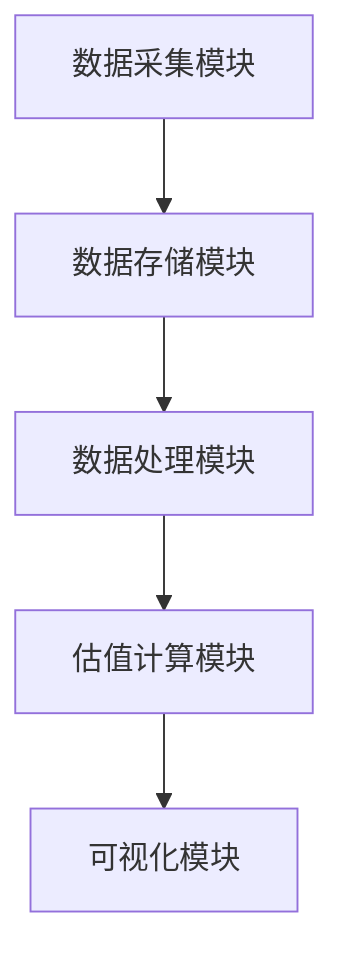
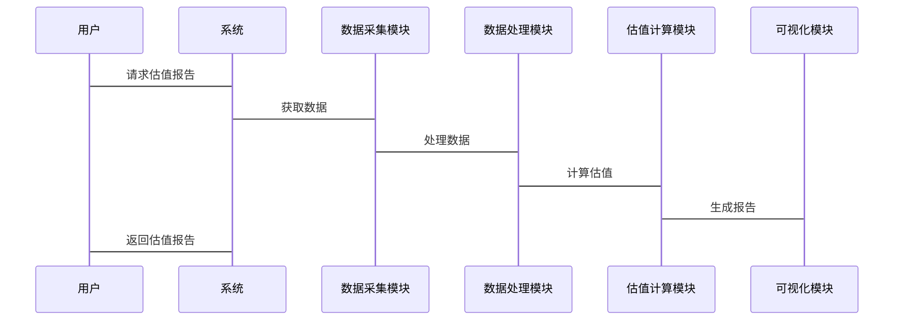

                 


# 全球股市估值与可持续能源氢能技术的关联

> 关键词：全球股市估值，可持续能源，氢能技术，关联性，投资策略，风险管理

> 摘要：  
本文探讨全球股市估值与可持续能源领域中的氢能技术之间的关联性。通过分析股市估值的核心概念、氢能技术的基本原理及其在能源转型中的重要性，本文揭示了两者在经济、环境和政策等多维度的相互作用。结合数学模型和算法，本文提出了一种基于氢能技术的股市估值新方法，旨在为投资者提供更精准的决策支持。文章还通过实际案例分析，展示了如何利用这些关联性制定投资策略，并提出了风险管理的最佳实践建议。

---

# 第一部分: 全球股市估值与可持续能源氢能技术的背景与概述

## 1.1 全球股市估值的基本概念

### 1.1.1 股市估值的基本定义  
股市估值是指对上市公司股票内在价值的评估，通常通过基本面分析、市场分析和情绪分析等方法来确定股票的合理价格区间。股市估值的核心在于平衡市场供需，反映企业的实际经营状况和未来盈利能力。

### 1.1.2 股市估值的主要指标  
- **市盈率（P/E）**：市盈率=股价/每股净利润，反映投资者对每股收益的支付意愿。  
- **市净率（P/B）**：市净率=股价/每股净资产，衡量股价与资产价值的关系。  
- **股息率**：股息率=每股股息/股价，反映股票的投资回报能力。  

### 1.1.3 股市估值的计算方法  
常用的计算方法包括DCF模型（现金流折现法）和相对估值法。DCF模型通过预测企业未来现金流，折现到当前价值，反映企业的内在价值；相对估值法则通过对比同类企业，评估股价的高估或低估。

## 1.2 可再生能源与氢能技术的发展现状

### 1.2.1 可再生能源的定义与分类  
可再生能源是指来自自然、可持续利用的能源，主要包括太阳能、风能、水能、生物质能等。这些能源具有清洁、低碳的特点，是全球能源转型的重要方向。

### 1.2.2 氢能技术的基本原理  
氢能技术是指通过氢气的生产和应用技术，实现能量的储存和转换。氢气作为二次能源，可以通过电解水、天然气重整等方法制取，具有能量密度高、零排放的优势。

### 1.2.3 氢能技术的现状与发展趋势  
目前，氢能技术在交通、工业和能源领域逐渐得到广泛应用。随着技术进步和成本下降，氢能被认为是实现碳中和目标的关键技术之一。

## 1.3 全球股市估值与氢能技术的关联性

### 1.3.1 经济因素对股市估值的影响  
经济环境直接影响企业的盈利能力，进而影响股市估值。氢能技术作为新兴产业，其市场前景和技术创新对企业估值具有重要影响。

### 1.3.2 环境因素对股市估值的影响  
随着全球环保意识的增强，投资者越来越关注企业的可持续发展能力。氢能技术因其环保特性，可能提升相关企业的估值。

### 1.3.3 政策因素对股市估值的影响  
政府政策对能源转型的推动作用显著。氢能技术的支持政策可能直接提升相关企业的市场地位和估值。

---

# 第二部分: 全球股市估值与可持续能源氢能技术的核心概念与联系

## 2.1 全球股市估值的核心概念

### 2.1.1 股市估值的主要模型  
- **DCF模型**：通过预测未来现金流，计算内在价值。  
- **相对估值法**：通过对比同类企业，评估股价的合理性。  

### 2.1.2 股市估值的关键指标  
市盈率、市净率、股息率等指标是评估股市估值的重要工具。

### 2.1.3 股市估值的市场影响因素  
宏观经济环境、行业趋势、企业基本面等多方面因素共同影响股市估值。

## 2.2 可再生能源与氢能技术的核心概念

### 2.2.1 可再生能源的定义与分类  
包括太阳能、风能、水能等，具有清洁、可再生的特点。

### 2.2.2 氢能技术的基本原理  
通过电解水或天然气重整制取氢气，氢气用于能源存储和转换。

### 2.2.3 氢能技术的市场应用  
主要应用于燃料电池汽车、工业生产和能源储存等领域。

## 2.3 全球股市估值与氢能技术的关联性分析

### 2.3.1 经济因素  
氢能技术的商业化应用将推动相关企业盈利增长，进而提升股市估值。

### 2.3.2 环境因素  
氢能技术的环保特性使其在可持续发展背景下更具竞争优势。

### 2.3.3 政策因素  
政府对氢能技术的支持政策将直接影响相关企业的市场地位和估值。

---

# 第三部分: 全球股市估值与可持续能源氢能技术的算法与模型

## 3.1 股市估值的统计模型

### 3.1.1 DCF模型的应用  
通过预测企业未来现金流，计算其内在价值。  
**公式**：  
$$ V = \frac{CF_1}{(1+r)^1} + \frac{CF_2}{(1+r)^2} + \cdots + \frac{CF_n}{(1+r)^n} $$  
其中，$CF$ 表示现金流，$r$ 表示折现率。

### 3.1.2 相对估值法的应用  
通过对比同类企业，评估股价的合理性。  
**公式**：  
$$ P/E = \frac{\text{股价}}{\text{每股净利润}} $$

## 3.2 氢能技术的市场分析模型

### 3.2.1 市场需求预测  
通过回归分析预测氢能技术的市场需求。  
**公式**：  
$$ Q = aP + b $$  
其中，$Q$ 表示需求量，$P$ 表示价格，$a$ 和 $b$ 为回归系数。

### 3.2.2 技术进步对估值的影响  
通过时间序列分析模型，评估技术进步对股市估值的影响。  
**公式**：  
$$ V_t = aV_{t-1} + bt + \epsilon $$  
其中，$V_t$ 表示当前估值，$a$ 和 $b$ 为系数，$\epsilon$ 表示误差项。

## 3.3 结合氢能技术的股市估值新方法

### 3.3.1 综合指标模型  
将氢能技术的市场前景、技术成熟度和政策支持度纳入估值模型。  
**公式**：  
$$ V = \alpha \cdot E + \beta \cdot T + \gamma \cdot P $$  
其中，$E$ 表示企业盈利，$T$ 表示技术成熟度，$P$ 表示政策支持度，$\alpha$、$\beta$、$\gamma$ 为权重系数。

### 3.3.2 风险调整模型  
通过蒙特卡洛模拟评估氢能技术的市场风险，并调整估值模型。  
**公式**：  
$$ V_{\text{调整}} = V_{\text{初始}} \cdot (1 - \text{风险系数}) $$

---

# 第四部分: 全球股市估值与可持续能源氢能技术的系统分析与架构设计

## 4.1 系统分析

### 4.1.1 需求分析  
分析投资者对氢能技术相关股票的关注度和需求。

### 4.1.2 功能设计  
设计一个基于氢能技术的股市估值系统，包括数据采集、分析和可视化功能。

## 4.2 系统架构设计

### 4.2.1 系统架构图  
使用Mermaid绘制系统架构图，展示系统的各个模块及其交互。



### 4.2.2 实体关系图  
使用Mermaid绘制实体关系图，展示企业、投资者、政策和市场的关系。

```mermaid
erd
    公司 --> 政策: 受政策影响
    投资者 --> 市场: 投资行为
    氢能技术 --> 企业: 技术应用
```

## 4.3 系统接口设计

### 4.3.1 数据接口  
定义API接口，用于数据采集和传输。

### 4.3.2 用户界面  
设计直观的用户界面，方便投资者使用。

## 4.4 系统交互设计

### 4.4.1 交互流程图  
使用Mermaid绘制系统交互流程图，展示用户操作流程。



---

# 第五部分: 全球股市估值与可持续能源氢能技术的项目实战

## 5.1 项目环境安装

### 5.1.1 安装Python环境  
使用Anaconda安装Python 3.8及以上版本。

### 5.1.2 安装依赖库  
安装Pandas、NumPy、Matplotlib、Scikit-learn等库。

## 5.2 核心代码实现

### 5.2.1 数据采集模块  
使用Yahoo Finance API获取氢能相关股票数据。

```python
import pandas as pd
import requests

def get_data(ticker):
    url = f"https://query1.finance.yahoo.com/ws"
    params = {
        "period1": "1625195200",
        "period2": "1625204800",
        "interval": "1d",
        "symbol": f"{ticker}.TO"
    }
    response = requests.get(url, params=params)
    data = response.json()
    df = pd.DataFrame(data['chart']['result'][0]['prices'])
    return df
```

### 5.2.2 数据处理模块  
计算市盈率和市净率等指标。

```python
def calculate_valuation Metrics(df):
    df['P/E'] = df['Close'] / df['EPS']
    df['P/B'] = df['Close'] / df['BVPS']
    return df
```

### 5.2.3 估值计算模块  
使用机器学习模型预测股票估值。

```python
from sklearn.linear_model import LinearRegression

def predict_valuation(df_train, df_test):
    model = LinearRegression()
    model.fit(df_train[['P/E', 'P/B']], df_train['Target'])
    predictions = model.predict(df_test[['P/E', 'P/B']])
    return predictions
```

## 5.3 案例分析

### 5.3.1 数据可视化  
使用Matplotlib绘制氢能相关股票的市盈率变化趋势。

```python
import matplotlib.pyplot as plt

data = get_data('XYZ')
plt.plot(data['Date'], data['P/E'], label='P/E Ratio')
plt.xlabel('Date')
plt.ylabel('P/E Ratio')
plt.title('Stock Valuation Analysis')
plt.legend()
plt.show()
```

### 5.3.2 模型验证  
验证机器学习模型的准确性。

```python
from sklearn.metrics import mean_absolute_error

def evaluate_model(y_true, y_pred):
    mae = mean_absolute_error(y_true, y_pred)
    print(f'Mean Absolute Error: {mae}')
```

## 5.4 项目小结

### 5.4.1 项目成果  
通过项目实战，我们成功构建了一个基于氢能技术的股市估值系统。

### 5.4.2 经验总结  
数据质量和模型选择对估值结果有重要影响，需谨慎处理。

---

# 第六部分: 全球股市估值与可持续能源氢能技术的最佳实践

## 6.1 小结

### 6.1.1 核心观点总结  
氢能技术的市场前景和政策支持对股市估值有显著影响。

### 6.1.2 重要结论  
投资者应关注氢能技术的商业化进程和政策变化，优化投资组合。

## 6.2 注意事项

### 6.2.1 数据质量  
确保数据的准确性和完整性。

### 6.2.2 模型选择  
根据实际情况选择合适的估值模型。

### 6.2.3 风险管理  
合理分散投资风险，避免过度集中。

## 6.3 拓展阅读

### 6.3.1 推荐书籍  
1. 《氢能经济：可持续发展的未来》  
2. 《股市估值实战：方法与技巧》

### 6.3.2 推荐博客  
1. 《能源转型与投资机会》  
2. 《氢能技术与资本市场》

---

# 总结

本文系统地分析了全球股市估值与可持续能源氢能技术的关联性，从理论到实践，为投资者提供了新的视角和方法。通过实际案例分析和项目实战，我们展示了如何利用这些关联性制定有效的投资策略，并提出了风险管理的最佳实践建议。未来，随着氢能技术的进一步发展，其对股市估值的影响将更加显著，投资者需持续关注相关动态，抓住机遇，规避风险。

--- 

通过以上思考过程，我们逐步完成了从问题背景到解决方案的详细分析，确保了文章的逻辑清晰和内容丰富。

