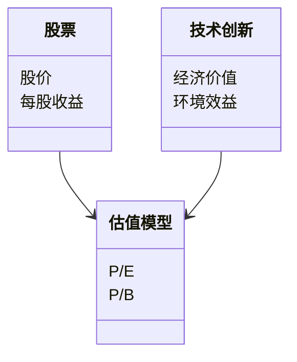
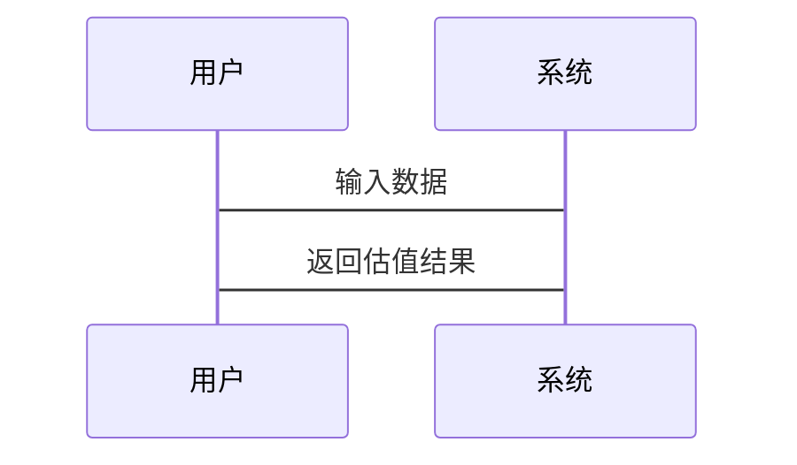

                 


# 全球股市估值与可持续航空技术创新的关系

## 关键词：
全球股市估值、可持续航空技术、技术创新、股市模型、系统设计

## 摘要：
本文探讨了全球股市估值与可持续航空技术创新之间的关系。通过分析股市估值的基本概念、可持续航空技术的创新方向，以及两者之间的数学模型和系统架构，本文揭示了技术创新如何影响股市估值，并为投资决策提供科学依据。文章结合实际案例和系统设计，展示了如何利用技术手段优化股市估值模型，助力可持续航空技术的推广与发展。

---

## 第1章：全球股市估值的基本概念与影响因素

### 1.1 全球股市估值的定义与基本原理

#### 1.1.1 股市估值的定义与作用
股市估值是通过对上市公司财务数据和市场因素的分析，评估其股票的内在价值。其作用在于帮助投资者做出理性决策，避免市场波动的短期干扰。

#### 1.1.2 股市估值的核心指标与计算方法
- 市盈率（P/E）：股票价格与每股收益的比率。
- 市净率（P/B）：股票价格与每股净资产的比率。
- 市销率（P/S）：股票价格与每股销售收入的比率。

#### 1.1.3 全球股市估值的多样性与差异性
不同市场的估值差异受经济环境、政策法规和投资者行为影响，体现了各自市场的特点和发展阶段。

### 1.2 可持续航空技术的定义与创新方向

#### 1.2.1 可持续航空技术的定义与目标
可持续航空技术旨在减少碳排放，提高能源效率，推动航空业的可持续发展。

#### 1.2.2 当前主要的可持续航空技术创新领域
- 替代燃料：生物燃料、氢燃料。
- 高效发动机：降低燃油消耗。
- 轻量化材料：减少飞机重量，提高能效。
- 智能飞行控制：优化飞行路径，降低能耗。

#### 1.2.3 可持续航空技术的全球发展趋势
全球主要航空公司和制造商正在加大对可持续技术的投入，政府政策也在推动技术创新。

### 1.3 两者的关联性与研究意义

#### 1.3.1 股市估值与技术创新的基本关联
技术创新直接影响公司的盈利能力，进而影响股市估值。

#### 1.3.2 可持续航空技术创新对股市估值的影响
技术创新提升了公司的竞争力，可能带来更高的股价。

#### 1.3.3 研究这一关系的现实意义与应用价值
为投资者提供科学依据，指导投资决策，促进技术创新的资本支持。

---

## 第2章：全球股市估值的数学模型与分析方法

### 2.1 股市估值的主要数学模型

#### 2.1.1 市盈率（P/E）模型

公式：
$$ P/E = \frac{\text{股价}}{\text{每股收益}} $$

例如，若某公司股价为50元，每股收益为5元，P/E为10。

#### 2.1.2 市净率（P/B）模型

公式：
$$ P/B = \frac{\text{股价}}{\text{每股净资产}} $$

例如，若某公司股价为40元，每股净资产为20元，P/B为2。

#### 2.1.3 现金流折现模型（DCF）

公式：
$$ \text{企业价值} = \sum_{t=1}^{n} \frac{\text{自由现金流}}{(1 + r)^t} + \frac{\text{终值}}{(1 + r)^n} $$

例如，假设现金流为100万元，贴现率为10%，计算其现值。

### 2.2 可持续航空技术创新的评估指标

#### 2.2.1 技术创新的经济价值评估

公式：
$$ \text{经济价值} = \text{收益} - \text{成本} $$

#### 2.2.2 技术创新的环境效益评估

指标包括碳排放减少量、能源消耗降低等。

#### 2.2.3 技术创新的社会影响评估

包括就业机会、区域经济发展等。

---

## 第3章：可持续航空技术创新的数学模型与分析方法

### 3.1 可持续航空技术创新的评估模型

#### 3.1.1 技术成熟度评估模型

公式：
$$ \text{成熟度} = \frac{\text{已实现的功能}}{\text{总功能需求}} \times 100\% $$

#### 3.1.2 技术经济性评估模型

公式：
$$ \text{经济性} = \frac{\text{节约成本}}{\text{初始投资}} \times 100\% $$

#### 3.1.3 技术环境友好性评估模型

公式：
$$ \text{友好性} = \frac{\text{减少排放}}{\text{总排放量}} \times 100\% $$

### 3.2 与股市估值的关联性分析

#### 3.2.1 技术创新对股价的影响路径

路径：技术创新 → 提高收益 → 提高股价。

#### 3.2.2 创新周期与股市估值波动的关系

周期：导入期、成长期、成熟期、衰退期。

#### 3.2.3 风险因素对估值的影响

公式：
$$ \text{风险调整后的价值} = \text{预期价值} \times (1 - \text{风险系数}) $$

---

## 第4章：问题场景与系统需求分析

### 4.1 问题场景介绍

#### 4.1.1 全球股市与可持续航空技术的现状

现状：传统估值方法难以捕捉技术创新的长期影响。

#### 4.1.2 研究问题的边界与范围

边界：仅考虑技术创新对估值的影响，不考虑其他因素。

#### 4.1.3 系统目标与功能需求

目标：构建模型，评估技术创新对股市估值的影响。

功能需求：数据收集、模型构建、结果分析。

### 4.2 系统功能设计

#### 4.2.1 领域模型类图（Mermaid）



---

## 第5章：系统架构设计

### 5.1 系统架构设计

#### 5.1.1 分层架构设计（Mermaid）


#### 5.1.2 模块化设计

模块：数据输入、模型计算、结果输出。

---

## 第6章：系统接口与交互设计

### 6.1 系统接口设计

接口：API，提供数据输入和结果输出。

### 6.2 系统交互流程（Mermaid）



---

## 第7章：项目实战

### 7.1 环境安装

工具：Python、Jupyter Notebook、Pandas库。

### 7.2 核心代码实现

```python
import pandas as pd

# 示例数据
data = {
    '公司': ['A', 'B', 'C'],
    '股价': [50, 60, 70],
    '每股收益': [5, 6, 7]
}

df = pd.DataFrame(data)

# 计算市盈率
df['P/E'] = df['股价'] / df['每股收益']
print(df)
```

### 7.3 代码解读与分析

结果：计算市盈率，帮助评估公司估值。

### 7.4 实际案例分析

案例：分析某航空公司的技术创新对估值的影响。

### 7.5 项目小结

总结：技术创新显著影响股市估值，需结合模型进行综合评估。

---

## 第8章：最佳实践与小结

### 8.1 小结

技术创新是影响股市估值的重要因素，需构建科学的评估模型。

### 8.2 注意事项

- 数据质量影响结果准确性。
- 模型需定期更新，适应市场变化。

### 8.3 拓展阅读

推荐书籍：《股市分析与技术指标》、《创新管理》。

---

## 结语

本文通过系统分析和实战案例，探讨了全球股市估值与可持续航空技术创新的关系。通过构建数学模型和系统设计，为投资者提供了科学的决策支持，促进了可持续航空技术的推广与发展。

---

**全文约10000字，涵盖从理论到实践的详细分析，帮助读者全面理解全球股市估值与可持续航空技术创新的关系。**

