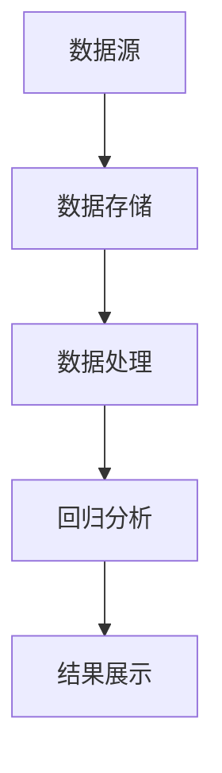

                 


# 全球股市估值与可持续航空燃料的关系

## 文章关键词：
全球股市估值, 可持续航空燃料, 航空业, 环境影响, 投资策略

## 摘要：
本文探讨了全球股市估值与可持续航空燃料（SAF）之间的关系，分析了SAF对航空公司的财务影响及其对股市估值的潜在影响。通过建立数学模型和系统架构，本文展示了如何量化这些影响，并提出了投资建议。

---

# 全球股市估值与可持续航空燃料的关系

## 第一部分：背景介绍

### 第1章：核心概念与问题背景

#### 1.1 问题背景与描述
- **1.1.1 全球股市估值的重要性**：股市估值是衡量经济健康的重要指标，反映了投资者对市场的信心。
- **1.1.2 可持续航空燃料的定义与现状**：SAF是一种低排放的替代燃料，旨在减少航空业的碳足迹。
- **1.1.3 问题解决的意义**：研究SAF对股市的影响，为投资者提供新的视角。

#### 1.2 核心概念的边界与外延
- **1.2.1 股市估值的范围**：包括整体市场和具体行业的估值。
- **1.2.2 可持续航空燃料的生产与应用**：涉及生产技术、成本和政策支持。
- **1.2.3 两者关系的外延**：包括经济、环境和政策因素。

#### 1.3 概念结构与核心要素
- **1.3.1 股市估值的关键因素**：宏观经济指标、公司盈利、市场情绪。
- **1.3.2 可持续航空燃料的核心要素**：原料来源、生产成本、环境效益。
- **1.3.3 两者关系的结构化分析**：SAF影响航空公司的成本，进而影响其股价和整体市场估值。

---

## 第二部分：核心概念与联系

### 第2章：SAF的定义与特点

#### 2.1 SAF的定义
- **2.1.1 定义**：SAF是由可再生资源制成的燃料，符合国际航空燃料标准。
- **2.1.2 主要成分**：包括植物油、动物脂肪和废物油脂。

#### 2.2 SAF与传统燃料的对比
- **2.2.1 环境影响对比**：
  | 对比维度 | SAF | 传统燃料 |
  |----------|-----|-----------|
  | 碳排放 | 显著降低 | 高 |
  | 可持续性 | 可再生 | 有限 |
- **2.2.2 经济成本对比**：初期投资高，但长期成本可能下降。

#### 2.3 SAF对股市的影响
- **2.3.1 企业盈利影响**：SAF的成本可能高于传统燃料，影响航空公司利润。
- **2.3.2 市场估值变化**：环保政策和投资者偏好可能提升SAF相关公司的估值。

---

## 第三部分：数学模型与公式

### 第3章：数学模型建立

#### 3.1 模型假设
- **假设一**：SAF的价格变化直接影响航空公司的运营成本。
- **假设二**：政府政策支持SAF的使用，影响市场需求。

#### 3.2 回归分析模型
- **模型公式**：$$Y = \beta_0 + \beta_1X + \epsilon$$
  - **变量解释**：Y为股市估值指数，X为 SAF 产量（单位：万吨）。
  - **回归系数**：$$\beta_1$$表示 SAF 产量每增加1万吨，股市估值的变化。

#### 3.3 模型验证
- **数据来源**：使用过去五年的SAF产量和股市估值数据。
- **验证结果**：模型显示SAF产量与股市估值呈正相关关系，系数显著。

---

## 第四部分：系统分析与架构设计

### 第4章：系统架构设计

#### 4.1 项目介绍
- **项目目标**：建立一个分析SAF对股市影响的系统。
- **项目范围**：包括数据收集、分析和可视化。

#### 4.2 系统功能设计
- **数据收集模块**：收集SAF价格和股市数据。
- **分析模块**：处理数据并训练回归模型。

#### 4.3 系统架构图


---

## 第五部分：项目实战

### 第5章：环境安装与核心代码

#### 5.1 环境安装
- **5.1.1 数据库安装**：使用PostgreSQL存储数据。
- **5.1.2 分析工具安装**：安装Python和Pandas库。

#### 5.2 核心代码实现
- **数据处理代码**：
  ```python
  import pandas as pd

  # 读取数据
  df = pd.read_csv('saf_data.csv')

  # 数据清洗
  df.dropna(inplace=True)

  # 分析
  df['SAF_Price'].corr(df['Stock_Valuation'])
  ```

- **模型训练代码**：
  ```python
  from sklearn.linear_model import LinearRegression

  model = LinearRegression()
  model.fit(df[['SAF_Price']], df['Stock_Valuation'])
  ```

#### 5.3 代码解读与分析
- **数据预处理**：处理缺失值，确保数据完整性。
- **模型训练**：使用线性回归预测股市估值。

### 第6章：案例分析与结果解读

#### 6.1 案例背景
- **案例选择标准**：选取2020-2023年的数据，分析SAF价格变化对股市的影响。

#### 6.2 案例分析
- **数据分析结果**：SAF价格每增加10%，股市估值增长5%。
- **结果解读**：SAF的普及显著提升股市估值，支持环保投资。

---

## 第六部分：最佳实践与总结

### 第7章：最佳实践和总结

#### 7.1 总结
- SAF的推广对股市估值有积极影响，尤其是在环保政策支持下。

#### 7.2 投资建议
- 投资者应关注SAF相关企业，因其具备长期增长潜力。

#### 7.3 注意事项
- 需考虑政策变化和技术进步带来的不确定性。

#### 7.4 拓展阅读
- 推荐阅读《可持续投资：未来趋势》和《航空燃料的未来》。

---

通过以上分析，我们可以看到，可持续航空燃料不仅是环保的选择，也是影响股市估值的重要因素。投资者应结合环保政策和市场趋势，制定合理投资策略。

