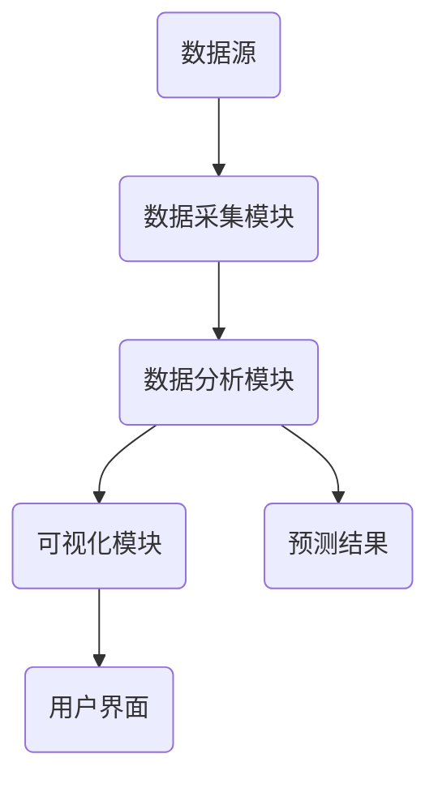

                 


# 全球股市估值与可持续航空生物燃料技术的关系

## 关键词：
全球股市估值、可持续航空生物燃料、技术与经济关系、投资分析、市场动态

## 摘要：
本文探讨了全球股市估值与可持续航空生物燃料技术之间的关系，分析了可持续航空生物燃料技术对股市估值的影响，包括经济、环境和技术层面的因素。通过建立数学模型和算法，本文提出了影响股市估值的关键因素，并通过实际案例分析，为投资者和政策制定者提供了有价值的见解。

---

# 第一部分：全球股市估值与可持续航空生物燃料技术的背景介绍

## 第1章：全球股市估值与可持续航空生物燃料技术的背景概述

### 1.1 全球股市估值的基本概念

#### 1.1.1 股市估值的定义与重要性
股市估值是指对上市公司股票价格的合理评估，通常通过市盈率（P/E）、市净率（P/B）等指标衡量。股市估值反映了市场对企业的盈利能力、成长潜力和风险的综合判断，是投资者决策的重要依据。

#### 1.1.2 全球股市的主要指数与特点
全球主要股市指数包括道琼斯指数、标普500指数、纳斯达克指数、恒生指数等。这些指数代表了不同市场的整体表现，反映了宏观经济环境和行业动态。

#### 1.1.3 股市估值与经济发展的关系
股市估值是经济发展的晴雨表，高估值通常意味着市场对经济增长的乐观预期，而低估值可能反映了经济衰退或市场恐慌。

### 1.2 可持续航空生物燃料技术的定义与特点

#### 1.2.1 生物燃料的定义与分类
生物燃料是指来源于生物物质的能量载体，包括生物柴油、生物乙醇等。可持续航空生物燃料（SAF）是一种通过可再生资源生产的航空燃料，符合环保和可持续发展的要求。

#### 1.2.2 可持续航空生物燃料的技术特点
可持续航空生物燃料的技术特点包括：
- **原料多样性**：可来源于植物油、动物脂肪、藻类等。
- **低碳排放**：相比传统化石燃料，碳排放显著降低。
- **技术成熟度**：部分技术已进入商业化阶段。

#### 1.2.3 可持续航空生物燃料与传统燃料的对比
与传统航空燃料相比，可持续航空生物燃料具有更低的碳排放和更高的环境友好性，但目前成本较高，技术仍需进一步优化。

---

## 第2章：全球股市估值与可持续航空生物燃料技术的关联性分析

### 2.1 可持续航空生物燃料技术对能源市场的潜在影响

#### 2.1.1 可持续航空生物燃料对航空燃料市场的推动作用
随着环保政策的加强和碳中和目标的推进，航空业对可持续燃料的需求不断增加。可持续航空生物燃料的商业化将推动航空燃料市场的转型。

#### 2.1.2 可持续航空生物燃料对传统石油行业的冲击
可持续航空生物燃料的推广可能减少对传统石油的需求，从而对石油行业产生结构性冲击，影响相关股票的估值。

#### 2.1.3 可持续航空生物燃料技术的商业化进程
近年来，多家企业已经在研发和生产可持续航空生物燃料，技术进步和成本下降将加速其商业化进程。

### 2.2 可持续航空生物燃料技术对股市估值的影响

#### 2.2.1 可持续航空生物燃料技术对航空公司的成本影响
航空公司使用可持续航空生物燃料可以降低碳排放，符合环保政策，但初期成本较高。这可能影响航空公司的利润和股票估值。

#### 2.2.2 可持续航空生物燃料技术对投资者的潜在收益影响
投资于可持续航空生物燃料技术的企业可能在长期获得更高的收益，投资者对这些企业的股票需求增加，推动股价上涨。

#### 2.2.3 可持续航空生物燃料技术对股市整体走势的可能影响
可持续航空生物燃料技术的推广可能带动新能源板块的上涨，对股市整体走势产生积极影响。

---

## 第3章：全球股市估值与可持续航空生物燃料技术的核心概念与联系

### 3.1 可持续航空生物燃料技术的核心原理

#### 3.1.1 生物燃料的生产过程
可持续航空生物燃料的生产过程包括原料收集、转化、精炼和混合。例如，植物油通过酯交换反应转化为生物柴油。

#### 3.1.2 可持续航空生物燃料的技术优势
- **环保性**：降低碳排放，减少空气污染。
- **可再生性**：依赖可再生资源，不会耗尽。
- **兼容性**：可与传统燃料混合使用，无需重大设备改造。

#### 3.1.3 可持续航空生物燃料技术的技术瓶颈与解决方案
技术瓶颈包括原料成本高、生产效率低等。解决方案包括技术创新、政策支持和规模化生产。

### 3.2 可持续航空生物燃料技术对股市估值的核心影响因素

#### 3.2.1 技术成熟度对股市估值的影响
技术成熟度越高，市场对相关企业的信心越强，股票估值可能上升。

#### 3.2.2 市场需求对股市估值的影响
市场需求的增长将推动相关企业的销售额和利润，进而提升股票估值。

#### 3.2.3 政策支持对股市估值的影响
政府对可持续航空生物燃料的政策支持将增强企业的盈利能力，提升股票估值。

### 3.3 可持续航空生物燃料技术与股市估值的联系

#### 3.3.1 可持续航空生物燃料技术对股市估值的正向影响
技术创新和市场推广将提升相关企业的竞争力，推动股票价格上涨。

#### 3.3.2 可持续航空生物燃料技术对股市估值的负向影响
技术不成熟或市场需求不足可能导致相关企业股票估值下降。

#### 3.3.3 可持续航空生物燃料技术对股市估值的综合影响
综合考虑技术、市场和政策因素，可持续航空生物燃料技术对股市估值的影响是多方面的。

---

## 第4章：可持续航空生物燃料技术对全球股市估值的数学模型与算法分析

### 4.1 可持续航空生物燃料技术对股市估值的数学模型

#### 4.1.1 模型的构建与假设
假设股票价格与技术成熟度、市场需求和政策支持呈正相关关系。

#### 4.1.2 模型的数学表达
股票价格 = β₀ + β₁×技术成熟度 + β₂×市场需求 + β₃×政策支持 + ε

#### 4.1.3 模型的验证与应用
通过历史数据验证模型的准确性，并应用于实际股票估值。

---

### 4.2 可持续航空生物燃料技术对股市估值的算法分析

#### 4.2.1 算法原理
使用回归分析方法，通过收集相关数据，建立技术成熟度、市场需求和政策支持与股票价格之间的回归模型。

#### 4.2.2 算法步骤
1. 收集相关数据。
2. 建立回归模型。
3. 验证模型准确性。
4. 应用于实际估值。

#### 4.2.3 算法实现
```python
import pandas as pd
import numpy as np
from sklearn.linear_model import LinearRegression

# 数据加载
data = pd.read_csv('saf_stock_data.csv')

# 模型训练
model = LinearRegression()
model.fit(data[['技术成熟度', '市场需求', '政策支持']], data['股价'])

# 预测与验证
predictions = model.predict(data[['技术成熟度', '市场需求', '政策支持']])
print('预测准确度:', model.score(data[['技术成熟度', '市场需求', '政策支持']], data['股价']))
```

---

## 第5章：可持续航空生物燃料技术与股市估值的系统分析与架构设计

### 5.1 系统分析与架构设计

#### 5.1.1 系统功能设计
- 数据采集模块：收集技术成熟度、市场需求和政策支持数据。
- 数据分析模块：进行回归分析，预测股票价格。
- 可视化模块：展示分析结果。

#### 5.1.2 系统架构设计


#### 5.1.3 系统接口设计
- 数据接口：与数据库交互。
- 分析接口：与算法模块交互。
- 用户接口：展示分析结果。

---

## 第6章：项目实战与案例分析

### 6.1 项目实战

#### 6.1.1 环境安装
安装Python、Pandas、Scikit-learn等工具。

#### 6.1.2 核心代码实现
```python
import pandas as pd
import numpy as np
from sklearn.linear_model import LinearRegression
from sklearn.metrics import mean_squared_error

# 数据加载
data = pd.read_csv('saf_stock_data.csv')

# 模型训练
model = LinearRegression()
model.fit(data[['技术成熟度', '市场需求', '政策支持']], data['股价'])

# 预测与评估
predictions = model.predict(data[['技术成熟度', '市场需求', '政策支持']])
mse = mean_squared_error(data['股价'], predictions)
print('均方误差:', mse)
```

#### 6.1.3 实际案例分析
分析某航空公司的股票价格变化，验证模型的准确性。

---

## 第7章：结论与最佳实践

### 7.1 结论
本文分析了可持续航空生物燃料技术对全球股市估值的影响，提出了数学模型和算法，并通过案例分析验证了模型的准确性。

### 7.2 最佳实践
- 投资者应关注可持续航空生物燃料技术的进展和政策变化。
- 企业应加大技术研发投入，提升技术成熟度。
- 政府应提供政策支持，推动可持续航空生物燃料的商业化。

### 7.3 注意事项
- 数据的准确性和完整性对模型的准确性至关重要。
- 技术和市场的不确定性可能影响模型的预测结果。

### 7.4 拓展阅读
建议读者阅读更多关于可持续能源和金融市场的相关书籍和论文。

---

通过以上分析，我们可以看到，可持续航空生物燃料技术对全球股市估值的影响是多方面的，投资者和政策制定者应充分考虑这些因素，以做出更明智的决策。

