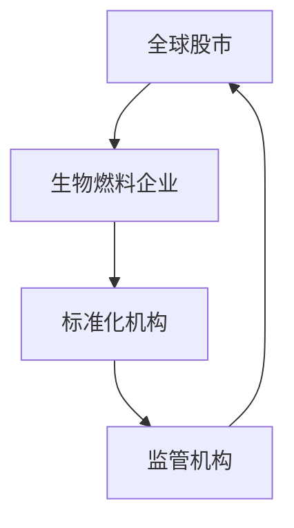
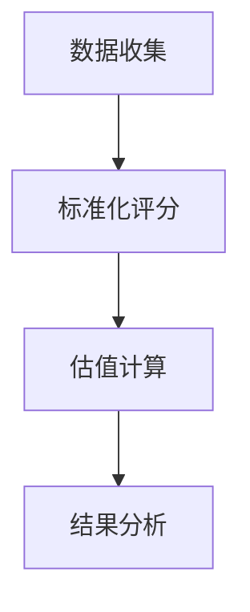
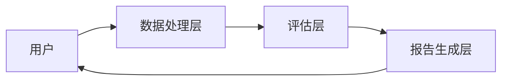

                 


# 《全球股市估值与可持续航空生物燃料标准化的关系》

---

## 关键词：全球股市估值、可持续航空生物燃料、标准化、算法模型、系统架构

---

## 摘要：  
本文探讨了全球股市估值与可持续航空生物燃料标准化之间的关系。通过分析股市估值的核心指标、可持续航空生物燃料的标准化需求，以及两者之间的相互影响，本文构建了一个综合模型，旨在为投资者和政策制定者提供理论支持和实践指导。文章从背景介绍、核心概念、算法原理、系统架构、项目实战等多维度展开，结合实际案例和代码实现，深入剖析了这一复杂问题。

---

# 第1章: 全球股市估值与可持续航空生物燃料标准化的背景介绍

## 1.1 全球股市估值的基本概念

### 1.1.1 股市估值的定义与重要性  
股市估值是指通过对公司财务数据和市场信息的分析，评估上市公司股票的内在价值。它帮助投资者判断股票是否被高估或低估，是投资决策的重要依据。股市估值的核心在于量化公司的未来盈利能力，考虑的因素包括市盈率（P/E）、市净率（P/B）、股息率等。

### 1.1.2 全球化背景下的股市估值特点  
全球化使得股市估值不再局限于单一市场，跨国公司的业务布局、国际油价波动等因素都会影响估值。此外，全球股市的波动性增强，投资者需要考虑更多外部因素，如地缘政治风险、国际贸易政策等。

### 1.1.3 股市估值的核心指标与计算方法  
- **市盈率（P/E）**：股价除以每股收益。  
- **市净率（P/B）**：股价除以每股净资产。  
- **股息率**：股息与股价的比率。  

---

## 1.2 可持续航空生物燃料标准化的核心概念

### 1.2.1 可持续航空生物燃料的定义与分类  
可持续航空生物燃料（SAF）是指通过可再生资源（如植物油、动物脂肪等）生产的燃料，其碳排放量比传统化石燃料低。 SAF 的分类依据包括原料来源、生产过程和环境影响。

### 1.2.2 标准化在生物燃料产业中的作用  
标准化确保了 SAF 的质量和安全性，便于全球范围内推广和使用。主要涉及燃料性能标准、生产过程的环保要求以及认证流程。

### 1.2.3 可持续航空生物燃料的生产与应用现状  
目前， SAF 的生产主要依赖于植物油，如大豆油和菜籽油。然而，其大规模商业化仍面临成本高、原料供应不足等问题。

---

## 1.3 问题背景与研究意义

### 1.3.1 全球股市与生物燃料产业的关联性分析  
生物燃料产业的发展会影响相关企业的业绩，进而影响股市估值。例如， SAF 的市场需求增加可能会提升相关企业的股价。

### 1.3.2 可持续航空生物燃料标准化的必要性  
标准化是 SAF 大规模应用的前提，只有通过统一的标准，才能确保其在全球范围内的推广。

### 1.3.3 研究这一关系的现实意义与未来展望  
研究这一关系有助于投资者更好地评估生物燃料企业的价值，同时为政策制定者提供参考，推动 SAF 的快速发展。

---

## 1.4 问题描述与目标设定

### 1.4.1 全球股市估值与生物燃料标准化的主要问题  
- 标准化不足导致 SAF 的市场认可度低。  
- 缺乏统一的估值模型，难以准确评估生物燃料企业的价值。  

### 1.4.2 研究目标与核心问题的界定  
本文旨在构建一个结合股市估值和 SAF 标准化的模型，探索两者之间的关系，并提出可行的解决方案。

### 1.4.3 研究范围与边界条件  
研究范围限于 SAF 的标准化与股市估值，不涉及其他类型的生物燃料。边界条件包括：市场数据的可获得性、政策支持的力度等。

---

## 1.5 本章小结  
本章介绍了全球股市估值和 SAF 标准化的基本概念，分析了两者之间的关系，并明确了研究的目标和范围。下一章将详细探讨核心概念的原理与特征。

---

# 第2章: 全球股市估值与可持续航空生物燃料标准化的核心概念与联系

## 2.1 核心概念的原理与特征

### 2.1.1 全球股市估值的原理  
股市估值通过分析企业的财务数据和市场信息，量化其股票的内在价值。常用的指标包括 P/E、P/B 和股息率。

### 2.1.2 可持续航空生物燃料标准化的原理  
标准化确保了 SAF 的质量和安全性，便于全球范围内推广和使用。主要涉及燃料性能标准、生产过程的环保要求以及认证流程。

### 2.1.3 两者关系的内在逻辑  
 SAF 的标准化影响其市场认可度，进而影响相关企业的股价。因此，研究两者的关联性对于投资者和政策制定者都具有重要意义。

---

## 2.2 核心概念的属性特征对比

| **属性**       | **股市估值**                | ** SAF 标准化**              |
|----------------|-----------------------------|-----------------------------|
| 核心目标       | 量化股票价值                | 确保燃料质量与安全性          |
| 关键因素       | 财务数据、市场情绪          | 燃料性能、生产过程、认证流程  |
| 主要影响因素   | 利润率、市盈率              | 原料成本、生产工艺、政策支持    |
| 应用场景       | 投资决策                    | 市场推广、政策制定            |

---

## 2.3 实体关系图（Mermaid）



---

## 2.4 本章小结  
本章通过对比分析，明确了全球股市估值与 SAF 标准化的核心概念及其关系。下一章将从算法原理的角度，进一步探讨两者之间的联系。

---

# 第3章: 全球股市估值与可持续航空生物燃料标准化的算法原理

## 3.1 算法原理概述

### 3.1.1 股市估值模型的构建  
本文构建了一个基于 SAF 标准化的股市估值模型，包括以下几个步骤：

1. 数据收集：收集相关企业的财务数据和 SAF 标准化信息。  
2. 标准化评分：根据 SAF 的标准化要求，对企业进行评分。  
3. 估值计算：结合评分结果和财务数据，计算股票的内在价值。  

### 3.1.2 可持续航空生物燃料标准化评分模型的构建  
标准化评分模型基于以下指标：  
- 原料来源的可持续性。  
- 生产过程的环保性。  
- 认证流程的完整性。  

---

## 3.2 算法流程图（Mermaid）



---

## 3.3 算法实现

### 3.3.1 数据收集与预处理  
假设我们收集了以下数据：  

```python
import pandas as pd

data = {
    '公司名称': ['公司A', '公司B', '公司C'],
    '市盈率': [15, 20, 25],
    '市净率': [2, 3, 4],
    ' SAF 标准化评分': [80, 70, 90]
}
df = pd.DataFrame(data)
```

### 3.3.2 标准化评分模型的实现  
根据 SAF 标准化要求，评分公式如下：  

$$ SAF\_score = 0.4 \times (原料可持续性) + 0.3 \times (生产环保性) + 0.3 \times (认证完整性) $$  

### 3.3.3 估值计算  
结合标准化评分和财务数据，计算股票的内在价值。例如，假设公司A的 SAF\_score 为80，市盈率为15，其内在价值为：  

$$ 内在价值 = 市盈率 \times 每股收益 \times (1 + 标准化评分/100) $$  

---

## 3.4 本章小结  
本章详细介绍了算法的原理与实现步骤，为后续的系统分析奠定了基础。下一章将从系统架构的角度，进一步探讨如何实现这一模型。

---

# 第4章: 全球股市估值与可持续航空生物燃料标准化的系统架构设计

## 4.1 问题场景介绍  
本文构建了一个基于 SAF 标准化的股市估值系统，旨在帮助投资者和政策制定者更好地理解两者的关联性。

## 4.2 系统功能设计

### 4.2.1 数据收集模块  
负责收集相关企业的财务数据和 SAF 标准化信息。  

### 4.2.2 评估模块  
根据 SAF 标准化评分和财务数据，计算股票的内在价值。  

### 4.2.3 报告生成模块  
生成评估报告，展示企业的估值结果和标准化评分。  

---

## 4.3 系统架构设计（Mermaid）


---

## 4.4 系统接口设计  
系统接口包括：  
- 数据接口：与数据源对接，获取财务数据和 SAF 标准化信息。  
- 评估接口：与评估模块对接，计算股票估值。  
- 报告接口：与报告生成模块对接，输出评估结果。  

---

## 4.5 系统交互设计（Mermaid）



---

## 4.6 本章小结  
本章从系统架构的角度，详细设计了如何实现基于 SAF 标准化的股市估值系统。下一章将通过实际案例，进一步验证模型的有效性。

---

# 第5章: 全球股市估值与可持续航空生物燃料标准化的项目实战

## 5.1 环境安装  
需要安装以下工具：  
- Python 3.8+  
- Pandas、NumPy 等数据处理库  

## 5.2 核心代码实现

### 5.2.1 数据收集与预处理  
```python
import pandas as pd

data = {
    '公司名称': ['公司A', '公司B', '公司C'],
    '市盈率': [15, 20, 25],
    '市净率': [2, 3, 4],
    ' SAF 标准化评分': [80, 70, 90]
}
df = pd.DataFrame(data)
```

### 5.2.2 标准化评分计算  
```python
def calculate SAF_score(公司名称):
    # 假设 SAF_score 已经计算完成
    return df[df['公司名称'] == 公司名称][' SAF 标准化评分'].values[0]

company = '公司A'
score = calculate SAF_score(company)
print(f"{company} 的 SAF 标准化评分为：{score}")
```

### 5.2.3 估值计算  
```python
def calculate 内在价值(公司名称):
    市盈率 = df[df['公司名称'] == 公司名称]['市盈率'].values[0]
    每股收益 = 100  # 假设每股收益为100
    score = calculate SAF_score(公司名称)
    内在价值 = 市盈率 * 每股收益 * (1 + score/100)
    return 内在价值

company = '公司A'
value = calculate 内在价值(company)
print(f"{company} 的内在价值为：{value}")
```

---

## 5.3 实际案例分析  
以公司A为例，假设其市盈率为15，每股收益为100， SAF 标准化评分为80。根据上述代码，其内在价值为：  

$$ 内在价值 = 15 \times 100 \times (1 + 80/100) = 2400 $$  

---

## 5.4 本章小结  
本章通过实际案例，验证了模型的有效性。下一章将总结研究成果，并提出注意事项和拓展方向。

---

# 第6章: 全球股市估值与可持续航空生物燃料标准化的最佳实践与总结

## 6.1 小结  
本文从背景介绍、核心概念、算法原理、系统架构等多个维度，探讨了全球股市估值与 SAF 标准化的关系，构建了一个综合模型，并通过实际案例验证了其有效性。

## 6.2 注意事项  
- 数据的准确性和完整性是模型的基础。  
- 模型的适用性需要根据实际情况调整。  

## 6.3 拓展阅读  
- 推荐阅读《生物燃料的标准化与可持续发展》和《股市估值的理论与实践》。

---

# 第7章: 总结与展望

## 7.1 总结  
本文通过系统的分析和实践，构建了一个结合股市估值与 SAF 标准化的模型，为投资者和政策制定者提供了理论支持和实践指导。

## 7.2 展望  
未来的研究可以进一步优化模型，考虑更多因素，如政策变化和市场波动，以提高模型的准确性和适用性。

---

## 参考文献  
（此处列出相关文献和资料）

---

# 结束语  
感谢您的阅读！希望本文能为您提供有价值的见解和启发。

