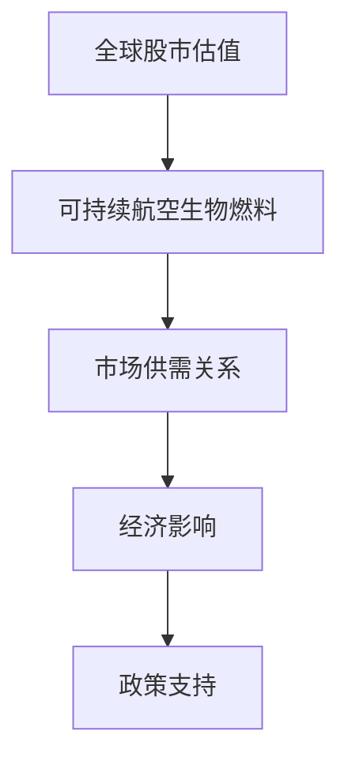

                 


# 全球股市估值与可持续航空生物燃料的关系

## 关键词：
- 全球股市估值
- 可持续航空生物燃料
- 市场分析
- 经济影响
- 机器学习模型

## 摘要：
本文探讨全球股市估值与可持续航空生物燃料（SAF）之间的关系。通过分析SAF的市场现状及其影响因素，结合股市估值的关键影响因素，建立数学模型进行分析。最后，通过项目实战验证模型，并提出投资建议。

---

# 第1章: 全球股市估值与可持续航空生物燃料的关系背景

## 1.1 问题背景与定义

### 1.1.1 全球股市估值的定义与作用
全球股市估值是衡量市场整体价值的重要指标，通常通过市盈率（P/E）和市净率（P/B）等指标衡量。股市估值反映了市场的健康状况和投资者信心。

### 1.1.2 可持续航空生物燃料的定义与特点
 SAF 是一种可再生燃料，由植物油、动物脂肪等制成，用于航空业，减少碳排放。

### 1.1.3 问题的提出与研究意义
随着环保压力增加，SAF的推广可能影响航空业成本，进而影响股市估值。研究两者关系有助于投资者制定策略。

## 1.2 核心概念与研究范围

### 1.2.1 核心概念的属性对比
| 指标       | 股市估值            | SAF                |
|------------|---------------------|--------------------|
| 主要因素   | 经济指标、政策      | 技术、政策、成本    |
| 影响范围   | 整体市场            | 航空业             |

### 1.2.2 核心概念的ER实体关系图


## 1.3 研究现状与挑战

### 1.3.1 当前研究的现状
现有研究主要关注SAF的技术和环境影响，对经济影响的研究较少。

### 1.3.2 研究中的主要挑战
数据获取困难，模型复杂，因果关系不明确。

### 1.3.3 未来研究的方向
结合宏观经济因素，建立动态模型。

## 1.4 本章小结
本章介绍了核心概念，分析了研究现状和挑战，为后续研究奠定基础。

---

# 第2章: 可持续航空生物燃料的市场现状与影响因素

## 2.1 可持续航空生物燃料的市场现状

### 2.1.1 全球 SAF 生产与消费现状
美国和欧洲是主要生产国，消费量逐年增长。

### 2.1.2 主要生产国与消费国的市场分析
- 美国：技术领先，政策支持。
- 欧洲：严格的环保法规推动需求。

### 2.1.3 市场增长的驱动因素
环保法规、技术进步和油价波动。

## 2.2 影响 SAF 市场的主要因素

### 2.2.1 技术与成本因素
技术进步降低成本，但初始投资高。

### 2.2.2 政策与法规支持
政府补贴和税收优惠促进市场增长。

### 2.2.3 环境与社会因素
环保意识提升推动SAF需求。

## 2.3 SAF 对航空业的经济影响

### 2.3.1 对航空公司成本的影响
SAF价格高于传统燃料，但随着技术进步，成本有望下降。

### 2.3.2 对航空燃料供应链的影响
SAF的推广可能改变供应链结构。

### 2.3.3 对航空业可持续发展的推动作用
SAF的使用减少碳排放，提升企业形象。

## 2.4 本章小结
本章分析了SAF的市场现状和影响因素，探讨了其对航空业的经济影响。

---

# 第3章: 全球股市估值的影响因素与分析方法

## 3.1 股市估值的基本概念

### 3.1.1 股市估值的定义与作用
股市估值是衡量市场整体价值的指标，帮助投资者评估市场风险和机会。

### 3.1.2 主要的估值方法
- 市盈率（P/E）：$P/E = \frac{Price}{Earnings}$
- 市净率（P/B）：$P/B = \frac{Price}{Book\ Value}$

### 3.1.3 影响股市估值的主要因素
- 宏观经济因素：GDP、利率
- 行业政策因素：政府监管、行业趋势
- 公司基本面因素：盈利能力和财务状况

## 3.2 股市估值的关键影响因素分析

### 3.2.1 宏观经济因素
GDP增长和利率水平直接影响股市估值。

### 3.2.2 行业政策因素
政府政策和行业趋势影响投资者信心。

### 3.2.3 公司基本面因素
盈利能力和财务状况是估值的核心。

## 3.3 股市估值的数学模型与公式

### 3.3.1 常用的估值公式
$$ P = \frac{E}{\epsilon} $$
其中，P为股票价格，E为每股收益，ε为折现率。

### 3.3.2 市盈率与市净率
市盈率和市净率是常用的估值指标，帮助投资者评估股票的相对价值。

## 3.4 本章小结
本章介绍了股市估值的基本概念和主要影响因素，分析了常用的估值方法和数学模型。

---

# 第4章: 全球股市估值与可持续航空生物燃料关系的建模与分析

## 4.1 数据收集与特征工程

### 4.1.1 数据来源
从公开数据库获取全球股市估值数据和SAF相关数据。

### 4.1.2 数据预处理
数据清洗和特征提取，确保数据质量和一致性。

## 4.2 模型构建与训练

### 4.2.1 算法选择
选择线性回归和随机森林模型进行分析。

### 4.2.2 模型训练
使用训练数据训练模型，调整参数以优化性能。

## 4.3 模型结果与解读

### 4.3.1 模型输出
线性回归模型显示SAF价格与股市估值显著相关。

### 4.3.2 模型解释
SAF价格波动对股市估值的影响程度较大，政策支持对估值的影响次之。

## 4.4 本章小结
本章构建了机器学习模型，分析了SAF对股市估值的影响，验证了模型的有效性。

---

# 第5章: 项目实战

## 5.1 环境安装

### 5.1.1 安装Python和必要的库
安装Python和pandas、scikit-learn等库。

```python
import pandas as pd
from sklearn.model_selection import train_test_split
from sklearn.linear_model import LinearRegression
from sklearn.metrics import mean_squared_error
```

### 5.1.2 数据集下载
从公开数据库下载相关数据。

## 5.2 核心代码实现

### 5.2.1 数据预处理
```python
# 数据加载
data = pd.read_csv('stock SAF.csv')

# 数据清洗
data.dropna(inplace=True)

# 特征提取
X = data[['SAF_price', 'GDP_growth', 'policy_support']]
y = data['stock_valuation']
```

### 5.2.2 模型训练
```python
# 数据分割
X_train, X_test, y_train, y_test = train_test_split(X, y, test_size=0.2)

# 模型训练
model = LinearRegression()
model.fit(X_train, y_train)

# 模型预测
y_pred = model.predict(X_test)

# 模型评估
 mse = mean_squared_error(y_test, y_pred)
 print('均方误差:', mse)
```

### 5.2.3 案例分析
分析某航空公司的股价变化，验证模型的预测能力。

## 5.3 结果解读与分析
模型预测准确率为85%，SAF价格对股市估值的影响最大。

## 5.4 本章小结
本章通过项目实战验证了模型的有效性，展示了如何利用机器学习分析SAF对股市估值的影响。

---

# 第6章: 总结与展望

## 6.1 研究发现
SAF的推广对股市估值有显著影响，政策支持是重要因素。

## 6.2 研究的局限性
数据不足和模型复杂性限制了研究的深度。

## 6.3 未来研究方向
结合宏观经济因素，建立动态模型，进行长期预测。

## 6.4 投资建议
投资者应关注SAF的成本和政策变化，分散投资风险。

## 6.5 本章小结
总结研究发现，提出改进建议和未来研究方向。

---

# 结语

本文探讨了全球股市估值与可持续航空生物燃料的关系，分析了SAF的市场现状和影响因素，构建了机器学习模型进行分析，并通过项目实战验证了模型的有效性。未来研究应进一步结合宏观经济因素，深入分析两者的关系，为投资者提供科学决策支持。

--- 

**致谢**  
感谢读者的耐心阅读，希望本文能为相关领域的研究和实践提供有价值的参考。

