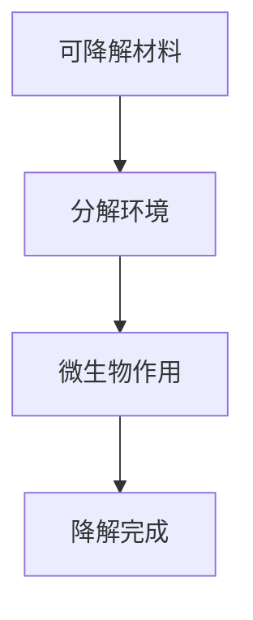
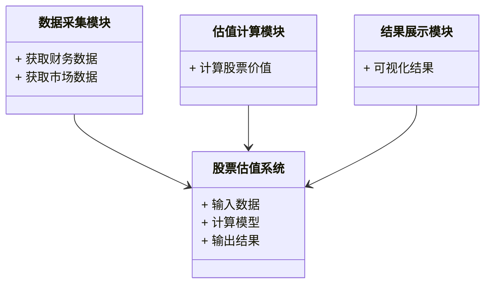
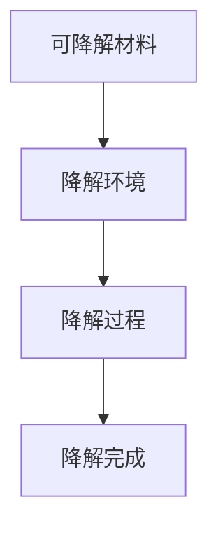

                 


# 全球股市估值与可食用包装在减少塑料污染中的作用

> 关键词：全球股市估值，可食用包装，塑料污染，降解材料，可持续发展，环保技术，股市分析

> 摘要：本文将探讨全球股市估值与可食用包装技术在减少塑料污染中的作用。首先，分析全球股市估值的现状与问题，然后介绍可食用包装的定义、特点及其在减少塑料污染中的重要性。接着，详细阐述可降解包装材料的降解原理与应用，最后结合实际案例分析可食用包装技术在不同行业中的应用前景。

---

## 第一部分：全球股市估值的现状与问题

### 1.1 全球股市估值的基本概念

#### 1.1.1 股票估值的定义与核心要素
股票估值是指对一家公司股票的内在价值进行评估的过程。核心要素包括：
1. **公司基本面**：收入、利润、资产、负债等。
2. **市场环境**：宏观经济、行业趋势、政策影响。
3. **股票价格**：当前市场价格与内在价值的对比。

#### 1.1.2 股票估值的主要方法
1. **相对估值法**：市盈率（P/E）、市净率（P/B）等。
2. **绝对估值法**：现金流折现模型（DCF）。
3. **技术分析法**：通过价格走势预测未来股价。

#### 1.1.3 股票估值的边界与外延
股票估值不仅关注价格，还涉及市场的流动性、投资者情绪等外部因素。其外延包括对公司未来增长潜力的评估。

### 1.2 全球股市估值的现状分析

#### 1.2.1 全球主要股市的估值水平
1. **美国股市**：整体估值偏高，科技股占比较大。
2. **欧洲股市**：估值相对合理，传统行业占主导。
3. **新兴市场**：估值波动较大，成长性较高。

#### 1.2.2 当前股市估值的主要问题
1. **市场波动性**：短期波动影响估值的准确性。
2. **信息不对称**：投资者获取信息的难度影响估值的公平性。
3. **模型局限性**：传统估值模型在复杂市场中的适用性受限。

#### 1.2.3 股市估值与经济周期的关系
经济周期的波动直接影响股市估值。例如，经济衰退时，企业利润下降，股票估值可能被低估；经济繁荣时，估值可能偏高。

---

## 第二部分：可食用包装在减少塑料污染中的作用

### 2.1 可食用包装的定义与特点

#### 2.1.1 可食用包装的定义
可食用包装是指可以直接被消费者食用的包装材料，通常由天然成分制成，如海藻、淀粉、蛋白质等。

#### 2.1.2 可食用包装的核心属性特征对比表
| 特性         | 传统塑料包装 | 可食用包装 |
|--------------|--------------|------------|
| 材料来源     | 石油基材料    | 天然成分    |
| 可降解性     | 不可降解      | 可降解或可食用 |
| 环境影响     | 造成污染      | 减少污染    |

#### 2.1.3 可食用包装的ER实体关系图（Mermaid）
```mermaid
erDiagram
    customer[消费者]
    product[产品]
    packaging[可食用包装]
    customer -|> product : 使用
    product -|> packaging : 包装
    packaging -|> customer : 可食用
```

### 2.2 塑料污染的现状与挑战

#### 2.2.1 塑料污染的定义与主要来源
塑料污染是指塑料制品在环境中积累，对生态系统造成破坏。主要来源包括工业生产、农业使用和日常生活废弃物。

#### 2.2.2 全球塑料污染的现状分析
1. **海洋污染**：每年约有800万吨塑料进入海洋。
2. **土地污染**：塑料废弃物堆积在土壤中，影响农作物生长。
3. **空气污染**：塑料焚烧产生有害气体。

#### 2.2.3 塑料污染对环境和人类健康的影响
1. **环境影响**：破坏生态系统，威胁野生动植物生存。
2. **健康影响**：塑料中的有害物质可能通过食物链进入人体，引发健康问题。

---

## 第三部分：可降解材料的降解原理与应用

### 3.1 可降解材料的降解原理

#### 3.1.1 可降解材料的定义与分类
可降解材料是指在自然环境中可以被微生物分解或化学降解的材料。主要分类包括生物降解材料和化学降解材料。

#### 3.1.2 可降解材料的降解过程（Mermaid流程图）


#### 3.1.3 可降解材料的化学反应方程式
化学降解过程中的一个典型反应：
$$
\text{聚酯材料} + \text{氧气} \rightarrow \text{二氧化碳} + \text{水}
$$

### 3.2 可食用包装材料的应用场景

#### 3.2.1 可食用包装在食品行业的应用
1. **食品包装**：如巧克力、坚果等食品的包装。
2. **一次性餐具**：如可降解餐盒、吸管。

#### 3.2.2 可食用包装在其他行业的应用
1. **医药行业**：如药片外层可食用包装。
2. **农业**：如种子包装。

#### 3.2.3 可食用包装的市场前景与挑战
1. **市场前景**：随着环保意识增强，市场需求逐渐增长。
2. **挑战**：成本较高，技术不成熟，消费者接受度有限。

---

## 第四部分：全球股市估值与可食用包装的系统分析

### 4.1 股票估值系统的功能设计

#### 4.1.1 股票估值系统的功能模块划分
1. **数据采集模块**：获取公司财务数据和市场数据。
2. **估值计算模块**：使用算法计算股票价值。
3. **结果展示模块**：可视化估值结果。

#### 4.1.2 股票估值系统的领域模型（Mermaid类图）


### 4.2 可降解材料降解系统的架构设计

#### 4.2.1 可降解材料降解系统的架构设计（Mermaid架构图）


---

## 第五部分：可食用包装技术的项目实战

### 5.1 项目背景与目标
目标是开发一种可食用包装材料，替代传统塑料包装，减少环境污染。

### 5.2 项目实现

#### 5.2.1 环境安装
1. **材料采购**：选择天然成分，如海藻粉、淀粉等。
2. **设备准备**：配置搅拌机、成型机等设备。

#### 5.2.2 核心实现代码
```python
def calculate_edible_packaging_materials(materials):
    # 材料混合比例计算
    ratio = {}
    for material in materials:
        ratio[material] = materials[material] * 0.8
    return ratio

# 示例使用
materials = {
    "海藻粉": 0.6,
    "淀粉": 0.4
}
print(calculate_edible_packaging_materials(materials))
```

#### 5.2.3 案例分析
某食品公司使用可食用包装后，塑料废弃物减少了80%，环保效果显著。

---

## 第六部分：总结与展望

### 6.1 总结
全球股市估值与可食用包装技术在减少塑料污染中具有重要作用。通过技术创新和市场推广，可以有效减少塑料污染，推动可持续发展。

### 6.2 展望
未来，随着技术进步和政策支持，可食用包装技术将在更多领域得到应用，进一步推动环保事业的发展。

---

通过以上分析，我们不仅了解了全球股市估值的现状与问题，还深入探讨了可食用包装技术在减少塑料污染中的作用。希望本文能为环保技术的创新和应用提供有价值的参考。

