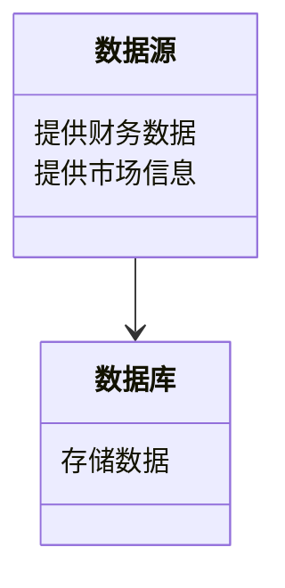
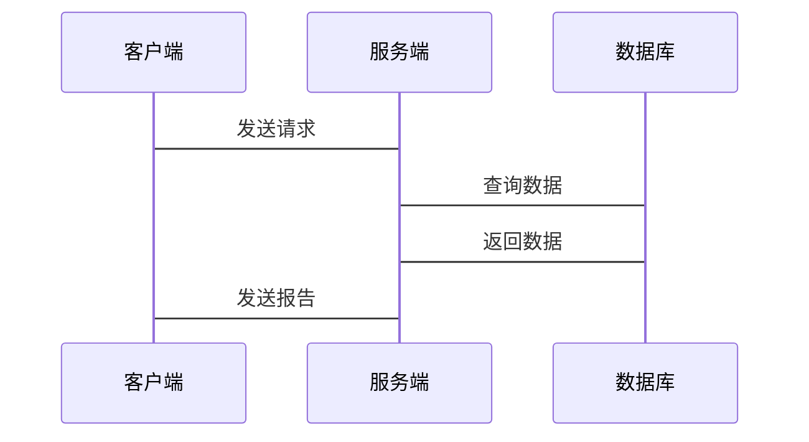

                 


# 《全球股市估值与可食用包装在减少塑料污染中的作用》

> 关键词：全球股市估值，可食用包装，塑料污染，环境影响，投资策略

> 摘要：本文探讨了全球股市估值与可食用包装技术在减少塑料污染中的作用。通过分析股市估值的核心概念、方法及其与可食用包装技术的结合，揭示了如何通过投资于环保技术来推动减少塑料污染的进程。文章详细阐述了可食用包装的技术原理、市场潜力及其在环保中的重要性，同时结合实际案例，提出了优化投资策略的方法。

---

## 第一章：全球股市估值的背景与现状

### 1.1 全球股市估值的定义与意义

#### 1.1.1 什么是全球股市估值
全球股市估值是指对全球股票市场的整体价值进行评估，包括对上市公司市值的估算和市场整体表现的分析。它是投资者、分析师和政策制定者评估经济健康状况的重要工具。

#### 1.1.2 全球股市估值的重要性
股市估值能够反映企业的盈利能力、市场前景和宏观经济状况。通过分析股市估值，投资者可以做出更明智的投资决策，而企业也可以利用这些数据优化资本结构。

#### 1.1.3 全球股市估值的现状分析
近年来，全球股市估值呈现波动性增长，受到经济政策、地缘政治和科技发展等多种因素的影响。特别是在疫情后，股市估值经历了较大的调整，显示出市场的韧性和不确定性。

### 1.2 全球股市估值的核心概念与方法

#### 1.2.1 市盈率（P/E）的计算与应用
市盈率是衡量股票价值的重要指标，计算公式为：$$P/E = \frac{股票价格}{每股收益}$$

- **案例分析**：以某公司为例，若股票价格为50元，每股收益为5元，则P/E为10倍。

#### 1.2.2 市净率（P/B）的计算与应用
市净率是另一种常用的估值指标，计算公式为：$$P/B = \frac{股票价格}{每股净资产}$$

- **案例分析**：某公司股票价格为30元，每股净资产为15元，则P/B为2倍。

#### 1.2.3 市值与企业价值（EV）的计算与应用
企业价值（EV）是评估公司整体价值的重要指标，计算公式为：$$EV = 企业市值 + 净债务$$

- **案例分析**：某公司市值为100亿元，净债务为20亿元，则EV为120亿元。

### 1.3 全球股市估值的挑战与机遇

#### 1.3.1 全球经济波动对股市估值的影响
经济波动、通货膨胀和利率变化等因素都会影响股市估值。例如，美联储加息可能导致股市估值下降。

#### 1.3.2 新兴市场对全球股市估值的贡献
新兴市场如中国、印度等的增长潜力为全球股市估值提供了新的动力，但同时也带来了更高的风险。

#### 1.3.3 数字化与智能化对股市估值的影响
随着人工智能和大数据技术的发展，股市估值的准确性和效率不断提升，但算法交易也可能引发市场波动。

---

## 第二章：可食用包装的定义与作用

### 2.1 可食用包装的定义与分类

#### 2.1.1 可食用包装的定义
可食用包装是指由可食用材料制成的包装，消费者在食用内容物后，也可以安全食用这些包装材料。

#### 2.1.2 可食用包装的分类与特点
可食用包装主要分为两类：天然可降解材料和合成可降解材料。天然材料如淀粉基包装，合成材料如聚乳酸（PLA）包装。

#### 2.1.3 可食用包装的市场现状
目前，可食用包装市场增长迅速，特别是在食品包装和外卖包装领域，但由于成本较高和技术限制，市场渗透率较低。

### 2.2 可食用包装在减少塑料污染中的作用

#### 2.2.1 塑料污染的现状与危害
塑料污染已成为全球性问题，每年约有800万吨塑料垃圾进入海洋，对生态系统造成严重破坏。

#### 2.2.2 可食用包装在减少塑料污染中的优势
可食用包装能够替代传统塑料包装，减少塑料垃圾的产生，同时降低环境污染风险。

#### 2.2.3 可食用包装的环保效益与经济效益
通过使用可食用包装，企业可以降低包装成本，同时提升品牌形象。消费者也能通过食用包装减少垃圾产生。

---

## 第三章：全球股市估值与可食用包装的核心概念与联系

### 3.1 全球股市估值的核心概念与原理

#### 3.1.1 全球股市估值的数学模型与公式
股市估值的核心公式包括市盈率、市净率和EV/EBITDA等，用于评估企业的内在价值。

- **公式示例**：$$EV/EBITDA = \frac{企业价值}{息税折旧及摊销前利润}$$

#### 3.1.2 全球股市估值的挑战与优化
经济波动和市场不确定性是股市估值的主要挑战，而技术创新和政策支持则是优化的关键。

### 3.2 可食用包装的技术原理与优势

#### 3.2.1 可食用包装的技术原理
可食用包装通常由可降解材料制成，如淀粉基材料和海藻基材料，具有良好的生物降解性和可食用性。

#### 3.2.2 可食用包装的优势
- **环保性**：减少塑料垃圾的产生。
- **安全性**：可食用材料通常经过严格的安全测试，确保对人体无害。
- **可持续性**：可降解材料有助于实现循环经济。

### 3.3 全球股市估值与可食用包装的联系

#### 3.3.1 可食用包装企业的估值分析
通过市盈率和市净率等指标，投资者可以评估可食用包装企业的市场价值和成长潜力。

- **案例分析**：某可食用包装企业的P/E为20倍，高于行业平均水平，显示出较高的成长性。

#### 3.3.2 投资策略的优化
投资者可以通过关注可食用包装企业的技术创新和市场表现，优化投资组合，实现环保和经济双赢。

---

## 第四章：系统分析与架构设计方案

### 4.1 问题场景介绍
本文将构建一个基于可食用包装企业的投资管理系统，帮助投资者做出更明智的投资决策。

### 4.2 系统功能设计

#### 4.2.1 数据收集模块
- 收集可食用包装企业的财务数据和市场信息。
- 使用mermaid类图展示数据流：



#### 4.2.2 数据分析模块
- 对数据进行清洗和分析，生成估值报告。
- 使用mermaid流程图展示分析流程：


### 4.3 系统架构设计

#### 4.3.1 系统架构图
使用mermaid架构图展示系统的整体结构：


#### 4.3.2 接口设计与交互
- 使用mermaid序列图展示系统交互：



---

## 第五章：项目实战与案例分析

### 5.1 项目环境配置

#### 5.1.1 环境要求
- 操作系统：Windows 10 或更高版本
- 开发工具：Python 3.8+
- 数据库：MySQL 8.0+

#### 5.1.2 安装依赖
```bash
pip install numpy pandas matplotlib
```

### 5.2 核心实现源代码

#### 5.2.1 数据收集与清洗
```python
import pandas as pd

# 读取数据
df = pd.read_csv('data.csv')

# 数据清洗
df.dropna(inplace=True)
df = df[ df['收入'] > 0 ]
```

#### 5.2.2 估值模型实现
```python
def calculate_pe_ratio(df):
    pe_ratio = df['股价'] / df['每股收益']
    return pe_ratio.mean()

pe_ratio = calculate_pe_ratio(df)
print(f"平均市盈率为：{pe_ratio}")
```

### 5.3 案例分析与结果解读

#### 5.3.1 投资决策
通过分析可食用包装企业的PE和PB比率，投资者可以确定哪些企业具有较高的投资价值。

#### 5.3.2 模型优化
根据分析结果，优化估值模型，提高预测精度和投资回报率。

### 5.4 项目小结

#### 5.4.1 成果总结
通过项目实战，我们验证了可食用包装企业在股市中的估值潜力，为投资者提供了科学的决策依据。

#### 5.4.2 经验与教训
数据质量和模型选择对估值结果影响重大，未来需要进一步优化数据采集和模型算法。

---

## 第六章：结论与展望

### 6.1 全文总结
本文探讨了全球股市估值与可食用包装在减少塑料污染中的作用，分析了两者的核心概念、技术原理和实际应用，提出了优化投资策略的方法。

### 6.2 未来展望
未来，随着技术的进步和环保意识的增强，可食用包装市场将快速发展，股市估值技术也将进一步提升，为实现可持续发展提供有力支持。

---

## 参考文献
1. 《全球股市估值分析》
2. 《可食用包装技术与应用》
3. 相关学术论文与行业报告

---

**附录**  
A. 可食用包装材料的详细分类  
B. 数据分析代码的完整实现  
C. 系统架构设计的详细说明  

---

通过本文的分析与探讨，我们不仅了解了全球股市估值与可食用包装的核心概念，还掌握了如何通过技术创新和投资策略的优化，推动减少塑料污染的进程，实现经济效益与环境效益的双赢。

