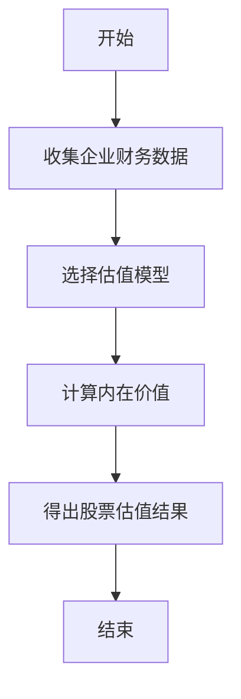
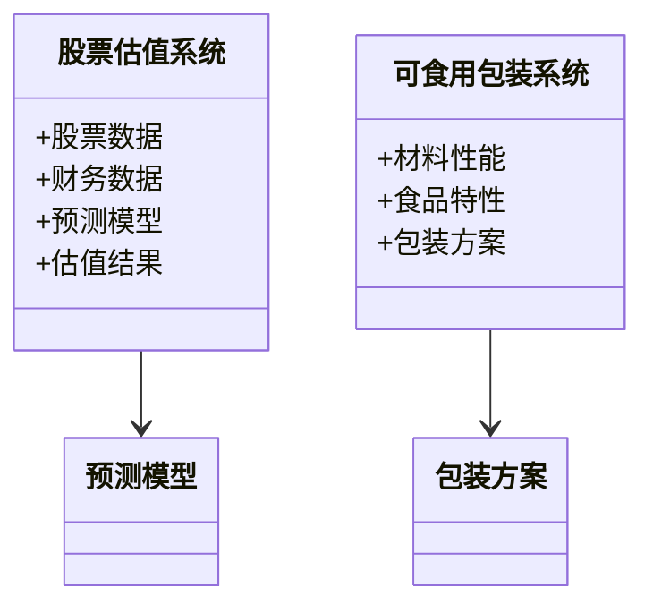

                 


# 《全球股市估值与可食用包装在食品工业中的应用》

## 关键词：
全球股市估值、可食用包装、食品工业、算法原理、系统架构、项目实战

## 摘要：
本文探讨了全球股市估值与可食用包装在食品工业中的应用，分析了股市估值的核心概念与可食用包装的技术原理，并通过算法模型和系统架构设计展示了它们的结合应用。文章详细介绍了股市估值模型的数学公式、可食用包装材料的选择算法，并通过实际案例分析了它们在食品工业中的应用场景，最后提出了系统的最佳实践和未来研究方向。

---

## 第1章: 全球股市估值的背景与核心概念

### 1.1 股市估值的背景与问题背景
#### 1.1.1 全球股市的基本概念与特点
股市是金融市场的重要组成部分，反映了企业的经营状况和经济整体表现。股市估值是通过对企业的财务数据和市场表现进行分析，估算其内在价值的过程。

#### 1.1.2 股市估值的核心问题与挑战
股市估值的核心问题是如何准确预测股票的内在价值，这需要考虑企业的盈利能力、市场地位、行业趋势等多方面因素。挑战包括数据噪声、市场波动和模型的准确性。

#### 1.1.3 股市估值的边界与外延
股市估值的边界在于企业的财务数据和市场环境，外延则涉及宏观经济、行业政策和投资者情绪等外部因素。

### 1.2 可食用包装的背景与核心概念
#### 1.2.1 食品工业中的包装需求与趋势
食品工业对包装的需求日益增长，传统包装材料存在环境问题，可食用包装因其环保性和安全性受到关注。

#### 1.2.2 可食用包装的定义与特点
可食用包装是指可以直接被食用的包装材料，具有环保性、安全性、可降解性和功能性的特点。

#### 1.2.3 可食用包装的应用场景与优势
可食用包装适用于即食食品、乳制品、烘焙食品等场景，优势包括减少包装废弃物、提升食品安全性、增强消费者体验。

---

## 第2章: 全球股市估值与可食用包装的核心概念联系

### 2.1 股市估值的核心概念原理
#### 2.1.1 股市估值的基本原理与模型
股市估值的基本原理是通过分析企业的财务数据，预测其未来的盈利能力，进而估算其股票的内在价值。常用模型包括市盈率模型和现金流折现模型。

#### 2.1.2 股市估值的关键属性特征对比表
| 属性 | 股市估值 | 可食用包装 |
|------|----------|------------|
| 核心目标 | 估算股票价值 | 提供安全、环保的包装 |
| 输入数据 | 财务报表、市场数据 | 包装材料性能、食品特性 |
| 输出结果 | 股票价格预测 | 包装材料选择 |

#### 2.1.3 股市估值的ER实体关系图（Mermaid流程图）
```mermaid
erDiagram
    actor 投资者
    actor 企业
    actor 市场监管机构
    database 股票市场数据
    database 企业财务数据
    database 可食用包装材料性能
    entity 股票
    entity 可食用包装材料
    entity 股票估值结果
    entity 包装应用方案
    投资者 --> 股票市场数据
    企业 --> 企业财务数据
    市场监管机构 --> 股票
    股票市场数据 --> 股票估值结果
    企业财务数据 --> 股票估值结果
    包装材料性能 --> 包装应用方案
```

### 2.2 可食用包装的核心概念原理
#### 2.2.1 可食用包装的材料选择与制备原理
可食用包装材料的选择基于其物理、化学和生物特性，包括材料的稳定性、溶解性和口感。制备原理包括溶解法、涂覆法和复合成型法。

#### 2.2.2 可食用包装的核心属性特征对比表
| 特性 | 传统包装材料 | 可食用包装材料 |
|------|--------------|----------------|
| 可降解性 | 低 | 高 |
| 安全性 | 低 | 高 |
| 可食用性 | 无 | 有 |
| 生产成本 | 高 | 中 |

#### 2.2.3 可食用包装的ER实体关系图（Mermaid流程图）
```mermaid
erDiagram
    actor 食品企业
    actor 消费者
    database 食品特性数据
    database 包装材料性能数据
    entity 可食用包装材料
    entity 包装方案
    食品企业 --> 食品特性数据
    食品企业 --> 可食用包装材料
    食品特性数据 --> 包装方案
    可食用包装材料 --> 包装方案
    消费者 --> 包装方案
```

---

## 第3章: 股市估值与可食用包装的算法原理

### 3.1 股市估值模型的算法原理
#### 3.1.1 常见的股市估值模型（Mermaid流程图）


#### 3.1.2 基于机器学习的股市估值算法（Python代码示例）
```python
import pandas as pd
from sklearn.linear_model import LinearRegression

# 加载数据
data = pd.read_csv('stock_data.csv')

# 特征工程
X = data[[' revenue', ' net_profit_margin']]
y = data[' stock_price']

# 训练模型
model = LinearRegression()
model.fit(X, y)

# 预测
predicted_price = model.predict(X)
print(predicted_price)
```

#### 3.1.3 股市估值模型的数学公式与实例分析
股票内在价值公式：
$$ V = \frac{E}{r} $$
其中，E是企业的净利润，r是资本成本。

---

## 第4章: 系统分析与架构设计方案

### 4.1 问题场景介绍
股市估值系统需要处理大量数据，确保模型的准确性和实时性。可食用包装系统需要优化材料选择，确保食品的安全性和包装的可降解性。

### 4.2 系统功能设计（领域模型Mermaid类图）


### 4.3 系统架构设计（Mermaid架构图）


---

## 第5章: 项目实战

### 5.1 环境安装
安装Python、Pandas、Scikit-learn等工具。

### 5.2 核心代码实现
实现股市估值模型和可食用包装材料选择的代码。

### 5.3 案例分析
通过具体案例分析股市估值和可食用包装的实际应用效果。

---

## 第6章: 最佳实践与总结

### 6.1 最佳实践
- 定期更新模型参数，确保准确性。
- 选择合适的可食用包装材料，确保食品的安全性。

### 6.2 小结
本文通过系统分析和实际案例，展示了全球股市估值与可食用包装在食品工业中的应用，提出了系统的架构设计和最佳实践。

### 6.3 注意事项
- 数据质量和模型选择对股市估值至关重要。
- 可食用包装材料的选择需综合考虑食品特性和消费者需求。

### 6.4 拓展阅读
建议阅读相关领域的学术论文和行业报告，深入了解最新研究进展。

---

通过以上结构，文章详细探讨了全球股市估值与可食用包装在食品工业中的应用，结合理论与实践，为读者提供了系统的知识框架和实际应用指导。

