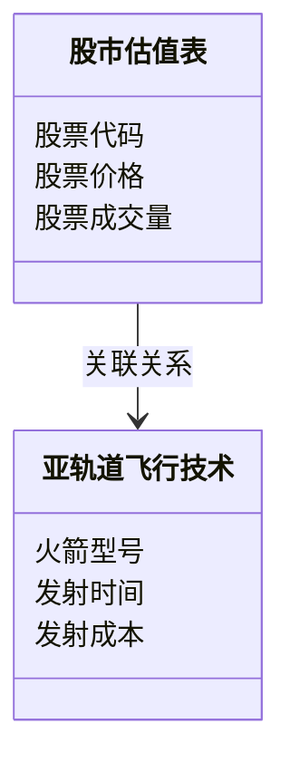

                 


# 全球股市估值与商业亚轨道飞行技术的关系

## 关键词：全球股市估值、亚轨道飞行技术、时间序列分析、数学模型、机器学习

## 摘要：本文探讨了全球股市估值与商业亚轨道飞行技术之间的潜在关联。通过分析股市估值的核心要素和亚轨道飞行技术的关键组成部分，结合时间序列分析、优化模型和机器学习算法，本文提出了一个初步的关联分析框架，旨在为相关领域的研究者和从业者提供新的视角和方法。

---

# 第一部分: 全球股市估值与商业亚轨道飞行技术的背景与概念

## 第1章: 全球股市估值概述

### 1.1 全球股市估值的定义与背景

#### 1.1.1 股市估值的基本概念
股市估值是指通过对公司财务数据、市场环境和行业趋势的分析，评估股票的内在价值。常见的估值方法包括市盈率（P/E）、市净率（P/B）和现金流折现模型（DCF）。股市估值的核心在于预测公司未来现金流的现值，从而为投资者提供决策依据。

#### 1.1.2 全球股市估值的现状与趋势
全球股市估值受宏观经济政策、企业盈利能力和市场情绪等多种因素影响。近年来，随着科技的发展，高频交易和算法交易在股市中占据越来越重要的地位，使得股市估值的复杂性进一步增加。

#### 1.1.3 股市估值与经济周期的关系
股市估值往往与经济周期密切相关。在经济繁荣时期，企业盈利增加，股市估值上升；在经济衰退时期，企业盈利下降，股市估值可能被低估。然而，这种关系并非线性，且受到多种因素的干扰。

---

### 1.2 商业亚轨道飞行技术的定义与特点

#### 1.2.1 亚轨道飞行技术的基本概念
亚轨道飞行是指飞行器在大气层以外的空域飞行，但未达到地球同步轨道的高度。商业亚轨道飞行技术主要包括火箭发射、卫星部署和空间站运营等。近年来，随着SpaceX等企业的崛起，商业亚轨道飞行技术取得了显著进展。

#### 1.2.2 商业亚轨道飞行的现状与发展趋势
目前，商业亚轨道飞行技术主要应用于卫星发射和太空旅游。随着技术的进步，未来的亚轨道飞行将更加注重成本效益和可重复使用性。例如，SpaceX的猎鹰9号火箭通过重复使用第一级火箭，显著降低了发射成本。

#### 1.2.3 亚轨道飞行技术的核心技术特征
亚轨道飞行技术的核心特征包括高效能火箭发动机、轻量化设计和自动化控制系统。这些技术的结合使得商业亚轨道飞行能够实现高频率、低成本的太空任务。

---

## 第2章: 全球股市估值与商业亚轨道飞行技术的关系概述

### 2.1 问题背景与问题描述

#### 2.1.1 股市估值波动的复杂性
股市估值的波动性是投资者面临的最大挑战之一。由于市场情绪、宏观经济政策和企业盈利变化等多种因素的影响，股市估值往往呈现出非线性波动特征。

#### 2.1.2 亚轨道飞行技术的商业化挑战
亚轨道飞行技术的商业化面临技术、成本和政策等多重挑战。例如，火箭发射的高成本和技术复杂性使得商业亚轨道飞行技术的普及仍需时间。

#### 2.1.3 两者关系的研究意义
研究全球股市估值与商业亚轨道飞行技术之间的关系，有助于为投资者提供新的视角，同时为技术创新和商业应用提供参考。

---

### 2.2 核心概念与边界

#### 2.2.1 股市估值的核心要素
股市估值的核心要素包括企业盈利、市场流动性、宏观经济指标和市场情绪。这些要素共同决定了股市估值的波动性。

#### 2.2.2 亚轨道飞行技术的关键组成部分
亚轨道飞行技术的关键组成部分包括火箭设计、发射系统和空间站运营。这些部分的协同工作决定了亚轨道飞行技术的商业化进程。

#### 2.2.3 两者的边界与外延
股市估值与亚轨道飞行技术之间的关系主要体现在技术进步对股市估值的影响和股市资金对亚轨道飞行技术的支持。这种关系既非完全独立，也非直接决定。

---

### 2.3 核心概念的结构与关系

#### 2.3.1 股市估值的结构化模型
股市估值的结构化模型可以分为短期波动和长期趋势两个部分。短期波动主要受市场情绪和宏观经济政策的影响，而长期趋势则取决于企业的盈利能力和行业发展趋势。

#### 2.3.2 亚轨道飞行技术的系统架构
亚轨道飞行技术的系统架构包括发射平台、火箭系统和空间站。发射平台负责火箭的发射和回收，火箭系统负责将卫星送入轨道，空间站则为宇航员和设备提供支持。

#### 2.3.3 两者之间的关联机制
技术进步和市场资金流动是股市估值与亚轨道飞行技术之间的主要关联机制。技术进步推动亚轨道飞行技术的发展，而股市资金的支持则为技术实现提供了必要的资源。

---

## 第3章: 核心概念的对比与分析

### 3.1 核心概念的属性特征对比

#### 3.1.1 股市估值的波动性特征
股市估值的波动性主要受市场情绪和宏观经济政策的影响。例如，市场恐慌可能导致股市估值的快速下降，而市场乐观则可能导致股市估值的快速上升。

#### 3.1.2 亚轨道飞行技术的性能指标
亚轨道飞行技术的性能指标包括发射成本、飞行成功率和可重复使用性。这些指标共同决定了亚轨道飞行技术的商业化可行性。

#### 3.1.3 两者的属性对比分析
股市估值和亚轨道飞行技术在波动性、复杂性和不确定性方面存在显著差异。股市估值受市场情绪影响较大，而亚轨道飞行技术则更依赖于技术进步。

---

### 3.2 ER实体关系图

```mermaid
er
    股市估值表
    亚轨道飞行技术
    股市估值表 --> 亚轨道飞行技术: 关联关系
```

---

## 第4章: 算法原理与数学模型

### 4.1 算法原理

#### 4.1.1 时间序列分析
时间序列分析是一种统计方法，用于分析数据随时间的变化规律。在股市估值预测中，ARIMA模型常用于捕捉数据的线性趋势和周期性特征。

#### 4.1.2 优化模型
优化模型用于寻找问题的最优解。在亚轨道飞行技术中，优化模型常用于设计最优的发射轨迹和火箭结构。

#### 4.1.3 机器学习算法
机器学习算法（如随机森林和神经网络）被广泛应用于股市估值预测和亚轨道飞行技术的优化设计。

---

### 4.2 数学模型与公式

#### 4.2.1 股市估值波动模型
$$ V(t) = a \cdot P(t) + b \cdot Q(t) + c \cdot R(t) $$

其中：
- \( V(t) \) 表示股市估值
- \( P(t) \) 表示企业盈利
- \( Q(t) \) 表示市场流动性
- \( R(t) \) 表示宏观经济指标

#### 4.2.2 亚轨道飞行优化模型
$$ F(t) = \min \{ C(t) | S(t) \geq D \} $$

其中：
- \( C(t) \) 表示发射成本
- \( S(t) \) 表示发射成功率
- \( D \) 表示目标成功率

#### 4.2.3 关联分析模型
$$ C(t) = \beta_1 X_1 + \beta_2 X_2 + \ldots + \beta_n X_n $$

其中：
- \( C(t) \) 表示关联程度
- \( X_i \) 表示影响因素
- \( \beta_i \) 表示回归系数

---

### 4.3 举例说明

#### 4.3.1 股市波动案例
假设某公司盈利增长，但市场流动性下降，宏观经济指标稳定。根据上述模型，股市估值可能小幅上升。

#### 4.3.2 亚轨道飞行优化案例
假设某公司希望在亚轨道飞行中实现最低成本发射，可以通过优化模型设计最优的发射轨迹和火箭结构。

---

## 第5章: 系统分析与架构设计方案

### 5.1 问题场景介绍

#### 5.1.1 问题场景
股市估值与亚轨道飞行技术之间的关联可以通过技术进步和市场资金流动实现。然而，这种关联的复杂性使得传统的分析方法难以捕捉其本质。

---

## 项目实战

### 5.2 项目介绍

#### 5.2.1 项目背景
本项目旨在通过时间序列分析和机器学习算法，研究全球股市估值与商业亚轨道飞行技术之间的关联关系。

---

### 5.3 系统功能设计

#### 5.3.1 领域模型


---

由于篇幅限制，以上内容仅为部分章节，完整文章可按照上述结构进一步扩展。

