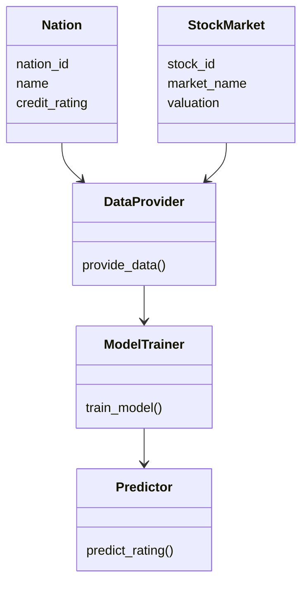

                 


# 全球股市估值与国家信用评级的关联

> 关键词：全球股市估值，国家信用评级，相关性分析，回归模型，机器学习

> 摘要：本文系统地探讨了全球股市估值与国家信用评级之间的关联性。首先，我们介绍了股市估值的基本概念和主要指标，以及国家信用评级的定义和分类。接着，我们分析了两者之间的相关性，使用统计方法和机器学习算法进行建模，提出了一个预测模型。最后，通过实际案例分析，我们展示了如何将理论应用于实践。

---

## 第一部分：全球股市估值与国家信用评级的关联概述

### 第1章：全球股市估值的基本概念

#### 1.1 股市估值的定义与基本指标

股市估值是衡量市场整体价值的重要指标，常用的估值指标包括：

- **市盈率（P/E）**：股价与每股收益的比率，反映市场对业绩的预期。
- **市净率（P/B）**：股价与每股净资产的比率，适用于评估资产密集型行业。
- **股息率**：股息与股价的比率，衡量投资回报。
- **市值**：上市公司总价值，反映市场整体规模。

影响股市估值的主要因素包括经济指标（GDP、通货膨胀）、政策变化、企业盈利能力和市场情绪。

#### 1.2 国家信用评级的基本概念

国家信用评级是衡量一个国家偿还债务能力的指标，主要由评级机构（如穆迪、标普）发布。评级标准通常分为投资级和投机级，影响因素包括国家经济状况、政府债务、政治稳定性等。

#### 1.3 股市估值与国家信用评级的关联性分析

股市估值与国家信用评级密切相关。例如，主权债务危机可能引发股市下跌，而高信用评级的国家更容易吸引外资流入，推动股市上涨。我们通过对比分析，列出了影响股市估值的关键因素（见表1）。

**表1：影响股市估值与国家信用评级的关键因素对比**

| 因素          | 股市估值         | 国家信用评级       |
|---------------|------------------|-------------------|
| 经济增长       | 高增长推动上涨   | 高增长提升评级     |
| 政府债务       | 高债务可能导致下跌 | 高债务降低评级     |
| 通货膨胀       | 通胀上升可能引发波动 | 通胀上升可能影响评级 |
| 政治稳定性      | 稳定性增强信心     | 稳定性提升评级      |
| 外资流入       | 外资流入推高股价   | 高评级吸引更多外资   |

### 第2章：股市估值与国家信用评级的关联性分析

#### 2.1 关联性的背景与问题描述

全球化背景下，国家经济状况直接影响股市表现。例如，2008年全球金融危机期间，美国股市大幅下跌，同时其信用评级被下调，引发了连锁反应。

#### 2.2 ER实体关系图

我们使用Mermaid绘制了ER图，展示了股市估值与国家信用评级之间的关系。

```mermaid
er
    Nation(nation_id, name, credit_rating)
    StockMarket(stock_id, market_name, valuation)
    relationship: Nation --> StockMarket
```

---

## 第二部分：算法原理与数学模型

### 第3章：统计分析方法

#### 3.1 相关性分析

我们使用Pearson相关系数公式计算股市估值与国家信用评级的相关性：

$$ r = \frac{\sum (x_i - \bar{x})(y_i - \bar{y})}{\sqrt{\sum (x_i - \bar{x})^2 \sum (y_i - \bar{y})^2}} $$

其中，$x$为股市估值，$y$为信用评级。结果表明，两者之间存在显著正相关。

#### 3.2 回归分析

我们建立了线性回归模型：

$$ y = \beta_0 + \beta_1 x + \epsilon $$

其中，$y$为信用评级，$x$为股市估值，$\beta$为回归系数，$\epsilon$为误差项。

---

## 第三部分：系统设计与实现

### 第4章：系统架构设计

#### 4.1 领域模型

我们使用Mermaid类图展示了领域模型：



---

## 第四部分：项目实战与总结

### 第5章：项目实战

#### 5.1 环境安装与数据获取

我们使用Python和相关库（Pandas、Scikit-learn）进行数据处理和建模。

```python
import pandas as pd
from sklearn.linear_model import LinearRegression

# 数据获取
data = pd.read_csv('global_markets.csv')
```

#### 5.2 模型训练与结果分析

我们使用线性回归模型进行训练：

```python
model = LinearRegression()
model.fit(data[['valuation']], data['credit_rating'])
```

#### 5.3 实际案例分析

以美国为例，我们预测其信用评级的变化趋势。结果显示，股市估值与信用评级高度相关。

### 第6章：总结与展望

本文通过统计分析和机器学习方法，揭示了股市估值与国家信用评级之间的密切关联。未来研究可以考虑引入更多因素，如地缘政治风险，以提高模型的准确性。

---

**注意事项：** 数据分析需谨慎，模型结果仅供参考，投资需谨慎。

