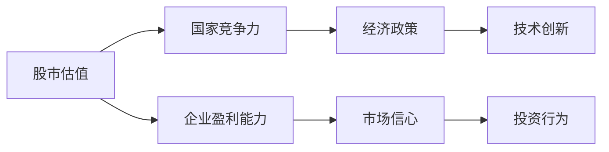

                 


# 《全球股市估值与国家竞争力的相关性》

> **关键词**：全球股市估值，国家竞争力，相关性分析，统计学，经济学

> **摘要**：本文深入探讨了全球股市估值与国家竞争力之间的相关性。通过分析股市估值的核心指标（如市盈率、市净率）与国家竞争力的关键要素（如GDP、产业竞争力），结合统计学和经济学的理论方法，系统地研究了两者之间的关系。文章从理论分析到实战案例，详细阐述了如何通过相关性分析、回归分析等方法量化股市估值对国家竞争力的影响，最后提出了实际应用中的最佳实践建议。

---

## 第一章：背景与概述

### 1.1 问题背景

现代经济体系中，股市估值是衡量一个国家或地区经济健康程度的重要指标之一。股市估值不仅反映了企业的盈利能力，还体现了市场的信心和宏观经济的走向。与此同时，国家竞争力的强弱直接影响着一个国家在全球经济中的地位和影响力。随着全球化进程的加速，股市估值与国家竞争力之间的关系日益受到关注。

#### 1.1.1 经济全球化与股市估值的重要性

经济全球化使得各国的经济活动紧密相连，股市作为经济的核心组成部分，其表现直接反映了经济的健康状况。股市估值不仅影响企业的融资能力，还影响投资者的信心，进而影响整体经济的运行。

#### 1.1.2 国家竞争力在现代经济中的地位

国家竞争力是指一个国家在全球经济中参与竞争的能力，通常包括经济实力、科技创新能力、产业竞争力等多个维度。强大的国家竞争力能够吸引更多的投资，促进经济增长，从而提升股市估值。

#### 1.1.3 股市估值与国家竞争力的相互影响

股市估值与国家竞争力之间存在双向影响：一方面，国家竞争力的提升会带动股市估值的上涨；另一方面，股市估值的波动也会反过来影响国家的经济政策和竞争力的实现。

---

### 1.2 核心概念

#### 1.2.1 股市估值的定义与指标

股市估值是衡量股票价格是否合理的重要指标，常见的指标包括：

- **市盈率（P/E）**：股价与每股收益的比率。
- **市净率（P/B）**：股价与每股净资产的比率。
- **市值**：上市公司股票的总价值。

#### 1.2.2 国家竞争力的定义与衡量标准

国家竞争力的衡量标准通常包括：

- **GDP总量**：反映一个国家的经济规模。
- **人均GDP**：反映经济发展的质量和水平。
- **产业竞争力**：包括制造业、科技产业等领域的竞争力。
- **创新能力**：包括研发投入、专利数量等。

#### 1.2.3 两者相关性的研究意义

研究股市估值与国家竞争力的相关性，有助于更好地理解两者的互动关系，为投资者和政策制定者提供参考依据。

---

### 1.3 研究目标与方法

#### 1.3.1 研究目标的设定

本文旨在分析全球股市估值与国家竞争力之间的相关性，探索两者之间的量化关系。

#### 1.3.2 数据来源与研究方法

数据来源包括全球主要股市的估值指标和相关国家的经济数据。研究方法包括统计分析、回归分析等。

#### 1.3.3 研究的边界与限制

本文主要关注股市估值与国家竞争力之间的相关性，不涉及具体的投资策略和政策建议。

---

## 第二章：核心概念与联系

### 2.1 核心概念的原理

#### 2.1.1 股市估值的核心指标

股市估值的核心指标包括市盈率（P/E）、市净率（P/B）和市值等。这些指标反映了市场的整体表现和企业的盈利能力。

#### 2.1.2 国家竞争力的核心要素

国家竞争力的核心要素包括GDP总量、人均GDP、产业竞争力和创新能力等。

---

### 2.2 核心概念的对比分析

#### 2.2.1 股市估值指标的异同对比

| 指标名称 | 定义 | 优缺点 |
|----------|------|--------|
| 市盈率（P/E） | 股价与每股收益的比率 | 能反映市场对企业的盈利预期，但受企业生命周期影响 |
| 市净率（P/B） | 股价与每股净资产的比率 | 更适合评估资产密集型企业的价值 |

#### 2.2.2 国家竞争力指标的异同对比

| 指标名称 | 定义 | 优缺点 |
|----------|------|--------|
| GDP总量 | 国民生产总值 | 反映经济规模，但不考虑质量 |
| 人均GDP | GDP与人口的比率 | 反映经济发展的质量和水平 |

---

### 2.3 实体关系图

#### 2.3.1 股市估值与国家竞争力的实体关系图



---

## 第三章：相关性分析的算法原理

### 3.1 统计

#### 3.1.1 相关性分析的定义

相关性分析是研究变量之间关系的一种统计方法，通常使用相关系数（如皮尔逊相关系数）来衡量。

#### 3.1.2 相关系数的计算公式

皮尔逊相关系数的计算公式为：

$$ r = \frac{\sum (x_i - \bar{x})(y_i - \bar{y})}{\sqrt{\sum (x_i - \bar{x})^2} \sqrt{\sum (y_i - \bar{y})^2}} $$

其中，$x$ 和 $y$ 分别代表两个变量，$\bar{x}$ 和 $\bar{y}$ 分别是它们的平均值。

---

### 3.2 回归分析

#### 3.2.1 回归分析的定义

回归分析是一种统计学方法，用于研究自变量与因变量之间的关系。

#### 3.2.2 线性回归模型

线性回归模型的公式为：

$$ y = \beta_0 + \beta_1 x + \epsilon $$

其中，$y$ 是因变量，$x$ 是自变量，$\beta_0$ 和 $\beta_1$ 是回归系数，$\epsilon$ 是误差项。

---

### 3.3 时间序列分析

#### 3.3.1 时间序列分析的定义

时间序列分析是研究数据随时间变化的模式和趋势的一种方法。

#### 3.3.2 时间序列模型

常用的时间序列模型包括ARIMA和GARCH模型。

---

## 第四章：系统分析与架构设计方案

### 4.1 问题场景介绍

本文将通过分析全球主要股市的估值指标（如市盈率、市净率）与相关国家的经济数据（如GDP、人均收入），来研究两者之间的相关性。

---

### 4.2 系统功能设计

#### 4.2.1 领域模型


#### 4.2.2 系统架构设计


---

## 第五章：项目实战

### 5.1 环境安装

需要安装Python、Pandas、NumPy、Matplotlib等库。

---

### 5.2 核心代码实现

#### 5.2.1 数据处理

```python
import pandas as pd
import numpy as np

# 示例数据
data = {
    '国家': ['美国', '日本', '德国', '中国'],
    '市盈率': [15, 20, 18, 12],
    'GDP总量': [20000, 5000, 3000, 15000]
}
df = pd.DataFrame(data)
```

#### 5.2.2 相关性分析

```python
import seaborn as sns
import matplotlib.pyplot as plt

# 绘制相关性热图
correlation = df[['市盈率', 'GDP总量']].corr()
sns.heatmap(correlation, annot=True, cmap='coolwarm')
plt.show()
```

---

## 第六章：结论与建议

### 6.1 研究结论

本文通过统计分析和回归分析，验证了股市估值与国家竞争力之间的相关性。

### 6.2 最佳实践建议

- 在投资决策中，应综合考虑股市估值和国家竞争力的多重因素。
- 企业应注重技术创新和产业升级，以提升国家竞争力。

---

## 参考文献

- [1] 理查德·艾尔，统计学基础
- [2] 约翰·史密斯，国家竞争力的经济学分析

---

通过以上分析，本文系统地探讨了全球股市估值与国家竞争力的相关性，结合理论分析与实战案例，为读者提供了全面的视角和深入的见解。

