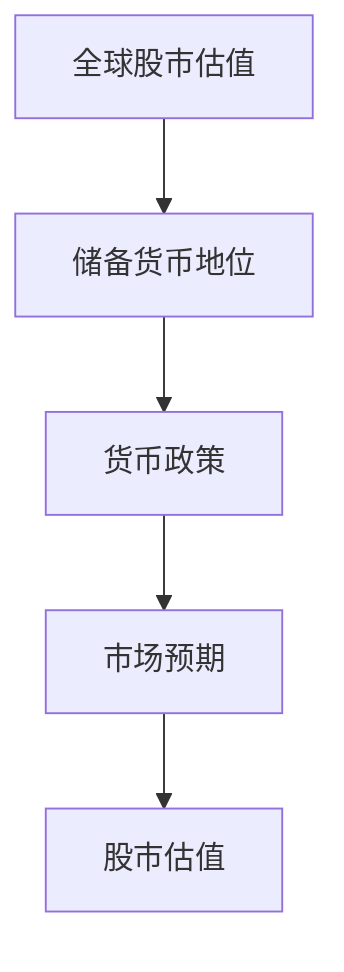

                 


# 全球股市估值与国际储备货币地位的互动

## 关键词：全球股市估值，国际储备货币，互动关系，货币政策，经济影响，投资策略

## 摘要：  
本文探讨了全球股市估值与国际储备货币地位之间的互动关系，分析了影响这一互动的主要因素，包括宏观经济指标、货币政策和市场参与者的预期。通过建立数学模型和实证分析，本文揭示了储备货币地位变化如何影响股市估值，以及股市估值波动如何反过来影响储备货币的国际地位。文章还提出了基于互动关系的投资策略和风险管理框架，为投资者和政策制定者提供了实用的参考。

---

## 第一部分: 全球股市估值与国际储备货币地位的背景介绍

### 第1章: 全球股市估值的基本概念

#### 1.1 股市估值的定义与计算方法
股市估值是指对股票市场价格进行评估和预测的过程。常用的估值方法包括市盈率（P/E）、市净率（P/B）、股息率等指标。这些指标帮助投资者判断股票是否被高估或低估。

#### 1.2 全球股市估值的指标体系
全球股市估值涉及多个指标，包括：
- **市场指数**：如标普500、道琼斯指数、MSCI指数等。
- **估值指标**：如市盈率、市净率、股息率等。
- **市场情绪指标**：如投资者信心指数、恐慌指数（VIX）。

#### 1.3 全球股市估值的区域差异
不同地区的股市估值受到本地经济、政策和市场结构的影响。例如，新兴市场通常具有较高的市盈率，而成熟市场则市盈率较低。

### 第2章: 国际储备货币的基本概念

#### 2.1 储备货币的定义与特征
储备货币是指被多个国家用作国际交易和储备的主要货币。主要储备货币包括美元、欧元、英镑和日元等。储备货币的特征包括稳定性、流通性和广泛接受性。

#### 2.2 储备货币的演变历程
储备货币的主导地位经历了多次变化，从英镑到美元，再到欧元的崛起，反映了国际政治经济格局的变化。

#### 2.3 储备货币的国际地位与影响
储备货币的国际地位影响其汇率稳定性、国际贸易结算和全球资本流动。

### 第3章: 互动背景与研究意义

#### 3.1 全球化背景下的金融一体化
全球化促进了资本的自由流动，使得储备货币与股市估值之间的互动更加频繁和复杂。

#### 3.2 储备货币地位对股市估值的影响
储备货币地位的变化直接影响汇率和资本流动，进而影响股市估值。

#### 3.3 研究互动机制的现实意义
理解储备货币与股市估值的互动关系，有助于投资者制定更有效的投资策略，也有助于政策制定者制定更合理的货币政策。

---

## 第二部分: 全球股市估值与国际储备货币地位的核心概念与联系

### 第4章: 核心概念的原理分析

#### 4.1 股市估值的核心驱动因素
- **宏观经济因素**：GDP增长率、通胀率、利率等。
- **企业盈利**：企业的盈利能力直接影响股票价格。
- **市场情绪**：投资者情绪波动会影响股市估值。

#### 4.2 储备货币地位的决定因素
- **经济实力**：国家的经济规模和增长潜力。
- **货币政策**：央行的货币政策和利率水平。
- **国际信任**：市场对货币发行国的信任度。

#### 4.3 互动关系的内在逻辑
储备货币地位的变化会影响汇率和资本流动，进而影响股市估值；而股市估值的变化也会影响市场对储备货币的信心。

### 第5章: 核心概念的对比分析

#### 5.1 核心概念属性对比表
| 属性                | 全球股市估值           | 国际储备货币地位       |
|---------------------|-----------------------|-----------------------|
| 定义                | 股票价格的评估与预测   | 主要用于国际交易的货币 |
| 主要影响因素        | 宏观经济、企业盈利、市场情绪 | 经济实力、货币政策、国际信任 |
| 衡量指标            | 市盈率、市净率等       | 汇率、外汇储备、国际支付占比 |

#### 5.2 实体关系图


---

## 第三部分: 全球股市估值与国际储备货币地位的互动机制分析

### 第6章: 互动机制的直接分析

#### 6.1 汇率波动对股市估值的影响
储备货币的汇率变化直接影响跨国公司的利润和股价。例如，美元贬值可能导致美国公司出口增加，从而提升股价。

#### 6.2 资本流动的影响
储备货币地位的变化会影响资本流动，进而影响股市估值。例如，美元作为主要储备货币，其地位上升可能导致更多的国际资本流入美国股市。

#### 6.3 资产配置的影响
投资者通常会根据储备货币的变化调整资产配置。例如，当美元地位上升时，投资者可能增加对美国股市的投资。

### 第7章: 互动机制的间接分析

#### 7.1 货币政策的影响
央行的货币政策（如降息、加息）会影响储备货币的流动性，进而影响股市估值。例如，美联储的降息政策可能导致美元贬值，进而影响股市估值。

#### 7.2 市场情绪的影响
储备货币地位的变化会影响市场情绪，进而影响股市估值。例如，当美元地位下降时，市场可能对全球经济感到担忧，导致股市估值下降。

#### 7.3 预期引导的影响
市场对储备货币地位的预期会影响股市估值。例如，如果市场预期美元地位将上升，投资者可能会增加对美元资产的投资，从而推高股市估值。

---

## 第四部分: 全球股市估值与国际储备货币地位的影响因素分析

### 第8章: 宏观经济因素分析

#### 8.1 经济增长与储备货币地位
经济实力是决定储备货币地位的核心因素。例如，美国的经济实力使其成为全球主要的储备货币发行国。

#### 8.2 通胀与股市估值
通胀率的变化会影响股市估值。高通胀可能导致股市估值下降，而低通胀则可能提升股市估值。

#### 8.3 利率与互动关系
利率水平影响储备货币的吸引力，进而影响股市估值。例如，低利率政策可能导致更多的资本流入股市。

### 第9章: 政策因素分析

#### 9.1 货币政策的影响
央行的货币政策直接影响储备货币的流动性，进而影响股市估值。例如，量化宽松政策可能导致股市估值上升。

#### 9.2 财政政策的影响
财政政策通过影响经济基本面，间接影响储备货币地位和股市估值。例如，大规模财政刺激可能导致股市估值上升。

#### 9.3 国际政策协调
国际政策协调（如汇率政策）会影响储备货币的相对地位，进而影响股市估值。

### 第10章: 市场参与者预期的影响

#### 10.1 投资者预期与互动关系
投资者对储备货币地位的预期会影响股市估值。例如，如果投资者预期美元地位将上升，可能会增加对美国股市的投资。

#### 10.2 市场情绪与互动关系
市场情绪的变化会影响储备货币地位和股市估值的互动关系。例如，市场恐慌可能导致储备货币地位下降，进而影响股市估值。

---

## 第五部分: 全球股市估值与国际储备货币地位的实证分析

### 第11章: 实证分析方法

#### 11.1 数据来源与处理
- 数据来源：全球股市指数、储备货币汇率数据、宏观经济指标。
- 数据处理：数据清洗、标准化处理。

#### 11.2 模型选择
- 使用回归模型分析储备货币地位对股市估值的影响。
- 使用时间序列分析方法研究互动关系。

#### 11.3 实证结果
- 数据显示，储备货币地位的变化对股市估值有显著影响。
- 股市估值的变化也会影响市场对储备货币的信心。

### 第12章: 历史案例分析

#### 12.1 主要经济体的案例
- 美国：美元地位变化对美国股市的影响。
- 欧元区：欧元地位变化对欧洲股市的影响。

#### 12.2 长期趋势分析
- 储备货币地位与股市估值的长期趋势。
- 周期性波动的规律。

---

## 第六部分: 投资策略与风险管理

### 第13章: 基于互动关系的投资策略

#### 13.1 投资策略的制定
- 根据储备货币地位的变化调整资产配置。
- 在储备货币地位上升时，增加对相应股市的投资。

#### 13.2 风险管理框架
- 设置止损点。
- 分散投资以降低风险。

### 第14章: 投资策略的实施

#### 14.1 投资组合优化
- 根据储备货币地位变化优化投资组合。
- 选择具有较强抗风险能力的资产。

#### 14.2 风险管理工具
- 使用期权、期货等工具对冲风险。
- 定期评估投资组合的风险敞口。

### 第15章: 实际案例分析

#### 15.1 美元地位变化的案例
- 美元地位下降时，投资者可能增加对新兴市场的投资。

#### 15.2 欧元地位变化的案例
- 欧元地位上升时，投资者可能增加对欧洲股市的投资。

---

## 第七部分: 数学模型与系统架构

### 第16章: 数学模型

#### 16.1 回归模型
$$ \text{Stock Value} = \beta_0 + \beta_1 \times \text{Reserve Currency Status} + \epsilon $$

#### 16.2 时间序列模型
$$ \text{Stock Value}_t = \alpha \times \text{Stock Value}_{t-1} + \gamma \times \text{Reserve Currency Status}_t + \delta $$

### 第17章: 系统架构

#### 17.1 系统功能设计
- 数据采集：获取全球股市数据和储备货币数据。
- 数据分析：使用回归模型和时间序列模型进行分析。
- 结果展示：生成可视化报告。

#### 17.2 系统架构图


---

## 第八部分: 项目实战

### 第18章: 项目环境安装

#### 18.1 环境要求
- Python 3.8+
- 数据处理工具：Pandas、NumPy。
- 可视化工具：Matplotlib、Seaborn。
- 回归分析工具：Statsmodels。

### 第19章: 核心代码实现

#### 19.1 数据获取与处理
```python
import pandas as pd
import numpy as np

# 获取全球股市数据
stock_data = pd.read_csv('global_stocks.csv')

# 获取储备货币数据
reserve_data = pd.read_csv('reserve_currency.csv')

# 数据清洗
stock_data.dropna(inplace=True)
reserve_data.dropna(inplace=True)
```

#### 19.2 回归分析
```python
import statsmodels.api as sm

# 构建回归模型
model = sm.OLS(stock_data['value'], sm.add_constant(reserve_data['status']))
result = model.fit()

# 输出结果
print(result.summary())
```

#### 19.3 可视化
```python
import matplotlib.pyplot as plt

# 绘制散点图
plt.scatter(reserve_data['status'], stock_data['value'])
plt.xlabel('Reserve Currency Status')
plt.ylabel('Stock Value')
plt.show()
```

### 第20章: 项目小结

#### 20.1 项目成果
- 成功建立储备货币地位与股市估值的回归模型。
- 通过实证分析验证了互动关系。

#### 20.2 经验总结
- 数据清洗和特征选择对模型性能至关重要。
- 可视化结果有助于更好地理解互动关系。

---

## 第九部分: 总结与展望

### 第21章: 总结

#### 21.1 核心观点回顾
- 储备货币地位与股市估值之间存在复杂的互动关系。
- 宏观经济因素、货币政策和市场预期是主要影响因素。

#### 21.2 研究意义
- 为投资者制定投资策略提供了理论依据。
- 为政策制定者制定货币政策提供了参考。

### 第22章: 展望

#### 22.1 未来研究方向
- 更深入地研究储备货币地位变化的滞后效应。
- 探讨不同地区储备货币地位变化对股市估值的差异化影响。

#### 22.2 对投资人的建议
- 长期投资者应关注宏观经济趋势。
- 短期投资者应关注市场情绪和政策变化。

---

## 结语

全球股市估值与国际储备货币地位的互动关系是一个复杂而重要的课题。通过本文的分析，读者可以更好地理解这一互动关系，并在实际投资中加以应用。未来的研究可以进一步探索这一领域的更多细节，为投资者和政策制定者提供更有力的支持。

