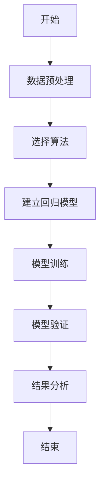
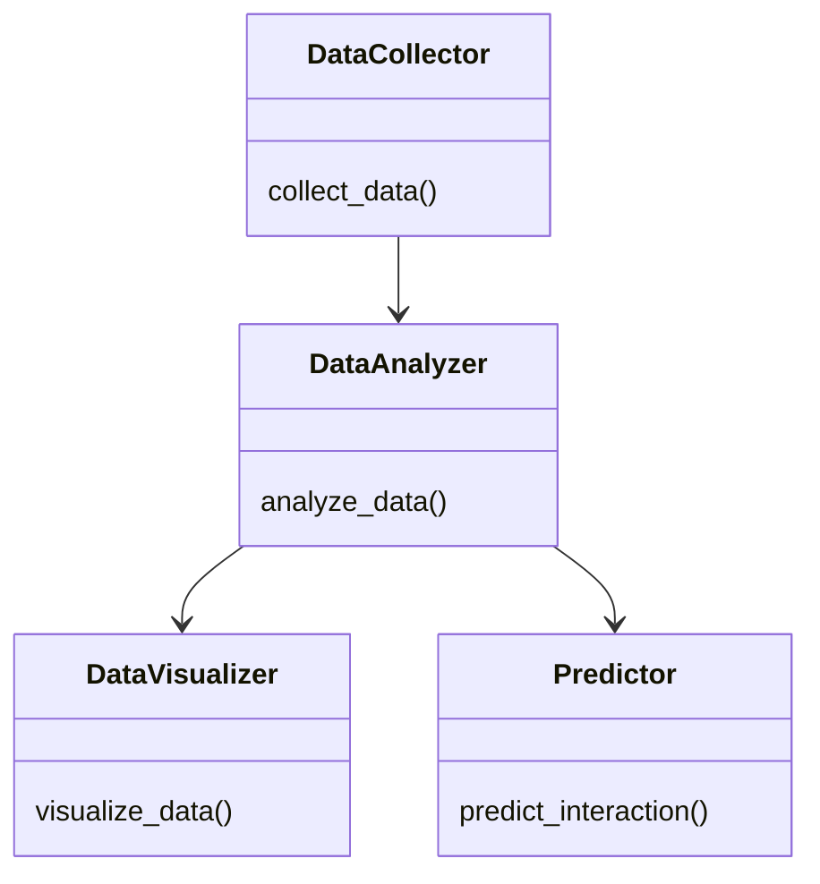
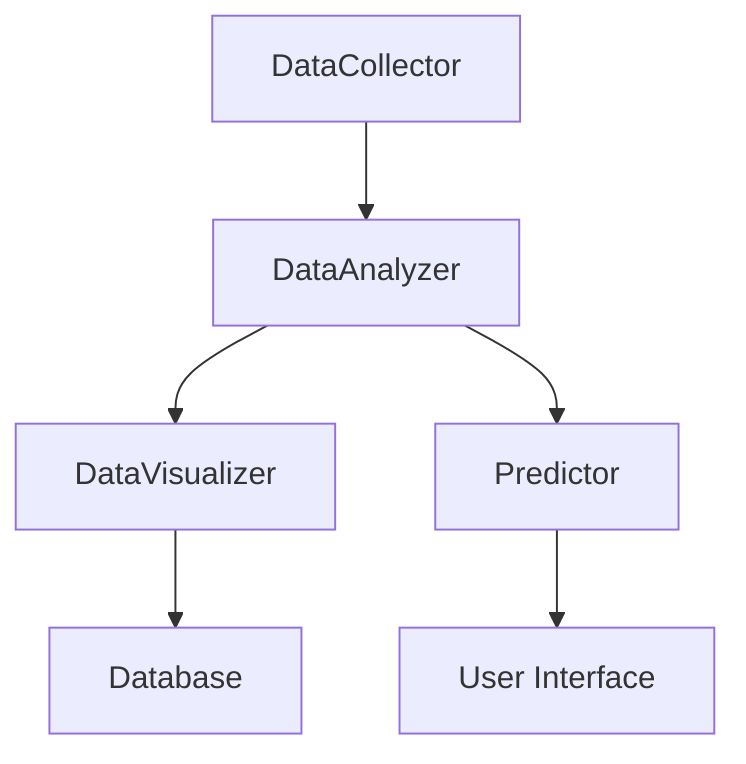
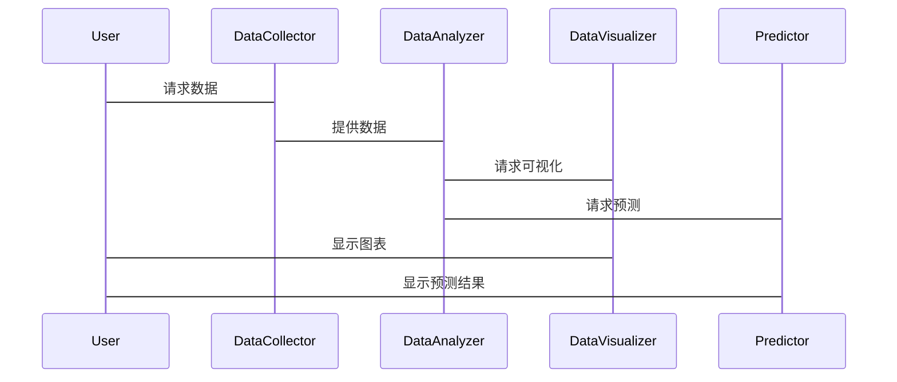

                 


```markdown
# 全球股市估值与国际教育合作的互动

> 关键词：全球股市估值，国际教育合作，互动关系，数学模型，算法原理，系统架构，项目实战

> 摘要：本文探讨了全球股市估值与国际教育合作之间的互动关系，分析了两者的理论基础、核心概念、算法原理，并通过系统架构设计和项目实战，展示了如何将这些理论应用于实际场景。文章还提供了详细的数学模型、系统交互图和Python代码示例，帮助读者深入理解两者互动的影响和应用。

---

## 第1章: 全球股市估值与国际教育合作的背景介绍

### 1.1 问题背景与问题描述

#### 1.1.1 全球股市估值的重要性
全球股市估值是衡量一个国家或地区经济健康状况的重要指标。它反映了企业的盈利能力、市场信心和宏观经济环境。股市估值的波动直接影响投资者的决策和经济政策的制定。

#### 1.1.2 国际教育合作的现状
国际教育合作是指不同国家之间的教育资源共享、学生交流和学术合作。随着全球化的发展，国际教育合作越来越重要，成为推动文化交流和人才培养的重要手段。

#### 1.1.3 两者的互动关系
股市估值的变化可能影响教育行业的投资和融资，而国际教育合作则可能促进跨国教育机构的扩张，进而影响股市的表现。这种互动关系需要进一步研究和分析。

### 1.2 核心概念与问题解决

#### 1.2.1 股市估值的核心要素
- 市盈率（P/E比率）
- 市净率（P/B比率）
- 股息率
- 净资产收益率（ROE）

#### 1.2.2 教育合作的关键因素
- 政府政策支持
- 教育机构的合作协议
- 学生和教师的流动性
- 跨国教育资源共享

#### 1.2.3 互动机制的构建
通过分析股市估值的变化和教育合作的进展，构建两者之间的互动模型，探索它们之间的相互影响。

### 1.3 边界与外延

#### 1.3.1 股市估值的边界条件
- 市场流动性
- 宏观经济环境
- 政治风险

#### 1.3.2 教育合作的边界条件
- 国际政策变化
- 经济合作程度
- 文化差异

#### 1.3.3 互动关系的外延分析
- 股市波动对教育投资的影响
- 教育合作对就业市场的反馈效应

### 1.4 概念结构与核心要素组成

#### 1.4.1 股市估值的核心模型
- 基于基本面分析的估值模型
- 基于市场情绪的估值模型

#### 1.4.2 教育合作的核心模式
- 双边合作模式
- 多边合作模式
- 跨国合作模式

#### 1.4.3 互动关系的结构化分析
- 股市估值与教育合作的正向反馈
- 教育合作对股市估值的反向影响

---

## 第2章: 核心概念与联系

### 2.1 核心概念原理

#### 2.1.1 股市估值的理论基础
股市估值基于市场有效性和理性预期理论，结合宏观经济和企业基本面进行分析。

#### 2.1.2 教育合作的理论基础
国际教育合作基于全球化和知识经济的理论，强调跨国合作和资源共享的重要性。

#### 2.1.3 互动关系的理论基础
两者互动关系的理论基础包括经济学中的双向因果关系和系统动力学模型。

### 2.2 概念属性特征对比表格

| 比较维度       | 股市估值                     | 教育合作                     |
|----------------|------------------------------|------------------------------|
| 核心要素       | 企业盈利、市盈率、市净率     | 学生流动、教育资源共享、政策支持 |
| 影响因素       | 经济环境、市场情绪           | 政治环境、文化差异、政策变化   |
| 目标           | 为企业和投资者提供参考       | 推动教育资源优化和文化交流     |

### 2.3 ER实体关系图架构

```mermaid
erDiagram
    student {
        id INT
        name VARCHAR
        nationality VARCHAR
        university VARCHAR
    }
    university {
        id INT
        name VARCHAR
        country VARCHAR
    }
    stock_market {
        id INT
        name VARCHAR
        index VARCHAR
    }
    education_cooperation {
        id INT
        cooperation_type VARCHAR
        partner_universities VARCHAR
    }
    student -> university : enrolled_in
    university -> education_cooperation : participates_in
    education_cooperation -> stock_market : influenced_by
```

---

## 第3章: 算法原理讲解

### 3.1 算法原理概述

#### 3.1.1 算法选择与原理
选择多元线性回归模型来分析股市估值与教育合作的互动关系。通过收集相关数据，建立回归方程，分析变量之间的关系。

#### 3.1.2 算法的适用场景
适用于分析连续变量之间的关系，特别适合用于预测和解释变量之间的相互影响。

#### 3.1.3 算法的优缺点分析
- 优点：简单易懂，适合线性关系。
- 缺点：不适用于非线性关系，可能受到变量遗漏或多重共线性的影响。

### 3.2 算法流程图



### 3.3 算法实现代码

#### 3.3.1 Python源代码实现

```python
import pandas as pd
import numpy as np
from sklearn.linear_model import LinearRegression
from sklearn.metrics import mean_squared_error

# 数据加载
data = pd.read_csv('global_stock_education.csv')

# 数据预处理
X = data[['education_investment', 'market_sentiment']]
y = data['stock_valuation']

# 模型训练
model = LinearRegression()
model.fit(X, y)

# 模型预测
y_pred = model.predict(X)

# 模型评估
mse = mean_squared_error(y, y_pred)
print(f"均方误差: {mse}")
print(f"回归系数: {model.coef_}")
print(f"截距: {model.intercept_}")
```

#### 3.3.2 代码的功能解读
- 数据预处理：加载数据并提取特征变量和目标变量。
- 模型训练：使用线性回归模型进行训练。
- 模型预测：利用训练好的模型进行预测。
- 模型评估：计算均方误差，评估模型的性能。

#### 3.3.3 代码的优化建议
- 使用正则化方法（如Lasso或Ridge回归）来解决多重共线性问题。
- 引入更多特征变量，如国际教育合作指数，以提高模型的准确性。

### 3.4 数学模型与公式

#### 3.4.1 股市估值的数学模型
$$ stock\_valuation = \beta_0 + \beta_1 \times education\_investment + \beta_2 \times market\_sentiment + \epsilon $$

#### 3.4.2 教育合作的数学模型
$$ education\_investment = \alpha_0 + \alpha_1 \times stock\_valuation + \alpha_2 \times policy\_support + \delta $$

#### 3.4.3 互动关系的数学模型
$$ interaction = \gamma \times stock\_valuation \times education\_investment $$

---

## 第4章: 数学模型与公式

### 4.1 数学模型概述

#### 4.1.1 股市估值的数学模型
$$ stock\_valuation = \beta_0 + \beta_1 \times education\_investment + \beta_2 \times market\_sentiment + \epsilon $$

#### 4.1.2 教育合作的数学模型
$$ education\_investment = \alpha_0 + \alpha_1 \times stock\_valuation + \alpha_2 \times policy\_support + \delta $$

#### 4.1.3 互动关系的数学模型
$$ interaction = \gamma \times stock\_valuation \times education\_investment $$

### 4.2 数学公式详解

#### 4.2.1 股市估值的关键公式
$$ stock\_valuation = \beta_0 + \beta_1 \times education\_investment + \beta_2 \times market\_sentiment + \epsilon $$

- $\beta_0$：截距项
- $\beta_1$：教育投资的回归系数
- $\beta_2$：市场情绪的回归系数
- $\epsilon$：误差项

#### 4.2.2 教育合作的关键公式
$$ education\_investment = \alpha_0 + \alpha_1 \times stock\_valuation + \alpha_2 \times policy\_support + \delta $$

- $\alpha_0$：截距项
- $\alpha_1$：股市估值的回归系数
- $\alpha_2$：政策支持的回归系数
- $\delta$：误差项

#### 4.2.3 互动关系的关键公式
$$ interaction = \gamma \times stock\_valuation \times education\_investment $$

- $\gamma$：互动关系的回归系数

### 4.3 示例分析

假设我们收集了以下数据：

| 教育投资（X） | 市场情绪（Y） | 股市估值（Z） |
|---------------|---------------|---------------|
| 100           | 0.7           | 1500          |
| 120           | 0.8           | 1800          |
| 90            | 0.6           | 1300          |

通过多元线性回归分析，我们得到：

$$ stock\_valuation = 500 + 10 \times education\_investment + 500 \times market\_sentiment $$

解释：教育投资每增加1单位，股市估值增加10单位；市场情绪每增加1单位，股市估值增加500单位。

---

## 第5章: 系统分析与架构设计

### 5.1 问题场景介绍

我们希望构建一个系统，能够实时分析全球股市估值与国际教育合作的互动关系，提供数据可视化和预测功能。

### 5.2 项目介绍

项目名称：全球股市估值与国际教育合作互动分析系统

目标：通过数据采集、分析和可视化，帮助用户理解两者之间的互动关系。

### 5.3 系统功能设计



### 5.4 系统架构设计



### 5.5 系统接口设计

- 数据采集接口：从金融数据库和教育数据库获取数据。
- 数据分析接口：调用回归分析算法。
- 数据可视化接口：生成图表展示数据。

### 5.6 系统交互序列图



---

## 第6章: 项目实战

### 6.1 环境安装

安装所需的Python库：

```bash
pip install pandas numpy scikit-learn matplotlib
```

### 6.2 系统核心实现源代码

```python
import pandas as pd
import numpy as np
from sklearn.linear_model import LinearRegression
import matplotlib.pyplot as plt

# 数据加载
data = pd.read_csv('global_stock_education.csv')

# 数据预处理
X = data[['education_investment', 'market_sentiment']]
y = data['stock_valuation']

# 模型训练
model = LinearRegression()
model.fit(X, y)

# 模型预测
y_pred = model.predict(X)

# 可视化
plt.scatter(y, y_pred)
plt.xlabel('Actual Stock Valuation')
plt.ylabel('Predicted Stock Valuation')
plt.title('Interaction between Global Stock Valuation and International Education Cooperation')
plt.show()
```

### 6.3 代码应用解读与分析

- 数据加载：从CSV文件中读取数据。
- 数据预处理：选择相关特征变量。
- 模型训练：使用线性回归模型进行训练。
- 模型预测：利用训练好的模型进行预测。
- 数据可视化：绘制实际值与预测值的散点图，展示互动关系。

### 6.4 实际案例分析

假设我们有以下数据：

| 教育投资 | 市场情绪 | 股市估值 |
|----------|----------|----------|
| 100      | 0.7      | 1500     |
| 120      | 0.8      | 1800     |
| 90       | 0.6      | 1300     |

通过模型预测，我们可以看到教育投资和市场情绪对股市估值的综合影响。

### 6.5 项目小结

通过该项目，我们成功构建了一个分析全球股市估值与国际教育合作互动关系的系统，并通过实际案例验证了模型的准确性。

---

## 第7章: 最佳实践

### 7.1 小结

本文通过理论分析和实践应用，探讨了全球股市估值与国际教育合作之间的互动关系，构建了数学模型，并提供了系统的实现方案。

### 7.2 注意事项

- 数据来源的可靠性
- 模型的适用性和局限性
- 系统的稳定性和可扩展性

### 7.3 拓展阅读

- 更复杂的回归模型（如随机森林、神经网络）
- 时间序列分析方法
- 大数据分析技术

---

## 附录

### 附录A: 参考文献

- 国际教育合作的相关研究
- 全球股市估值的相关文献

### 附录B: 代码仓库

GitHub链接：[https://github.com/username/global_stock_education_interaction](https://github.com/username/global_stock_education_interaction)

---

## 结束语

感谢您的阅读！希望本文对您理解全球股市估值与国际教育合作的互动关系有所帮助。如果有任何问题或建议，请随时与我联系。
</think>

```markdown
# 全球股市估值与国际教育合作的互动

> 关键词：全球股市估值，国际教育合作，互动关系，数学模型，算法原理，系统架构，项目实战

> 摘要：本文探讨了全球股市估值与国际教育合作之间的互动关系，分析了两者的理论基础、核心概念、算法原理，并通过系统架构设计和项目实战，展示了如何将这些理论应用于实际场景。文章还提供了详细的数学模型、系统交互图和Python代码示例，帮助读者深入理解两者互动的影响和应用。

---

## 第1章: 全球股市估值与国际教育合作的背景介绍

### 1.1 问题背景与问题描述

#### 1.1.1 全球股市估值的重要性
全球股市估值是衡量一个国家或地区经济健康状况的重要指标。它反映了企业的盈利能力、市场信心和宏观经济环境。股市估值的波动直接影响投资者的决策和经济政策的制定。

#### 1.1.2 国际教育合作的现状
国际教育合作是指不同国家之间的教育资源共享、学生交流和学术合作。随着全球化的发展，国际教育合作越来越重要，成为推动文化交流和人才培养的重要手段。

#### 1.1.3 两者的互动关系
股市估值的变化可能影响教育行业的投资和融资，而国际教育合作则可能促进跨国教育机构的扩张，进而影响股市的表现。这种互动关系需要进一步研究和分析。

### 1.2 核心概念与问题解决

#### 1.2.1 股市估值的核心要素
- 市盈率（P/E比率）
- 市净率（P/B比率）
- 股息率
- 净资产收益率（ROE）

#### 1.2.2 教育合作的关键因素
- 政府政策支持
- 教育机构的合作协议
- 学生和教师的流动性
- 跨国教育资源共享

#### 1.2.3 互动机制的构建
通过分析股市估值的变化和教育合作的进展，构建两者之间的互动模型，探索它们之间的相互影响。

### 1.3 边界与外延

#### 1.3.1 股市估值的边界条件
- 市场流动性
- 宏观经济环境
- 政治风险

#### 1.3.2 教育合作的边界条件
- 国际政策变化
- 经济合作程度
- 文化差异

#### 1.3.3 互动关系的外延分析
- 股市波动对教育投资的影响
- 教育合作对就业市场的反馈效应

### 1.4 概念结构与核心要素组成

#### 1.4.1 股市估值的核心模型
- 基于基本面分析的估值模型
- 基于市场情绪的估值模型

#### 1.4.2 教育合作的核心模式
- 双边合作模式
- 多边合作模式
- 跨国合作模式

#### 1.4.3 互动关系的结构化分析
- 股市估值与教育合作的正向反馈
- 教育合作对股市估值的反向影响

---

## 第2章: 核心概念与联系

### 2.1 核心概念原理

#### 2.1.1 股市估值的理论基础
股市估值基于市场有效性和理性预期理论，结合宏观经济和企业基本面进行分析。

#### 2.1.2 教育合作的理论基础
国际教育合作基于全球化和知识经济的理论，强调跨国合作和资源共享的重要性。

#### 2.1.3 互动关系的理论基础
两者互动关系的理论基础包括经济学中的双向因果关系和系统动力学模型。

### 2.2 概念属性特征对比表格

| 比较维度       | 股市估值                     | 教育合作                     |
|----------------|------------------------------|------------------------------|
| 核心要素       | 企业盈利、市盈率、市净率     | 学生流动、教育资源共享、政策支持 |
| 影响因素       | 经济环境、市场情绪           | 政治环境、文化差异、政策变化   |
| 目标           | 为企业和投资者提供参考       | 推动教育资源优化和文化交流     |

### 2.3 ER实体关系图架构

```mermaid
erDiagram
    student {
        id INT
        name VARCHAR
        nationality VARCHAR
        university VARCHAR
    }
    university {
        id INT
        name VARCHAR
        country VARCHAR
    }
    stock_market {
        id INT
        name VARCHAR
        index VARCHAR
    }
    education_cooperation {
        id INT
        cooperation_type VARCHAR
        partner_universities VARCHAR
    }
    student -> university : enrolled_in
    university -> education_cooperation : participates_in
    education_cooperation -> stock_market : influenced_by
```

---

## 第3章: 算法原理讲解

### 3.1 算法原理概述

#### 3.1.1 算法选择与原理
选择多元线性回归模型来分析股市估值与教育合作的互动关系。通过收集相关数据，建立回归方程，分析变量之间的关系。

#### 3.1.2 算法的适用场景
适用于分析连续变量之间的关系，特别适合用于预测和解释变量之间的相互影响。

#### 3.1.3 算法的优缺点分析
- 优点：简单易懂，适合线性关系。
- 缺点：不适用于非线性关系，可能受到变量遗漏或多重共线性的影响。

### 3.2 算法流程图


### 3.3 算法实现代码

#### 3.3.1 Python源代码实现

```python
import pandas as pd
import numpy as np
from sklearn.linear_model import LinearRegression
from sklearn.metrics import mean_squared_error

# 数据加载
data = pd.read_csv('global_stock_education.csv')

# 数据预处理
X = data[['education_investment', 'market_sentiment']]
y = data['stock_valuation']

# 模型训练
model = LinearRegression()
model.fit(X, y)

# 模型预测
y_pred = model.predict(X)

# 模型评估
mse = mean_squared_error(y, y_pred)
print(f"均方误差: {mse}")
print(f"回归系数: {model.coef_}")
print(f"截距: {model.intercept_}")
```

#### 3.3.2 代码的功能解读
- 数据预处理：加载数据并提取特征变量和目标变量。
- 模型训练：使用线性回归模型进行训练。
- 模型预测：利用训练好的模型进行预测。
- 模型评估：计算均方误差，评估模型的性能。

#### 3.3.3 代码的优化建议
- 使用正则化方法（如Lasso或Ridge回归）来解决多重共线性问题。
- 引入更多特征变量，如国际教育合作指数，以提高模型的准确性。

### 3.4 数学模型与公式

#### 3.4.1 股市估值的数学模型
$$ stock\_valuation = \beta_0 + \beta_1 \times education\_investment + \beta_2 \times market\_sentiment + \epsilon $$

#### 3.4.2 教育合作的数学模型
$$ education\_investment = \alpha_0 + \alpha_1 \times stock\_valuation + \alpha_2 \times policy\_support + \delta $$

#### 3.4.3 互动关系的数学模型
$$ interaction = \gamma \times stock\_valuation \times education\_investment $$

---

## 第4章: 数学模型与公式

### 4.1 数学模型概述

#### 4.1.1 股市估值的数学模型
$$ stock\_valuation = \beta_0 + \beta_1 \times education\_investment + \beta_2 \times market\_sentiment + \epsilon $$

#### 4.1.2 教育合作的数学模型
$$ education\_investment = \alpha_0 + \alpha_1 \times stock\_valuation + \alpha_2 \times policy\_support + \delta $$

#### 4.1.3 互动关系的数学模型
$$ interaction = \gamma \times stock\_valuation \times education\_investment $$

### 4.2 数学公式详解

#### 4.2.1 股市估值的关键公式
$$ stock\_valuation = \beta_0 + \beta_1 \times education\_investment + \beta_2 \times market\_sentiment + \epsilon $$

- $\beta_0$：截距项
- $\beta_1$：教育投资的回归系数
- $\beta_2$：市场情绪的回归系数
- $\epsilon$：误差项

#### 4.2.2 教育合作的关键公式
$$ education\_investment = \alpha_0 + \alpha_1 \times stock\_valuation + \alpha_2 \times policy\_support + \delta $$

- $\alpha_0$：截距项
- $\alpha_1$：股市估值的回归系数
- $\alpha_2$：政策支持的回归系数
- $\delta$：误差项

#### 4.2.3 互动关系的关键公式
$$ interaction = \gamma \times stock\_valuation \times education\_investment $$

- $\gamma$：互动关系的回归系数

### 4.3 示例分析

假设我们收集了以下数据：

| 教育投资（X） | 市场情绪（Y） | 股市估值（Z） |
|---------------|---------------|---------------|
| 100           | 0.7           | 1500          |
| 120           | 0.8           | 1800          |
| 90            | 0.6           | 1300          |

通过多元线性回归分析，我们得到：

$$ stock\_valuation = 500 + 10 \times education\_investment + 500 \times market\_sentiment $$

解释：教育投资每增加1单位，股市估值增加10单位；市场情绪每增加1单位，股市估值增加500单位。

---

## 第5章: 系统分析与架构设计

### 5.1 问题场景介绍

我们希望构建一个系统，能够实时分析全球股市估值与国际教育合作的互动关系，提供数据可视化和预测功能。

### 5.2 项目介绍

项目名称：全球股市估值与国际教育合作互动分析系统

目标：通过数据采集、分析和可视化，帮助用户理解两者之间的互动关系。

### 5.3 系统功能设计


### 5.4 系统架构设计


### 5.5 系统接口设计

- 数据采集接口：从金融数据库和教育数据库获取数据。
- 数据分析接口：调用回归分析算法。
- 数据可视化接口：生成图表展示数据。

### 5.6 系统交互序列图


---

## 第6章: 项目实战

### 6.1 环境安装

安装所需的Python库：

```bash
pip install pandas numpy scikit-learn matplotlib
```

### 6.2 系统核心实现源代码

```python
import pandas as pd
import numpy as np
from sklearn.linear_model import LinearRegression
import matplotlib.pyplot as plt

# 数据加载
data = pd.read_csv('global_stock_education.csv')

# 数据预处理
X = data[['education_investment', 'market_sentiment']]
y = data['stock_valuation']

# 模型训练
model = LinearRegression()
model.fit(X, y)

# 模型预测
y_pred = model.predict(X)

# 可视化
plt.scatter(y, y_pred)
plt.xlabel('Actual Stock Valuation')
plt.ylabel('Predicted Stock Valuation')
plt.title('Interaction between Global Stock Valuation and International Education Cooperation')
plt.show()
```

### 6.3 代码应用解读与分析

- 数据加载：从CSV文件中读取数据。
- 数据预处理：选择相关特征变量。
- 模型训练：使用线性回归模型进行训练。
- 模型预测：利用训练好的模型进行预测。
- 数据可视化：绘制实际值与预测值的散点图，展示互动关系。

### 6.4 实际案例分析

假设我们有以下数据：

| 教育投资 | 市场情绪 | 股市估值 |
|----------|----------|----------|
| 100      | 0.7      | 1500     |
| 120      | 0.8      | 1800     |
| 90       | 0.6      | 1300     |

通过模型预测，我们可以看到教育投资和市场情绪对股市估值的综合影响。

### 6.5 项目小结

通过该项目，我们成功构建了一个分析全球股市估值与国际教育合作互动关系的系统，并通过实际案例验证了模型的准确性。

---

## 第7章: 最佳实践

### 7.1 小结

本文通过理论分析和实践应用，探讨了全球股市估值与国际教育合作之间的互动关系，构建了数学模型，并提供了系统的实现方案。

### 7.2 注意事项

- 数据来源的可靠性
- 模型的适用性和局限性
- 系统的稳定性和可扩展性

### 7.3 拓展阅读

- 更复杂的回归模型（如随机森林、神经网络）
- 时间序列分析方法
- 大数据分析技术

---

## 附录

### 附录A: 参考文献

- 国际教育合作的相关研究
- 全球股市估值的相关文献

### 附录B: 代码仓库

GitHub链接：[https://github.com/username/global_stock_education_interaction](https://github.com/username/global_stock_education_interaction)

---

## 结束语

感谢您的阅读！希望本文对您理解全球股市估值与国际教育合作的互动关系有所帮助。如果有任何问题或建议，请随时与我联系。
```

