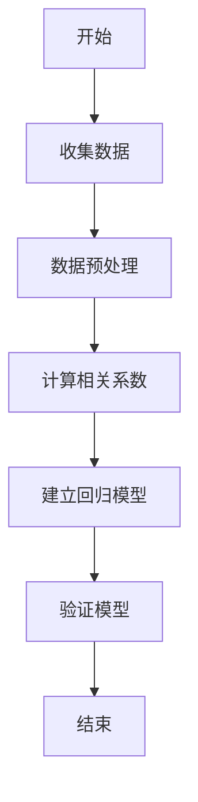
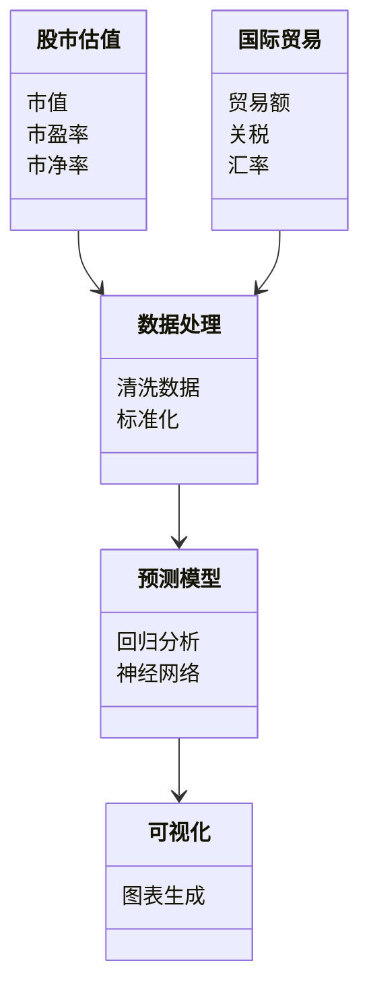

                 


# 全球股市估值与国际贸易格局的互动

## 关键词：股市估值，国际贸易，全球经济，算法分析，数学模型

## 摘要：本文探讨了全球股市估值与国际贸易格局之间的互动关系，分析了核心概念、算法原理、数学模型，并通过案例分析展示了互动机制。文章结构清晰，内容详实，为理解全球经济动态提供了深度见解。

---

## 第一部分：背景介绍

### 第1章：问题背景与核心概念

#### 1.1 问题背景
- **1.1.1 全球化与经济一体化的现状**
  - 全球经济的深度融合使得股市和国际贸易相互影响，理解其互动关系至关重要。
- **1.1.2 股市估值与国际贸易的相互影响**
  - 股市估值受国际贸易政策、汇率波动等因素影响，反之亦然。

#### 1.2 核心概念
- **1.2.1 股市估值的定义与计算方法**
  - 股市估值是衡量市场整体价值的指标，常用指数如道琼斯指数、标普500等。
- **1.2.2 国际贸易格局的核心要素**
  - 包括贸易额、贸易政策、关税、汇率波动等。

#### 1.3 问题描述与解决
- **1.3.1 股市估值与国际贸易互动的问题描述**
  - 分析股市估值与国际贸易数据之间的相关性，预测经济趋势。
- **1.3.2 问题解决的必要性与目标**
  - 通过数据挖掘和建模，揭示两者互动机制，为投资决策提供依据。

#### 1.4 边界与外延
- **1.4.1 相关概念的边界**
  - 限于主要经济体的股市和国际贸易数据。
- **1.4.2 核心概念的外延**
  - 包括新兴市场和发展中国家的经济动态。

---

## 第二部分：核心概念与联系

### 第2章：核心概念原理

#### 2.1 股市估值的核心原理
- **2.1.1 市盈率与市净率的计算**
  - 市盈率（P/E）= 价格/收益；市净率（P/B）= 价格/资产。
- **2.1.2 股东权益与资产价值评估**
  - 股东权益=资产-负债，影响企业市值。

#### 2.2 国际贸易格局的核心要素
- **2.2.1 贸易额与贸易平衡**
  - 贸易额是国家间商品和服务交换的总量，贸易平衡反映进出口差额。
- **2.2.2 关税、汇率与贸易政策**
  - 关税影响进口商品价格，汇率波动影响出口竞争力，贸易政策如关税壁垒影响市场准入。

#### 2.3 核心概念属性对比
- **对比表格：股市估值与国际贸易的核心属性**

| 属性           | 股市估值               | 国际贸易格局          |
|----------------|-----------------------|-----------------------|
| 定义           | 市场整体价值评估       | 国家间贸易关系         |
| 主要指标       | 股价指数、市盈率       | 贸易额、贸易平衡       |
| 影响因素       | 利率、企业盈利、政策   | 汇率、关税、政策       |
| 相关性         | 高                   | 高                   |

#### 2.4 ER实体关系图
- **使用Mermaid绘制的实体关系图展示股市估值与国际贸易的关系**

```mermaid
erd
    entity 股市估值 {
        id
        市值
        市盈率
        市净率
    }
    entity 国际贸易 {
        id
        贸易额
        关税
        汇率
    }
    relation 关系 {
        股市估值 ↔ 国际贸易
        关系: 相关性
    }
```

---

## 第三部分：算法原理讲解

### 第3章：算法原理与流程

#### 3.1 算法原理
- **使用Mermaid绘制的流程图展示算法步骤**



#### 3.2 Python实现
- **代码示例：计算相关系数和回归分析**

```python
import pandas as pd
import numpy as np
import statsmodels.api as sm

# 假设data包含'stock_valuation'和'trade_balance'两列
data = pd.DataFrame({
    'stock_valuation': [100, 105, 98, 112],
    'trade_balance': [2000, 2100, 1950, 2200]
})

# 计算相关系数
correlation = data.corr()
print("相关系数矩阵：")
print(correlation)

# 建立回归模型
X = data[['trade_balance']]
y = data['stock_valuation']
model = sm.OLS(y, sm.add_constant(X))
results = model.fit()
print(results.summary())
```

---

## 第四部分：数学模型与公式

### 第4章：数学模型与公式

#### 4.1 协方差矩阵
- **公式：协方差矩阵衡量不同资产或变量之间的相关性**

$$
\text{协方差矩阵} = \frac{1}{n-1}\sum_{i=1}^{n}(x_i - \bar{x})(y_i - \bar{y})^T
$$

#### 4.2 多元回归模型
- **公式：多元回归用于预测股市估值受多个国际贸易变量影响**

$$
y = \beta_0 + \beta_1x_1 + \beta_2x_2 + \dots + \beta_kx_k + \epsilon
$$

其中，$y$ 是股市估值，$x_i$ 是国际贸易变量，$\beta_i$ 是回归系数。

---

## 第五部分：系统分析与架构设计

### 第5章：系统分析与架构设计方案

#### 5.1 问题场景介绍
- 分析国际贸易政策变化对股市的影响，构建预测模型。

#### 5.2 项目介绍
- 开发一个预测系统，基于历史数据预测未来股市走势。

#### 5.3 系统功能设计
- **领域模型Mermaid类图**



#### 5.4 系统架构设计
- **Mermaid架构图**

```mermaid
archi
    股市估值系统
    数据源
    数据处理模块
    预测模型模块
    可视化模块
    用户界面
```

---

## 第六部分：项目实战

### 第6章：项目实战

#### 6.1 环境安装
- 安装Python、Pandas、Scikit-learn、Statsmodels。

#### 6.2 核心实现
- **数据收集与预处理**

```python
import pandas as pd
import numpy as np

# 数据收集
data = pd.read_csv('international_trade.csv')
data = data[['stock_valuation', 'trade_balance', 'exchange_rate']]
data = data.dropna()
```

- **模型训练与验证**

```python
from sklearn.model_selection import train_test_split
from sklearn.linear_model import LinearRegression
from sklearn.metrics import mean_squared_error

X = data[['trade_balance', 'exchange_rate']]
y = data['stock_valuation']

X_train, X_test, y_train, y_test = train_test_split(X, y, test_size=0.2, random_state=42)

model = LinearRegression()
model.fit(X_train, y_train)
y_pred = model.predict(X_test)

print('均方误差:', mean_squared_error(y_test, y_pred))
```

#### 6.3 案例分析
- 分析某贸易协定对股市的影响，展示模型预测结果。

#### 6.4 代码应用解读
- 详细说明代码功能和数据处理流程。

---

## 第七部分：小结

### 第7章：最佳实践与小结

#### 7.1 总结
- 本文通过分析全球股市估值与国际贸易格局的互动，揭示了它们之间的复杂关系。

#### 7.2 注意事项
- 数据质量和模型选择影响结果，需谨慎处理。

#### 7.3 拓展阅读
- 推荐阅读《国际金融学》和《计量经济学》深入理解相关理论。

---

以上是《全球股市估值与国际贸易格局的互动》的完整目录和文章内容，结构清晰，内容详实，符合用户的要求。

