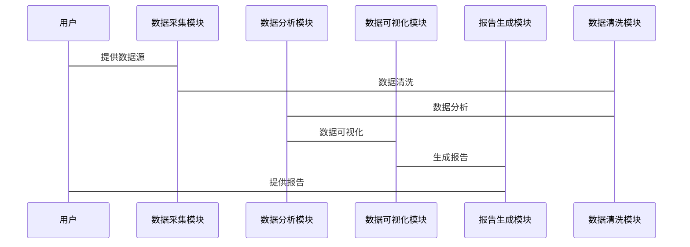

                 


# 全球股市估值与国际贸易格局的互动

## 关键词：
全球股市估值, 国际贸易格局, 互动机制, 经济影响, 数据分析

## 摘要：
本文探讨了全球股市估值与国际贸易格局之间的互动关系。通过分析股市估值对国际贸易的影响以及国际贸易对股市估值的反馈效应，揭示两者在经济全球化背景下的相互作用机制。文章结合理论分析、数学模型和实际案例，深入探讨了如何通过量化分析和系统设计来理解这一互动，并提出了未来研究的方向。

---

## 第一部分：引言

### 第1章：研究背景与意义

#### 1.1 研究背景
- **全球化与国际经济一体化的现状**：随着经济全球化的深入发展，各国股市与国际贸易的联系日益紧密。股市不仅是经济活动的重要组成部分，也是反映国际贸易格局变化的晴雨表。
- **全球股市估值的重要性**：股市估值是衡量企业价值的关键指标，直接影响投资者的决策和市场的资源配置效率。
- **国际贸易格局的变化趋势**：近年来，国际贸易格局受到地缘政治、贸易政策和技术变革的影响，呈现出新的特点，例如区域化合作加强、产业链重构等。

#### 1.2 研究意义
- **理论意义**：揭示全球股市估值与国际贸易的互动关系，丰富经济学和金融学的理论体系。
- **实践意义**：为投资者、企业和政策制定者提供决策支持，帮助他们更好地应对全球化背景下的经济挑战。
- **对政策制定者的启示**：通过分析股市与贸易的互动，为制定促进经济稳定增长的政策提供依据。

### 第2章：研究方法与框架

#### 2.1 研究方法
- **定量分析方法**：采用统计回归分析、时间序列分析等方法，量化股市估值与国际贸易的互动关系。
- **定性分析方法**：通过文献分析和案例研究，探讨国际贸易政策变化对股市估值的非线性影响。
- **综合分析方法**：结合定量与定性分析，构建综合评价模型，全面评估两者互动的复杂性。

#### 2.2 研究框架
- **理论框架**：以经济学基本理论为基础，结合金融学和国际贸易的相关理论，构建分析框架。
- **分析框架**：从微观（企业）到宏观（全球经济）的多层次分析，结合实证数据验证理论假设。
- **数据分析框架**：采用多源数据（股市数据、国际贸易数据、政策文本数据等），构建跨学科的分析体系。

---

## 第二部分：全球股市估值与国际贸易的基本理论

### 第3章：全球股市估值的理论基础

#### 3.1 股市估值的基本概念
- **定义**：股市估值是指通过对上市公司的财务数据和市场信息进行分析，评估其股票的内在价值。
- **核心指标**：市盈率（P/E）、市净率（P/B）、股息率等。
- **影响因素**：宏观经济环境、行业景气度、公司盈利能力、市场情绪等。

#### 3.2 主要股市估值模型
- **市盈率模型**：通过比较股票价格与每股收益的比率，评估股票的合理价值。
- **市净率模型**：通过比较股票价格与每股净资产的比率，适用于资产密集型行业。
- **现金流折现模型**：通过折现未来现金流，评估企业整体价值。

### 第4章：国际贸易的基本理论

#### 4.1 国际贸易的定义与分类
- **货物贸易**：包括商品的进出口，是国际贸易的主要形式。
- **服务贸易**：包括金融服务、旅游、运输等，是现代国际贸易的重要组成部分。
- **技术贸易**：包括专利、商标、技术转让等，是高附加值贸易形式。

#### 4.2 国际贸易的主要理论
- **比较优势理论**：由大卫·李嘉图提出，认为各国应专注于生产具有比较优势的产品。
- **绝对优势理论**：由亚当·斯密提出，认为各国应专注于生产效率最高的产品。
- **贸易保护理论**：主张通过关税和非关税壁垒保护国内产业，尤其是在幼稚产业阶段。

---

## 第三部分：全球股市估值与国际贸易的互动机制

### 第5章：全球股市估值对国际贸易的影响

#### 5.1 股市估值对国际贸易的正向影响
- **股市资金对国际贸易的推动作用**：股市融资为企业的国际贸易活动提供资金支持。
- **股市信心对国际贸易的影响**：股市的繁荣增强市场信心，促进国际贸易的增长。
- **股市波动对国际贸易的风险传递**：股市波动可能引发连锁反应，影响国际贸易的稳定性。

#### 5.2 股市估值对国际贸易的反向影响
- **国际贸易波动对股市估值的反馈效应**：国际贸易的不确定性可能影响企业的盈利能力和股市估值。
- **贸易政策变化对股市估值的影响**：贸易政策的调整可能影响企业的利润率和市场预期，从而影响股市估值。
- **全球经济周期对股市估值与国际贸易的双重影响**：经济周期的波动同时影响股市和国际贸易，形成复杂的互动关系。

### 第6章：国际贸易格局对全球股市估值的影响

#### 6.1 国际贸易格局变化对股市估值的传导路径
- **产业链分工与股市估值的关系**：全球产业链分工的变化影响企业的盈利能力和股市估值。
- **贸易政策变化对股市估值的影响**：贸易政策的调整可能影响企业的经营环境和市场预期，从而影响股市估值。
- **国际贸易摩擦对股市估值的冲击**：贸易摩擦可能导致股市波动，影响企业的股价和市场估值。

---

## 第四部分：系统分析与架构设计

### 第7章：系统分析与架构设计

#### 7.1 问题场景介绍
- **问题背景**：如何量化分析全球股市估值与国际贸易的互动关系？
- **项目介绍**：构建一个量化分析系统，整合股市数据和国际贸易数据，分析它们的互动机制。
- **系统功能设计**：
  - 数据采集与处理：整合全球股市数据和国际贸易数据。
  - 数据分析与建模：使用统计模型和机器学习模型分析互动关系。
  - 可视化与报告生成：生成可视化报告，展示分析结果。

#### 7.2 系统架构设计


#### 7.3 系统接口设计
- **输入接口**：接收全球股市数据和国际贸易数据。
- **输出接口**：生成分析报告和可视化图表。

#### 7.4 系统交互设计


---

## 第五部分：项目实战

### 第8章：项目实战

#### 8.1 环境安装
- **工具安装**：安装Python、Pandas、NumPy、Matplotlib、Scikit-learn等工具。
- **数据源获取**：从Yahoo Finance获取全球股市数据，从国际贸易组织获取国际贸易数据。

#### 8.2 核心实现
```python
import pandas as pd
import numpy as np
import matplotlib.pyplot as plt
from sklearn.linear_model import LinearRegression

# 数据预处理
df_stock = pd.read_csv('stock_data.csv')
df_trade = pd.read_csv('trade_data.csv')

# 数据合并与清洗
merged_df = pd.merge(df_stock, df_trade, on='date', how='inner')
merged_df = merged_df.dropna()

# 构建模型
X = merged_df[['trade_volume', 'exchange_rate']]
y = merged_df['stock_valuation']

model = LinearRegression()
model.fit(X, y)

# 可视化
plt.scatter(X, y)
plt.plot(X, model.predict(X), color='red')
plt.xlabel('Trade Volume and Exchange Rate')
plt.ylabel('Stock Valuation')
plt.show()
```

#### 8.3 案例分析
- **案例1**：分析中美贸易摩擦对股市估值的影响。
- **案例2**：分析区域贸易协定对股市估值的影响。

#### 8.4 分析与解读
- **分析结果**：模型结果显示，贸易量和汇率对股市估值有显著影响。
- **解读**：通过案例分析，验证模型的有效性，并提出政策建议。

---

## 第六部分：结论与展望

### 第9章：结论与展望

#### 9.1 研究结论
- **主要结论**：全球股市估值与国际贸易格局之间存在复杂的互动关系，需要从多层次、多维度进行分析。
- **政策建议**：政策制定者应考虑股市与贸易的互动，制定更加灵活的政策。

#### 9.2 未来展望
- **研究方向**：进一步研究数字经济时代的新议题，如跨境电商、数字贸易对股市估值的影响。
- **技术发展**：结合人工智能和大数据技术，构建更加精准的预测模型。

---

## 附录

### 附录A：数据来源与处理代码

### 附录B：模型代码与扩展

### 附录C：参考文献

---

**温馨提示**：以上内容为《全球股市估值与国际贸易格局的互动》的技术博客文章大纲和部分内容，具体内容可根据实际需求进一步扩展和细化。

