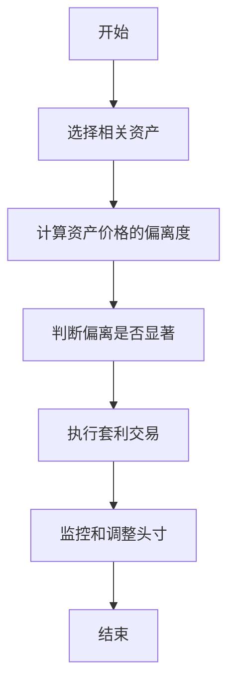
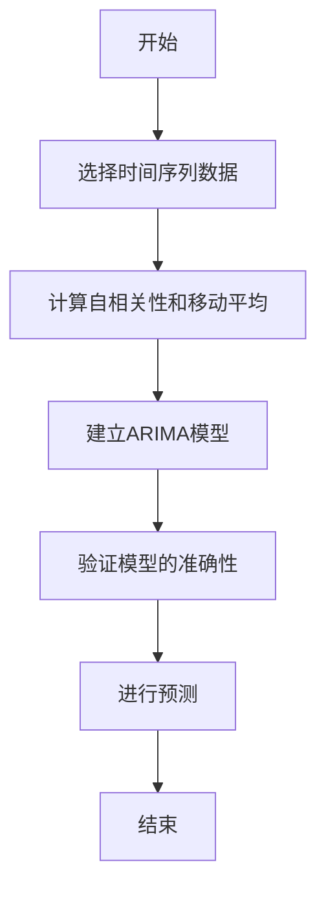
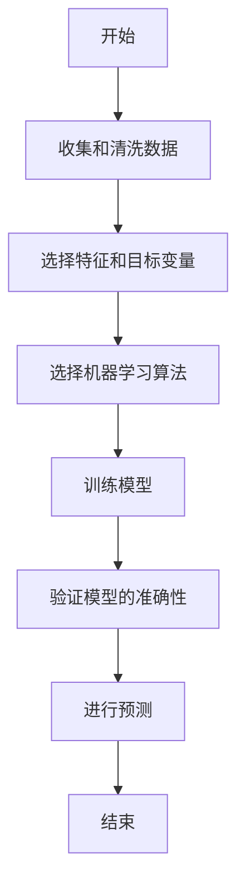
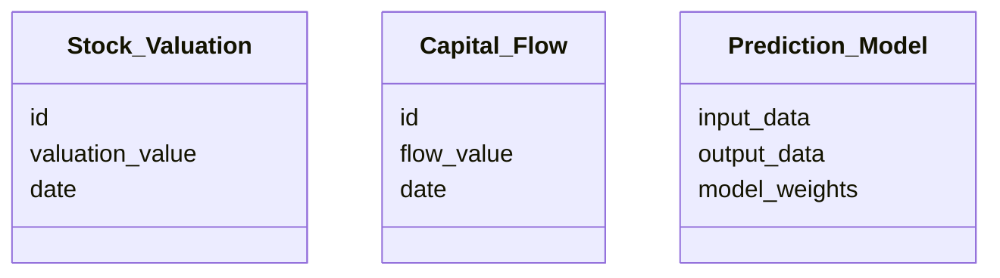
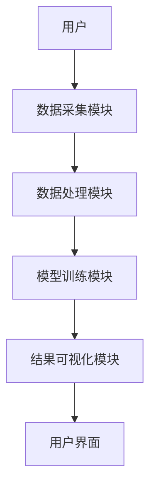
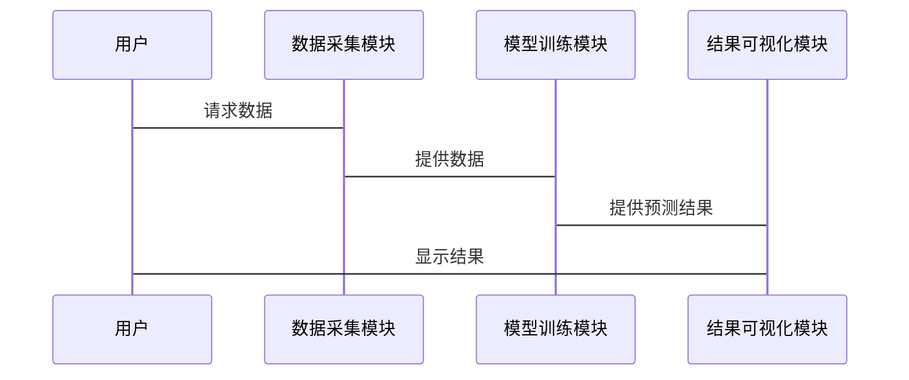

                 


# 全球股市估值与国际资本流动的关系

> 关键词：全球股市估值、国际资本流动、资本流动驱动因素、统计套利模型、时间序列分析、机器学习模型

> 摘要：本文探讨了全球股市估值与国际资本流动之间的复杂关系，通过分析股市估值的核心概念、国际资本流动的驱动因素，以及两者之间的相互影响，结合统计套利模型、时间序列分析和机器学习模型等算法，揭示了资本流动对股市估值的影响机制。同时，本文还提出了基于系统架构设计的解决方案，通过实际案例分析，展示了如何利用这些方法进行资本流动预测和股市估值分析，为投资者和政策制定者提供了有价值的参考。

---

# 第一部分: 全球股市估值与国际资本流动的关系背景介绍

## 第1章: 全球股市估值概述

### 1.1 股市估值的基本概念

#### 1.1.1 股市估值的定义
股市估值是指对股票市场价格的评估，通常基于公司基本面（如盈利能力、成长性）和市场情绪（如投资者心理）来判断股票的合理价格范围。股市估值的核心在于平衡资产的内在价值与市场的供需关系。

#### 1.1.2 股市估值的核心要素
- **市盈率（P/E）**：股票价格与每股收益的比率，反映了市场对公司的盈利能力的预期。
- **市净率（P/B）**：股票价格与每股净资产的比率，衡量股票价格相对于账面价值的高低。
- **股息率**：股息与股票价格的比率，反映了投资的收益能力。

#### 1.1.3 股市估值的计算方法
股市估值可以通过相对估值法（如市盈率、市净率）和绝对估值法（如现金流贴现法）来计算。相对估值法依赖于市场数据，而绝对估值法则基于公司未来现金流的折现。

### 1.2 全球股市估值的历史演变

#### 1.2.1 主要股市的历史表现
全球主要股市（如纽约证券交易所、纳斯达克、伦敦金融城、东京证券交易所）的历史表现受到经济周期、政策变化和国际局势的影响。例如，20世纪80年代的日本股市泡沫和2008年全球金融危机都对股市估值产生了深远影响。

#### 1.2.2 经济周期对股市估值的影响
经济周期的波动直接影响企业的盈利能力和投资者信心，从而影响股市估值。例如，在经济衰退期间，企业盈利下降，股市估值通常会受到压制。

#### 1.2.3 股市估值与经济政策的关系
政府的货币政策和财政政策对股市估值有直接影响。例如，降低利率通常会增加股市的流动性，推高估值水平。

## 第2章: 国际资本流动的基本概念

### 2.1 国际资本流动的定义

#### 2.1.1 资本流动的类型
- **短期资本流动**：如外汇交易和债券投资，通常受到市场情绪和短期利差驱动。
- **长期资本流动**：如外国直接投资（FDI）和股权投资，通常基于市场结构和长期收益预期。

#### 2.1.2 资本流动的驱动因素
- **利差**：不同国家之间的利率差异是资本流动的重要驱动力。
- **汇率波动**：汇率的变化会影响资本流动的收益和风险。
- **市场信心**：投资者对全球经济和市场的信心直接影响资本流动的方向。

#### 2.1.3 资本流动的衡量指标
- **资本流动净额**：反映资本流入和流出的差额。
- **资本流动比率**：衡量资本流动相对于GDP的比例。

### 2.2 国际资本流动的历史案例

#### 2.2.1 20世纪80年代拉美债务危机
拉美国家的债务危机导致大量资本外流，加剧了地区的经济衰退。

#### 2.2.2 1997年亚洲金融危机
亚洲国家的资本外流引发了 currencies危机，导致多国股市大幅下跌。

#### 2.2.3 2008年全球金融危机
全球金融危机导致国际资本流动急剧下降，股市估值受到重创。

## 第3章: 股市估值与国际资本流动的关系

### 3.1 股市估值对国际资本流动的影响

#### 3.1.1 高估值对资本流动的吸引力
高估值通常意味着较高的投资回报，可能吸引更多的资本流入。

#### 3.1.2 低估值对资本流动的阻力
低估值可能导致投资者对市场的信心不足，从而减少资本流入。

#### 3.1.3 股市估值波动对资本流动的冲击
股市估值的剧烈波动可能引发资本的短期撤离，加剧市场的不稳定性。

### 3.2 国际资本流动对股市估值的影响

#### 3.2.1 资本流入对股市估值的推高作用
资本流入通常会增加市场的流动性，推高股价，进而提高股市估值。

#### 3.2.2 资本流出对股市估值的打压作用
资本流出会导致市场的流动性下降，打压股价，降低股市估值。

#### 3.2.3 资本流动的不确定性对股市估值的影响
资本流动的不确定性和波动性可能导致股市估值的波动，影响市场的稳定性。

---

# 第二部分: 核心概念与联系

## 第4章: 股市估值与国际资本流动的核心概念

### 4.1 核心概念的原理

#### 4.1.1 股市估值的驱动因素
- **公司基本面**：盈利能力、成长性、财务状况。
- **市场情绪**：投资者心理、市场预期。

#### 4.1.2 国际资本流动的驱动因素
- **利差**：不同国家之间的利率差异。
- **汇率波动**：影响资本流动的收益和风险。
- **市场信心**：投资者对全球经济和市场的信心。

### 4.2 核心概念的属性特征对比

| 属性       | 股市估值                | 国际资本流动          |
|------------|------------------------|-----------------------|
| 驱动因素    | 公司基本面、市场情绪    | 利差、汇率、市场信心  |
| 时间维度   | 短期波动、长期趋势      | 短期波动、长期趋势    |
| 影响因素    | 政策、经济环境          | 政策、经济环境、地缘政治 |

### 4.3 ER实体关系图架构

```mermaid
erd
  investor
  has
  invests_in
  stock_market
  valuation
  country
  capital_flow
  currency
```

---

# 第三部分: 算法原理讲解

## 第5章: 统计套利模型

### 5.1 统计套利模型的原理

#### 5.1.1 算法原理
统计套利模型通过寻找资产价格的短期偏离，利用均值回归的特性进行套利。例如，当两只股票的价差超过历史平均水平时，买入低价股，卖出高价股。

#### 5.1.2 算法流程


#### 5.1.3 Python代码实现
```python
import pandas as pd
import numpy as np

def calculate_zscore(data, window=20):
    mean = data.rolling(window).mean()
    std = data.rolling(window).std()
    zscore = (data - mean) / std
    return zscore

# 示例数据
close_prices = pd.Series([100, 90, 95, 105, 110], index=pd.date_range('2023-01-01', periods=5))

zscore = calculate_zscore(close_prices)
print(zscore)
```

## 第6章: 时间序列分析

### 6.1 时间序列分析的原理

#### 6.1.1 算法原理
时间序列分析通过研究数据的自相关性和移动平均特性，预测未来的市场走势。例如，ARIMA模型可以用来预测股市指数的未来走势。

#### 6.1.2 算法流程


#### 6.1.3 Python代码实现
```python
from statsmodels.tsa.arima_model import ARIMA

# 示例数据
data = pd.Series([100, 105, 110, 115, 120], index=pd.date_range('2023-01-01', periods=5))

# 建立ARIMA模型
model = ARIMA(data, order=(1, 1, 1))
model_fit = model.fit()

# 进行预测
forecast = model_fit.forecast(steps=5)
print(forecast)
```

## 第7章: 机器学习模型

### 7.1 机器学习模型的原理

#### 7.1.1 算法原理
机器学习模型（如随机森林和神经网络）通过识别数据中的非线性关系，预测股市估值和资本流动的变化。例如，使用LSTM模型预测股市指数的未来走势。

#### 7.1.2 算法流程


#### 7.1.3 Python代码实现
```python
from keras.models import Sequential
from keras.layers import LSTM, Dense

# 示例数据
train_data = np.random.rand(100, 1)
test_data = np.random.rand(20, 1)

# 建立LSTM模型
model = Sequential()
model.add(LSTM(50, input_shape=(1, 1)))
model.add(Dense(1))
model.compile(optimizer='adam', loss='mean_squared_error')

# 训练模型
model.fit(train_data, train_data, epochs=50, batch_size=1)
```

---

# 第四部分: 系统分析与架构设计

## 第8章: 项目背景介绍

### 8.1 项目背景
本项目旨在通过分析全球股市估值和国际资本流动的关系，建立一个预测模型，帮助投资者和政策制定者更好地理解市场动态。

### 8.2 系统功能设计

#### 8.2.1 领域模型设计


#### 8.2.2 系统架构设计


#### 8.2.3 系统接口设计
- 数据接口：提供API用于数据的输入和输出。
- 模型接口：提供API用于模型的训练和预测。

#### 8.2.4 用户与系统交互


---

# 第五部分: 项目实战

## 第9章: 项目实战

### 9.1 环境安装

#### 9.1.1 Python安装
安装Python 3.8或更高版本。

#### 9.1.2 库安装
安装必要的库：
```bash
pip install pandas numpy matplotlib statsmodels keras
```

### 9.2 系统核心实现

#### 9.2.1 数据采集模块
编写代码采集全球股市估值和国际资本流动数据。

#### 9.2.2 数据处理模块
对数据进行清洗和预处理。

#### 9.2.3 模型训练模块
训练统计套利模型、时间序列模型和机器学习模型。

#### 9.2.4 结果可视化模块
将预测结果可视化并展示。

### 9.3 实际案例分析

#### 9.3.1 案例背景
分析2008年全球金融危机期间的股市估值和资本流动数据。

#### 9.3.2 数据分析
使用模型分析资本流动对股市估值的影响。

#### 9.3.3 模型预测
预测未来市场的走势。

### 9.4 项目总结

#### 9.4.1 项目经验
总结项目实施过程中的经验和教训。

#### 9.4.2 项目成果
展示项目的最终成果和实际应用价值。

---

# 第六部分: 结论与建议

## 第10章: 结论与建议

### 10.1 研究结论
本文通过分析全球股市估值和国际资本流动的关系，揭示了资本流动对股市估值的重要影响。统计套利模型、时间序列分析和机器学习模型为理解和预测市场动态提供了有效的工具。

### 10.2 政策建议
政策制定者应关注资本流动的波动性，采取措施稳定市场，防范系统性风险。

### 10.3 投资建议
投资者应结合市场环境和政策变化，合理配置资产，降低投资风险。

### 10.4 未来研究方向
未来研究可以进一步探讨多因素模型和复杂网络理论在股市估值和资本流动分析中的应用。

---

# 结语

本文系统地探讨了全球股市估值与国际资本流动的关系，结合理论分析和实际案例，为投资者和政策制定者提供了有价值的参考。通过本文的分析，读者可以更好地理解市场动态，做出更明智的投资决策。

--- 

如果需要更详细的内容或代码实现，请随时告诉我！

