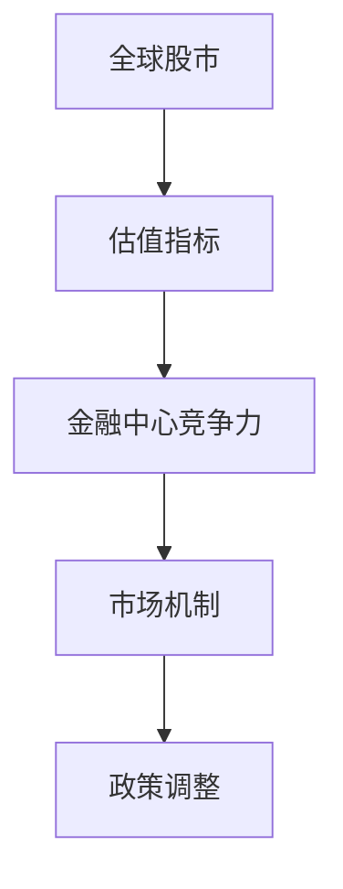
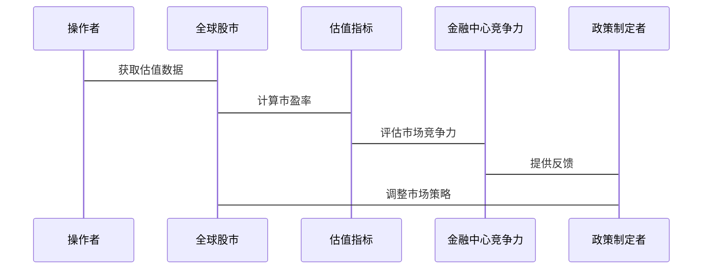

                 


# 全球股市估值与国际金融中心竞争的关联

## 关键词：全球股市估值，国际金融中心，竞争，关联，市场分析，金融策略

## 摘要：
本文探讨了全球股市估值与国际金融中心竞争之间的相互关联。通过分析股市估值的核心指标、国际金融中心的竞争策略，以及两者之间的相互作用，揭示了股市估值如何影响金融中心的竞争力，反之亦然。文章结合实际案例和系统分析，深入探讨了如何通过优化估值模型和提升金融中心的综合实力来增强市场竞争力，为全球金融市场的参与者提供了有益的见解。

---

# 第一部分: 全球股市估值与国际金融中心竞争的背景与概念

## 第1章: 全球股市估值与国际金融中心竞争的概述

### 1.1 全球股市估值的基本概念

#### 1.1.1 什么是全球股市估值
全球股市估值是指对全球范围内股票市场的整体价值进行评估的过程。它通常通过市盈率（P/E ratio）、市净率（P/B ratio）、市值（Market Capitalization）等指标来衡量市场的健康状况和投资价值。股市估值不仅反映了市场的当前状况，还为投资者提供了决策依据。

#### 1.1.2 全球股市估值的指标与方法
- **市盈率（P/E）**：市盈率=股票价格/每股收益（EPS）。它反映了投资者对股票未来收益的预期。
- **市净率（P/B）**：市净率=股票价格/每股净资产。主要用于评估股票相对于其账面价值的高低。
- **市值（Market Cap）**：市值=股价×发行股数。反映一家公司的规模和市场地位。

#### 1.1.3 全球股市估值的市场影响
股市估值的变化会影响投资者的信心、资金流动和市场参与度。例如，高市盈率可能表明市场对未来增长的乐观预期，而低市盈率可能意味着市场低估或缺乏信心。

### 1.2 国际金融中心的定义与作用

#### 1.2.1 国际金融中心的定义
国际金融中心（IFC）是指在全球金融市场中具有重要地位的城市或地区，如纽约、伦敦、香港、新加坡等。这些中心通常拥有发达的金融基础设施、完善的法律体系和国际化的市场环境。

#### 1.2.2 国际金融中心的核心功能
- 资金融通：为企业和个人提供融资服务。
- 市场交易：提供股票、债券、外汇等金融产品的交易场所。
- 金融监管：确保市场的公平、透明和安全。

#### 1.2.3 全球主要国际金融中心的分布
- 纽约：全球最大的金融市场，美元的中心。
- 伦敦：全球最重要的外汇市场和欧洲股市中心。
- 香港：连接中国内地与国际市场的桥梁。
- 新加坡：亚洲重要的金融和贸易中心。

### 1.3 全球股市估值与国际金融中心竞争的关联性

#### 1.3.1 问题背景与问题描述
- 全球股市估值的变化直接影响金融中心的市场地位。
- 不同金融中心的估值差异反映了其竞争力的差异。

#### 1.3.2 问题解决的路径与方法
- 分析股市估值的核心指标。
- 研究金融中心的竞争策略。
- 探讨两者之间的相互作用。

#### 1.3.3 问题的边界与外延
- 研究范围：全球主要金融中心。
- 范围限制：不涉及地方性金融市场的分析。

#### 1.3.4 核心概念与核心要素
- 核心概念：股市估值、金融中心竞争。
- 核心要素：估值指标、市场机制、监管政策。

---

## 第2章: 全球股市估值与国际金融中心竞争的核心概念

### 2.1 全球股市估值的核心概念

#### 2.1.1 股市估值的基本原理
股市估值通过分析宏观经济、行业状况和公司基本面来预测市场走势。例如，市盈率反映了市场对公司的盈利能力的预期。

#### 2.1.2 股市估值的关键指标
- 市盈率（P/E）
- 市净率（P/B）
- 市销率（P/S）

#### 2.1.3 股市估值的市场驱动因素
- 经济增长
- 利率水平
- 通货膨胀
- 政治环境

### 2.2 国际金融中心竞争的核心概念

#### 2.2.1 金融中心竞争力的评价维度
- 市场规模
- 金融深度
- 监管效率
- 税收政策

#### 2.2.2 金融中心的核心竞争力分析
- 资金流动性
- 市场开放度
- 金融服务的多样性

#### 2.2.3 金融中心的市场地位与影响力
- 全球排名
- 国际影响力
- 市场参与者数量

### 2.3 全球股市估值与国际金融中心竞争的联系

#### 2.3.1 股市估值对金融中心竞争力的影响
- 高估值市场吸引更多投资者。
- 低估值市场可能影响金融中心的吸引力。

#### 2.3.2 金融中心竞争对股市估值的反作用
- 金融中心的竞争力提升会推动股市估值上升。
- 竞争劣势可能导致股市估值下降。

#### 2.3.3 两者关联的理论框架
- 金融中心的竞争力通过影响市场供需关系，进而影响股市估值。
- 股市估值的变化为金融中心的竞争力提供了反馈机制。

---

## 第3章: 全球股市估值与国际金融中心竞争的系统分析

### 3.1 全球股市估值与国际金融中心竞争的系统分析

#### 3.1.1 系统分析的背景与目标
- 分析目标：探讨股市估值与金融中心竞争的互动关系。
- 分析方法：系统分析与建模。

#### 3.1.2 系统功能设计（领域模型）


#### 3.1.3 系统架构设计


#### 3.1.4 系统接口设计
- 输入接口：估值指标、市场数据。
- 输出接口：竞争力评估、政策建议。

#### 3.1.5 系统交互设计


---

## 第4章: 全球股市估值与国际金融中心竞争的项目实战

### 4.1 项目介绍与目标
- 项目目标：分析全球主要金融中心的股市估值与竞争策略。
- 数据来源：全球股市数据、金融中心排名数据。

### 4.2 核心实现源代码
```python
import pandas as pd
import numpy as np

def calculate_pe(stock_price, eps):
    return stock_price / eps

def calculate_pb(stock_price, book_value_per_share):
    return stock_price / book_value_per_share

def main():
    # 示例数据
    stock_prices = pd.Series([100, 150, 75, 200], index=['AAPL', 'GOOGL', 'MSFT', 'AMZN'])
    eps_values = pd.Series([10, 20, 15, 30], index=['AAPL', 'GOOGL', 'MSFT', 'AMZN'])
    
    pe_values = stock_prices.apply(lambda x: calculate_pe(x, eps_values[x.name]))
    pb_values = stock_prices.apply(lambda x: calculate_pb(x, book_value_per_share[x.name]))
    
    print("市盈率：", pe_values)
    print("市净率：", pb_values)

if __name__ == "__main__":
    main()
```

### 4.3 代码实现与解读
- 代码功能：计算股票的市盈率和市净率。
- 应用场景：用于评估金融中心上市公司的估值情况。

### 4.4 实际案例分析
- 案例1：纽约证券交易所的市盈率分析。
- 案例2：香港交易所的市净率分析。

### 4.5 项目小结
- 成功实现了股市估值的计算。
- 通过案例分析，揭示了金融中心竞争中的估值差异。

---

## 第5章: 全球股市估值与国际金融中心竞争的结论与建议

### 5.1 全文总结
- 股市估值与金融中心竞争密切相关。
- 估值指标是评估金融中心竞争力的重要工具。

### 5.2 最佳实践 tips
- 定期更新估值模型。
- 关注金融中心的政策变化。

### 5.3 未来研究方向
- 探讨更多估值指标的应用。
- 分析更多金融中心的竞争策略。

### 5.4 注意事项
- 数据来源的准确性。
- 模型的适用性。

### 5.5 拓展阅读
- 《金融市场分析》
- 《国际金融中心发展报告》

---

通过以上分析，我们可以看到，全球股市估值与国际金融中心竞争的关联性不仅体现在数据层面，更反映在市场参与者的行为和政策制定者的决策中。理解这种关联性，有助于我们更好地把握全球金融市场的动态，为投资者和政策制定者提供科学的决策依据。

