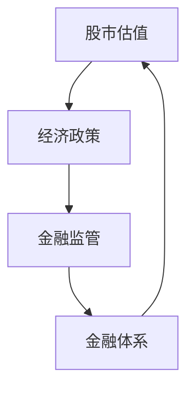

                 

# 全球股市估值与国际金融体系改革的互动

## 关键词
全球股市估值, 国际金融体系改革, 股市互动机制, 金融监管, 经济波动

## 摘要
本文探讨了全球股市估值与国际金融体系改革之间的互动关系。通过分析全球主要股市的估值现状、影响因素及波动性，结合国际金融体系的现状与问题，构建了两者之间的互动机制模型。进一步，本文提出了国际金融体系改革的方向与路径，并通过具体案例分析了互动机制的影响。文章还总结了当前研究的不足，并展望了未来的研究方向。

---

## 第1章: 引言

### 1.1 问题背景与研究意义
#### 1.1.1 全球化背景下的股市估值问题
全球化的深入发展使得股市估值成为各国经济发展的重要指标。近年来，新冠疫情、地缘政治冲突等事件对全球股市估值产生了深远影响，凸显了研究股市估值问题的重要性。

#### 1.1.2 国际金融体系改革的必要性
现行国际金融体系在2008年金融危机后暴露了许多问题，如监管不足、美元霸权带来的不平衡等。这些问题亟需通过改革来解决，以维护全球金融稳定。

#### 1.1.3 两者的互动关系与研究价值
股市估值与国际金融体系改革相互影响，前者反映了经济基本面，后者塑造了金融环境。研究这种互动有助于理解全球经济动态，为政策制定提供参考。

### 1.2 研究方法与框架
#### 1.2.1 理论分析法
通过经济学和金融学理论，分析股市估值与金融体系改革的内在联系。

#### 1.2.2 实证分析法
利用历史数据，验证理论模型的有效性。

#### 1.2.3 案例分析法
通过具体案例（如2008年金融危机）分析互动机制的实际表现。

---

## 第2章: 全球股市估值的现状与影响因素

### 2.1 全球主要股市估值分析
#### 2.1.1 美国股市估值现状
美国股市以纳斯达克为代表，科技股占据主导地位，近年来受美联储政策影响较大。

#### 2.1.2 欧洲股市估值现状
欧洲股市受欧元区经济一体化和地缘政治影响，波动性较大。

#### 2.1.3 亚洲股市估值现状
亚洲股市以中国、日本为代表，受区域经济增速和政策调控影响显著。

### 2.2 股市估值的影响因素
#### 2.2.1 经济指标对股市估值的影响
GDP增速、利率水平、通货膨胀率等经济指标直接影响股市估值。

#### 2.2.2 政治因素对股市估值的影响
地缘政治冲突、政策变化等政治因素对股市估值有显著影响。

#### 2.2.3 市场情绪对股市估值的影响
投资者情绪通过市场波动率和交易量影响股市估值。

### 2.3 股市估值的波动性与周期性
#### 2.3.1 股市估值的周期性特征
股市估值呈现周期性波动，与经济周期密切相关。

#### 2.3.2 经济危机对股市估值的影响
经济危机导致股市估值大幅下降，如2008年金融危机。

#### 2.3.3 疫情对股市估值的影响
新冠疫情导致股市估值剧烈波动，随后逐步恢复。

---

## 第3章: 国际金融体系的现状与问题

### 3.1 国际货币体系的现状
#### 3.1.1 美元霸权的现状
美元作为全球主要储备货币，主导国际货币体系。

#### 3.1.2 欧元区的金融一体化
欧元区通过金融一体化减少对美元的依赖，提升区域影响力。

#### 3.1.3 其他货币的崛起
人民币、日元等货币的国际化进程加速。

### 3.2 国际金融监管体系的现状
#### 3.2.1 国际货币基金组织的作用
IMF在维护全球金融稳定中发挥重要作用。

#### 3.2.2 巴塞尔协议的实施
巴塞尔协议规范了全球银行业的资本充足率，提升了金融系统的安全性。

#### 3.2.3 金融稳定委员会的职能
金融稳定委员会协调各国监管机构，防范系统性金融风险。

---

## 第4章: 全球股市估值与国际金融体系改革的互动机制

### 4.1 互动机制的模型构建
#### 4.1.1 概念架构与核心要素
通过mermaid图展示股市估值与金融体系改革的互动关系。

#### 4.1.2 影响路径
从经济政策、金融监管、市场参与等角度分析互动路径。

### 4.2 互动机制的具体分析
#### 4.2.1 经济政策对股市估值的影响
政府的财政政策和货币政策直接影响股市估值。

#### 4.2.2 金融监管对股市估值的影响
监管政策如资本流动管制、退市制度等影响股市估值。

#### 4.2.3 市场参与者的互动
投资者、企业、金融机构等市场参与者在互动中推动估值变化。

---

## 第5章: 国际金融体系改革的方向与路径

### 5.1 国际金融体系改革的方向
#### 5.1.1 推动多元化货币体系
减少对美元的依赖，促进多极化金融体系。

#### 5.1.2 完善金融监管框架
加强跨境金融监管合作，提升监管效率。

#### 5.1.3 提升透明度与信息披露
通过提高透明度减少市场信息不对称。

### 5.2 国际金融体系改革的路径
#### 5.2.1 推进国际货币基金组织改革
优化IMF的治理结构和资源配置。

#### 5.2.2 加强跨境资本流动监管
制定统一的资本流动监管标准。

#### 5.2.3 促进金融科技发展
通过技术创新提升金融服务效率和安全性。

---

## 第6章: 案例分析与互动机制的影响

### 6.1 2008年金融危机对全球股市估值的影响
#### 6.1.1 金融危机的爆发
次贷危机引发全球性金融危机，导致股市估值大幅下降。

#### 6.1.2 金融体系改革的实施
《多德-弗兰克法案》的实施加强了金融监管。

### 6.2 疫情对全球股市估值与金融体系的影响
#### 6.2.1 疫情导致的股市暴跌
2020年一季度全球股市经历剧烈波动。

#### 6.2.2 金融体系的应对措施
各国央行实施量化宽松政策，稳定金融市场。

---

## 第7章: 总结与展望

### 7.1 研究总结
总结全文，重申股市估值与金融体系改革的互动关系。

### 7.2 未来研究方向
提出未来可能的研究方向，如区域经济一体化对股市估值的影响。

### 7.3 研究意义与展望
强调研究对全球经济治理的重要意义，并展望未来的发展趋势。

---

## 关键词索引
全球股市估值, 国际金融体系改革, 股市互动机制, 金融监管, 经济波动

---

## 参考文献
（此处列出相关文献，如《国际金融学》、《金融市场分析》等。）

---

## 致谢
感谢在撰写本文过程中提供帮助的专家和机构。

---

通过以上目录和内容的详细阐述，我们可以系统地分析全球股市估值与国际金融体系改革的互动关系，为未来的政策制定和学术研究提供参考。

