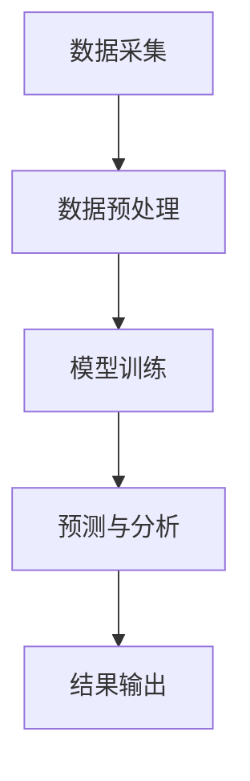
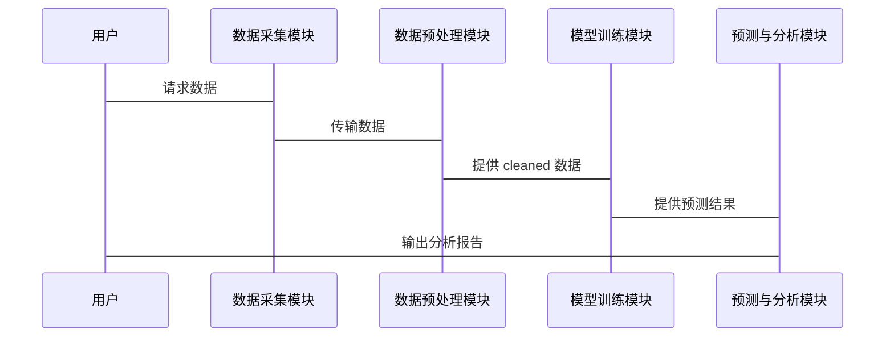

                 


# 全球股市估值与地缘政治风险的关联

## 关键词：全球股市估值、地缘政治风险、股市波动、地缘政治经济学、风险量化模型

## 摘要：本文深入探讨了全球股市估值与地缘政治风险之间的关联性，分析了地缘政治风险如何影响股市估值，提出了基于统计和计量经济学的方法来量化和预测这种影响。通过实际案例分析和系统设计，本文为投资者和研究人员提供了有价值的洞见和工具。

---

# 第一部分: 全球股市估值与地缘政治风险的背景与关联

## 第1章: 全球股市估值与地缘政治风险的背景介绍

### 1.1 问题背景

#### 1.1.1 全球股市估值的定义与意义
全球股市估值是指对全球主要股票市场指数（如标普500、纳斯达克、MSCI指数等）的总体价值进行评估。股市估值是投资者、企业和政策制定者评估经济健康状况的重要指标。

#### 1.1.2 地缘政治风险的定义与特征
地缘政治风险是指因国际关系、政治冲突、政策变化等因素引发的风险。这些风险可能影响国家间的贸易、投资和金融市场稳定性。

#### 1.1.3 问题背景的演进与现状
随着全球化的发展，地缘政治风险对全球经济和金融市场的影响力日益增强。近年来，地缘政治事件（如中美贸易摩擦、俄乌冲突）对股市的影响愈发显著，引发了学术界和实务界的广泛关注。

### 1.2 问题描述

#### 1.2.1 地缘政治风险对股市的影响
地缘政治风险可能导致股市波动加剧、投资者情绪变化和市场流动性下降。

#### 1.2.2 全球化背景下的股市波动
全球化使得金融市场高度互联，地缘政治风险的影响能够迅速传导至全球股市，引发连锁反应。

#### 1.2.3 问题的复杂性与研究的重要性
地缘政治风险具有高度的不确定性和复杂性，其对股市的影响机制尚不完全清晰。因此，研究其与股市估值的关联性具有重要的理论和实践意义。

### 1.3 问题解决方法

#### 1.3.1 数据分析与建模方法
通过收集地缘政治事件和股市数据，构建统计模型（如时间序列分析、回归分析）来量化风险影响。

#### 1.3.2 统计与计量经济学方法
利用计量经济学模型（如Granger因果关系检验、向量自回归模型）分析地缘政治风险与股市估值之间的因果关系。

#### 1.3.3 实证研究与案例分析
通过实证研究和具体案例分析，验证模型的有效性和适用性。

### 1.4 边界与外延

#### 1.4.1 研究的边界条件
本文研究聚焦于主要经济体的地缘政治风险对全球股市的影响，不考虑极端事件（如全球性金融危机）。

#### 1.4.2 相关概念的外延
地缘政治风险包括但不限于军事冲突、贸易摩擦、政策变化等。

#### 1.4.3 模型的适用范围
模型适用于中短期的地缘政治风险预测和股市估值分析。

### 1.5 概念结构与核心要素

#### 1.5.1 核心概念的构成
- 地缘政治风险：包括军事冲突、贸易摩擦、政策变化等。
- 股市估值：包括主要股市指数、市盈率、市净率等。

#### 1.5.2 核心要素的对比分析
| 要素 | 地缘政治风险 | 股市估值 |
|------|--------------|----------|
| 定义 | 国际关系引发的风险 | 股票市场整体价值评估 |
| 影响 | 影响市场情绪和流动性 | 影响股市指数和估值 |

#### 1.5.3 概念之间的关系
地缘政治风险通过影响投资者情绪、政策环境和市场流动性，进而影响股市估值。

---

## 第2章: 地缘政治风险与股市估值的核心概念与联系

### 2.1 地缘政治风险的类型与特征

#### 2.1.1 军事冲突风险
军事冲突可能导致投资者恐慌，引发股市大幅波动。

#### 2.1.2 贸易摩擦与关税战
贸易摩擦可能导致供应链中断，影响企业盈利能力和股市估值。

#### 2.1.3 政治制度与政策变化
政策变化（如税收政策、监管政策）可能对股市产生直接影响。

### 2.2 地缘政治风险对股市的影响机制

#### 2.2.1 风险的传导路径
1. 地缘政治事件发生 → 2. 市场情绪变化 → 3. 股市估值波动。

#### 2.2.2 投资者情绪的影响
地缘政治风险可能引发投资者恐慌，导致抛售行为，进而影响股市估值。

#### 2.2.3 市场流动性的变化
地缘政治风险可能导致市场流动性下降，进一步加剧股市波动。

### 2.3 地缘政治风险与股市估值的关系

#### 2.3.1 相关性分析
通过统计分析（如协方差分析）发现地缘政治风险与股市估值的相关性。

#### 2.3.2 因果关系探讨
利用Granger因果关系检验分析地缘政治风险是否是股市估值变化的因果因素。

#### 2.3.3 实证结果与案例分析
以中美贸易摩擦为例，分析其对全球股市估值的具体影响。

---

## 第3章: 地缘政治风险对股市估值的算法原理

### 3.1 时间序列分析模型

#### 3.1.1 ARIMA模型的原理
ARIMA模型通过自回归和移动平均机制，预测未来的股市估值。

#### 3.1.2 GARCH模型的应用
GARCH模型用于捕捉股市波动性，适用于地缘政治风险引发的异常波动。

#### 3.1.3 模型的优缺点
- 优点：适合时间序列数据，能够捕捉短期波动。
- 缺点：对地缘政治风险的非线性关系建模能力有限。

### 3.2 地缘政治事件影响的量化模型

#### 3.2.1 事件影响的权重计算
根据事件的性质和影响范围，赋予不同权重，量化其对股市的影响。

#### 3.2.2 事件对股市的冲击分析
通过冲击分析模型，评估地缘政治事件对股市的短期和长期影响。

#### 3.2.3 事件影响的动态调整
根据事件的演化情况，动态调整模型参数，提高预测准确性。

### 3.3 统计与计量经济学方法

#### 3.3.1 回归分析
通过回归分析，量化地缘政治风险对股市估值的具体影响。

#### 3.3.2 数学模型与公式
- 回归模型：$y_i = \beta_0 + \beta_1 x_i + \epsilon_i$
- GARCH模型：$r_t = \alpha_0 + \alpha_1 r_{t-1}^2 + \beta_1 r_{t-1} + \epsilon_t$

---

## 第4章: 地缘政治风险与股市估值的系统分析与架构设计

### 4.1 问题场景介绍
地缘政治风险对股市估值的影响是一个复杂的系统问题，涉及多个变量和动态关系。

### 4.2 系统功能设计

#### 4.2.1 领域模型设计


#### 4.2.2 系统架构设计


#### 4.2.3 接口设计
- 数据接口：从数据库中获取地缘政治事件和股市数据。
- 模型接口：调用预训练的统计模型进行预测。
- 结果接口：输出预测结果和分析报告。

#### 4.2.4 交互序列图


---

## 第5章: 地缘政治风险与股市估值的项目实战

### 5.1 环境安装
- 安装Python、Pandas、NumPy、Matplotlib、Scikit-learn等库。

### 5.2 核心代码实现

#### 5.2.1 数据采集
```python
import pandas as pd
import requests

url = "https://example.com/data"
response = requests.get(url)
data = pd.read_json(response.text)
```

#### 5.2.2 数据预处理
```python
data['date'] = pd.to_datetime(data['date'])
data.set_index('date', inplace=True)
data = data[['stock_index', 'geopolitical_risk']]
```

#### 5.2.3 模型训练
```python
from sklearn.linear_model import LinearRegression
model = LinearRegression()
model.fit(data[['geopolitical_risk']], data['stock_index'])
```

#### 5.2.4 预测与分析
```python
import matplotlib.pyplot as plt

predicted = model.predict(data[['geopolitical_risk']])
plt.plot(data.index, predicted, label='预测值')
plt.plot(data.index, data['stock_index'], label='实际值')
plt.legend()
plt.show()
```

### 5.3 案例分析
以中美贸易摩擦为例，分析其对纳斯达克指数的具体影响。

### 5.4 项目小结
总结项目的实施过程、主要发现和改进建议。

---

## 第6章: 最佳实践、小结与拓展阅读

### 6.1 最佳实践
- 定期更新模型参数，以反映最新的地缘政治风险。
- 结合多种模型（如ARIMA和GARCH）提高预测准确性。

### 6.2 小结
本文通过理论分析和实证研究，探讨了地缘政治风险对全球股市估值的影响，并提出了量化和预测的方法。

### 6.3 注意事项
- 模型的预测结果仅供参考，实际投资需谨慎。
- 数据质量和模型选择对预测结果有重要影响。

### 6.4 拓展阅读
- 更深入的文献：《地缘政治经济学》。
- 相关工具：Python的Pandas、NumPy库。

---

# 结语

通过本文的分析和实践，读者可以更好地理解地缘政治风险与股市估值之间的关联，并能够利用这些方法进行实际的投资和风险管理。未来的研究可以进一步探索更多复杂因素对股市的影响。

