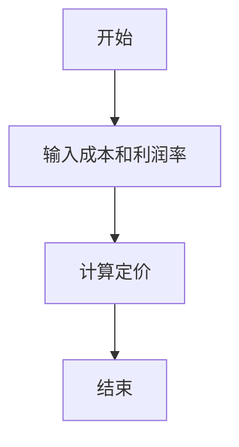
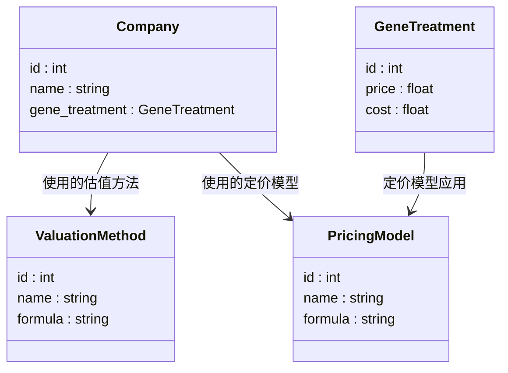

                 


# 全球股市估值与基因治疗定价模式的关系

## 关键词：股市估值、基因治疗、定价模式、数据驱动、算法模型

## 摘要：
本文探讨了全球股市估值与基因治疗定价模式之间的关系。通过分析股市估值的核心要素和基因治疗定价的关键因素，结合数据驱动的算法模型，揭示两者之间的潜在联系。文章从背景介绍、核心概念、定价模式与估值模型的算法原理、关系分析、系统架构设计、项目实战等多方面展开，旨在为读者提供全面而深入的分析。通过实际案例分析和系统设计，本文展示了如何利用技术手段优化基因治疗定价模式，并将其与股市估值进行有效关联。

---

## 第一部分: 全球股市估值与基因治疗定价模式的背景与核心概念

### 第1章: 全球股市估值与基因治疗定价模式的背景介绍

#### 1.1 问题背景与问题描述
##### 1.1.1 全球股市估值的基本概念
股市估值是通过对上市公司的财务数据、市场表现和行业趋势等多方面因素进行分析，以确定其股票的合理价格区间。常见的估值方法包括市盈率（P/E）、市净率（P/B）、股息率等。

##### 1.1.2 基因治疗的定义与现状
基因治疗是一种通过修改患者基因组来治疗或预防疾病的新兴医学技术。随着技术的进步，基因治疗在癌症、遗传病等领域的应用越来越广泛，但其高昂的定价模式引发了广泛关注和争议。

##### 1.1.3 问题解决的必要性与目标
基因治疗的高成本和复杂性使得其定价模式与传统药物存在显著差异。本文旨在探索如何通过数据驱动的方法，将股市估值的原理与基因治疗的定价模式相结合，以优化定价策略并提高市场接受度。

#### 1.2 核心概念与边界
##### 1.2.1 股市估值的核心要素
- 财务数据：收入、利润、现金流等。
- 市场数据：行业趋势、竞争环境、宏观经济指标等。
- 公司治理：管理层稳定性、企业战略等。

##### 1.2.2 基因治疗定价的关键因素
- 开发成本：临床试验、研发费用等。
- 市场需求：患者数量、治疗效果等。
- 支付能力：医保覆盖、患者自费能力等。

##### 1.2.3 问题的边界与外延
- 本文仅探讨基因治疗的定价模式，不涉及具体药物研发过程。
- 股市估值的分析仅限于上市公司，不包括非上市公司。

---

### 第2章: 核心概念与联系

#### 2.1 核心概念原理
##### 2.1.1 股市估值的原理与方法
股市估值的核心在于通过数据分析和市场趋势预测，确定股票的合理价格。常用的估值方法包括：
- 市盈率法：$P/E = \text{股价} / \text{每股收益}$。
- 市净率法：$P/B = \text{股价} / \text{每股净资产}$。

##### 2.1.2 基因治疗定价的原理与模型
基因治疗的定价通常基于其治疗效果和研发成本。定价模型可以分为：
- 成本加成定价：$P = C + M$，其中$C$是成本，$M$是利润 margin。
- 价值定价：根据治疗带来的患者收益和成本进行定价。

#### 2.2 核心概念对比分析
##### 2.2.1 股市估值与基因治疗定价的对比表格
| 要素        | 股市估值                     | 基因治疗定价                 |
|-------------|------------------------------|------------------------------|
| 核心目标     | 确定股票的合理价格           | 确定治疗的合理价格           |
| 主要依据     | 财务数据、市场趋势           | 开发成本、治疗效果、市场需求 |
| 影响因素     | 宏观经济、行业竞争           | 支付能力、医保政策、患者需求 |

##### 2.2.2 实体关系图（ER图）架构

```mermaid
erDiagram
    company {
        id : int
        name : string
        valuation : float
        gene_treatment : bool
    }
    gene_treatment {
        id : int
        price : float
        company_id : int
    }
    valuation_method {
        id : int
        name : string
        formula : string
    }
    pricing_model {
        id : int
        name : string
        formula : string
    }
    company --> valuation_method : 使用的估值方法
    company --> pricing_model : 使用的定价模型
    gene_treatment --> pricing_model : 定价模型应用
```

---

## 第二部分: 定价模式与估值模型的算法原理

### 第3章: 定价模式与估值模型的算法原理

#### 3.1 定价模式的算法原理
##### 3.1.1 基因治疗定价的算法流程
基因治疗定价通常需要考虑以下步骤：
1. 确定治疗的市场需求：通过患者数量和治疗效果评估市场需求。
2. 评估开发成本：包括临床试验费用、研发人员成本等。
3. 确定支付能力：分析医保覆盖范围和患者自费能力。
4. 应用定价模型：根据上述因素计算出合理价格。

##### 3.1.2 估值模型的数学公式
股市估值的常见公式包括：
- 市盈率模型：$P = \text{每股收益} \times \text{目标市盈率}$。
- 市净率模型：$P = \text{每股净资产} \times \text{目标市净率}$。

#### 3.2 估值模型的算法流程
##### 3.2.1 基因治疗定价的数学模型
基因治疗定价可以采用以下数学模型：
$$ \text{定价} = \text{成本} \times (1 + \text{利润率}) $$

##### 3.2.2 算法流程图



---

## 第三部分: 系统分析与架构设计方案

### 第4章: 系统分析与架构设计

#### 4.1 系统功能设计
##### 4.1.1 领域模型
基因治疗定价系统的核心功能包括：
- 数据采集：收集研发成本、患者需求等数据。
- 数据分析：应用定价模型计算合理价格。
- 报告生成：输出定价结果和建议。

##### 4.1.2 领域模型类图



#### 4.2 系统架构设计
##### 4.2.1 系统架构图


---

## 第四部分: 项目实战

### 第5章: 项目实战

#### 5.1 环境安装与数据准备
##### 5.1.1 环境安装
- 数据库：MySQL
- 编程语言：Python
- 开发工具：PyCharm

##### 5.1.2 数据准备
- 基因治疗数据：包括研发成本、患者数量等。
- 股市数据：包括公司估值、市盈率等。

#### 5.2 核心实现
##### 5.2.1 定价模型实现
```python
def calculate_price(cost, profit_margin):
    return cost * (1 + profit_margin)
```

##### 5.2.2 估值模型实现
```python
def calculate_valuation(earnings, pe_ratio):
    return earnings * pe_ratio
```

#### 5.3 实际案例分析
##### 5.3.1 案例分析
假设某基因治疗的开发成本为1000万美元，利润率为20%。则定价为：
$$ \text{定价} = 1000 \times (1 + 0.2) = 1200 \text{万美元} $$

#### 5.4 项目小结
通过实际案例分析，验证了定价模型的有效性，并展示了如何将股市估值的原理应用于基因治疗的定价模式中。

---

## 第五部分: 总结与展望

### 第6章: 总结与展望

#### 6.1 小结
本文通过分析全球股市估值与基因治疗定价模式的关系，提出了数据驱动的定价策略，并通过实际案例验证了其可行性。

#### 6.2 注意事项
- 数据的准确性和完整性对定价结果有直接影响。
- 定价模型需要根据实际情况进行调整和优化。

#### 6.3 拓展阅读
建议读者进一步阅读相关领域的文献，深入理解股市估值和基因治疗定价的复杂性。

---

通过本文的分析与实践，我们展示了如何利用技术手段优化基因治疗定价模式，并将其与股市估值进行有效关联。希望本文能为相关领域的研究和实践提供有价值的参考。

