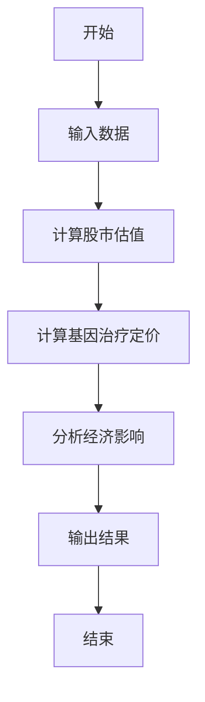
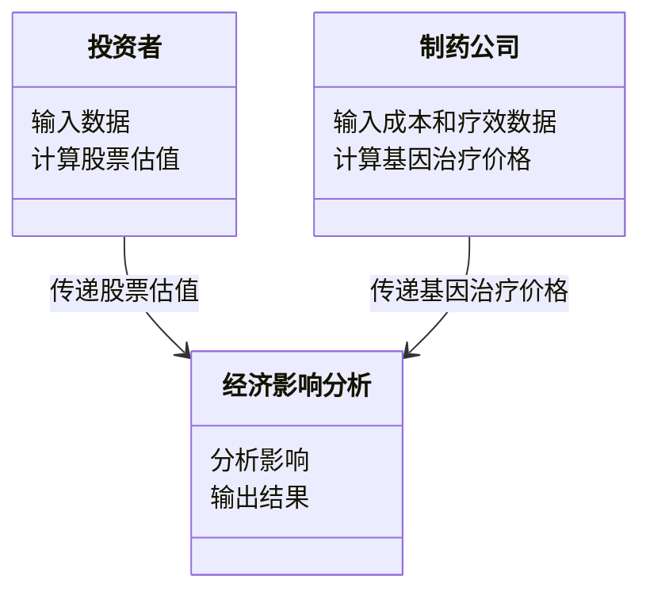

                 


# 全球股市估值与基因治疗定价模式的经济影响

> 关键词：全球股市估值、基因治疗定价模式、经济影响、数学模型、算法原理

> 摘要：本文探讨全球股市估值与基因治疗定价模式之间的经济联系，分析它们对经济的整体影响。通过数学模型和算法原理的深入分析，揭示两者在定价与估值上的相互作用。文章结合实际案例，探讨如何通过系统架构设计优化经济影响，为读者提供清晰的解决方案。

---

# 第1章 全球股市估值与基因治疗定价模式的背景介绍

## 1.1 全球股市估值的现状与问题背景

### 1.1.1 全球股市估值的核心概念
股市估值是通过特定指标评估公司价值的过程，常用的指标包括市盈率（P/E）、市净率（P/B）和股息率等。这些指标帮助投资者判断股票的合理价格区间，从而做出投资决策。

基因治疗是一种新兴的医疗技术，通过修改基因序列治疗疾病。由于其高技术门槛和研发周期长，基因治疗的定价模式复杂，通常采用成本加成定价法和价值定价法。

### 1.1.2 当前股市估值的主要方法
1. **相对估值法**：基于可比公司的市盈率或市净率进行估值。
2. **绝对估值法**：通过现金流折现模型（DCF）评估公司内在价值。
3. **技术评估法**：结合公司技术实力和市场前景进行综合评估。

### 1.1.3 基因治疗在医疗领域的应用与挑战
基因治疗在遗传病、癌症和罕见病等领域展现出巨大潜力，但其高昂的研发成本和不确定性使其定价复杂。制药公司通常采用风险分担定价和分期定价模式。

### 1.1.4 基因治疗定价模式的经济影响
基因治疗的高价可能导致患者负担加重，进而影响其市场接受度。同时，高定价可能影响保险公司的赔付能力，引发政策干预和市场竞争。

## 1.2 问题背景与问题描述

### 1.2.1 全球股市估值的波动性问题
股市波动性加剧导致估值模型失效，投资者难以准确判断股票价值。

### 1.2.2 基因治疗定价的复杂性与不确定性
基因治疗的研发周期长、成本高，定价模型难以准确预测市场需求和价格弹性。

### 1.2.3 问题解决的必要性与可行性
解决股市估值波动性和基因治疗定价复杂性问题，有助于降低投资风险，提高市场效率。

---

# 第2章 核心概念与联系

## 2.1 核心概念原理

### 2.1.1 股市估值的核心原理
股市估值基于公司基本面和市场情绪，反映投资者对公司的预期。常用模型包括DCF和相对估值法。

### 2.1.2 基因治疗定价的核心原理
基因治疗定价考虑研发成本、治疗效果和患者数量，常用成本加成定价和价值定价法。

### 2.1.3 两者之间的经济联系
股市估值影响投资者对基因治疗公司的投资决策，而基因治疗定价影响公司的市场表现和估值。

## 2.2 核心概念属性对比

| 属性       | 股市估值         | 基因治疗定价       |
|------------|-----------------|--------------------|
| 定价主体     | 投资者           | 制药公司、政府       |
| 价格影响因素 | 公司业绩、市场情绪 | 成本、疗效、患者数量 |
| 定价目标     | 投资回报         | 收回研发成本         |

## 2.3 ER实体关系图

```mermaid
er
    actor 投资者
    actor 患者
    actor 制药公司
    entity 股票价值
    entity 基因治疗价格
    entity 经济影响
    投资者 --> 股票价值: 评估与交易
    患者 --> 基因治疗价格: 支付与影响
    制药公司 --> 基因治疗价格: 定价与调整
    基因治疗价格 --> 经济影响: 传导与反馈
```

---

# 第3章 数学模型与经济影响分析

## 3.1 数学模型构建

### 3.1.1 股市估值的数学模型
股票价值计算公式：
$$ P = \text{市盈率} \times \text{每股收益} $$

### 3.1.2 基因治疗定价的数学模型
基因治疗价格计算公式：
$$ P = C + M \times Q $$
其中，\( C \) 为固定成本，\( M \) 为边际成本，\( Q \) 为产量。

## 3.2 经济影响分析

### 3.2.1 股市估值对经济的影响
股市波动影响投资者信心和企业融资能力，进而影响整体经济。

### 3.2.2 基因治疗定价对经济的影响
高价基因治疗可能导致患者负担加重，影响医疗市场发展。

### 3.2.3 两者结合的综合影响
股市估值波动和基因治疗高价可能导致市场萎缩，但技术创新可能推动经济增长。

---

# 第4章 算法原理与流程图

## 4.1 算法原理

### 4.1.1 股市估值算法
1. 收集公司财务数据。
2. 应用DCF模型计算内在价值。
3. 比较可比公司市盈率，得出合理估值。

### 4.1.2 基因治疗定价算法
1. 计算研发成本。
2. 评估治疗效果和患者数量。
3. 应用成本加成定价法。

## 4.2 算法流程图



---

# 第5章 系统分析与架构设计

## 5.1 系统功能设计

### 5.1.1 股市估值模块
功能：输入公司数据，计算股票估值。

### 5.1.2 基因治疗定价模块
功能：输入成本和疗效数据，计算价格。

### 5.1.3 经济影响分析模块
功能：分析股市估值和基因治疗价格对经济的影响。

## 5.2 系统架构设计



---

# 结语

通过分析全球股市估值与基因治疗定价模式的经济影响，我们揭示了两者之间的复杂关系。未来，随着技术进步和市场发展，优化定价策略和估值模型将有助于提升经济效率。

