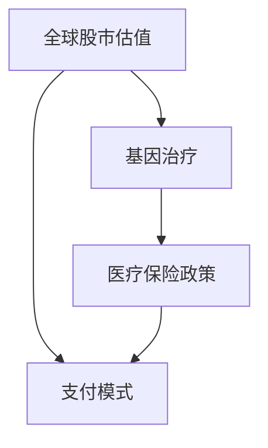
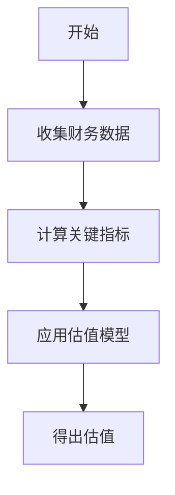
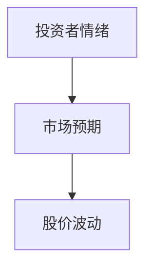
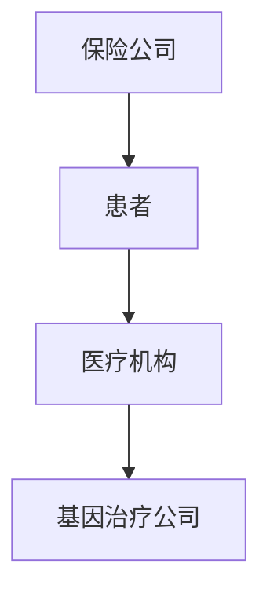

                 


# 全球股市估值与基因治疗的医疗保险政策框架

## 关键词：全球股市估值、基因治疗、医疗保险政策、数学模型、系统架构设计、支付模式

## 摘要：
本文探讨了全球股市估值与基因治疗在医疗保险政策框架中的相互作用。通过分析股市估值的基本原理、基因治疗的技术与政策挑战，以及两者结合的数学模型，本文提出了一种综合评估框架，以指导投资者和政策制定者在基因治疗领域的决策。文章结合实际案例，展示了如何通过系统架构设计和支付模式优化，实现基因治疗的可持续发展。

---

## 第一部分：引言与背景

### 第1章：问题背景与核心概念

#### 1.1 问题背景
随着基因治疗技术的快速发展，其在医疗领域的潜力巨大。然而，基因治疗的高成本和不确定性对医疗保险政策提出了新的挑战。本文旨在探讨如何通过全球股市估值的方法，为基因治疗的医疗保险政策提供框架。

#### 1.2 核心概念与边界
- **核心概念**：基因治疗、股市估值、医疗保险政策
- **边界与外延**：本文聚焦于基因治疗的经济影响和股市估值方法，不涉及具体的治疗技术细节。

#### 1.3 核心概念的结构与组成
图1展示了核心概念的结构：



---

## 第二部分：全球股市估值基础

### 第2章：全球股市估值理论

#### 2.1 股市估值的基本原理
股市估值是通过对公司财务数据和市场趋势的分析，确定股票的内在价值。常用的方法包括：

- **市盈率（P/E）**：$$\text{P/E} = \frac{\text{股价}}{\text{每股收益}}$$
- **市净率（P/B）**：$$\text{P/B} = \frac{\text{股价}}{\text{每股净资产}}$$

#### 2.2 股市估值模型
以下是一个简单的股票估值模型：



Python代码示例：

```python
def calculate_pe_ratio(price, earnings):
    return price / earnings

# 示例数据
price = 100
earnings = 10
pe_ratio = calculate_pe_ratio(price, earnings)
print(f"市盈率为：{pe_ratio}")
```

---

## 第三部分：基因治疗的医疗政策框架

### 第3章：基因治疗概述

#### 3.1 基因治疗的基本概念
基因治疗是一种通过修改基因组来治疗疾病的方法。其技术类型包括替换、添加或抑制基因表达。

#### 3.2 基因治疗的医疗政策
基因治疗的政策框架涉及监管、支付和伦理问题。以下是各国常用的支付模式对比：

| 模式 | 描述 |
|------|------|
| 前付 | 病例发生前支付 |
| 后付 | 病例发生后支付 |
| 按效果付 | 根据治疗效果支付 |

---

## 第四部分：基因治疗与股市估值的结合

### 第4章：基因治疗对股市估值的影响

#### 4.1 基因治疗公司的估值挑战
基因治疗公司的估值受技术风险、产品生命周期和政策不确定性影响。以下是一个简化的影响模型：

$$\text{估值} = \text{技术风险} \times \text{产品生命周期} \times \text{政策影响}$$

#### 4.2 股市对基因治疗公司的定价机制
投资者情绪和市场预期对股价影响显著。以下是一个情绪分析模型：



---

## 第五部分：基因治疗的医疗保险政策框架

### 第5章：基因治疗的支付模式

#### 5.1 基因治疗的支付结构
支付模式的设计需考虑成本、效果和公平性。以下是一个支付结构的系统架构图：



---

## 第六部分：系统分析与架构设计

### 第6章：基因治疗的医疗保险支付系统

#### 6.1 系统功能设计
系统功能包括数据采集、支付处理和效果评估。以下是领域模型：

```mermaid
classDiagram
    class 保险公司 {
        收集数据
        处理支付
    }
    class 患者 {
        提交申请
        支付费用
    }
    class 医疗机构 {
        开具治疗方案
        报送数据
    }
    class 基因治疗公司 {
        提供治疗
        提交数据
    }
    保险公司 <--o> 患者
    患者 <--o> 医疗机构
    医疗机构 <--o> 基因治疗公司
```

---

## 第七部分：项目实战

### 第7章：基因治疗支付系统的实现

#### 7.1 环境安装
安装Python和必要的库：

```bash
pip install pandas numpy matplotlib
```

#### 7.2 核心实现
以下是支付模拟代码：

```python
import pandas as pd

def calculate_payment(price, coverage):
    return price * coverage

# 示例数据
price = 100000
coverage = 0.8
payment = calculate_payment(price, coverage)
print(f"支付金额为：{payment}")
```

#### 7.3 案例分析
通过案例分析支付模式的效果，例如：

- 患者负担：$$\text{患者支付} = \text{总费用} \times (1 - \text{保险覆盖比例})$$

---

## 第八部分：结论与展望

### 第8章：总结与未来方向

#### 8.1 小结
本文提出了一个结合全球股市估值与基因治疗的医疗保险政策框架，通过数学模型和系统设计，为投资者和政策制定者提供了指导。

#### 8.2 注意事项
在实施过程中，需注意数据的准确性和模型的适应性。

#### 8.3 拓展阅读
建议进一步研究动态定价模型和个性化支付方案。

---

通过以上结构，本文系统地探讨了全球股市估值与基因治疗的医疗保险政策框架，为相关领域的研究和实践提供了参考。

